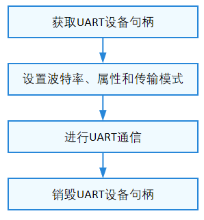

# UART

## 概述

### 功能简介

UART指异步收发传输器（Universal Asynchronous Receiver/Transmitter），是通用串行数据总线，用于异步通信。该总线双向通信，可以实现全双工传输。

两个UART设备的连接示意图如下，UART与其他模块一般用2线（图1）或4线（图2）相连，它们分别是：

- TX：发送数据端，和对端的RX相连。

- RX：接收数据端，和对端的TX相连。

- RTS：发送请求信号，用于指示本设备是否准备好，可接收数据，和对端CTS相连。

- CTS：允许发送信号，用于判断是否可以向对端发送数据，和对端RTS相连。

**图 1** 2线UART设备连接示意图


**图 2** 4线UART设备连接示意图


UART通信之前，收发双方需要约定好一些参数：波特率、数据格式（起始位、数据位、校验位、停止位）等。通信过程中，UART通过TX发送给对端数据，通过RX接收对端发送的数据。当UART接收缓存达到预定的门限值时，RTS变为不可发送数据，对端的CTS检测到不可发送数据，则停止发送数据。

UART接口定义了操作UART端口的通用方法集合，包括：

- 打开/关闭UART设备

- 读写数据

- 设置/获取UART设备波特率

- 设置/获取UART设备属性

### 基本概念

- 异步通信

    异步通信中，数据通常以字符或者字节为单位组成字符帧传送。字符帧由发送端逐帧发送，通过传输线被接收设备逐帧接收。发送端和接收端可以由各自的时钟来控制数据的发送和接收，这两个时钟源彼此独立，互不同步。异步通信以一个字符为传输单位，通信中两个字符间的时间间隔是不固定的，然而在同一个字符中的两个相邻位代码间的时间间隔是固定的。

- 全双工传输（Full Duplex）

    此通信模式允许数据在两个方向上同时传输，它在能力上相当于两个单工通信方式的结合。全双工可以同时进行信号的双向传输。

### 运作机制

在HDF框架中，UART接口适配模式采用独立服务模式（如图3所示）。在这种模式下，每一个设备对象会独立发布一个设备服务来处理外部访问，设备管理器收到API的访问请求之后，通过提取该请求的参数，达到调用实际设备对象的相应内部方法的目的。独立服务模式可以直接借助HDF设备管理器的服务管理能力，但需要为每个设备单独配置设备节点，增加内存占用。

独立服务模式下，核心层不会统一发布一个服务供上层使用，因此这种模式下驱动要为每个控制器发布一个服务，具体表现为：

- 驱动适配者需要实现HdfDriverEntry的Bind钩子函数以绑定服务。

- device_info.hcs文件中deviceNode的policy字段为1或2，不能为0。

UART模块各分层作用：

- 接口层提供打开UART设备、UART设备读取指定长度数据、UART设备写入指定长度数据、设置UART设备波特率、获取设UART设备波特率、设置UART设备属性、获取UART设备波特率、设置UART设备传输模式、关闭UART设备的接口。

- 核心层主要提供UART控制器的创建、移除以及管理的能力，通过钩子函数与适配层交互。

- 适配层主要是将钩子函数的功能实例化，实现具体的功能。

**图 3** UART独立服务模式结构图


### 约束与限制

UART模块UartSetTransMode接口设置传输模式在Linux中不支持，仅为空实现。

## 使用指导

### 场景介绍

UART模块应用比较广泛，主要用于实现设备之间的低速串行通信，例如输出打印信息，当然也可以外接各种模块，如GPS、蓝牙等。

### 接口说明

UART模块提供的主要接口如表1所示，具体API详见//drivers/hdf_core/framework/include/platform/uart_if.h。

**表 1** UART驱动API接口功能介绍

| 接口名 | 接口描述 |
| -------- | -------- |
| DevHandle UartOpen(uint32_t port) | UART获取设备句柄 |
| void UartClose(DevHandle handle) | UART释放设备句柄 |
| int32_t UartRead(DevHandle handle, uint8_t \*data, uint32_t size) | 从UART设备中读取指定长度的数据 |
| int32_t UartWrite(DevHandle handle, uint8_t \*data, uint32_t size) | 向UART设备中写入指定长度的数据 |
| int32_t UartGetBaud(DevHandle handle, uint32_t \*baudRate) | UART获取波特率 |
| int32_t UartSetBaud(DevHandle handle, uint32_t baudRate) | UART设置波特率 |
| int32_t UartGetAttribute(DevHandle handle, struct UartAttribute \*attribute) | UART获取设备属性 |
| int32_t UartSetAttribute(DevHandle handle, struct UartAttribute \*attribute) | UART设置设备属性 |
| int32_t UartSetTransMode(DevHandle handle, enum UartTransMode mode) | UART设置传输模式 |

>  **说明：**<br>
> 本文涉及的UART所有接口，支持内核态及用户态使用。

### 开发步骤

使用UART的一般流程如下图所示。

**图 4** UART使用流程图




#### 获取UART设备句柄

在使用UART进行通信时，首先要调用UartOpen获取UART设备句柄，该函数会返回指定端口号的UART设备句柄。

```c
DevHandle UartOpen(uint32_t port);
```

**表 2** UartOpen参数和返回值描述

| 参数 | 参数描述 |
| -------- | -------- |
| port | uint32_t类型，UART设备号 |
| **返回值** | **返回值描述** |
| NULL | 获取UART设备句柄失败 |
| 设备句柄 | UART设备句柄 |

假设系统中的UART端口号为1，获取该UART设备句柄的示例如下：

```c
DevHandle handle = NULL;    // UART设备句柄
uint32_t port = 1;          // UART设备端口号

handle = UartOpen(port);
if (handle == NULL) {
    HDF_LOGE("UartOpen: open uart_%u failed!\n", port);
    return;
}
```

#### UART设置波特率

在通信之前，需要设置UART的波特率，设置波特率的函数如下所示：

```c
int32_t UartSetBaud(DevHandle handle, uint32_t baudRate);
```

**表 3** UartSetBaud参数和返回值描述

| 参数 | 参数描述 |
| -------- | -------- |
| handle | DevHandle类型，UART设备句柄 |
| baudRate | uint32_t类型，待设置的波特率值 |
| **返回值** | **返回值描述** |
| HDF_SUCCESS | UART设置波特率成功 |
| 负数 | UART设置波特率失败 |

假设需要设置的UART波特率为9600，设置波特率的实例如下：

```c
int32_t ret;

ret = UartSetBaud(handle, 9600);    // 设置UART波特率
if (ret != HDF_SUCCESS) {
    HDF_LOGE("UartSetBaud: failed, ret %d\n", ret);
    return ret;
}
```

#### UART获取波特率

设置UART的波特率后，可以通过获取波特率接口来查看UART当前的波特率，获取波特率的函数如下所示：

```c
int32_t UartGetBaud(DevHandle handle, uint32_t *baudRate);
```

**表 4** UartGetBaud参数和返回值描述

| 参数 | 参数描述 |
| -------- | -------- |
| handle | DevHandle类型，UART设备句柄 |
| baudRate | uint32_t类型指针，用于接收波特率的值 |
| **返回值** | **返回值描述** |
| HDF_SUCCESS | UART获取波特率成功 |
| 负数 | UART获取波特率失败 |

获取波特率的实例如下：

```c
int32_t ret;
uint32_t baudRate;

ret = UartGetBaud(handle, &baudRate);    // 获取UART波特率
if (ret != HDF_SUCCESS) {
    HDF_LOGE("UartGetBaud: failed, ret %d\n", ret);
    return ret;
}
```

#### UART设置设备属性

在通信之前，需要设置UART的设备属性，设置设备属性的函数如下所示：

```c
int32_t UartSetAttribute(DevHandle handle, struct UartAttribute *attribute);
```

**表 5** UartSetAttribute参数和返回值描述

| 参数 | 参数描述 |
| -------- | -------- |
| handle | DevHandle类型，UART设备句柄 |
| attribute | 结构体指针，待设置的设备属性 |
| **返回值** | **返回值描述** |
| HDF_SUCCESS | UART设置设备属性成功 |
| 负数 | UART设置设备属性失败 |

设置UART的设备属性的实例如下：

```c
int32_t ret;
struct UartAttribute attribute;

attribute.dataBits = UART_ATTR_DATABIT_7;     // UART传输数据位宽，一次传输7个bit
attribute.parity = UART_ATTR_PARITY_NONE;     // UART传输数据无校检
attribute.stopBits = UART_ATTR_STOPBIT_1;     // UART传输数据停止位为1位
attribute.rts = UART_ATTR_RTS_DIS;            // UART禁用RTS
attribute.cts = UART_ATTR_CTS_DIS;            // UART禁用CTS
attribute.fifoRxEn = UART_ATTR_RX_FIFO_EN;    // UART使能RX FIFO
attribute.fifoTxEn = UART_ATTR_TX_FIFO_EN;    // UART使能TX FIFO

ret = UartSetAttribute(handle, &attribute);   // 设置UART设备属性
if (ret != HDF_SUCCESS) {
    HDF_LOGE("UartSetAttribute: failed, ret %d\n", ret);
turn ret;
}
```

#### UART获取设备属性

设置UART的设备属性后，可以通过获取设备属性接口来查看UART当前的设备属性，获取设备属性的函数如下所示：

```c
int32_t UartGetAttribute(DevHandle handle, struct UartAttribute *attribute);
```

**表 6** UartGetAttribute参数和返回值描述

| 参数 | 参数描述 |
| -------- | -------- |
| handle | DevHandle类型，UART设备句柄 |
| attribute | 结构体指针，接收UART设备属性的指针 |
| **返回值** | **返回值描述** |
| HDF_SUCCESS | UART获取设备属性成功 |
| 负数 | UART获取设备属性失败 |

获取UART的设备属性的实例如下：

```c
int32_t ret;
struct UartAttribute attribute;

ret = UartGetAttribute(handle, &attribute);    // 获取UART设备属性
if (ret != HDF_SUCCESS) {
    HDF_LOGE("UartGetAttribute: failed, ret %d\n", ret);
    return ret;
}
```

#### 设置UART传输模式

在通信之前，需要设置UART的传输模式，设置传输模式的函数如下所示：

```c
int32_t UartSetTransMode(DevHandle handle, enum UartTransMode mode);
```

**表 7** UartSetTransMode参数和返回值描述

| 参数 | 参数描述 |
| -------- | -------- |
| handle | DevHandle类型，UART设备句柄 |
| mode | 枚举类型，待设置的传输模式 |
| **返回值** | **返回值描述** |
| HDF_SUCCESS | UART设置传输模式成功 |
| 负数 | UART设置传输模式失败 |

假设需要设置的UART传输模式为UART_MODE_RD_BLOCK，设置传输模式的实例如下：

```c
int32_t ret;

ret = UartSetTransMode(handle, UART_MODE_RD_BLOCK);    // 设置UART传输模式
if (ret != HDF_SUCCESS) {
    HDF_LOGE("UartSetTransMode: failed, ret %d\n", ret);
    return ret;
}
```

#### 向UART设备写入指定长度的数据

对应的接口函数如下所示：

```c
int32_t UartWrite(DevHandle handle, uint8_t *data, uint32_t size);
```

**表 8** UartWrite参数和返回值描述

| 参数 | 参数描述 |
| -------- | -------- |
| handle | DevHandle类型，UART设备句柄 |
| data | uint8_t类型指针，待写入数据的 |
| size | uint32_t类型，待写入数据的长度 |
| **返回值** | **返回值描述** |
| HDF_SUCCESS | UART写数据成功 |
| 负数 | UART写数据失败 |

写入指定长度数据的实例如下：

```c
int32_t ret;
uint8_t wbuff[5] = {1, 2, 3, 4, 5};

ret = UartWrite(handle, wbuff, 5);    // 向UART设备写入指定长度的数据
if (ret != HDF_SUCCESS) {
    HDF_LOGE("UartWrite: failed, ret %d\n", ret);
    return ret;
}
```

#### 从UART设备中读取指定长度的数据

对应的接口函数如下所示：

```c
int32_t UartRead(DevHandle handle, uint8_t *data, uint32_t size);
```

**表 9** UartRead参数和返回值描述

| 参数 | 参数描述 |
| -------- | -------- |
| handle | DevHandle类型，UART设备句柄 |
| data | uint8_t类型指针，接收读取数据 |
| size | uint32_t类型，待读取数据的长度 |
| **返回值** | **返回值描述** |
| 非负数 | UART读取到的数据长度 |
| 负数 | UART读取数据失败 |

读取指定长度数据的实例如下：

```c
int32_t ret;
uint8_t rbuff[5] = {0};

ret = UartRead(handle, rbuff, 5);    // 从UART设备读取指定长度的数据
if (ret < 0) {
    HDF_LOGE("UartRead: failed, ret %d\n", ret);
	return ret;
}
```

>  **注意：**
> UART返回值为非负值，表示UART读取成功。若返回值等于0，表示UART无有效数据可以读取。若返回值大于0，表示实际读取到的数据长度，该长度小于或等于传入的参数size的大小，并且不超过当前正在使用的UART控制器规定的最大单次读取数据长度的值。


#### 销毁UART设备句柄

UART通信完成之后，需要销毁UART设备句柄，函数如下所示：

```c
void UartClose(DevHandle handle);
```

该函数会释放申请的资源。

**表 10** UartClose参数和返回值描述

| 参数 | 参数描述 |
| -------- | -------- |
| handle | UART设备句柄 |

销毁UART设备句柄的实例如下：

```c
UartClose(handle);    // 销毁UART设备句柄
```

## 使用实例

下面将基于Hi3516DV300开发板展示使用UART完整操作，步骤主要如下：

1. 传入UART端口号num，打开端口号对应的UART设备并获得UART设备句柄。

2. 通过UART设备句柄及设置的波特率，设置UART设备的波特率。

3. 通过UART设备句柄及待获取的波特率，获取UART设备的波特率。

4. 通过UART设备句柄及待设置的设备属性，设置UART设备的设备属性。

5. 通过UART设备句柄及待获取的设备属性，获取UART设备的设备属性。

6. 通过UART设备句柄及待设置的传输模式，设置UART设备的传输模式。

7. 通过UART设备句柄及待传输的数据及大小，传输指定长度的数据。

8. 通过UART设备句柄及待接收的数据及大小，接收指定长度的数据。

9. 通过UART设备句柄，关闭UART设备。

```c
#include "hdf_log.h"
#include "uart_if.h"

static int32_t UartTestSample(void)
{
    int32_t ret;
    uint32_t port;
    uint32_t baud;
    DevHandle handle = NULL;
    uint8_t wbuff[5] = { 1, 2, 3, 4, 5 };
    uint8_t rbuff[5] = { 0 };
    struct UartAttribute attribute;

    attribute.dataBits = UART_ATTR_DATABIT_7;                  // UART传输数据位宽，一次传输7个bit
    attribute.parity = UART_ATTR_PARITY_NONE;                  // UART传输数据无校检
    attribute.stopBits = UART_ATTR_STOPBIT_1;                  // UART传输数据停止位为1位
    attribute.rts = UART_ATTR_RTS_DIS;                         // UART禁用RTS
    attribute.cts = UART_ATTR_CTS_DIS;                         // UART禁用CTS
    attribute.fifoRxEn = UART_ATTR_RX_FIFO_EN;                 // UART使能RX FIFO
    attribute.fifoTxEn = UART_ATTR_TX_FIFO_EN;                 // UART使能TX FIFO

    port = 1;                                                  // UART设备端口号，要填写实际平台上的端口号

    handle = UartOpen(port);                                   // 获取UART设备句柄
    if (handle == NULL) {
        HDF_LOGE("UartOpen: open uart_%u failed!\n", port);
        return HDF_FAILURE;
    }

    ret = UartSetBaud(handle, 9600);                           // 设置UART波特率为9600
    if (ret != HDF_SUCCESS) {
        HDF_LOGE("UartSetBaud: set baud failed, ret %d\n", ret);
        goto ERR;
    }

    ret = UartGetBaud(handle, &baud);                          // 获取UART波特率
    if (ret != HDF_SUCCESS) {
        HDF_LOGE("UartGetBaud: get baud failed, ret %d\n", ret);
        goto ERR;
    }

    ret = UartSetAttribute(handle, &attribute);                // 设置UART设备属性
    if (ret != HDF_SUCCESS) {
        HDF_LOGE("UartSetAttribute: set attribute failed, ret %d\n", ret);
        goto ERR;
    }

    ret = UartGetAttribute(handle, &attribute);                // 获取UART设备属性
    if (ret != HDF_SUCCESS) {
        HDF_LOGE("UartGetAttribute: get attribute failed, ret %d\n", ret);
        goto ERR;
    }

    ret = UartSetTransMode(handle, UART_MODE_RD_NONBLOCK);     // 设置UART传输模式为非阻塞模式
    if (ret != HDF_SUCCESS) {
        HDF_LOGE("UartSetTransMode: set trans mode failed, ret %d\n", ret);
        goto ERR;
    }

    ret = UartWrite(handle, wbuff, 5);                         // 向UART设备写入5字节的数据
    if (ret != HDF_SUCCESS) {
        HDF_LOGE("UartWrite: write data failed, ret %d\n", ret);
        goto ERR;
    }

    ret = UartRead(handle, rbuff, 5);                          // 从UART设备读取5字节的数据
    if (ret < 0) {
        HDF_LOGE("UartRead: read data failed, ret %d\n", ret);
        goto ERR;
    }
    HDF_LOGI("%s: function tests end, %d", __func__, ret);
ERR:
    UartClose(handle);                                         // 销毁UART设备句柄
    return ret;
}
```
