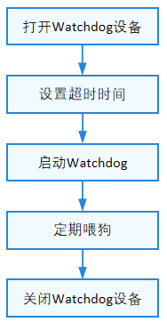

# Watchdog

## 概述

### 功能简介

看门狗（Watchdog），又称看门狗计时器（Watchdog timer），是一种硬件计时设备。一般有一个输入，叫做喂狗，一个输出到系统的复位端。当系统主程序发生错误导致未及时清除看门狗计时器的计时值时，看门狗计时器就会对系统发出复位信号，使系统从悬停状态恢复到正常运作状态。

Watchdog接口定义了看门狗操作的通用方法集合，包括：

- 打开/关闭看门狗设备
- 启动/停止看门狗设备
- 设置/获取看门狗设备超时时间
- 获取看门狗设备状态
- 喂狗

### 基本概念

系统正常工作的时候，每隔一段时间输出一个信号到喂狗端，给看门狗清零，这个操作就叫做喂狗。如果超过规定的时间不喂狗，看门狗定时超时，就会给出一个复位信号到系统，使系统复位。

### 运作机制

在HDF框架中，Watchdog模块接口适配模式采用独立服务模式，如图1所示。在这种模式下，每一个设备对象会独立发布一个设备服务来处理外部访问，设备管理器收到API的访问请求之后，通过提取该请求的参数，达到调用实际设备对象的相应内部方法的目的。独立服务模式可以直接借助HDF设备管理器的服务管理能力，但需要为每个设备单独配置设备节点，增加内存占用。

独立服务模式下，核心层不会统一发布一个服务供上层使用，因此这种模式下驱动要为每个控制器发布一个服务，具体表现为：

- 驱动适配者需要实现HdfDriverEntry的Bind钩子函数以绑定服务。
- device_info.hcs文件中deviceNode的policy字段为1或2，不能为0。

Watchdog模块各分层作用：

- 接口层提供打开看门狗设备、获取看门狗设备状态、启动看门狗设备、设置看门狗设备超时时间、获取看门狗设备超时时间、喂狗、停止看门狗设备超时时间、关闭看门狗设备的接口。
- 核心层主要提供看门狗控制器的添加、移除以及管理的能力，通过钩子函数与适配层交互。
- 适配层主要是将钩子函数的功能实例化，实现具体的功能。

**图 1** Watchdog独立服务模式结构图


## 使用指导

### 场景介绍

对于无法直接观测到的软件异常，我们可以使用看门狗进行自动检测，并在异常产生时及时重置。

### 接口说明

Watchdog模块提供的主要接口如表1所示。

**表1** 看门狗API接口功能介绍

| 接口名 | 描述 |
| -------- | -------- |
| int32_t WatchdogOpen(int16_t wdtId, DevHandle *handle) | 打开看门狗 |
| void WatchdogClose(DevHandle handle) | 关闭看门狗 |
| int32_t WatchdogStart(DevHandle handle) | 启动看门狗 |
| int32_t WatchdogStop(DevHandle handle) | 停止看门狗 |
| int32_t WatchdogSetTimeout(DevHandle handle, uint32_t seconds) | 设置看门狗超时时间 |
| int32_t WatchdogGetTimeout(DevHandle handle, uint32_t *seconds) | 获取看门狗超时时间 |
| int32_t WatchdogGetStatus(DevHandle handle, int32_t *status) | 获取看门狗状态 |
| int32_t WatchdogFeed(DevHandle handle) | 清除看门狗定时器（喂狗） |

>  **说明：**<br>
> 本文涉及的看门狗的所有接口，支持内核态及用户态使用。

### 开发步骤

使用看门狗的一般流程如下图所示。

**图2** 看门狗使用流程图



#### 打开看门狗设备

在操作看门狗之前，需要调用WatchdogOpen打开看门狗设备，一个系统可能有多个看门狗，通过看门狗ID号来打开指定的看门狗设备：

```c
DevHandle WatchdogOpen(int16_t wdtId, DevHandle *handle);
```

**表2** WatchdogOpen参数和返回值描述

| **参数** | **参数描述** |
| -------- | -------- |
| wdtId | 看门狗设备号 |
| handle | 看门狗设备句柄 |
| **返回值** | **返回值描述** |
| HDF_SUCCESS | 打开看门狗设备成功 |
| 负数 | 打开看门狗设备失败 |

```c
int16_t wdtId = 0;
int32_t ret;
DevHandle *handle = NULL;

ret = WatchdogOpen(wdtId, handle);    // 打开0号看门狗设备
if (ret != HDF_SUCCESS) {
    HDF_LOGE("WatchdogOpen: open watchdog_%hd failed, ret:%d\n", wdtId, ret);
    return ret;
}
```

#### 获取看门狗状态

```c
int32_t WatchdogGetStatus(DevHandle handle, int32_t *status); 
```

**表3** WatchdogGetStatus参数和返回值描述

| **参数** | **参数描述** |
| -------- | -------- |
| handle | 看门狗设备句柄 |
| status | 获取到的看门狗状态 |
| **返回值** | **返回值描述** |
| HDF_SUCCESS | 获取看门狗状态成功 |
| 负数 | 获取看门狗状态失败 |

```c
int32_t ret;
int32_t status;

ret = WatchdogGetStatus(handle, &status);    // 获取Watchdog状态
if (ret != HDF_SUCCESS) {
    HDF_LOGE("WatchdogGetStatus: watchdog get status failed, ret:%d\n", ret);
    return ret;
}
```

#### 设置超时时间


```c
int32_t WatchdogSetTimeout(DevHandle *handle, uint32_t seconds); 
```

**表4** WatchdogSetTimeout参数和返回值描述

| **参数** | **参数描述** |
| -------- | -------- |
| handle | 看门狗设备句柄 |
| seconds | 超时时间，单位为秒 |
| **返回值** | **返回值描述** |
| HDF_SUCCESS | 设置成功 |
| 负数 | 设置失败 |

```c
int32_t ret;

ret = WatchdogSetTimeout(handle, 2);    // 设置超时时间2秒
if (ret != HDF_SUCCESS) {
    HDF_LOGE("WatchdogSetTimeout: watchdog set timeOut failed, ret:%d\n", ret);
    return ret;
}
```

#### 获取超时时间

```c
int32_t WatchdogGetTimeout(DevHandle *handle, uint32_t *seconds);
```

**表5** WatchdogGetTimeout参数和返回值描述

| **参数** | **参数描述** |
| -------- | -------- |
| handle | 看门狗设备句柄 |
| seconds | 获取的看门狗超时时间 |
| **返回值** | **返回值描述** |
| HDF_SUCCESS | 获取看门狗超时时间成功 |
| 负数 | 获取看门狗超时时间失败 |

```c
 int32_t ret;
 uint32_t timeOut;

 ret = WatchdogGetTimeout(handle, &timeOut);     // 获取超时时间
 if (ret != HDF_SUCCESS) {
     HDF_LOGE("WatchdogGetTimeout: watchdog get timeOut failed, ret:%d\n", ret);
     return ret;
 }
```

#### 启动看门狗

```c
int32_t WatchdogStart(DevHandle handle);
```

**表6** WatchdogStart参数和返回值描述

| **参数** | **参数描述** |
| -------- | -------- |
| handle | 看门狗设备句柄 |
| **返回值** | **返回值描述** |
| HDF_SUCCESS | 启动看门狗成功 |
| 负数 | 启动看门狗失败 |

```c
int32_t ret;

ret = WatchdogStart(handle);    // 启动看门狗
if (ret != HDF_SUCCESS) {
    HDF_LOGE("WatchdogStart: start watchdog failed, ret:%d\n", ret);
    return ret;
}
```

#### 喂狗

```c
int32_t WatchdogFeed(DevHandle handle);
```

**表7** WatchdogFeed参数和返回值描述

| **参数** | **参数描述** |
| -------- | -------- |
| handle | 看门狗设备句柄 |
| **返回值** | **返回值描述** |
| HDF_SUCCESS | 喂狗成功 |
| 负数 | 喂狗失败 |

```c
int32_t ret;

ret = WatchdogFeed(handle);    // 喂狗
if (ret != HDF_SUCCESS) {
    HDF_LOGE("WatchdogFeed: feed watchdog failed, ret:%d\n", ret);
    return ret;
}
```

#### 停止看门狗

```c
int32_t WatchdogStop(DevHandle handle);
```

**表8** WatchdogStop参数和返回值描述

| **参数** | **参数描述** |
| -------- | -------- |
| handle | 看门狗设备句柄 |
| **返回值** | **返回值描述** |
| HDF_SUCCESS | 停止看门狗成功 |
| 负数 | 停止看门狗失败 |

```c
int32_t ret;

ret = WatchdogStop(handle);    // 停止看门狗
if (ret != HDF_SUCCESS) {
    HDF_LOGE("WatchdogStop: stop watchdog failed, ret:%d\n", ret);
    return ret;
}
```

#### 关闭看门狗设备

当所有操作完毕后，调用WatchdogClose关闭打开的看门狗设备：

```c
void WatchdogClose(DevHandle handle);
```

**表9** WatchdogClose参数和返回值描述

| **参数** | **参数描述** |
| -------- | -------- |
| handle | 看门狗设备句柄 |

```c
WatchdogClose(handle);    // 关闭看门狗
```

## 使用实例

下面将基于Hi3516DV300开发板展示使用Watchdog完整操作，步骤主要如下：

1. 传入看门狗ID号，及空的描述句柄，打开看门狗设备并获得看门狗设备句柄。
2. 通过看门狗设备句柄及超时时间，设置看门狗设备超时时间。
3. 通过看门狗设备句柄及待获取超时时间，获取看门狗设备超时时间。
4. 通过看门狗设备句柄启动看门狗设备。
5. 通过看门狗设备句柄喂狗。
6. 通过看门狗设备句柄停止看门狗设备。
7. 通过看门狗设备句柄关闭看门狗设备。

```c
#include "watchdog_if.h"              /* watchdog标准接口头文件 */
#include "hdf_log.h"                  /* 标准日志打印头文件 */
#include "osal_time.h"                /* 标准延迟&睡眠接口头文件 */

#define WATCHDOG_TEST_TIMEOUT     2
#define WATCHDOG_TEST_FEED_TIME   6

static int32_t TestCaseWatchdog(void)
{
    int32_t i;
    int32_t ret;
    int16_t wdtId = 0;
    int32_t status;
    uint32_t timeout;
    DevHandle *handle = NULL;

    /* 打开0号看门狗设备 */
    ret = WatchdogOpen(wdtId, handle);
    if (ret != HDF_SUCCESS) {
        HDF_LOGE("WatchdogOpen: open watchdog_%hd failed, ret:%d\n", wdtId, ret);
        return ret;
    }

    /* 设置超时时间 */
    ret = WatchdogSetTimeout(handle, WATCHDOG_TEST_TIMEOUT);
    if (ret != HDF_SUCCESS) {
        HDF_LOGE("%s: set timeout fail! ret:%d\n", __func__, ret);
        WatchdogClose(handle);
        return ret;
    }

    /* 获取超时时间 */
    ret = WatchdogGetTimeout(handle, &timeout);
    if (ret != HDF_SUCCESS) {
        HDF_LOGE("%s: get timeout fail! ret:%d\n", __func__, ret);
        WatchdogClose(handle);
        return ret;
    }
    /* 比较设置与获取的超时时间是否一致*/
    if (timeout != WATCHDOG_TEST_TIMEOUT) {
        HDF_LOGE("%s: set:%u, but get:%u", __func__, WATCHDOG_TEST_TIMEOUT, timeout);
        WatchdogClose(handle);
        return HDF_FAILURE;
    }
    HDF_LOGI("%s: read timeout back:%u\n", __func__, timeout);

    /* 启动看门狗，开始计时 */
    ret = WatchdogStart(handle);
    if (ret != HDF_SUCCESS) {
        HDF_LOGE("%s: start fail! ret:%d\n", __func__, ret);
        WatchdogClose(handle);
        return ret;
    }
    /* 获取看门狗状态，是否启动*/
    status = WATCHDOG_STOP;
    ret = WatchdogGetStatus(handle, &status);
    if (ret != HDF_SUCCESS) {
        HDF_LOGE("%s: get status fail! ret:%d", __func__, ret);
        WatchdogClose(handle);
        return ret;
    }
    if (status != WATCHDOG_START) {
        HDF_LOGE("%s: status is:%d after start", __func__, status);
        WatchdogClose(handle);
        return HDF_FAILURE;
    }

    /* 每隔1S喂狗一次 */
    for (i = 0; i < WATCHDOG_TEST_FEED_TIME; i++) {
        HDF_LOGI("%s: feeding watchdog %d times... \n", __func__, i);
        ret = WatchdogFeed(handle);
        if (ret != HDF_SUCCESS) {
            HDF_LOGE("%s: feed dog fail! ret:%d\n", __func__, ret);
            WatchdogClose(handle);
            return ret;
        }
        OsalSleep(1);
    }
    /* 由于喂狗间隔小于超时时间，系统不会发生复位，此日志可以正常打印 */
    HDF_LOGI("%s: no reset ... feeding test OK!!!\n", __func__);

    ret = WatchdogStop(handle);
    if (ret != HDF_SUCCESS) {
        HDF_LOGE("%s: stop fail! ret:%d", __func__, ret);
        WatchdogClose(handle);
        return ret;
    }
    /* 获取看门狗状态，是否停止*/
    status = WATCHDOG_START;
    ret = WatchdogGetStatus(handle, &status);
    if (ret != HDF_SUCCESS) {
        HDF_LOGE("%s: get status fail! ret:%d", __func__, ret);
        WatchdogClose(handle);
        return ret;
    }
    if (status != WATCHDOG_STOP) {
        HDF_LOGE("%s: status is:%d after stop", __func__, status);
        WatchdogClose(handle);
        return HDF_FAILURE;
    }
    WatchdogClose(handle);
    return HDF_SUCCESS;
}
```