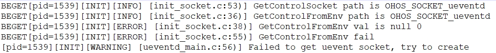

# startup常见问题

## 启动恢复常见问题

### 设备启动过程中打印“parse failed!”错误后停止启动

**现象描述**

设备启动过程中，打印日志“[Init] InitReadCfg, parse failed! please check file /etc/init.cfg format.”错误，启动过程停止，如下图所示：

  **图1** 运行报错图

  

**可能原因**

init.cfg文件内容不符合JSON语法格式。

**解决办法**

排查init.cfg文件，格式符合JSON格式要求。


### 设备开机后，反复重启。

**现象描述**

设备启动过程中反复重启。

**可能原因**

init服务中定义“importance”的属性（详见[参数说明](../subsystems/subsys-boot-init-service.md#服务进程配置文件说明)描述）。

- 属性值为0时，表示当前服务进程退出，设备不重启。

- 属性值为1时，表示当前服务进程退出，设备重启。

**解决办法**

1. 通过日志确认崩溃或报错退出的服务，并解决其崩溃/报错的问题，重新烧写镜像即可。

2. 将崩溃/报错退出的服务的“importance”属性改为0，重新烧写镜像，设备不重启。


### 调用SetParameter/GetParameter返回失败

**现象描述**

在参数正确的情况下，调用SetParameter/GetParameter返回失败。

**出现问题系统类型**

liteos-a

**可能原因**

程序有对SetParameter/GetParameter这两个接口做权限校验，因此在各参数正确的情况下，调用SetParameter/GetParameter返回操作失败，是调用者的uid大于1000，没有调用权限。

**解决办法**

无需处理。

### ueventd服务启动后报获取socket失败，尝试创建

**现象描述**

ueventd服务启动后，打印日志 “Failed to get uevent socket, try to create”日志，并且有如下图所示错误日志：

  **图2** ueventd获取socket失败

  

**可能原因**

由于ueventd服务是按需启动的服务，其设备启动后，首先从环境变量中拿到init为其创建的socket的fd。根据上述报错打印可知，是获取环境变量的值失败，这种情况可能是：
1. cfg文件中的ueventd服务没有配置socket，导致init并没有为其创建socket，也就没有相应的环境变量能够让其获取。
2. cfg文件中的ueventd服务已经配置了socket，那可能是在另外一个cfg文件中重复配置了ueventd服务，并且其中没有配置socket。

**解决办法**

1. cfg文件没有配置socket，需要在cfg文件中对ueventd服务进行socket配置，具体可参看init.cfg中ueventd[服务的socket配置](../subsystems/subsys-boot-init-service.md#服务进程配置文件说明)。
2. 重复配置socket，需要查看所有cfg文件找到重复配置的ueventd服务，并将其删除，保留一个有效的ueventd服务配置。

### ueventd服务轮询socket超时，并自动退出

**现象描述**

ueventd服务启动一段时间后，出现打印日志 “poll ueventd socket timeout, ueventd exit” 并自动退出。

**可能原因**

由于ueventd服务是按需启动的服务，其行为是当有uevent事件上报时，init监听到socket消息，会将ueventd服务拉起使其处理相应的socket消息，ueventd服务处理完现有的socket消息后，会自己再轮询对应socket句柄30秒，若30秒内又有新消息上报，则继续处理，待处理结束后再次计时轮询30秒；若超过30秒都没有新消息上报，ueventd服务将会退出，并将socket交还给init轮询，此时就会出现日志中的打印，因此这是一个正常的行为逻辑。

**解决办法**

正常行为，无需解决。

### 配置了ondemand属性的服务无法被正确解析启动

**现象描述**

符合JSON格式的服务配置无法被正确解析，打印日志 “Service is invalid which has both critical and ondemand attribute”，启动该服务时提示“Cannot find service”。

**可能原因**

ondemand属性默认是按需启动的，ondemand和critical属性互斥，两者同时配置，服务不能被正确解析。

**解决办法**

1. 服务不按需启动， 不需要配置ondemand属性。
2. 服务按需启动， critical是常驻进程配置， 配置ondemand属性后，不需要再配置critical属性， 或者配置critical属性不使能。

### 配置ondemand属性的服务不受并行启动控制

**现象描述**

配置ondemand属性的服务并没有在并行启动阶段被拉起，start-mode设置无效。

**可能原因**

ondemand属性属于按需启动配置， 服务未能满足启动条件，因此未能成功拉起服务， 属于正常现象。

**解决办法**

并行启动的服务不配置ondemand属性。

### SA按需启动服务无法按需拉起

**现象描述**

SA服务配置为按需启动的情况，在SA客户端发送请求后，samgr并没有动态拉起SA服务。

**可能原因**

在SA服务实现按需启动初期，使用统一接口SystemAbilityManager::CheckSystemAbility(int32_t systemAbilityId)，后续为了将按需启动的SA服务区分开来，新增samgr提供的动态加载接口LoadSystemAbility(int32_t systemAbilityId, const sptr& callback)，原接口不适配按需启动的SA服务，故导致SA服务未能按需拉起。

**解决办法**

在按需启动的SA服务中使用samgr提供的动态加载接口LoadSystemAbility(int32_t systemAbilityId, const sptr& callback)。

### caps配置不合理

**现象描述**

caps 配置错误，会导致配置失效，报错如下：
 ```
4.619955] [pid=1 0][Init][ERROR][init_capability.c:119]service=multimodalinput not support caps = CAP_DC_OVERRIDE caps 41
[ 4.620014] [pid=1 0][Init][ERROR][init_service_manager.c:818]GetServiceSecon secon section not found, skip
[ 4.620216] [pid=1 0][Init][ERROR][init_service_manager.c:818]GetServiceSecon secon section not found, skip
[ 4.620608] [pid=1 0][Init][ERROR][init_capability.c:119]service=mmi_uinput_service  not support caps = CAP_DC_OVERRIDE caps 41
```
**可能原因**

1. 内核不支持。
2. cfg文件中配置错误。

**出现问题版本**

OpenHarmony-3.0-LTS

**解决办法**

1. 内核不支持， 不需要配置caps。
2. 内核支持，cfg文件中caps配置不正确，导致在init中解析的时候，解析失败，参考base/startup/init/services/init/init_capability.c中，capStrCapNum数据结构的定义，正确配置caps。

### 打开沙盒功能

**现象描述**

通过hdc shell param get const.sandbox查看该parameter的值不是enable。

**可能原因**

无。

**解决方法**

在base/startup/init/services/etc/param/ohos.para中配置const.sandbox=enable。具体参考[沙盒指导](../subsystems/subsys-boot-init-sandbox.md)

### 查看服务中沙盒的挂载状态

**现象描述**

无。

**可能原因**

无。

**解决方法**

设备进入hdc shell下， 执行sandbox -s service_name命令，模拟当前服务进入沙盒场景， 通过 ls 等shell命令查看当前服务沙盒目录。具体参考[沙盒命令](../subsystems/subsys-boot-init-plugin.md)

### Bootevent部分事件的ready阶段的时间戳为0

**现象描述**

Bootevent手动模式下，开机完成之后在执行dump_service all bootevent命令后有部分事件的ready阶段的时间戳为0。

**可能原因**

1. 服务没有发送bootevent事件。
2. 服务发送bootevent事件， 但是没有相关权限。

**解决方法**

1. 服务配置了bootevent，但是没有发送该bootevent事件，请相关服务在代码中发送该bootevent事件。
2. 在代码中已经执行到设置bootevent的操作，但是ready的状态就是为零，此时请检查服务是否有设置bootevent参数的权限。

### A/B分区启动过程因只烧写原始分区导致的无法启动

**现象描述**

烧写完成后系统无法正常启动，并且可以在串口日志中找到类似如下打印：

```
wait for file:/dev/block/platform/fe310000.sdhci/by-name/system_b failed after 5 second.
Mount /dev/block/platform/fe310000.sdhci/by-name/system_b to /usr failed 2
```

**可能原因**

当前系统已经支持了A/B分区启动，根据日志可知本次启动尝试挂载了带"_b"后缀的system分区，即本次启动从B分区启动，但是并没有找到设备，导致挂载失败。这种情况是由于当前misc分区中的active slot值被设置为了2（B分区），但是并没有烧写对应B分区导致的。

**解决方法**

1. 可以清空misc分区（使用空misc镜像烧写对应分区），将其中的active slot值擦除，再次启动即可从默认分区启动。
2. 使用配置了B分区的分区表将system_b和vendor_b镜像烧写到开发板中，再次启动即可从对应B分区正常启动。

## Appspawn应用孵化常见问题

### 设备启动中，appspawn启动失败

**现象描述**

设备启动过程中，设备停止开机动画中， 进入appspawn失败。

**可能原因**

1. 开机动画未能正常退出。
2. 拉起系统应用失败， 导致appspawn启动失败。

**解决办法**

需要通过日志确认崩溃或报错退出的服务，并解决其崩溃/报错的问题，然后重新烧写镜像即可。

### 冷启动命令启动应用失败

**现象描述**

通过冷启动命令拉起应用失败。
  ```
  aa start -d 12345 -a $name -b $package -C
  ```

**可能原因**

1. 冷启动状态未打开。
2. 冷启动命令参数输入错误。
3. socket请求超时。
4. selinux打开。

**解决办法**

1. 冷启动不使能， 通过param get startup.appspawn.cold.boot命令查看状态，如果冷启动状态是0, 通过param set startup.appspawn.cold.boot 1 命令打开冷启动状态。
2. 冷启动命令参数不正确， 查看并确认冷启动参数。
3. 设置超时时间>3秒，执行 param set persist.appspawn.client.timeout 5 命令。
4. 关闭selinux, 执行 setenforce 0 命令。

### 应用沙盒创建失败

**现象描述**

com.ohos.systemui应用启动失败、OpenHarmony开机动画退出失败、计算器应用无法使用、字体不能正常显示等。日志报错：
 - bind mount `<src-path>` to `<sandbox-path>` failed errno `<errorCode>`。
 - private mount to `<sandbox-path>`  failed errno `<errorCode>`。
 - symlink failed, `<link-name>`, errno is `<errorCode>`。

**可能原因**

1. 沙盒流程创建失败。
2. com.ohos.systemui沙盒创建失败。
3. 沙盒应用依赖的文件配置失败。

**解决办法**

1. 查看hilog日志中，排查相关hilog报错信息，针对报错修改对应的JSON文件。
2. 查看对应应用的pid情况，排查沙盒建立过程的代码逻辑，以及相应的JSON配置的正确性。

具体参考[应用沙盒开发步骤](../subsystems/subsys-boot-appspawn.md#开发步骤)