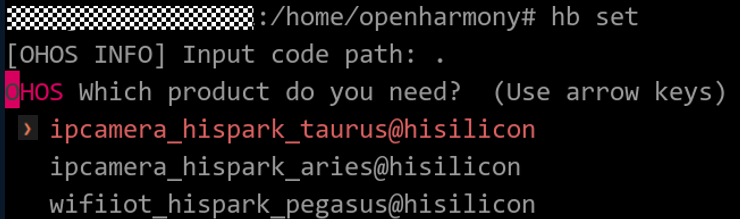

# Docker编译环境


## Docker环境介绍

OpenHarmony为开发者提供了两种Docker环境，以帮助开发者快速完成复杂的开发环境准备工作。两种Docker环境及适用场景如下：

- 独立Docker环境：适用于直接基于Ubuntu、Windows操作系统平台进行版本编译的场景。

- 基于HPM的Docker环境：适用于使用HPM工具进行发行版编译的场景。

  **表1** Docker镜像介绍

| 系统类型 | 运行平台 | Docker镜像仓库 | 标签 | 
| -------- | -------- | -------- | -------- |
| 轻量和小型系统/标准系统（独立Docker环境） | Ubuntu/Windows | swr.cn-south-1.myhuaweicloud.com/openharmony-docker/openharmony-docker | 1.0.0 | 
| 轻量和小型系统（HPM Docker环境） | Ubuntu/Windows | swr.cn-south-1.myhuaweicloud.com/openharmony-docker/openharmony-docker | 0.0.3 | 


## 环境准备

在使用docker环境前需要先完成以下操作：

1. 安装Docker，Docker安装请参考[官方指导](https://docs.docker.com/engine/install/)。

2. 获取OpenHarmony源码，请参考[获取源码](https://device.harmonyos.com/cn/docs/documentation/guide/sourcecode-acquire-0000001050769927)。
   >  **说明：**
   > HPM Docker环境无需单独获取源码。


## 独立Docker环境

OpenHarmony的Docker镜像托管在[HuaweiCloud SWR](https://console.huaweicloud.com/swr/?region=cn-south-1#/app/warehouse/warehouseMangeDetail/goldensir/openharmony-docker/openharmony-docker?type=ownImage)上。开发者可以通过该镜像在很大程度上简化编译前的环境配置。下文将介绍具体使用步骤。

### 搭建Docker环境（轻量系统和小型系统）

1. 获取Docker镜像。
     
   ```
   docker pull swr.cn-south-1.myhuaweicloud.com/openharmony-docker/openharmony-docker:1.0.0
   ```

2. 进入源码根目录执行如下命令，从而进入Docker构建环境。
     ubuntu下执行：
     
   ```
   docker run -it -v $(pwd):/home/openharmony swr.cn-south-1.myhuaweicloud.com/openharmony-docker/openharmony-docker:1.0.0
   ```

   windows下执行（假设源码目录为D:\OpenHarmony）：

     
   ```
   docker run -it -v D:\OpenHarmony:/home/openharmony swr.cn-south-1.myhuaweicloud.com/openharmony-docker/openharmony-docker:1.0.0
   ```

### 编译源码（轻量系统和小型系统）

通过如下编译脚本启动轻量系统类设备（参考内存≥128KiB）和小型系统类设备（参考内存≥1MiB）的编译。下文以Hi3516平台为例说明具体编译步骤。

  设置编译路径，选择当前路径。
  
```
hb set
 .
```

  **图1** 设置编译界面

  

>  **说明：**
> 当前开发板平台和编译界面的对应关系如下：
> 
> - Hi3861：wifiiot_hispark_pegasus\@hisilicon
> 
> - Hi3516：ipcamera_hispark_taurus\@hisilicon
> 
> - Hi3518：ipcamera_hispark_aries\@hisilicon

1. 选择ipcamera_hispark_taurus\@hisilicon并回车。

2. 执行编译。
     
   ```
   hb build -f
   ```

3. 查看编译结果。
   编译结果文件生成在out/hispark_taurus/ipcamera_hispark_taurus目录下。

### 搭建Docker环境（标准系统）

1. 获取Docker镜像。
     
   ```
   docker pull swr.cn-south-1.myhuaweicloud.com/openharmony-docker/openharmony-docker-standard:1.0.0
   ```

2. 进入源码根目录执行如下命令，从而进入Docker构建环境。
     
   ```
   docker run -it -v $(pwd):/home/openharmony swr.cn-south-1.myhuaweicloud.com/openharmony-docker/openharmony-docker-standard:1.0.0
   ```

### 编译源码（标准系统）

  通过如下编译脚本启动标准系统类设备（参考内存≥128MB）的编译。
  
```
./build.sh --product-name {product_name} --ccache
```

{product_name}为当前版本支持的平台。比如：Hi3516DV300和rk3568等。

编译所生成的文件都归档在out/{device_name}/目录下，结果镜像输出在 out/{device_name}/packages/phone/images/ 目录下。


>  **说明：**
> 退出Docker执行exit命令即可。


## 基于HPM的Docker环境

docker_dist是一个[HPM](https://hpm.harmonyos.com/)系统中的模板组件，能够帮助用户快速初始化HPM工程，利用docker镜像来快速编译OpenHarmony发行版，在很大程度上简化了编译前的环境配置。开发者在配置好Ubuntu和[hpm-cli](https://device.harmonyos.com/cn/docs/documentation/guide/hpm-part-development-install-0000001178291102)开发环境后，可以通过以下步骤来使用我们提供的Docker环境。


### 搭建Docker环境

1. 初始化安装模板。在任意工作目录中执行以下命令。
     
   ```
   hpm init -t @ohos/docker_dist
   ```

2. 修改publishAs。
   因为获取到的是模板类型的包，要把包的类型改为需要的类型。 在当前目录下打开bundle.json文件，把"publishAs"字段的值由"template"改为"distribution"。


### 获取及编译源码

执行编译。自动安装docker只能在Ubuntu环境下执行，如果其他环境，需要用户自行安装docker，然后拉取镜像，执行编译。

- **自动安装docker（Ubuntu环境）**
  以下命令可以帮助用户自动安装docker, 拉取镜像，并且在容器中开始运行对应解决方案的拉取和编译。

  **方式一：**

  命令后接参数指定解决方案，格式如下：

    
  ```
  hpm run docker solution={product}
  ```

  {product}为需编译的解决方案，如：\@ohos/hispark_taurus、\@ohos/hispark_aries、\@ohos/hispark_pegasus。

  **方式二：**

  设置环境变量来选择解决方案，再执行编译命令。

  1. 选择解决方案。
        
      ```
      export solution={product}
      ```

      {product}为需编译的解决方案，如：\@ohos/hispark_taurus、\@ohos/hispark_aries、\@ohos/hispark_pegasus。
  2. 获取源码及执行编译。
        
      ```
      hpm run docker
      ```

    以上两种方式以\@ohos/hispark_taurus为例，执行成功结果如下：
    
  ```
  ......
  ohos ipcamera_hispark_taurus build success!
  @ohos/hispark_taurus: distribution building completed.
  ```

- **自行安装docker（非Ubuntu环境）**
  自行安装docker相关操作如下：

    
  ```
  # 拉取镜像 
  docker pull swr.cn-south-1.myhuaweicloud.com/openharmony-docker/openharmony-docker:0.0.3# linux环境下的编译 
  hpm run distWithDocker solution={product}
  # windows下的编译，需要配置gitbash 
  hpm config set shellPath "gitbash路径"
  hpm run distWithDocker solution={product}
  ```
