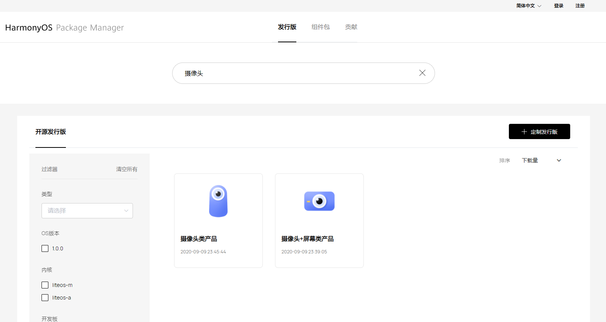
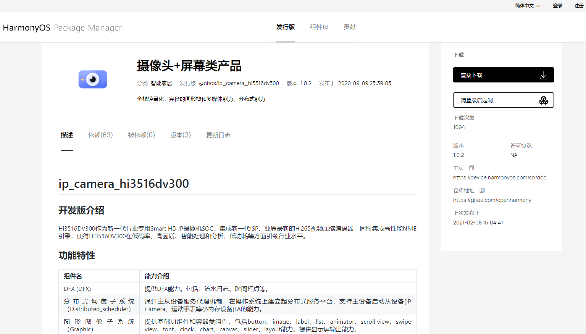

# 源码获取<a name="ZH-CN_TOPIC_0000001050769927"></a>

-   [OpenHarmony介绍](#section6370143622110)
-   [源码获取概述](#section12763342204)
-   [获取方式1：从镜像站点获取](#section1186691118430)
-   [获取方式2：从HPM（包管理器）组件式获取](#section463013147412)
-   [适用场景](#section123926431441)
-   [前提条件](#section42627508156)
-   [操作步骤](#section1781916234118)
-   [获取方式3：从代码仓库获取](#section537312010229)
-   [适用场景](#section1492115412228)
-   [准备](#section1076962313239)
-   [操作](#section17162735266)
-   [源码目录简介](#section1072115612811)

## OpenHarmony介绍<a name="section6370143622110"></a>

OpenHarmony是HarmonyOS的开源版，由华为捐赠给开放原子开源基金会（OpenAtom Foundation）开源。第一个开源版本支持在128KB\~128MB的设备上运行，欢迎参加开源社区一起持续演进。

代码仓库地址：[https://openharmony.gitee.com](https://openharmony.gitee.com)

> **说明：** 
>当前的OpenHarmony源代码仅支持在Linux环境下编译，如果在Windows下使用，可能会出现异常。
>例如，某些组件在下载安装时需要调用Linux命令来设置环境变量，如果在Windows环境下操作可能就会报错。遇到此问题时可以尝试先将hpm 的 shell改为第三方的shell，例如改为git的sh.exe，可通过执行以下命令修改shell：
>hpm config set shellPath 'C:\\Program Files\\Git\\bin\\sh.exe'

## 源码获取概述<a name="section12763342204"></a>

本文档将介绍如何获取OpenHarmony源码并说明OpenHarmony的源码目录结构。OpenHarmony的代码以[组件](../bundles/概述.md)的形式开放，开发者可以通过如下其中一种方式获取：

-   **获取方式1**：从镜像站点下载归档后的发行版压缩文件（推荐）
-   **获取方式2**：通过HPM包管理器获取。在[HPM](https://hpm.harmonyos.com)网站，查找满足需求的开源发行版，直接下载（或者定制后下载），再通过hpm-cli命令工具将所需的组件及工具链下载、安装到本地。
-   **获取方式3**：从代码仓库获取。通过repo或git工具从代码仓库中下载。

## 获取方式1：从镜像站点获取<a name="section1186691118430"></a>

为了获得更好的下载性能，您可以选择从以下站点的镜像库获取源码或者对应的解决方案。

**表 1**  源码获取路径

<a name="table91984129177"></a>
<table><thead align="left"><tr id="row51981312101713"><th class="cellrowborder" valign="top" width="25%" id="mcps1.2.5.1.1"><p id="p16618172471719"><a name="p16618172471719"></a><a name="p16618172471719"></a>下载内容</p>
</th>
<th class="cellrowborder" valign="top" width="25%" id="mcps1.2.5.1.2"><p id="p46181224161718"><a name="p46181224161718"></a><a name="p46181224161718"></a>版本信息</p>
</th>
<th class="cellrowborder" valign="top" width="25%" id="mcps1.2.5.1.3"><p id="p1461814241177"><a name="p1461814241177"></a><a name="p1461814241177"></a>下载站点</p>
</th>
<th class="cellrowborder" valign="top" width="25%" id="mcps1.2.5.1.4"><p id="p12618192481716"><a name="p12618192481716"></a><a name="p12618192481716"></a>SHA256校验码</p>
</th>
</tr>
</thead>
<tbody><tr id="row11198111281715"><td class="cellrowborder" valign="top" width="25%" headers="mcps1.2.5.1.1 "><p id="p161822419172"><a name="p161822419172"></a><a name="p161822419172"></a>全量代码</p>
</td>
<td class="cellrowborder" valign="top" width="25%" headers="mcps1.2.5.1.2 "><p id="p361810245170"><a name="p361810245170"></a><a name="p361810245170"></a>1.0.1</p>
</td>
<td class="cellrowborder" valign="top" width="25%" headers="mcps1.2.5.1.3 "><p id="p11618112416174"><a name="p11618112416174"></a><a name="p11618112416174"></a><a href="https://repo.huaweicloud.com/harmonyos/os/1.0.1/code-1.0.1.tar.gz" target="_blank" rel="noopener noreferrer">站点</a></p>
</td>
<td class="cellrowborder" valign="top" width="25%" headers="mcps1.2.5.1.4 "><p id="p2619182441717"><a name="p2619182441717"></a><a name="p2619182441717"></a><a href="https://repo.huaweicloud.com/harmonyos/os/1.0.1/code-1.0.1.tar.gz.sha256" target="_blank" rel="noopener noreferrer">SHA256 校验码</a></p>
</td>
</tr>
<tr id="row1019861220171"><td class="cellrowborder" valign="top" width="25%" headers="mcps1.2.5.1.1 "><p id="p1619102471714"><a name="p1619102471714"></a><a name="p1619102471714"></a>Hi3861解决方案（二进制）</p>
</td>
<td class="cellrowborder" valign="top" width="25%" headers="mcps1.2.5.1.2 "><p id="p660745105917"><a name="p660745105917"></a><a name="p660745105917"></a>1.0.1</p>
</td>
<td class="cellrowborder" valign="top" width="25%" headers="mcps1.2.5.1.3 "><p id="p6619122411710"><a name="p6619122411710"></a><a name="p6619122411710"></a><a href="https://repo.huaweicloud.com/harmonyos/os/1.0.1/wifiiot-1.0.1.tar.gz" target="_blank" rel="noopener noreferrer">站点</a></p>
</td>
<td class="cellrowborder" valign="top" width="25%" headers="mcps1.2.5.1.4 "><p id="p86198245173"><a name="p86198245173"></a><a name="p86198245173"></a><a href="https://repo.huaweicloud.com/harmonyos/os/1.0.1/wifiiot-1.0.1.tar.gz.sha256" target="_blank" rel="noopener noreferrer">SHA256 校验码</a></p>
</td>
</tr>
<tr id="row419901210176"><td class="cellrowborder" valign="top" width="25%" headers="mcps1.2.5.1.1 "><p id="p1461992491711"><a name="p1461992491711"></a><a name="p1461992491711"></a>Hi3518解决方案（二进制）</p>
</td>
<td class="cellrowborder" valign="top" width="25%" headers="mcps1.2.5.1.2 "><p id="p1219537125917"><a name="p1219537125917"></a><a name="p1219537125917"></a>1.0.1</p>
</td>
<td class="cellrowborder" valign="top" width="25%" headers="mcps1.2.5.1.3 "><p id="p13619112431714"><a name="p13619112431714"></a><a name="p13619112431714"></a><a href="https://repo.huaweicloud.com/harmonyos/os/1.0.1/ipcamera_hi3518ev300-1.0.1.tar.gz" target="_blank" rel="noopener noreferrer">站点</a></p>
</td>
<td class="cellrowborder" valign="top" width="25%" headers="mcps1.2.5.1.4 "><p id="p6619224191719"><a name="p6619224191719"></a><a name="p6619224191719"></a><a href="https://repo.huaweicloud.com/harmonyos/os/1.0.1/ipcamera_hi3518ev300-1.0.1.tar.gz.sha256" target="_blank" rel="noopener noreferrer">SHA256 校验码</a></p>
</td>
</tr>
<tr id="row1019901219170"><td class="cellrowborder" valign="top" width="25%" headers="mcps1.2.5.1.1 "><p id="p2619142411713"><a name="p2619142411713"></a><a name="p2619142411713"></a>Hi3516解决方案（二进制）</p>
</td>
<td class="cellrowborder" valign="top" width="25%" headers="mcps1.2.5.1.2 "><p id="p440317815592"><a name="p440317815592"></a><a name="p440317815592"></a>1.0.1</p>
</td>
<td class="cellrowborder" valign="top" width="25%" headers="mcps1.2.5.1.3 "><p id="p176194245176"><a name="p176194245176"></a><a name="p176194245176"></a><a href="https://repo.huaweicloud.com/harmonyos/os/1.0.1/ipcamera_hi3516dv300-1.0.1.tar.gz" target="_blank" rel="noopener noreferrer">站点</a></p>
</td>
<td class="cellrowborder" valign="top" width="25%" headers="mcps1.2.5.1.4 "><p id="p196193246171"><a name="p196193246171"></a><a name="p196193246171"></a><a href="https://repo.huaweicloud.com/harmonyos/os/1.0.1/ipcamera_hi3516dv300-1.0.1.tar.gz.sha256" target="_blank" rel="noopener noreferrer">SHA256 校验码</a></p>
</td>
</tr>
<tr id="row151991912161714"><td class="cellrowborder" valign="top" width="25%" headers="mcps1.2.5.1.1 "><p id="p116191324121716"><a name="p116191324121716"></a><a name="p116191324121716"></a>RELEASE-NOTES</p>
</td>
<td class="cellrowborder" valign="top" width="25%" headers="mcps1.2.5.1.2 "><p id="p3375101590"><a name="p3375101590"></a><a name="p3375101590"></a>1.0.1</p>
</td>
<td class="cellrowborder" valign="top" width="25%" headers="mcps1.2.5.1.3 "><p id="p66190245178"><a name="p66190245178"></a><a name="p66190245178"></a><a href="https://repo.huaweicloud.com/harmonyos/os/1.0.1/OpenHarmony_Release_Notes_zh_cn.zip" target="_blank" rel="noopener noreferrer">站点</a></p>
</td>
<td class="cellrowborder" valign="top" width="25%" headers="mcps1.2.5.1.4 "><p id="p1161982411713"><a name="p1161982411713"></a><a name="p1161982411713"></a>-</p>
</td>
</tr>
</tbody>
</table>

## 获取方式2：从HPM（包管理器）组件式获取<a name="section463013147412"></a>

## 适用场景<a name="section123926431441"></a>

对于刚接触OpenHarmony的新用户，希望能够参考一些示例解决方案从而进行快速开发。可以在[HPM](https://hpm.harmonyos.com)获取下载开源发行版，也可以在开源发行版的基础上定制（添加或删除组件）。

然后通过包管理器命令行工具（hpm-cli）将需要的组件及相关的编译工具链全部下载、安装到本地。

## 前提条件<a name="section42627508156"></a>

先要在本地安装Node.js和hpm命令行工具，安装步骤如下：

1.  安装Node.js。

    官网下载并在本地安装Node.js.

    推荐安装  [Node.js](https://nodejs.org/)  12.x \(包含 npm 6.14.4\)或更高版本 \(推荐 12.13.0+\)。

2.  通过Node.js自带的npm安装hpm命令行工具。

    打开CMD，执行以下命令：

    ```
    npm install -g @ohos/hpm-cli
    ```

3.  安装完成后执行如下命令，显示hpm版本，即安装成功。

    ```
    hpm -V 或 hpm --version
    ```

4.  如果升级hpm的版本，请执行如下命令：

    ```
    npm update -g @ohos/hpm-cli
    ```


## 操作步骤<a name="section1781916234118"></a>

1.  查找发行版。
    1.  打开包管理页面[HPM](https://hpm.harmonyOS.com)，设定搜索的对象为“发行版“，如下图所示。
    2.  自搜索框输入关键字搜索，如"摄像头"。
    3.  结果中显示与关键字匹配的发行版，可以进一步根据组件类别等过滤条件\(如：适配的开发板，内核）精确筛选。
    4.  查找合适的发行版，点击查看发行版的详情介绍。

        **图 1**  包管理<a name="fig838103114320"></a>  
        

        


2.  了解发行版详情。

    1.  仔细阅读发行版的说明信息，以了解使用场景、特性、组件构成、使用方法以及如何进行定制化，如下图所示。
    2.  点击「直接下载」，将发行版下载到本地。
    3.  点击「定制组件」，将对发行版包含的组件进行定制（添加/删除）。

    **图 2**  发行版示例<a name="fig1329851510414"></a>  
    

    

3.  定制组件。
    1.  进入发行版的定制页面，如下图所示。
    2.  通过关闭开关移除可选组件，或者通过“添加组件”增加新的组件。
    3.  在右边填写您的项目基本信息，包括名称、版本、描述等信息。
    4.  点击“下载“，系统会根据您的选择，生成相应的OpenHarmony代码结构文件\(如my\_cust\_dist.zip\)，保存至本地文件。

        **图 3**  组件定制<a name="fig05036599014"></a>  
        

        


4.  下载安装组件。
    1.  解压下载的压缩文件，用命令行工具CMD（Linux下的Shell终端）
    2.  在解压后的文件目录下执行hpm install指令
    3.  下载的组件存在工程目录下的ohos\_bundles文件夹中（部分组件安装后会将源码复制到指定目录下）。


## 获取方式3：从代码仓库获取<a name="section537312010229"></a>

## 适用场景<a name="section1492115412228"></a>

-   基于OpenHarmony的稳定分支建立自己的基线，分发下游客户。

-   已经完成自身软件与OpenHarmony的对接，需要进行OpenHarmony官方认证。

-   芯片/模组/app通过OpenHarmony官方认证后，贡献代码到OpenHarmony生态。

-   修复OpenHarmony的问题。

-   学习OpenHarmony的源码。


## 准备<a name="section1076962313239"></a>

1.  注册码云gitee账号。
2.  注册码云SSH公钥，请参考码云帮助中心的公钥管理：[https://gitee.com/help/articles/4191](https://gitee.com/help/articles/4191)
3.  安装git客户端并配置用户信息。

    ```
    git config --global user.name "yourname"
    git config --global user.email "your-email-address"
    git config --global credential.helper store
    ```

4.  安装码云repo工具，可以执行如下命令。

    ```
    curl https://gitee.com/oschina/repo/raw/fork_flow/repo-py3 > /usr/local/bin/repo
    chmod a+x /usr/local/bin/repo
    pip install -i https://pypi.tuna.tsinghua.edu.cn/simple requests
    ```


## 操作<a name="section17162735266"></a>

> **说明：** 
>主干代码为码云的开发分支，开发者可通过主干代码获取最新特性。分支代码相对比较稳定，开发者可基于分支代码进行商用功能开发。

-   **OpenHarmony主干代码获取**

方式一（推荐）：通过repo下载

```
repo init -u https://gitee.com/openharmony/manifest.git -b master --no-repo-verify
repo sync -c
```

方式二：通过git clone单个代码仓库

进入[代码仓库主页](https://gitee.com/openharmony)，选择需要克隆的代码仓库，执行命令，如：

```
git clone https://gitee.com/openharmony/manifest.git -b master
```

-   **OpenHarmony_1.0.1_release 分支代码获取**

通过repo下载

```
repo init -u https://gitee.com/openharmony/manifest.git  -b OpenHarmony_1.0.1_release --no-repo-verify
repo sync -c 
```

## 源码目录简介<a name="section1072115612811"></a>

下表是OpenHarmony源码的目录及简单说明：

**表 2**  源码目录的说明

<a name="table3815144702820"></a>
<table><thead align="left"><tr id="row198162047192810"><th class="cellrowborder" valign="top" width="50%" id="mcps1.2.3.1.1"><p id="p690319291299"><a name="p690319291299"></a><a name="p690319291299"></a>目录名</p>
</th>
<th class="cellrowborder" valign="top" width="50%" id="mcps1.2.3.1.2"><p id="p5903122962918"><a name="p5903122962918"></a><a name="p5903122962918"></a>描述</p>
</th>
</tr>
</thead>
<tbody><tr id="row1981674719280"><td class="cellrowborder" valign="top" width="50%" headers="mcps1.2.3.1.1 "><p id="p69031429162912"><a name="p69031429162912"></a><a name="p69031429162912"></a>applications</p>
</td>
<td class="cellrowborder" valign="top" width="50%" headers="mcps1.2.3.1.2 "><p id="p090352912914"><a name="p090352912914"></a><a name="p090352912914"></a>应用程序样例，包括wifi-iot，camera等</p>
</td>
</tr>
<tr id="row5816747132817"><td class="cellrowborder" valign="top" width="50%" headers="mcps1.2.3.1.1 "><p id="p99031129112918"><a name="p99031129112918"></a><a name="p99031129112918"></a>base</p>
</td>
<td class="cellrowborder" valign="top" width="50%" headers="mcps1.2.3.1.2 "><p id="p790472962914"><a name="p790472962914"></a><a name="p790472962914"></a>基础软件服务子系统集&amp;硬件服务子系统集</p>
</td>
</tr>
<tr id="row1134218692910"><td class="cellrowborder" valign="top" width="50%" headers="mcps1.2.3.1.1 "><p id="p4904112910295"><a name="p4904112910295"></a><a name="p4904112910295"></a>build</p>
</td>
<td class="cellrowborder" valign="top" width="50%" headers="mcps1.2.3.1.2 "><p id="p1090482942911"><a name="p1090482942911"></a><a name="p1090482942911"></a>组件化编译、构建和配置脚本</p>
</td>
</tr>
<tr id="row8166154261316"><td class="cellrowborder" valign="top" width="50%" headers="mcps1.2.3.1.1 "><p id="p1216719425130"><a name="p1216719425130"></a><a name="p1216719425130"></a>docs</p>
</td>
<td class="cellrowborder" valign="top" width="50%" headers="mcps1.2.3.1.2 "><p id="p17167134217134"><a name="p17167134217134"></a><a name="p17167134217134"></a>说明文档</p>
</td>
</tr>
<tr id="row1841618902919"><td class="cellrowborder" valign="top" width="50%" headers="mcps1.2.3.1.1 "><p id="p1390462902910"><a name="p1390462902910"></a><a name="p1390462902910"></a>domains</p>
</td>
<td class="cellrowborder" valign="top" width="50%" headers="mcps1.2.3.1.2 "><p id="p1390432914296"><a name="p1390432914296"></a><a name="p1390432914296"></a>增强软件服务子系统集</p>
</td>
</tr>
<tr id="row841620912298"><td class="cellrowborder" valign="top" width="50%" headers="mcps1.2.3.1.1 "><p id="p119041629182919"><a name="p119041629182919"></a><a name="p119041629182919"></a>drivers</p>
</td>
<td class="cellrowborder" valign="top" width="50%" headers="mcps1.2.3.1.2 "><p id="p9904629132911"><a name="p9904629132911"></a><a name="p9904629132911"></a>驱动子系统</p>
</td>
</tr>
<tr id="row164164992915"><td class="cellrowborder" valign="top" width="50%" headers="mcps1.2.3.1.1 "><p id="p79042298298"><a name="p79042298298"></a><a name="p79042298298"></a>foundation</p>
</td>
<td class="cellrowborder" valign="top" width="50%" headers="mcps1.2.3.1.2 "><p id="p18904132922915"><a name="p18904132922915"></a><a name="p18904132922915"></a>系统基础能力子系统集</p>
</td>
</tr>
<tr id="row1441610922915"><td class="cellrowborder" valign="top" width="50%" headers="mcps1.2.3.1.1 "><p id="p490402916299"><a name="p490402916299"></a><a name="p490402916299"></a>kernel</p>
</td>
<td class="cellrowborder" valign="top" width="50%" headers="mcps1.2.3.1.2 "><p id="p1904112932912"><a name="p1904112932912"></a><a name="p1904112932912"></a>内核子系统</p>
</td>
</tr>
<tr id="row194175972917"><td class="cellrowborder" valign="top" width="50%" headers="mcps1.2.3.1.1 "><p id="p1904132912910"><a name="p1904132912910"></a><a name="p1904132912910"></a>prebuilts</p>
</td>
<td class="cellrowborder" valign="top" width="50%" headers="mcps1.2.3.1.2 "><p id="p390492919296"><a name="p390492919296"></a><a name="p390492919296"></a>编译器及工具链子系统</p>
</td>
</tr>
<tr id="row841718942913"><td class="cellrowborder" valign="top" width="50%" headers="mcps1.2.3.1.1 "><p id="p12904929202919"><a name="p12904929202919"></a><a name="p12904929202919"></a>test</p>
</td>
<td class="cellrowborder" valign="top" width="50%" headers="mcps1.2.3.1.2 "><p id="p4904152912297"><a name="p4904152912297"></a><a name="p4904152912297"></a>测试子系统</p>
</td>
</tr>
<tr id="row24175915294"><td class="cellrowborder" valign="top" width="50%" headers="mcps1.2.3.1.1 "><p id="p13904162992916"><a name="p13904162992916"></a><a name="p13904162992916"></a>third_party</p>
</td>
<td class="cellrowborder" valign="top" width="50%" headers="mcps1.2.3.1.2 "><p id="p6904829112917"><a name="p6904829112917"></a><a name="p6904829112917"></a>开源第三方组件</p>
</td>
</tr>
<tr id="row334210652914"><td class="cellrowborder" valign="top" width="50%" headers="mcps1.2.3.1.1 "><p id="p1390442918299"><a name="p1390442918299"></a><a name="p1390442918299"></a>utils</p>
</td>
<td class="cellrowborder" valign="top" width="50%" headers="mcps1.2.3.1.2 "><p id="p690412296297"><a name="p690412296297"></a><a name="p690412296297"></a>常用的工具集</p>
</td>
</tr>
<tr id="row73421664298"><td class="cellrowborder" valign="top" width="50%" headers="mcps1.2.3.1.1 "><p id="p7905172920292"><a name="p7905172920292"></a><a name="p7905172920292"></a>vendor</p>
</td>
<td class="cellrowborder" valign="top" width="50%" headers="mcps1.2.3.1.2 "><p id="p290510290293"><a name="p290510290293"></a><a name="p290510290293"></a>厂商提供的软件</p>
</td>
</tr>
<tr id="row734319617292"><td class="cellrowborder" valign="top" width="50%" headers="mcps1.2.3.1.1 "><p id="p09056291290"><a name="p09056291290"></a><a name="p09056291290"></a>build.py</p>
</td>
<td class="cellrowborder" valign="top" width="50%" headers="mcps1.2.3.1.2 "><p id="p1790542912290"><a name="p1790542912290"></a><a name="p1790542912290"></a>编译脚本文件</p>
</td>
</tr>
</tbody>
</table>

