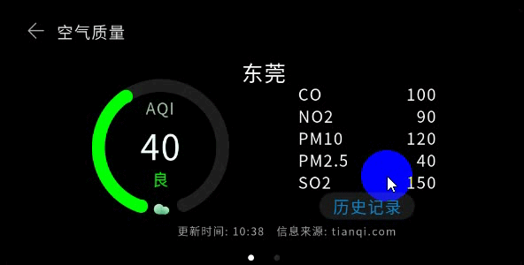

# 概述

-   [效果展示](#section3997224182313)

本文将介绍如何快速搭建基于OpenHarmony系统的行车记录仪（Hi3516DV300开发板）应用开发环境，并基于一个简易的APP示例逐步展示应用的创建、开发、调试和安装等流程。接下来本文以空气质量监测（AirQuality）App为例进行说明。

## 效果展示

空气质量监测App是一款展示城市空气质量信息的应用，有两个页面组成：首页和详情页，在DevEco Studio模拟器中的显示效果如下图所示：

**图 1**  空气质量监测 App显示效果图  

