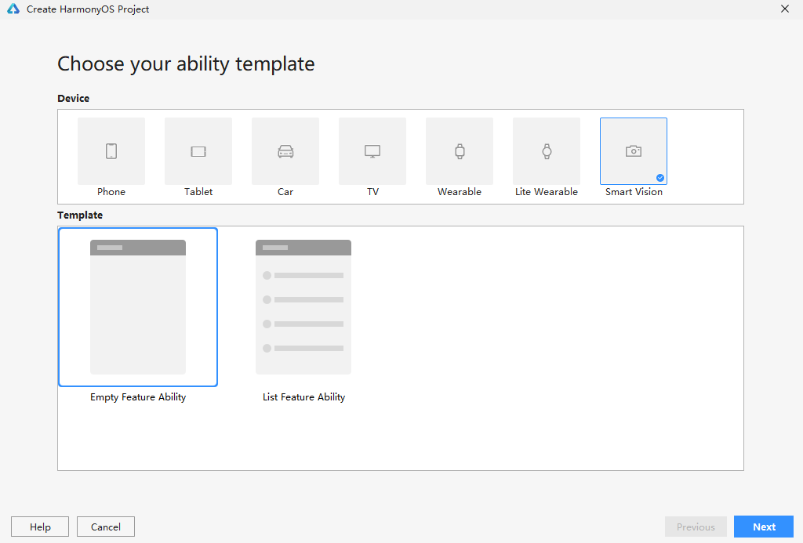

# 开发准备

-   [准备开发环境](#section1912530122716)
-   [创建项目](#section1456035192720)

## 准备开发环境

首先需要下载和配置DevEco Studio，具体操作请参考[《DevEco Studio使用指南》](https://developer.harmonyos.com/cn/docs/documentation/doc-guides/software_install-0000001053582415)。

## 创建项目

1.  通过如下两种方式，打开工程创建向导界面。
    -   如果当前未打开任何工程，可以在DevEco Studio的欢迎页，选择**Create Project**开始创建一个新工程。
    -   如果已经打开了工程，可以在菜单栏选择**File \> New \> Create Project**来创建一个新工程。

2.  选择“Application”下的“Empty Ability”模板，点击**Next**。

    

3.  填写工程相关信息，保持默认值即可，单击**Finish**。
    
    关于各个参数的详细介绍，请参考[《DevEco Studio使用指南》](https://developer.harmonyos.com/cn/docs/documentation/doc-guides-V3/create_new_project-0000001053342414-V3)。
    
    工程创建完成后，DevEco Studio会自动进行工程的同步。
