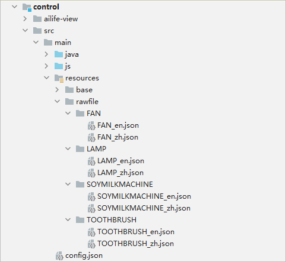

# 开发指导<a name="ZH-CN_TOPIC_0000001158604283"></a>

-   [概述](#section117101122133917)
-   [工程模板介绍](#section16117463402)
-   [向设备发送消息（NAN通道建立完成）](#section536518118361)
-   [定义设备控制原子化服务的UI界面](#section737418403116)

## 概述<a name="section117101122133917"></a>

碰一碰设备控制模板（OneHop Device Ability\(JS\) ）用于帮助开发者实现**“碰一碰-设备配网-设备控制”**完整流程。默认工程运行后为智能电风扇的样例效果，开发者可以参考[定义设备控制原子化服务的UI界面](#section737418403116)章节修改成其他自定义设备。

该模板工程主要分为两部分：

**设备配网原子化服务 （entry模块）**

**设备控制原子化服务 （control模块）**

本指导书用于指导开发者如何开发**设备控制原子化服务的（control模块）**，**设备配网原子化服务（entry模块）**开发指导请参考[设备配网原子化服务开发指导书](guide-atomic-service-netconfig-overview.md)。

## 工程模板介绍<a name="section16117463402"></a>

OneHop Device Ability\(JS\)碰一碰设备控制模板的工程目录结构如下所示。

```
├─control
│  └─ailife-view //该目录无需修改
│      ├─control //控件容器
│      │  ├─display //信息展示类控件
│      │  ├─enum //枚举类控件
│      │  ├─increasedecrease //加减器控件
│      │  ├─item //显示子元素
│      │  ├─multifunction //多功能控件
│      │  ├─progress //进度条控件
│      │  └─reversal //开关类控件
│      ├─customdisplay //自定义展示区
│      ├─dialog //弹窗容器
│      │  ├─dialogbox
│      │  ├─enumlist //枚举弹窗
│      │  ├─info //信息显示弹窗
│      │  ├─picker //选择器弹窗
│      │  └─radiolist //单选弹窗
│      ├─observed
│      └─utils
└─src
    └─main
        ├─java //该目录下内容可见下方类定义
        ├─js
        │  └─default
        │      ├─common //该目录下为本地资源文件，主要都是用于显示的图标资源
        │      │  └─FAN
        │      │          ic_on.png
        │      │          ic_off.png
        │      │          ...
        │      └─pages
        │          └─index
        │                  index.js //起始js
        └─resources
            └─rawfile
                ├─FAN
                        FAN_en.json //本地英文模板配置文件
                        FAN_zh.json //本地中文模板配置文件
```

源码目录src/main/java中各个类的说明如下表所示。

<a name="table1763715163417"></a>
<table><thead align="left"><tr id="row1270013153413"><th class="cellrowborder" valign="top" width="28.52%" id="mcps1.1.3.1.1"><p id="p20933112381015"><a name="p20933112381015"></a><a name="p20933112381015"></a><strong id="b11933152319104"><a name="b11933152319104"></a><a name="b11933152319104"></a>Java</strong></p>
</th>
<th class="cellrowborder" valign="top" width="71.48%" id="mcps1.1.3.1.2"><p id="p07009114346"><a name="p07009114346"></a><a name="p07009114346"></a>Description</p>
</th>
</tr>
</thead>
<tbody><tr id="row2070019113416"><td class="cellrowborder" valign="top" width="28.52%" headers="mcps1.1.3.1.1 "><p id="p137003123411"><a name="p137003123411"></a><a name="p137003123411"></a>MyApplication</p>
</td>
<td class="cellrowborder" valign="top" width="71.48%" headers="mcps1.1.3.1.2 "><p id="p5700131153412"><a name="p5700131153412"></a><a name="p5700131153412"></a>应用的入口类。</p>
</td>
</tr>
<tr id="row1700121133420"><td class="cellrowborder" valign="top" width="28.52%" headers="mcps1.1.3.1.1 "><p id="p11700201193415"><a name="p11700201193415"></a><a name="p11700201193415"></a>ControlMainAbility</p>
</td>
<td class="cellrowborder" valign="top" width="71.48%" headers="mcps1.1.3.1.2 "><p id="p37001219341"><a name="p37001219341"></a><a name="p37001219341"></a>拉起JS的入口类。</p>
</td>
</tr>
<tr id="row18700715343"><td class="cellrowborder" valign="top" width="28.52%" headers="mcps1.1.3.1.1 "><p id="p1670011118348"><a name="p1670011118348"></a><a name="p1670011118348"></a>BaseDeviceDataHandler</p>
</td>
<td class="cellrowborder" valign="top" width="71.48%" headers="mcps1.1.3.1.2 "><p id="p97001814349"><a name="p97001814349"></a><a name="p97001814349"></a>与设备数据交互的抽象类。</p>
</td>
</tr>
<tr id="row1170019193416"><td class="cellrowborder" valign="top" width="28.52%" headers="mcps1.1.3.1.1 "><p id="p4700111343"><a name="p4700111343"></a><a name="p4700111343"></a>NetworkDeviceDataHandler</p>
</td>
<td class="cellrowborder" valign="top" width="71.48%" headers="mcps1.1.3.1.2 "><p id="p570118193413"><a name="p570118193413"></a><a name="p570118193413"></a>继承BaseDeviceDataHandler抽象类，实现NAN无感配网通路的设备数据交互，开发者根据自己的设备进行修改。</p>
</td>
</tr>
<tr id="row11701111143410"><td class="cellrowborder" valign="top" width="28.52%" headers="mcps1.1.3.1.1 "><p id="p10701218342"><a name="p10701218342"></a><a name="p10701218342"></a>SampleDeviceDataHandler</p>
</td>
<td class="cellrowborder" valign="top" width="71.48%" headers="mcps1.1.3.1.2 "><p id="p7701161173414"><a name="p7701161173414"></a><a name="p7701161173414"></a>继承BaseDeviceDataHandler抽象类，示例代码，开发者无需修改。</p>
</td>
</tr>
<tr id="row670141203410"><td class="cellrowborder" valign="top" width="28.52%" headers="mcps1.1.3.1.1 "><p id="p1970119114344"><a name="p1970119114344"></a><a name="p1970119114344"></a>DataHandlerAbility</p>
</td>
<td class="cellrowborder" valign="top" width="71.48%" headers="mcps1.1.3.1.2 "><p id="p1370113115344"><a name="p1370113115344"></a><a name="p1370113115344"></a>Java与JS交互消息的通道。</p>
</td>
</tr>
</tbody>
</table>

<a name="table36377582916"></a>
<table><thead align="left"><tr id="row1363810581196"><th class="cellrowborder" valign="top" width="28.52%" id="mcps1.1.3.1.1"><p id="p13513164112106"><a name="p13513164112106"></a><a name="p13513164112106"></a><strong id="b251316417107"><a name="b251316417107"></a><a name="b251316417107"></a>JS</strong></p>
</th>
<th class="cellrowborder" valign="top" width="71.48%" id="mcps1.1.3.1.2"><p id="p06383581290"><a name="p06383581290"></a><a name="p06383581290"></a>Description</p>
</th>
</tr>
</thead>
<tbody><tr id="row1763835810916"><td class="cellrowborder" valign="top" width="28.52%" headers="mcps1.1.3.1.1 "><p id="p06381581496"><a name="p06381581496"></a><a name="p06381581496"></a>control/ailife-view</p>
</td>
<td class="cellrowborder" valign="top" width="71.48%" headers="mcps1.1.3.1.2 "><p id="p116381658694"><a name="p116381658694"></a><a name="p116381658694"></a>家居控件， 可以在json配置文件声明引用。</p>
</td>
</tr>
<tr id="row126381658793"><td class="cellrowborder" valign="top" width="28.52%" headers="mcps1.1.3.1.1 "><p id="p1963817584912"><a name="p1963817584912"></a><a name="p1963817584912"></a>index.js</p>
</td>
<td class="cellrowborder" valign="top" width="71.48%" headers="mcps1.1.3.1.2 "><p id="p963835816912"><a name="p963835816912"></a><a name="p963835816912"></a>设备控制主页面，根据json配置文件加载ailife-view下的不同控件。</p>
</td>
</tr>
</tbody>
</table>

## 向设备发送消息（NAN通道建立完成）<a name="section536518118361"></a>

**本模板是通过JAVA接口向设备发消息，开发者可在NetworkDeviceDataHandler中调用本模板。**

**JS接口：NetConfig.sendMessage\(commonInfo, message, callbackFunc\)**

-   依赖：需要import模板工程里的fa-netconfig.js进行调用。
-   说明：
    1.  commonInfo里需要填入本次配网通路的sessionId， 由配网原子化服务获取。
    2.  message为发送给设备的字符串消息。
    3.  callbackFunc为消息发送成功与否的回调。


示例：

```
sendMessage: function () {
    let callbackFunc = function (value) {
	//sendMessage 回调
    };
    let commonInfo = {
	sessionId: getApp(this).ConfigParams.deviceInfo.sessionId
    };
    getApp(this).Netconfig.sendMessage(commonInfo, message, callbackFunc).then(
	function (result) {
	    let ret = JSON.parse(result);
	    //sendMessage 消息下发结果
        });
}
```

**Java接口：NetConfigApi._getInstance_\(\).sendMessage\(CommonInfo commonInfo, String message, BaseCallback<String\> callback\)**

依赖：在build.gradle的dependencies中添加 implementation\(group:'com.huawei.hilink',name:'ailifeability',version:'1.0.0.1',ext:'har'\)

说明：

1.  commonInfo里需要填入本次配网通路的sessionId， 由配网原子化服务获取。
2.  message为发送给设备的字符串消息。
3.  callback为消息发送成功与否的回调。

示例：

```
private void sendMessage(String message, HashMap<String, Object> tmpMap) {
    CommonInfo commonInfo = new CommonInfo();
    commonInfo.setSessionId(sessionId);
    HiLog.error(LABEL_LOG, "sessionId " + sessionId);
    NetConfigApi.getInstance().sendMessage(commonInfo, message, (code, controlMessage, str) -> {
	if (code == 0) {
	    HiLog.info(LABEL_LOG, "Message sent successfully" + message);
	    dataMap.putAll(tmpMap);
	    mainHandler.postTask(() -> onDeviceDataChange(dataMap));
	} else {
	    HiLog.error(LABEL_LOG, "Failed to send the message. Code =" +
	    code + " control message = " + controlMessage);
	}
    });
}
```

## 定义设备控制原子化服务的UI界面<a name="section737418403116"></a>

本章节用于指导开发设备控制页面，有两种实现方式：

1.  使用预设的组件构建自定义设备控制页面。此方式通过配置JSON文件，生成设备控制界面。此种方式的优点是可以快速地构建出设备控制界面，并且为界面的各个组件绑定了点击事件和处理逻辑。
2.  开发者自己开发自定义的设备控制页面。此方式使用系统原生组件开发设备控制页面。此种方式的优点是开发者可灵活地定义UI界面。

本章节主要介绍第一种方式，第二种方式后续将会推出。

该模板工程在control/ailife-view下提供了一系列的UI控件，同时定义了一套json配置规则。这套规则会引用自定义UI控件，来生成自定义的设备控制页面。

在control/src/main/js/default/pages/index/index.hml中相关控件引用代码如下：\( 控件样式请参考下方[JSON文件配置说明](guide-atomic-service-device-ctrl-json-intro.md)章节 \)


**使用预设的组件构建出自定义设备控制页面需要执行以下几个步骤：**

1.  声明用于描述界面的json文件, 放置到**control/src/main/resources/rawfile/<设备名\>**  的目录下。

    json配置文件的详细字段定义见[JSON文件配置说明](guide-atomic-service-device-ctrl-json-intro.md)，文件名必须为 <设备名\>\_<语言\>.json。

    > **说明：** 
    >模板工程默认提供了台灯、牙刷、豆浆机和智能电风扇4个样例，对应的配置文件为LAMP.json、TOOTHBRUSH.json、SOYMILKMACHINE.json、FAN.json。
    >默认运行使用FAN.json。

    

2.  提供UX资源图，可以打包本地资源，也可以使用云端资源。

    使用本地资源需要统一打包到**control/src/main/js/default/common/<设备名\>**的目录下，在json配置文件里可以直接引用。

    

    使用云端资源需要在代码中添加资源的网络路径目录，具体修改到DataHandlerAbility.java中的getTemplate方法，将iconUrl填入您的网络路径， json配置文件中引用的资源是该网络路径下的相对路径。下方为getTemplate方法中需要修改的部分示例：

    ```
    if (result != null) {
            //iconUrl 是图标的前缀路径。这里我们在 js 模块中使用 /common/productName 。您可以将其更改为网络地址，所有图标文件必须在 iconUrl 下。
    	result.put("iconUrl", SampleDeviceDataHandler.EXAMPLE_RESOURCE_DIR + "/" + productName);
    	// deviceIcon 是产品图标的文件名。它必须存在于 iconUrl 下。
    	result.put("deviceIcon", "/" + productName + ".png");
    	// logoIcon 是产品标志的文件名。它必须存在于 iconUrl 下。
    	result.put("logoIcon", "/logo.png");
    }
    ```

3.  将DataHandlerAbility.java中的DEVICE\_DATA\_MODE设为DEVICE\_DATA\_MODE\_NETWORK\_DEVICE，即可使用NetworkDeviceDataHandler.java处理数据，实现秒控控制设备的效果。

    参考NetworkDeviceDataHandler.java中的fanDataModel，模板中已经实现了一个智能电风扇的数据处理逻辑。这个处理逻辑可将页面的点击事件传过来的数据转换成指令发送给设备，您可以参照该电风扇模型添加您的自定义设备处理逻辑。

    ```
    public class NetworkDeviceDataHandler extends BaseDeviceDataHandler {
        private static final HiLogLabel LABEL_LOG = new HiLogLabel(HiLog.DEBUG, 0, "MessageDataHandler");
        private static String sessionId = null;
        private final DeviceDataModel dataModel;
        private final EventHandler mainHandler;
        private final Map<String, Object> dataMap = new HashMap<>();
        private final DeviceDataModel fanDataModel = new DeviceDataModel() {
            @Override
            public Map<String, Object> recoverData() {
                dataMap.put("switch/on", 0);
                dataMap.put("windMode/mode", 0);
                dataMap.put("windGear/gear", 0);
                dataMap.put("shutdown/mode", 0);
                return dataMap;
            }
    	}
    }
    ```

    更多代码处理流程，请参考[核心代码说明](guide-atomic-service-device-ctrl-logic.md#section17354153553419)。


