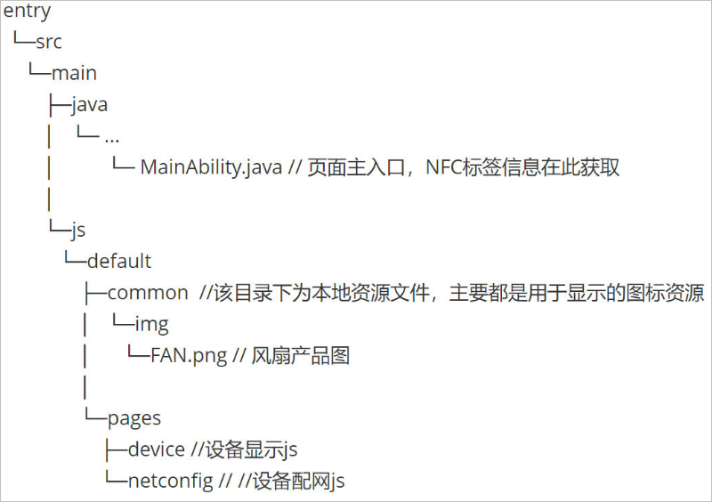

# 开发指导<a name="ZH-CN_TOPIC_0000001158765979"></a>

-   [概述](#section117101122133917)
-   [工程项目结构](#section163058534218)
-   [定义设备配网原子化服务的UI界面](#section129531555424)

## 概述<a name="section117101122133917"></a>

碰一碰设备控制模板（OneHop Device Ability\(JS\) ）用于帮助开发者实现**“碰一碰-设备配网-设备控制”**完整流程。默认工程运行后为智能电风扇的样例效果，开发者可以参考[定义设备配网原子化服务的UI界面](#section129531555424)章节修改成其他自定义设备。

该模板工程主要分为两部分：

**设备配网原子化服务 （entry模块）**

**设备控制原子化服务 （control模块）**

本指导书用于指导开发者如何开发**设备配网原子化服务 （entry模块）**，关于**设备控制原子化服务（control模块）**的开发指导请参考[设备控制原子化服务开发指导书](guide-atomic-service-device-ctrl-overview.md)。

## 工程项目结构<a name="section163058534218"></a>

OneHop Device Ability\(JS\)碰一碰设备配网模板的工程目录结构如下所示。



源码目录中各个类的说明如下表所示。

<a name="table21156122315"></a>
<table><thead align="left"><tr id="row81671115238"><th class="cellrowborder" valign="top" width="22.36%" id="mcps1.1.3.1.1"><p id="p181670112231"><a name="p181670112231"></a><a name="p181670112231"></a>Class</p>
</th>
<th class="cellrowborder" valign="top" width="77.64%" id="mcps1.1.3.1.2"><p id="p18167111122313"><a name="p18167111122313"></a><a name="p18167111122313"></a>Description</p>
</th>
</tr>
</thead>
<tbody><tr id="row141674115231"><td class="cellrowborder" colspan="2" valign="top" headers="mcps1.1.3.1.1 mcps1.1.3.1.2 "><p id="p11679172319"><a name="p11679172319"></a><a name="p11679172319"></a><strong id="b1716713114234"><a name="b1716713114234"></a><a name="b1716713114234"></a>Java</strong></p>
</td>
</tr>
<tr id="row1516781132314"><td class="cellrowborder" valign="top" width="22.36%" headers="mcps1.1.3.1.1 "><p id="p116751132311"><a name="p116751132311"></a><a name="p116751132311"></a>MyApplication</p>
</td>
<td class="cellrowborder" valign="top" width="77.64%" headers="mcps1.1.3.1.2 "><p id="p2016719117238"><a name="p2016719117238"></a><a name="p2016719117238"></a>应用的入口类</p>
</td>
</tr>
<tr id="row101670192310"><td class="cellrowborder" valign="top" width="22.36%" headers="mcps1.1.3.1.1 "><p id="p4167121172314"><a name="p4167121172314"></a><a name="p4167121172314"></a>MainAbility</p>
</td>
<td class="cellrowborder" valign="top" width="77.64%" headers="mcps1.1.3.1.2 "><p id="p016718116235"><a name="p016718116235"></a><a name="p016718116235"></a>拉起JS的入口类，处理NFC标签读取到的信息</p>
</td>
</tr>
<tr id="row71685114234"><td class="cellrowborder" colspan="2" valign="top" headers="mcps1.1.3.1.1 mcps1.1.3.1.2 "><p id="p21681513237"><a name="p21681513237"></a><a name="p21681513237"></a><strong id="b21688112316"><a name="b21688112316"></a><a name="b21688112316"></a>JS</strong></p>
</td>
</tr>
<tr id="row5168101192316"><td class="cellrowborder" valign="top" width="22.36%" headers="mcps1.1.3.1.1 "><p id="p10168117236"><a name="p10168117236"></a><a name="p10168117236"></a>default/pages/device/device.js</p>
</td>
<td class="cellrowborder" valign="top" width="77.64%" headers="mcps1.1.3.1.2 "><p id="p181681518237"><a name="p181681518237"></a><a name="p181681518237"></a>设备简介页，碰一碰拉起后跳转的页面</p>
</td>
</tr>
<tr id="row1016814111235"><td class="cellrowborder" valign="top" width="22.36%" headers="mcps1.1.3.1.1 "><p id="p1816814112316"><a name="p1816814112316"></a><a name="p1816814112316"></a>default/pages/netconfig/netconfig.js</p>
</td>
<td class="cellrowborder" valign="top" width="77.64%" headers="mcps1.1.3.1.2 "><p id="p111681119236"><a name="p111681119236"></a><a name="p111681119236"></a>设备配网页，负责配网相关逻辑，在设备简介页点击配网后显示</p>
</td>
</tr>
</tbody>
</table>

## 定义设备配网原子化服务的UI界面<a name="section129531555424"></a>

1.  在MainAbility onStart里处理NFC标签读取到的product id信息，  **开发者可以根据自己的productId映射成不同的设备类型，将productName修改成具体的设备名**，默认为智能电风扇。

    ```
    @Override
    public void onStart(Intent intent) {
    	intent.setParam("window_modal", 3);
    	setInstanceName(JS_MODULE);
    
    	Object productInfo = Objects.requireNonNull(intent.getParams()).getParam("productInfo");
    	if (productInfo != null) {
    		productId = (String) productInfo;
    		// Modify your product name according to your product ID in the NFC tag.
    		productName = "FAN";
    	}
    }
    ```

2.  在资源目录下放置您的产品图， 用于界面显示，**注意文件命名为<设备名\>.png， 设备名保持与productName一致**。

    

    设备简介页和设备配网页会显示该产品图。

3.  在项目的entry\\src\\main\\js\\default\\pages\\netconfig\\netconfig.js的goToControl方法中添加deviceType：1，用于提高设备配网的稳定性。

    ```
    goToControl() {
    	let target = {
                    bundleName: 'com.example.middleplatform.deviceoperate',
                    abilityName: 'com.example.middleplatform.ControlMainAbility',
                    deviceType: 1,
                    data: {
                            session_id: getApp(this).ConfigParams.deviceInfo.sessionId,
                            product_id: getApp(this).Product.productId,
                            product_name: getApp(this).Product.productName
                    }
            }
            FeatureAbility.startAbility(target);
            app.terminate();
    }
    ```


