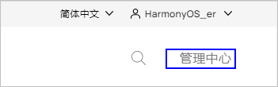
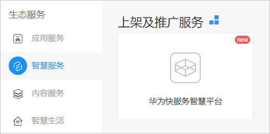
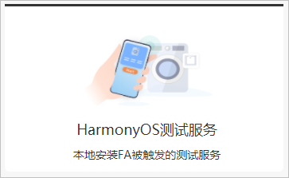
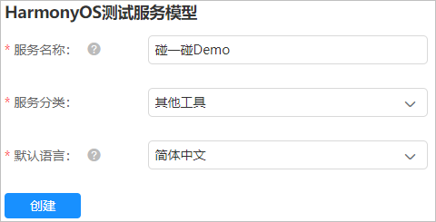
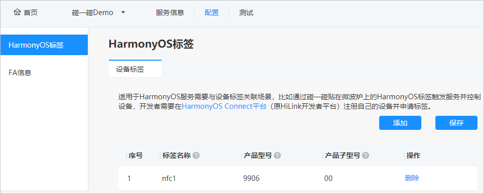
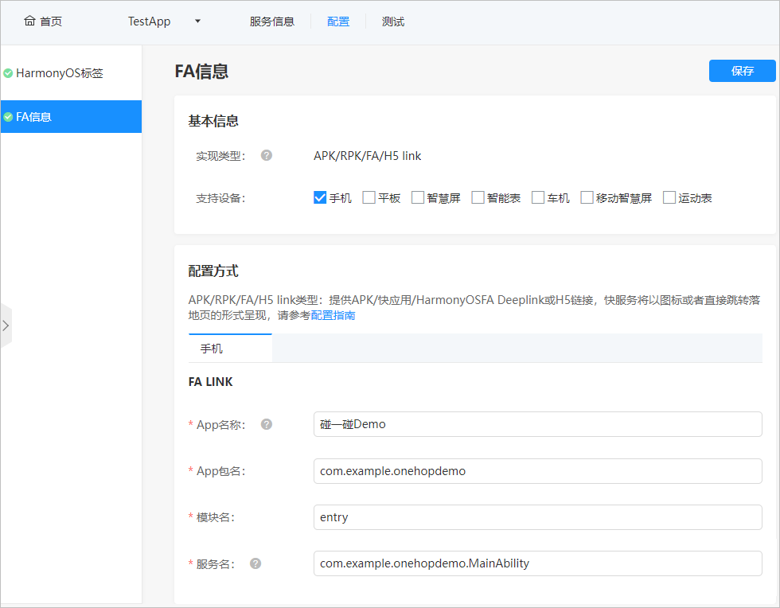
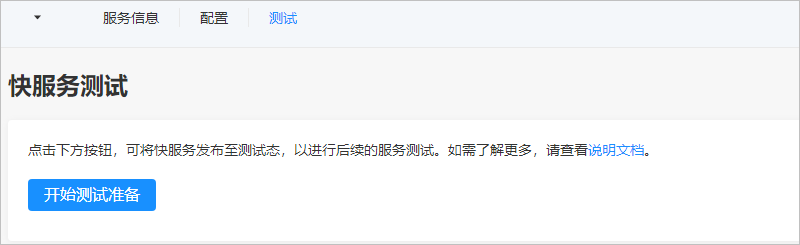
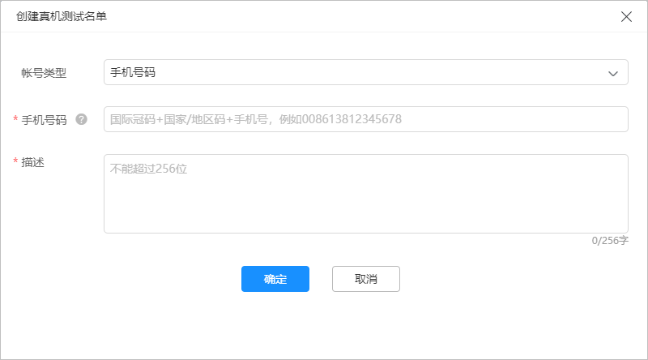

# 配置服务关联意图

通过在HAG上配置原子化服务的关联意图，在使用手机碰一碰NFC标签后，即可通过NFC标签中的Product ID信息，与HAG中配置的关联意图进行匹配，获取需要拉取的原子化服务信息，从而拉起设备配网原子化服务。

接下来为大家介绍如何在HAG中配置原子化服务的关联意图。

1.  请使用已经实名认证后的华为开发者帐号登录[华为开发者门户](https://developer.huawei.com/consumer/cn/)，登录后进入到管理中心。

    

2.  选择“生态服务 \> 智慧服务”，然后点击进入华为快服务智慧平台。首次使用，请阅读并签署《华为快服义务智慧平台合作协议》。

    

3.  点击**创建快服务**按钮，然后选择**HarmonyOS测试服务**。

    

4.  设置“服务名称”、“服务分类”和“默认语言”，然后点击**创建**。

    

5.  设置服务信息，包括“基本信息”和“服务呈现信息”。
    -   基本信息：如服务版本号、版本描述和服务分级信息，然后点击**保存**按钮。
    -   服务呈现信息：如简要描述、开发者品牌、服务图标等必选项，请注意，**服务大图标**也必须上传，然后点击**保存**。

6.  进入“配置 \> HarmonyOS标签”页面，点击**添加**按钮，添加设备标签。其中“产品型号”输入应用调测助手中申请的Product ID，“产品子型号”固定输入00，然后点击**保存**按钮。

    

7.  进入“配置 \> FA信息”页面，设置FA基本信息和配置方式，设置完成后点击**保存**按钮进行保存。

    -   基本信息：其中“实现类型”固定选择“APK/RPK/FA/H5 link”。
    -   FA Link：填写“App名称”、“App包名”、“模块名”和“服务名”，其中：
        -   “App包名”填写为config.json文件中的bundleName字段取值。
        -   “模块名”填写为入口原子化服务（即设备配网模块）config.json文件中的moduleName字段取值。
        -   “服务名”填写为入口原子化服务（即设备配网模块）config.json文件中的mainAbility字段取值。

    

8.  进入测试页签，点击**开始测试准备**按钮，启动测试。测试的有效期时间为1个月，到期后请重新点击**重新测试准备**即可。

    

    接下来在“真机测试”中，点击**创建按钮**，添加真机测试名单。此处填写的华为帐号信息需要与手机上登录的华为帐号保持一致。

    

