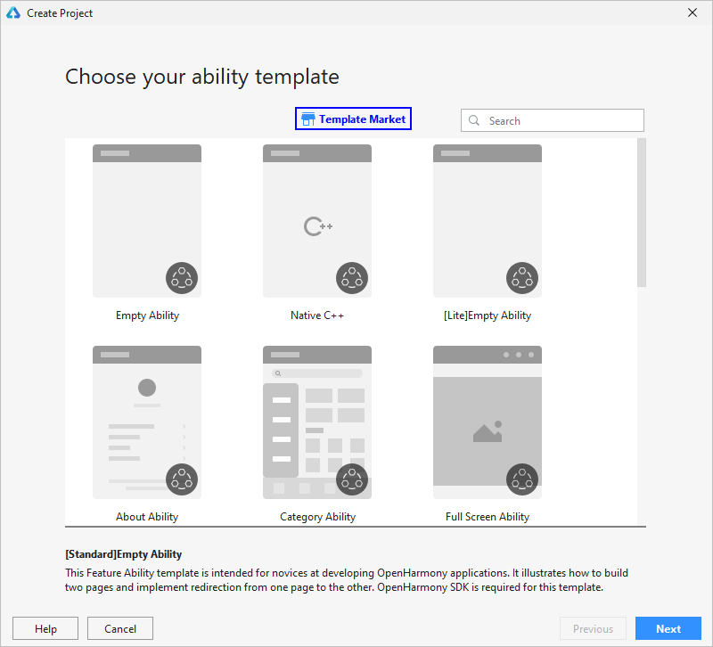

# 开发原子化服务<a name="ZH-CN_TOPIC_0000001213473151"></a>

碰一碰设备控制模板OneHop Device Ability\(JS\) 用于帮助开发者实现**“碰一碰-设备配网-设备控制”**完整流程，开发碰一碰拉起HarmonyOS原子化服务包括：开发设备控制原子化服务和设备配网原子化服务。开发设备配网/控制原子化服务使用的工具为[DevEco Studio 3.0 Beta1](https://developer.harmonyos.com/cn/develop/deveco-studio#download_beta)及以上版本，关于工具配置请查看[DevEco Studio环境搭建](https://developer.harmonyos.com/cn/docs/documentation/doc-guides/installation_process-0000001071425528)。

1.  通过如下两种方式，打开工程创建向导界面。
    -   如果当前未打开任何工程，可以在DevEco Studio的欢迎页，选择**Create Project**开始创建一个新工程。
    -   如果已经打开了工程，可以在菜单栏选择**File \> New \> New Project**来创建一个新工程。

2.  在工程向导中，点击**Template Market**按钮，从Marketplace中找到并下载OneHop Device Ability\(JS\) 模板。

    

3.  回到创建工程页面，下载的工程模板出现在模板列表中，然后选择OneHop Device Ability模板，并点击**Next**设置工程配置信息。
4.  在工程配置中，**Project Type**请选择“Service”，并勾选上“Show in Service Center”，点击**Finish**等待工程同步完成。

    > **说明：** 
    >设备控制/配网原子化服务一般为通过碰一碰拉起，在调测阶段，为方便开发者在手机桌面应用图标启动设备控制/配网原子化服务，可以在工程创建完成后，将config.json中的“installationFree”字段改为false，待调试完成后，再将该字段取值改回true。

    

5.  在工程的**entry\\src\\main\\js\\default\\pages\\netconfig\\netconfig.js**的goToControl方法中添加deviceType：1，以便从本地设备中拉起原子化服务。

    ```
    goToControl() {
    	let target = {
                    bundleName: 'com.example.middleplatform.deviceoperate',
                    abilityName: 'com.example.middleplatform.ControlMainAbility',
                    deviceType: 1,
                    data: {
                            session_id: getApp(this).ConfigParams.deviceInfo.sessionId,
                            product_id: getApp(this).Product.productId,
                            product_name: getApp(this).Product.productName
                    }
            }
            FeatureAbility.startAbility(target);
            app.terminate();
    }
    ```

    > **说明：** 
    >OneHop Device Ability\(JS\) 模板已预置智能风扇的设备配网和设备控制原子化服务，如果您想修改设备配网和设备控制原子化服务的UI界面和功能，可参考如下内容进行修改。
    >-   开发设备配网原子化服务：请参考[设备配网原子化服务开发指导书](guide-atomic-service-netconfig-overview.md)。
    >-   开发设备控制原子化服务：请参考[设备控制原子化服务开发指导书](guide-atomic-service-device-ctrl-overview.md)。

6.  设备配网和设备控制原子化服务开发完成后，在华为手机上运行，需要对原子化服务进行签名，签名指导请参考[通过DevEco Studio自动化签名方式对应用签名](https://developer.harmonyos.com/cn/docs/documentation/doc-guides/ide_debug_device-0000001053822404#section837891802519)。
7.  打开DevEco Studio菜单栏**Run \> Edit Configurations**， 勾选entry模块下的“Deploy Multi Hap Packages”选项，表示在运行entry模块（设备配网原子化服务）时，同时会在手机中安装control模块（设备控制原子化服务）。

    

8.  在工具栏中选择entry模块，然后点击**Run**按钮，同时在设备上安装设备控制和设备配网原子化服务。

    entry\\src\\main\\resources\\base\\element\\string.json中的“entry\_MainAbility”代表设备配网原子化服务的名称，您可以修改为其它名称。

    control\\src\\main\\resources\\base\\element\\string.json中的“control\_ControlMainAbility”代表设备控制原子化服务的名称，您可以修改为其它名称。

    

9.  在手机桌面，点击设备配网图标，确认是否启动设备配网原子化服务界面，如下图所示。

    


