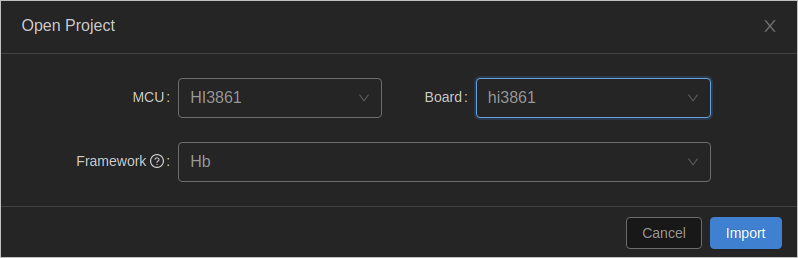
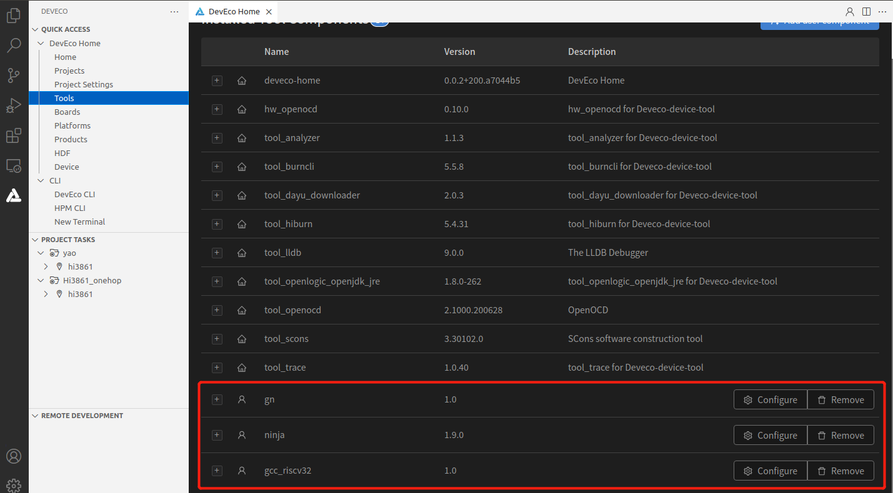
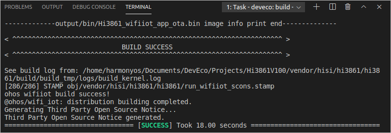

# 开发Hi3861设备侧功能<a name="ZH-CN_TOPIC_0000001167754794"></a>

-   [源码开发](#section103951747175415)
-   [源码编译](#section188441785558)
-   [源码烧录](#section91141823135914)

使用DevEco Device Tool工具进行Hi3861源码的开发、编译和烧录。开发编译环境必须使用Ubuntu系统，关于DevEco Device Tool的环境搭建请参考[Ubuntu开发环境准备](https://device.harmonyos.com/cn/docs/ide/user-guides/install_ubuntu-0000001072959308)。

## 源码开发<a name="section103951747175415"></a>

1.  解压Hi3861源码，并在DevEco Device Tool工具中点击**Import Project**打开源码文件。

    

2.  选择源码导入时，提示该工程不是DevEco Device Tool工程，点击**Import**。

    

3.  MCU选择Hi3861，Board选择Hi3861，Framework选择Hb，然后点击**Import**完成导入。

    

4.  将Hi3861开发板Demo代码中的**“hals”和“winder”**目录拷贝至源码工程中的**applications/sample/wifi-iot/app**/目录下。

    

5.  修改**device/hisilicon/hispark\_pegasus/hi3861\_adapter/hals/communication/wifi\_lite/wifiservice/source/wifi\_device.c**文件，将如下两处代码进行注释。

    ```
     if (LockWifiEventLock() != WIFI_SUCCESS) {
         return;
     }
    
     if (UnlockWifiEventLock() != WIFI_SUCCESS) {
         return;
     }
    ```

6.  打开**device/hisilicon/hispark\_pegasus/sdk\_liteos/build/config/usr\_config.mk**文件，找到**CONFIG\_I2C\_SUPPORT is not set**，取消注释，并将其修改为**CONFIG\_I2C\_SUPPORT=y**。

    

7.  修改**applications/sample/wifi-iot/app/BUILD.gn**文件，将features字段中的startup修改为winder，并添加winder模块的索引deps，配置示例如下所示。

    ```
     import("//build/lite/config/component/lite_component.gni")
        
       lite_component("app") {
       features = [
           "winder",
       ]
       deps = [ "//applications/sample/wifi-iot/app/hals:hi3861_hals" ]
     }
    ```


## 源码编译<a name="section188441785558"></a>

使用DevEco Device Tool对源码进行编译。

1.  下载并解压如下工具，包括：

    <a name="table197391139175613"></a>
    <table><thead align="left"><tr id="zh-cn_topic_0000001192526021_row6207164803718"><th class="cellrowborder" valign="top" width="19.121912191219124%" id="mcps1.1.4.1.1"><p id="zh-cn_topic_0000001192526021_p1220714482376"><a name="zh-cn_topic_0000001192526021_p1220714482376"></a><a name="zh-cn_topic_0000001192526021_p1220714482376"></a>工具包名称</p>
    </th>
    <th class="cellrowborder" valign="top" width="55.055505550555054%" id="mcps1.1.4.1.2"><p id="zh-cn_topic_0000001192526021_p4207184820378"><a name="zh-cn_topic_0000001192526021_p4207184820378"></a><a name="zh-cn_topic_0000001192526021_p4207184820378"></a>获取地址</p>
    </th>
    <th class="cellrowborder" valign="top" width="25.82258225822582%" id="mcps1.1.4.1.3"><p id="zh-cn_topic_0000001192526021_p420724863714"><a name="zh-cn_topic_0000001192526021_p420724863714"></a><a name="zh-cn_topic_0000001192526021_p420724863714"></a>在Tools中设置的路径</p>
    </th>
    </tr>
    </thead>
    <tbody><tr id="zh-cn_topic_0000001192526021_row46755108331"><td class="cellrowborder" valign="top" width="19.121912191219124%" headers="mcps1.1.4.1.1 "><p id="zh-cn_topic_0000001192526021_p19675161073317"><a name="zh-cn_topic_0000001192526021_p19675161073317"></a><a name="zh-cn_topic_0000001192526021_p19675161073317"></a>gn</p>
    </td>
    <td class="cellrowborder" valign="top" width="55.055505550555054%" headers="mcps1.1.4.1.2 "><p id="zh-cn_topic_0000001192526021_p1857514815456"><a name="zh-cn_topic_0000001192526021_p1857514815456"></a><a name="zh-cn_topic_0000001192526021_p1857514815456"></a><a href="https://repo.huaweicloud.com/harmonyos/compiler/gn/1717/linux/gn-linux-x86-1717.tar.gz" target="_blank" rel="noopener noreferrer">https://repo.huaweicloud.com/harmonyos/compiler/gn/1717/linux/gn-linux-x86-1717.tar.gz</a></p>
    </td>
    <td class="cellrowborder" valign="top" width="25.82258225822582%" headers="mcps1.1.4.1.3 "><p id="zh-cn_topic_0000001192526021_p16261055122016"><a name="zh-cn_topic_0000001192526021_p16261055122016"></a><a name="zh-cn_topic_0000001192526021_p16261055122016"></a>gn执行文件所在文件夹</p>
    </td>
    </tr>
    <tr id="zh-cn_topic_0000001192526021_row429115712472"><td class="cellrowborder" valign="top" width="19.121912191219124%" headers="mcps1.1.4.1.1 "><p id="zh-cn_topic_0000001192526021_p1558143018453"><a name="zh-cn_topic_0000001192526021_p1558143018453"></a><a name="zh-cn_topic_0000001192526021_p1558143018453"></a>ninja</p>
    </td>
    <td class="cellrowborder" valign="top" width="55.055505550555054%" headers="mcps1.1.4.1.2 "><p id="zh-cn_topic_0000001192526021_p117021959204517"><a name="zh-cn_topic_0000001192526021_p117021959204517"></a><a name="zh-cn_topic_0000001192526021_p117021959204517"></a><a href="https://repo.huaweicloud.com/harmonyos/compiler/ninja/1.9.0/linux/ninja.1.9.0.tar" target="_blank" rel="noopener noreferrer">https://repo.huaweicloud.com/harmonyos/compiler/ninja/1.9.0/linux/ninja.1.9.0.tar</a></p>
    </td>
    <td class="cellrowborder" valign="top" width="25.82258225822582%" headers="mcps1.1.4.1.3 "><p id="zh-cn_topic_0000001192526021_p126125572018"><a name="zh-cn_topic_0000001192526021_p126125572018"></a><a name="zh-cn_topic_0000001192526021_p126125572018"></a>ninja执行文件所在文件夹</p>
    </td>
    </tr>
    <tr id="zh-cn_topic_0000001192526021_row72912072477"><td class="cellrowborder" valign="top" width="19.121912191219124%" headers="mcps1.1.4.1.1 "><p id="zh-cn_topic_0000001192526021_p12396121984619"><a name="zh-cn_topic_0000001192526021_p12396121984619"></a><a name="zh-cn_topic_0000001192526021_p12396121984619"></a>gcc_riscv32</p>
    </td>
    <td class="cellrowborder" valign="top" width="55.055505550555054%" headers="mcps1.1.4.1.2 "><p id="zh-cn_topic_0000001192526021_p42070254469"><a name="zh-cn_topic_0000001192526021_p42070254469"></a><a name="zh-cn_topic_0000001192526021_p42070254469"></a><a href="https://repo.huaweicloud.com/harmonyos/compiler/gcc_riscv32/7.3.0/linux/gcc_riscv32-linux-7.3.0.tar.gz" target="_blank" rel="noopener noreferrer">https://repo.huaweicloud.com/harmonyos/compiler/gcc_riscv32/7.3.0/linux/gcc_riscv32-linux-7.3.0.tar.gz</a></p>
    </td>
    <td class="cellrowborder" valign="top" width="25.82258225822582%" headers="mcps1.1.4.1.3 "><p id="zh-cn_topic_0000001192526021_p5261855182018"><a name="zh-cn_topic_0000001192526021_p5261855182018"></a><a name="zh-cn_topic_0000001192526021_p5261855182018"></a>gcc_riscv32文件夹</p>
    </td>
    </tr>
    </tbody>
    </table>

2.  在DevEco Device Tool的**Tools**中，点击**Add user component**，添加gn、ninja和gcc\_riscv32工具。请注意，添加时，工具名称不能修改为其它名称。

    

3.  点击图标，打开DevEco Device Tool界面，在“PROJECT TASKS”中，点击对应开发板下的**Build**按钮，执行编译。

    

4.  等待编译完成，在**TERMINAL**窗口输出“SUCCESS”，编译完成。

    


## 源码烧录<a name="section91141823135914"></a>

1.  请连接好电脑和待烧录开发板，需要连接USB口，具体可参考[Hi3861V100开发板介绍](https://device.harmonyos.com/cn/docs/start/introduce/oem_minitinier_des_3861-0000001105041324)。
2.  打开电脑的设备管理器，查看并记录对应的串口号。

    > **说明：** 
    >如果对应的串口异常，请根据[Hi3861V100开发板串口驱动安装](https://device.harmonyos.com/cn/docs/ide/user-guides/hi3861-drivers-0000001058153433)安装USB转串口的驱动程序。

    

3.  打开DevEco Device Tool，在QUICK ACCESS\>DevEco Home\>Projects中，点击**Settings**打开工程配置界面。

    

4.  在“Partition Configuration”页签，设置待烧录文件信息，默认情况下，DevEco Device Tool已针对Hi3861V100开发板进行适配，无需单独修改。

    > **说明：** 
    >如果待烧录文件是直接通过拷贝的方式获取，需要手动修改待烧录文件的路径。打开待烧录文件的页签，在Partition Settings的New Opiton的下拉列表中，选择Partition\_bin，然后在Partition Opiton的Partition\_bin设置待烧录文件的路径。

5.  在“hi3861”页签，设置烧录选项，包括upload\_port、upload\_partitions和upload\_protocol。

    -   upload\_port：选择步骤2中查询的串口号。
    -   upload\_protocol：选择烧录协议，Windows系统可以选择“burn-serial”或“hiburn-serial”，Linux系统只能选择“hiburn-serial”。
    -   upload\_partitions：选择待烧录的文件，默认选择hi3861\_app。

    

6.  所有的配置都修改完成后，在工程配置页签的顶部，点击**Save**进行保存。
7.  打开工程文件，在DevEco Device Tool界面的“PROJECT TASKS”中，点击hi3861下的**Upload**按钮，启动烧录。

    

8.  启动烧录后，显示如下提示信息时，请按开发板上的RST按钮重启开发板。

    

9.  重新上电后，界面提示如下信息时，表示烧录成功。

    


