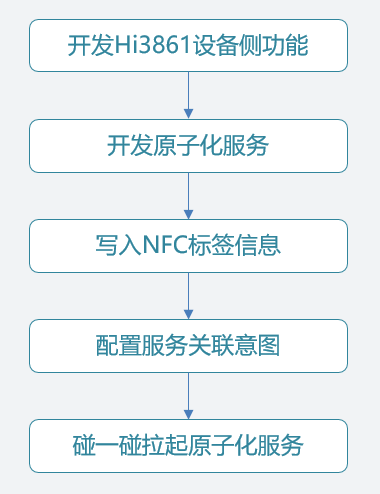

# 准备工作

开发碰一碰特性，需要涉及Hi3861开发板的开发和HarmonyOS原子化服务的开发两部分。因此，在开发前，请做好如下准备工作：

**HarmonyOS原子化服务开发准备工作：**

-   准备已经升级至HarmonyOS 2系统的华为Mate系列或P系列手机，系统版本号为2.0.0.168及以上。
-   下载[DevEco Studio 3.0 Beta1](https://developer.harmonyos.com/cn/develop/deveco-studio#download_beta)版本，并配置好[DevEco Studio开发环境](https://developer.harmonyos.com/cn/docs/documentation/doc-guides/installation_process-0000001071425528)。
-   在华为应用市场，下载并安装“应用调测助手”App，用于写NFC标签。
-   准备1个NFC标签，可以用手机触碰NFC标签，提前确保NFC功能可用。
-   打开手机**设置 \> 应用和服务 \> 应用管理**，搜索“智慧生活基础服务”，检测智慧生活基础服务的版本是否为12.0.2.306及以上。如果不是，请打开华为手机的“智慧生活”App，点击“**我的 \> 设置 \> 检查应用更新**”，更新“智慧生活基础服务”。

**Hi3861开发板开发准备工作：**

-   本指导基于Hi3861开发板为例，请准备Hi3861开发板（HiSpark Wi-Fi IoT智能家居套件）。
-   下载[HUAWEI DevEco Device Tool 3.0 Beta1](https://device.harmonyos.com/cn/ide#download_beta)  Linux版本，并搭建好[Ubuntu开发环境](https://device.harmonyos.com/cn/docs/documentation/guide/install_ubuntu-0000001072959308)。
-   获取OpenHarmony源码，版本为1.1.0 LTS全量代码，获取方式请参考[源码获取](https://gitee.com/openharmony/docs/blob/master/zh-cn/release-notes/OpenHarmony-1-1-0-LTS.md)。
-   获取[Hi3861开发板Demo代码](https://gitee.com/openharmony-sig/knowledge_demo_smart_home/tree/master/dev/team_x/demo_winder)，用于Hi3861开发板配网和接收设备控制指令。

接下来，熟悉碰一碰特性的主要开发流程，如下图所示。

