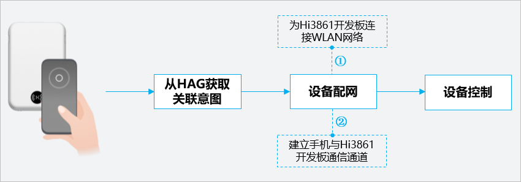
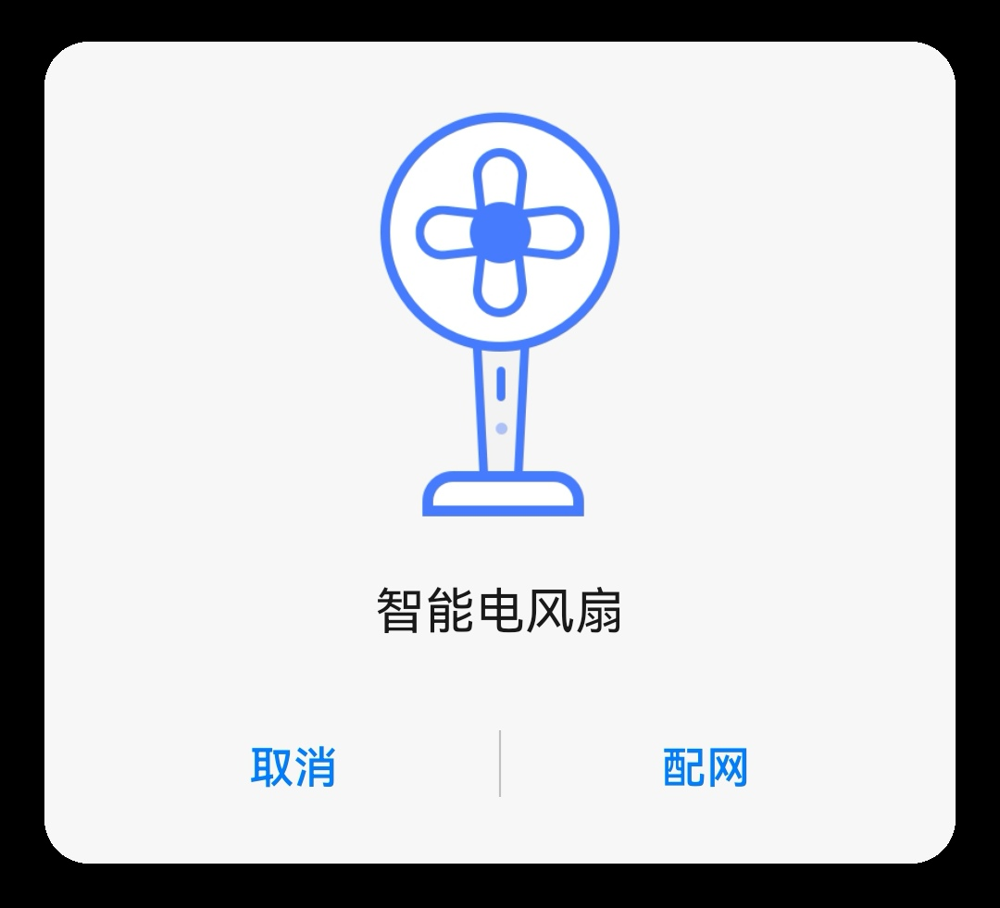
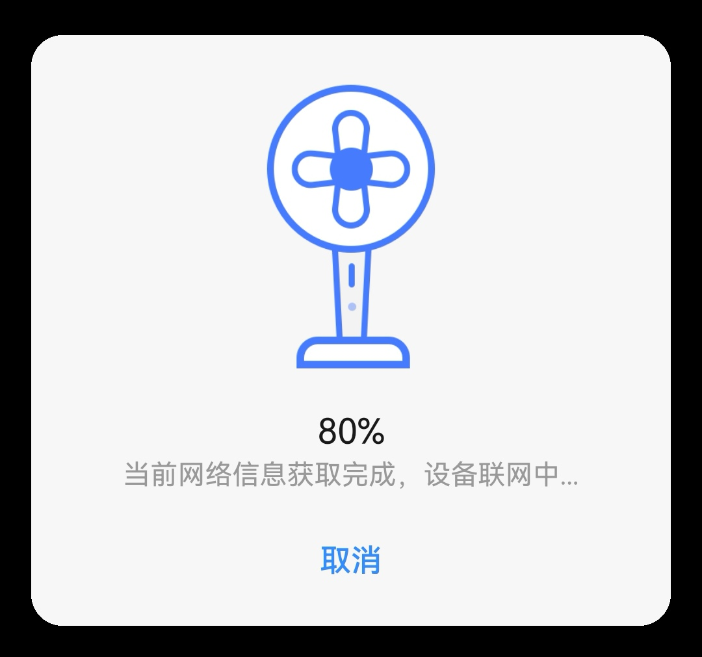
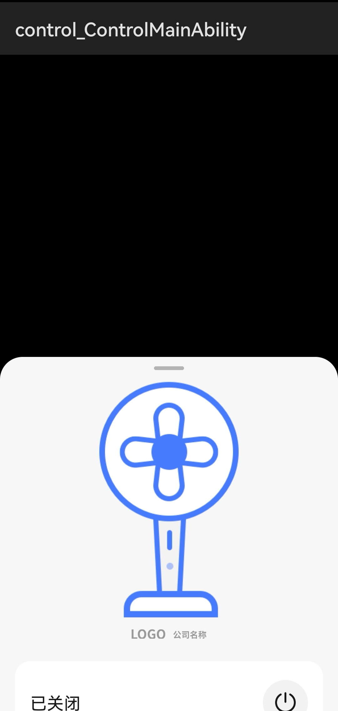
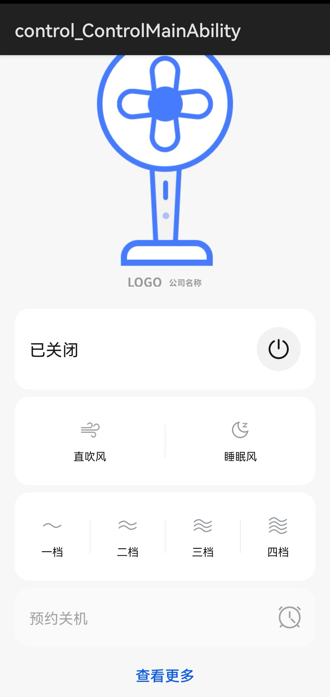

# 碰一碰拉起原子化服务

通过手机碰一碰Hi3861开发板的NFC标签，手机会自动为Hi3861开发板连接WLAN，并配置手机与Hi3861开发板之间的通信通道，从而拉起设备配网/控制原子化服务。

在碰一碰拉起原子化服务前，手机需要登录华为帐号，该帐号需要与在“应用调测助手”中申请Product ID时登录的华为帐号保持一致。

1.  打开手机NFC功能，确认手机已经接入WLAN无线网络。
2.  在每次触碰NFC标签前，请点击Hi3861开发板的**RST**复位按键，对Hi3861开发板进行复位。
3.  使用手机背部接触NFC标签，NFC标签会弹出以下页面。

    > **说明：** 
    >在触碰NFC标签时，请将手机与开发板保持在5cm以内的距离，如果未能发现设备，请重新触碰NFC标签。

    

4.  点击配网，并等待配网完成。

    > **说明：** 
    >如果出现“扫描设备失败”，可以根据如下操作进行重试。
    >1.  断开手机的WLAN连接，然后再重新连接WLAN。
    >2.  点击Hi3861开发板的**RST**复位按键，对Hi3861开发板进行复位。
    >3.  重新触碰NFC标签进行配网。

    

5.  配网完成后自动跳转到设备控制页面半屏态， 向上滑动后，点击**查看更多**跳转到全屏态。

    

6.  在设备控制页面进行操作，可以在Hi3861开发板的液晶显示屏上，查看是否能够收到相应指令。

    

至此，恭喜您已完成碰一碰特性的开发与体验。

