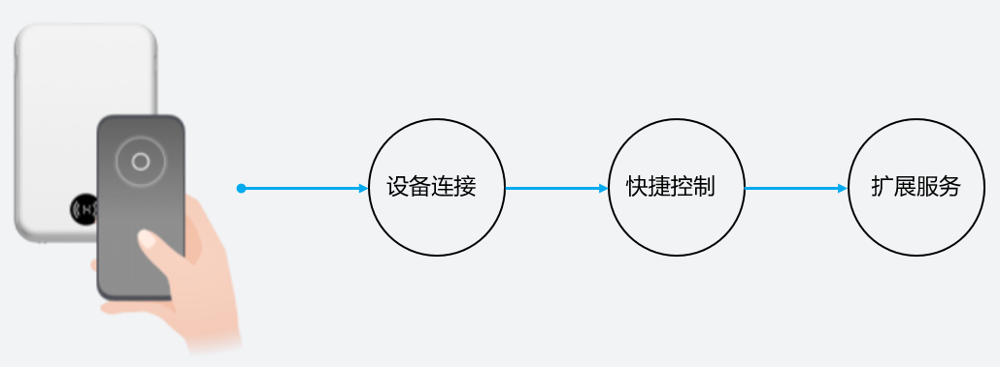

# 碰一碰概述

> **说明：** 
>本指导仅用于个人开发者体验HarmonyOS碰一碰特性，并不能作为商用方案进行碰一碰特性的开发和上架。如需开发商用版本的碰一碰特性，请参考[HarmonyOS Connect原子化服务开发](https://developer.huawei.com/consumer/cn/doc/development/SmartDevicePartner-Guides/atomic-service-overview-0000001136377936)指导。

碰一碰特性，是HarmonyOS具备的多终端业务协同技术。其依托NFC短距通信协议，通过碰一碰的交互方式，将手机和全场景设备连接起来。然后通过手机端的原子化服务能力，快速完成配网、远程控制的能力，解决了应用与设备之间接续慢、配网复杂、传输难的问题，为用户带来无缝切换的流畅体验。

华为基于HarmonyOS的碰一碰、原子化服务等能力，为开发者提供全流程的模板代码和API，包括原子化服务配网模板、控制模板等。开发者只需修改模板代码中的配置项，即可完成原子化服务的开发。然后通过碰一碰能力，免安装拉起原子化服务，快速完成设备配网，体验设备控制。碰一碰特性拥有以下体验：

-   **设备连接**

    “碰一碰”是用户连接设备控制服务的开端。手机“碰一碰”未连接的设备，在手机端拉起设备配网原子化服务，快速完成手机与设备的配网。

-   **快捷控制**

    快捷控制是日常使用的核心功能，大多数的设备控制功能可以通过原子化服务的卡片功能即可实现。

-   **扩展服务**

    当需要向用户提供更丰富的扩展服务时，可以在原子化服务中开发丰富的交互能力，并通过卡片进入到原子化服务界面，适用于更加复杂的功能使用场景。

