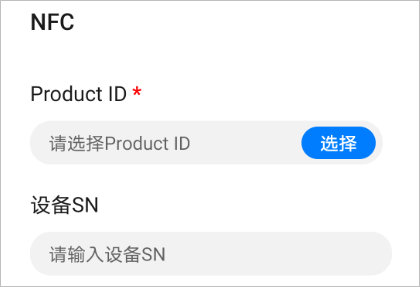
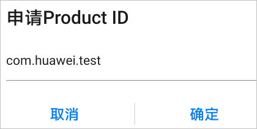
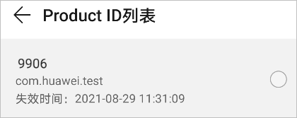
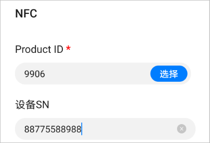
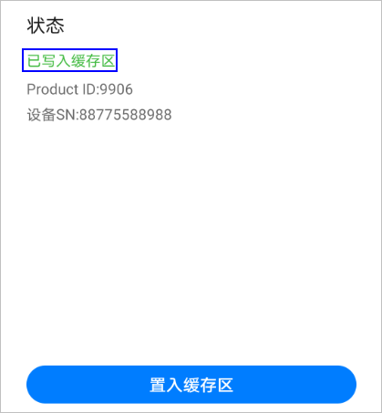
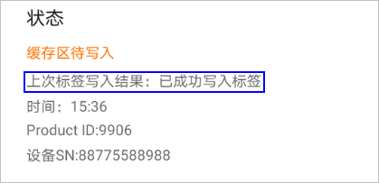

# 写入NFC标签信息

使用应用调测助手App，申请Product ID，并将Product ID写入到NFC中。

1.  打开手机的NFC功能。
2.  打开应用调测助手App，选择底部的“NFC”标签页。

    

3.  点击“选择”按钮，若华为帐号未登录，请先登录华为帐号。

    

4.  点击“申请”按钮，输入原子化服务的包名（与模块**src \> main**目录下的config.json中的“bundleName”保持一致），系统会自动分配Product ID。每个帐号最多可申请3个有效的Product ID，每个Product ID的有效期为1个月。Product ID失效后可重新申请。

    

5.  选择已申请的Product ID。

    

6.  输入Hi3861开发板的SN号码。SN号为可选填写，如果开发者需要通过NFC标签获取相关设备信息，可以在这里填写SN号。

    

7.  点击“置入缓存区”按钮，此时数据处于待写入状态。

    

8.  将手机靠近NFC标签，此时开始将缓存区的数据写入到NFC标签中，写入完成后，状态会变为“已成功写入标签”。

    

