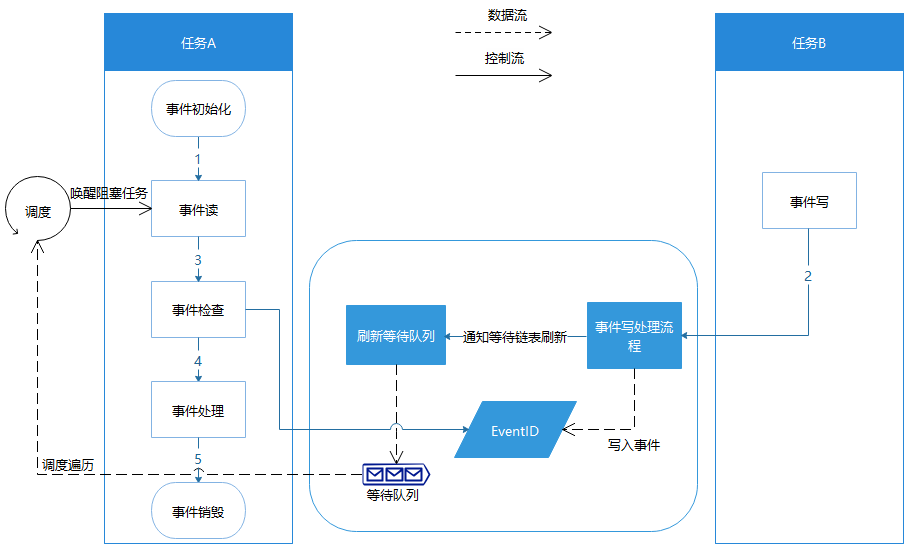

# 基本概念<a name="ZH-CN_TOPIC_0000001123763599"></a>

-   [运行机制](#section1735611583011)
    -   [事件控制块](#section1161415384467)
    -   [事件运作原理](#section187761153144617)


事件（Event）是一种任务间的通信机制，可用于任务间的同步操作。事件的特点是：

-   任务间的事件同步，可以一对多，也可以多对多。一对多表示一个任务可以等待多个事件，多对多表示多个任务可以等待多个事件。但是一次写事件最多触发一个任务从阻塞中醒来。
-   事件读超时机制。
-   只做任务间同步，不传输具体数据。

提供了事件初始化、事件读写、事件清零、事件销毁等接口。

## 运行机制<a name="section1735611583011"></a>

### 事件控制块<a name="section1161415384467"></a>

```
/**
  * 事件控制块数据结构
  */
typedef struct tagEvent {
    UINT32 uwEventID;        /* 事件集合，表示已经处理（写入和清零）的事件集合 */
    LOS_DL_LIST stEventList; /* 等待特定事件的任务链表 */
} EVENT_CB_S, *PEVENT_CB_S;
```

### 事件运作原理<a name="section187761153144617"></a>

**事件初始化：**会创建一个事件控制块，该控制块维护一个已处理的事件集合，以及等待特定事件的任务链表。

**写事件：**会向事件控制块写入指定的事件，事件控制块更新事件集合，并遍历任务链表，根据任务等待具体条件满足情况决定是否唤醒相关任务。

**读事件：**如果读取的事件已存在时，会直接同步返回。其他情况会根据超时时间以及事件触发情况，来决定返回时机：等待的事件条件在超时时间耗尽之前到达，阻塞任务会被直接唤醒，否则超时时间耗尽该任务才会被唤醒。

读事件条件满足与否取决于入参eventMask和mode，eventMask即需要关注的事件。mode是具体处理方式，分以下三种情况：

LOS\_WAITMODE\_AND：表示eventMask中所有事件都发生时，才返回。

LOS\_WAITMODE\_OR：表示eventMask中任何事件发生时，就返回。

LOS\_WAITMODE\_CLR：事件读取成功后，对应读取到的事件会被清零。需要配合LOS\_WAITMODE\_AND或者LOS\_WAITMODE\_OR来使用。

**事件清零：**根据指定掩码，去对事件控制块的事件集合进行清零操作。当掩码为0时，表示将事件集合全部清零。当掩码为0xffff时，表示不清除任何事件，保持事件集合原状。

**事件销毁：**销毁指定的事件控制块。

**图 1**  事件运作原理图<a name="fig17799175324612"></a>  


