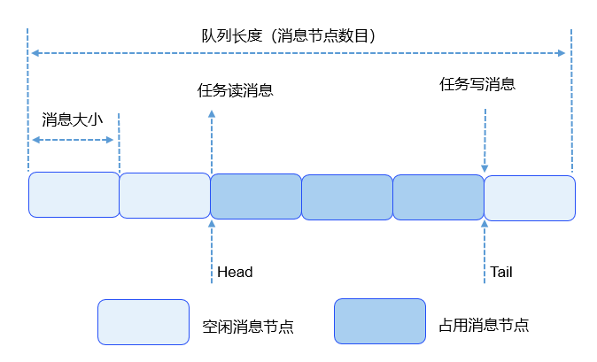

# 基本概念<a name="ZH-CN_TOPIC_0000001078876506"></a>

-   [运行机制](#section1582619446311)
    -   [队列控制块](#section1648304614720)
    -   [队列运作原理](#section15384012164811)


队列又称消息队列，是一种常用于任务间通信的数据结构。队列接收来自任务或中断的不固定长度消息，并根据不同的接口确定传递的消息是否存放在队列空间中。

任务能够从队列里面读取消息，当队列中的消息为空时，挂起读取任务；当队列中有新消息时，挂起的读取任务被唤醒并处理新消息。任务也能够往队列里写入消息，当队列已经写满消息时，挂起写入任务；当队列中有空闲消息节点时，挂起的写入任务被唤醒并写入消息。

可以通过调整读队列和写队列的超时时间来调整读写接口的阻塞模式，如果将读队列和写队列的超时时间设置为0，就不会挂起任务，接口会直接返回，这就是非阻塞模式。反之，如果将都队列和写队列的超时时间设置为大于0的时间，就会以阻塞模式运行。

消息队列提供了异步处理机制，允许将一个消息放入队列，但不立即处理。同时队列还有缓冲消息的作用，可以使用队列实现任务异步通信，队列具有如下特性：

-   消息以先进先出的方式排队，支持异步读写。
-   读队列和写队列都支持超时机制。
-   每读取一条消息，就会将该消息节点设置为空闲。
-   发送消息类型由通信双方约定，可以允许不同长度（不超过队列的消息节点大小）的消息。
-   一个任务能够从任意一个消息队列接收和发送消息。
-   多个任务能够从同一个消息队列接收和发送消息。
-   创建队列时所需的队列空间，接口内系统自行动态申请内存。

## 运行机制<a name="section1582619446311"></a>

### 队列控制块<a name="section1648304614720"></a>

```
/**
  * 队列控制块数据结构
  */
typedef struct 
{
    UINT8       *queue;                          /* 队列消息内存空间的指针 */
    UINT16      queueState;                      /* 队列状态 */
    UINT16      queueLen;                        /* 队列中消息节点个数，即队列长度 */
    UINT16      queueSize;                       /* 消息节点大小 */
    UINT16      queueID;                         /* 队列ID */
    UINT16      queueHead;                       /* 消息头节点位置（数组下标）*/
    UINT16      queueTail;                       /* 消息尾节点位置（数组下标）*/
    UINT16      readWriteableCnt[OS_READWRITE_LEN]; /* 数组下标0的元素表示队列中可读消息数，                              
                                                    数组下标1的元素表示队列中可写消息数 */
    LOS_DL_LIST readWriteList[OS_READWRITE_LEN];    /* 读取或写入消息的任务等待链表， 
                                                    下标0：读取链表，下标1：写入链表 */
    LOS_DL_LIST memList;                         /* 内存块链表 */
} LosQueueCB;
```

每个队列控制块中都含有队列状态，表示该队列的使用情况：

-   OS\_QUEUE\_UNUSED：队列未被使用。
-   OS\_QUEUE\_INUSED：队列被使用中。

### 队列运作原理<a name="section15384012164811"></a>

-   创建队列时，创建队列成功会返回队列ID。
-   在队列控制块中维护着一个消息头节点位置Head和一个消息尾节点位置Tail，用于表示当前队列中消息的存储情况。Head表示队列中被占用的消息节点的起始位置。Tail表示被占用的消息节点的结束位置，也是空闲消息节点的起始位置。队列刚创建时，Head和Tail均指向队列起始位置。
-   写队列时，根据readWriteableCnt\[1\]判断队列是否可以写入，不能对已满（readWriteableCnt\[1\]为0）队列进行写操作。写队列支持两种写入方式：向队列尾节点写入，也可以向队列头节点写入。尾节点写入时，根据Tail找到起始空闲消息节点作为数据写入对象，如果Tail已经指向队列尾部则采用回卷方式。头节点写入时，将Head的前一个节点作为数据写入对象，如果Head指向队列起始位置则采用回卷方式。
-   读队列时，根据readWriteableCnt\[0\]判断队列是否有消息需要读取，对全部空闲（readWriteableCnt\[0\]为0）队列进行读操作会引起任务挂起。如果队列可以读取消息，则根据Head找到最先写入队列的消息节点进行读取。如果Head已经指向队列尾部则采用回卷方式。
-   删除队列时，根据队列ID找到对应队列，把队列状态置为未使用，把队列控制块置为初始状态，并释放队列所占内存。

图 1 队列读写数据操作示意图



上图对读写队列做了示意，图中只画了尾节点写入方式，没有画头节点写入，但是两者是类似的。

