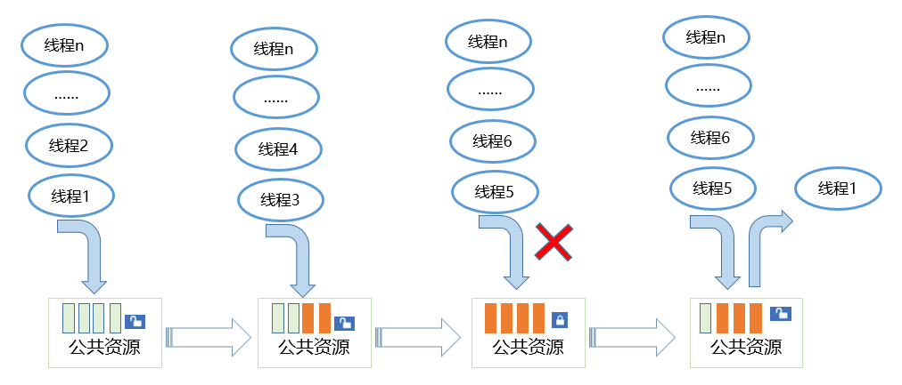

# 基本概念<a name="ZH-CN_TOPIC_0000001124066587"></a>

-   [运行机制](#section1794010261861)
    -   [信号量控制块](#section11372149164815)
    -   [信号量运作原理](#section139726510491)


信号量（Semaphore）是一种实现任务间通信的机制，可以实现任务间同步或共享资源的互斥访问。

一个信号量的数据结构中，通常有一个计数值，用于对有效资源数的计数，表示剩下的可被使用的共享资源数，其值的含义分两种情况：

-   0，表示该信号量当前不可获取，因此可能存在正在等待该信号量的任务。
-   正值，表示该信号量当前可被获取。

以同步为目的的信号量和以互斥为目的的信号量在使用上有如下不同：

-   用作互斥时，初始信号量计数值不为0，表示可用的共享资源个数。在需要使用共享资源前，先获取信号量，然后使用一个共享资源，使用完毕后释放信号量。这样在共享资源被取完，即信号量计数减至0时，其他需要获取信号量的任务将被阻塞，从而保证了共享资源的互斥访问。另外，当共享资源数为1时，建议使用二值信号量，一种类似于互斥锁的机制。
-   用作同步时，初始信号量计数值为0。任务1获取信号量而阻塞，直到任务2或者某中断释放信号量，任务1才得以进入Ready或Running态，从而达到了任务间的同步。

## 运行机制<a name="section1794010261861"></a>

### 信号量控制块<a name="section11372149164815"></a>

```
/**
 * 信号量控制块数据结构
 */
typedef struct {
    UINT16            semStat;          /* 信号量状态 */
    UINT16            semType;          /* 信号量类型 */
    UINT16            semCount;         /* 信号量计数 */
    UINT16            semId;            /* 信号量索引号 */
    LOS_DL_LIST       semList;          /* 挂接阻塞于该信号量的任务 */
} LosSemCB;
```

### 信号量运作原理<a name="section139726510491"></a>

信号量初始化，为配置的N个信号量申请内存（N值可以由用户自行配置，通过LOSCFG\_BASE\_IPC\_SEM\_LIMIT宏实现），并把所有信号量初始化成未使用，加入到未使用链表中供系统使用。

信号量创建，从未使用的信号量链表中获取一个信号量，并设定初值。

信号量申请，若其计数器值大于0，则直接减1返回成功。否则任务阻塞，等待其它任务释放该信号量，等待的超时时间可设定。当任务被一个信号量阻塞时，将该任务挂到信号量等待任务队列的队尾。

信号量释放，若没有任务等待该信号量，则直接将计数器加1返回。否则唤醒该信号量等待任务队列上的第一个任务。

信号量删除，将正在使用的信号量置为未使用信号量，并挂回到未使用链表。

信号量允许多个任务在同一时刻访问共享资源，但会限制同一时刻访问此资源的最大任务数目。当访问资源的任务数达到该资源允许的最大数量时，会阻塞其他试图获取该资源的任务，直到有任务释放该信号量。

**图 1**  信号量运作示意图<a name="fig467314634214"></a>  


