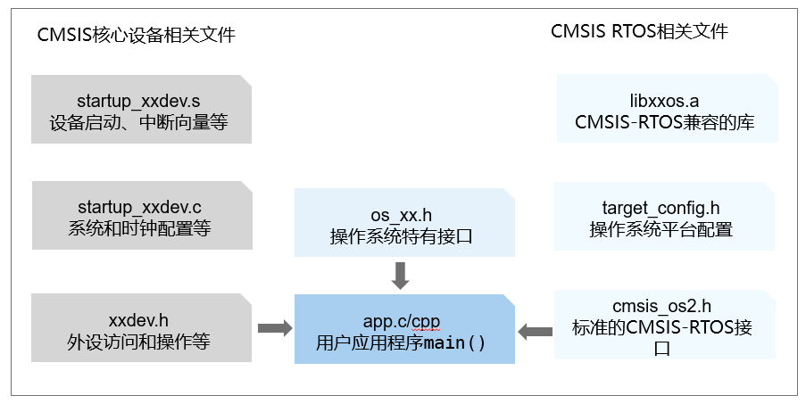

# 标准库支持


## CMSIS支持


### 基本概念

[CMSIS](https://developer.arm.com/tools-and-software/embedded/cmsis)是Cortex Microcontroller Software Interface Standard（Cortex微控制器软件接口标准）的缩写，是对于那些基于ARM Cortex处理器的微控制器独立于供应商的硬件抽象层。它包含多个组件层，其中之一是RTOS层，该层定义了一套通用及标准化的RTOS API接口，减少了应用开发者对特定RTOS的依赖，方便用户软件的移植重用。该套API有2个版本，分别为版本1（CMSIS-RTOS v1）和版本2（CMSIS-RTOS v2），OpenHarmony LiteOS-M仅提供其版本2的实现。


### 开发指导


#### 接口说明

CMSIS-RTOS v2提供下面几种功能，接口详细信息可以查看API参考。

  **表1** 内核信息与控制

| 接口名 | 接口描述 |
| -------- | -------- |
| osKernelGetInfo | 获取RTOS内核信息。 |
| osKernelGetState | 获取当前的RTOS内核状态。 |
| osKernelGetSysTimerCount | 获取RTOS内核系统计时器计数。 |
| osKernelGetSysTimerFreq | 获取RTOS内核系统计时器频率。 |
| osKernelInitialize | 初始化RTOS内核。 |
| osKernelLock | 锁定RTOS内核调度程序。 |
| osKernelUnlock | 解锁RTOS内核调度程序。 |
| osKernelRestoreLock | 恢复RTOS内核调度程序锁定状态。 |
| osKernelResume | 恢复RTOS内核调度程序。（暂未实现） |
| osKernelStart | 启动RTOS内核调度程序。 |
| osKernelSuspend | 挂起RTOS内核调度程序。（暂未实现） |
| osKernelGetTickCount | 获取RTOS内核滴答计数。 |
| osKernelGetTickFreq | 获取RTOS内核滴答频率。 |

  **表2** 线程管理

| 接口名 | 接口描述 |
| -------- | -------- |
| osThreadDetach | 分离线程（线程终止时可以回收线程存储）。（暂未实现） |
| osThreadEnumerate | 枚举活动线程。（暂未实现） |
| osThreadExit | 终止当前正在运行的线程的执行。 |
| osThreadGetCount | 获取活动线程的数量。 |
| osThreadGetId | 返回当前正在运行的线程的线程ID。 |
| osThreadGetName | 获取线程的名称。 |
| osThreadGetPriority | 获取线程的当前优先级。 |
| osThreadGetStackSize | 获取线程的堆栈大小。 |
| osThreadGetStackSpace | 根据执行期间的堆栈水印记录获取线程的可用堆栈空间。 |
| osThreadGetState | 获取线程的当前线程状态。 |
| osThreadJoin | 等待指定线程终止。（暂未实现） |
| osThreadNew | 创建一个线程并将其添加到活动线程中。 |
| osThreadResume | 恢复线程的执行。 |
| osThreadSetPriority | 更改线程的优先级。 |
| osThreadSuspend | 暂停执行线程。 |
| osThreadTerminate | 终止线程的执行。 |
| osThreadYield | 将控制权传递给处于就绪状态的下一个线程。 |

  **表3** 线程标志

| 接口名 | 接口描述 |
| -------- | -------- |
| osThreadFlagsSet | 设置线程的指定线程标志。（暂未实现） |
| osThreadFlagsClear | 清除当前正在运行的线程的指定线程标志。（暂未实现） |
| osThreadFlagsGet | 获取当前正在运行的线程的当前线程标志。（暂未实现） |
| osThreadFlagsWait | 等待当前正在运行的线程的一个或多个线程标志发出信号。（暂未实现） |

  **表4** 事件标志

| 接口名 | 接口描述 |
| -------- | -------- |
| osEventFlagsGetName | 获取事件标志对象的名称。（暂未实现） |
| osEventFlagsNew | 创建并初始化事件标志对象。 |
| osEventFlagsDelete | 删除事件标志对象。 |
| osEventFlagsSet | 设置指定的事件标志。 |
| osEventFlagsClear | 清除指定的事件标志。 |
| osEventFlagsGet | 获取当前事件标志。 |
| osEventFlagsWait | 等待一个或多个事件标志被发出信号。 |

  **表5** 通用等待函数

| 接口名 | 接口描述 |
| -------- | -------- |
| osDelay | 等待超时（时间延迟）。 |
| osDelayUntil | 等到指定时间。 |

  **表6** 计时器管理

| 接口名 | 接口描述 |
| -------- | -------- |
| osTimerDelete | 删除计时器。 |
| osTimerGetName | 获取计时器的名称。（暂未实现） |
| osTimerIsRunning | 检查计时器是否正在运行。 |
| osTimerNew | 创建和初始化计时器。 |
| osTimerStart | 启动或重新启动计时器。 |
| osTimerStop | 停止计时器。 |

  **表7** 互斥管理

| 接口名 | 接口描述 |
| -------- | -------- |
| osMutexAcquire | 获取互斥或超时（如果已锁定）。 |
| osMutexDelete | 删除互斥对象。 |
| osMutexGetName | 获取互斥对象的名称。（暂未实现） |
| osMutexGetOwner | 获取拥有互斥对象的线程。 |
| osMutexNew | 创建并初始化Mutex对象。 |
| osMutexRelease | 释放由osMutexAcquire获取的Mutex。 |

  **表8** 信号量

| 接口名 | 接口描述 |
| -------- | -------- |
| osSemaphoreAcquire | 获取信号量令牌或超时（如果没有可用的令牌）。 |
| osSemaphoreDelete | 删除一个信号量对象。 |
| osSemaphoreGetCount | 获取当前信号量令牌计数。 |
| osSemaphoreGetName | 获取信号量对象的名称。（暂未实现） |
| osSemaphoreNew | 创建并初始化一个信号量对象。 |
| osSemaphoreRelease | 释放信号量令牌，直到初始最大计数。 |

  **表9** 内存池

| 接口名 | 接口描述 |
| -------- | -------- |
| osMemoryPoolAlloc | 从内存池分配一个内存块。 |
| osMemoryPoolDelete | 删除内存池对象。 |
| osMemoryPoolFree | 将分配的内存块返回到内存池。 |
| osMemoryPoolGetBlockSize | 获取内存池中的内存块大小。 |
| osMemoryPoolGetCapacity | 获取内存池中最大的内存块数。 |
| osMemoryPoolGetCount | 获取内存池中使用的内存块数。 |
| osMemoryPoolGetName | 获取内存池对象的名称。 |
| osMemoryPoolGetSpace | 获取内存池中可用的内存块数。 |
| osMemoryPoolNew | 创建并初始化一个内存池对象。 |

  **表10** 消息队列

| 接口名 | 接口描述 |
| -------- | -------- |
| osMessageQueueDelete | 删除消息队列对象。 |
| osMessageQueueGet | 从队列获取消息，或者如果队列为空，则从超时获取消息。 |
| osMessageQueueGetCapacity | 获取消息队列中的最大消息数。 |
| osMessageQueueGetCount | 获取消息队列中排队的消息数。 |
| osMessageQueueGetMsgSize | 获取内存池中的最大消息大小。 |
| osMessageQueueGetName | 获取消息队列对象的名称。（暂未实现） |
| osMessageQueueGetSpace | 获取消息队列中消息的可用插槽数。 |
| osMessageQueueNew | 创建和初始化消息队列对象。 |
| osMessageQueuePut | 如果队列已满，则将消息放入队列或超时。 |
| osMessageQueueReset | 将消息队列重置为初始空状态。（暂未实现） |


#### 开发流程

CMSIS-RTOS2组件可以作为库或源代码提供（下图显示了库）。通过添加CMSIS-RTOS2组件（通常是一些配置文件），可以将基于CMSIS的应用程序扩展为具有RTOS功能。只需包含cmsis_os2.h头文件就可以访问RTOS API函数，这使用户应用程序能够处理RTOS内核相关事件，而在更换内核时无需重新编译源代码。

静态对象分配需要访问RTOS对象控制块定义。特定于实现的头文件（下图中的os_xx .h）提供对此类控制块定义的访问。对于OpenHarmony LiteOS-M内核，由文件名以los_开头的头文件提供，这些文件包含OpenHarmony LiteOS-M内核的这些定义。




#### 编程实例


```
#include ...
#include "cmsis_os2.h"

/*----------------------------------------------------------------------------
 * 应用程序主线程
 *---------------------------------------------------------------------------*/
void app_main (void *argument) {
  // ...
  for (;;) {}
}

int main (void) {
  // 系统初始化
  MySystemInit();
  // ...

  osKernelInitialize();                 // 初始化CMSIS-RTOS
  osThreadNew(app_main, NULL, NULL);    // 创建应用程序主线程
  osKernelStart();                      // 开始执行线程
  for (;;) {}
}
```

## POSIX支持


### 基本概念

OpenHarmony内核使用**musl libc**库以及自研接口，支持部分标准POSIX接口，开发者可基于POSIX标准接口开发内核之上的组件及应用。


### 开发指导


#### 接口说明

  **表1** process

| 需要包含的头文件 | 接口名 | 描述 |
| -------- | -------- | -------- |
| \#include&nbsp;&lt;stdlib.h&gt; | void&nbsp;abort(void); | 中止线程执行 |
| \#include&nbsp;&lt;assert.h&gt; | void&nbsp;assert(scalar&nbsp;expression); | 断言为假终止线程 |
| \#include&nbsp;&lt;pthread.h&gt; | int&nbsp;pthread_cond_destroy(pthread_cond_t&nbsp;\*cond); | 销毁条件变量 |
| \#include&nbsp;&lt;pthread.h&gt; | int&nbsp;pthread_cond_init(pthread_cond_t&nbsp;\*restrict&nbsp;co<br/>nd,&nbsp;const&nbsp;pthread_condattr_t&nbsp;\*restrict&nbsp;attr); | 初始化条件变量 |
| \#include&nbsp;&lt;pthread.h&gt; | int&nbsp;pthread_cond_timedwait(pthread_cond_t&nbsp;\*restr<br/>ict&nbsp;cond,&nbsp;pthread_mutex_t&nbsp;\*restrict&nbsp;mutex,&nbsp;const&nbsp;struct&nbsp;timespec&nbsp;\*restrict&nbsp;abstime); | 等待条件 |
| \#include&nbsp;&lt;pthread.h&gt; | int&nbsp;pthread_condattr_init(pthread_condattr_t&nbsp;\*attr); | 初始化条件变量属性对象 |
| \#include&nbsp;&lt;pthread.h&gt; | int&nbsp;pthread_mutex_unlock(pthread_mutex_t&nbsp;\*mutex); | 解锁互斥锁 |
| \#include&nbsp;&lt;pthread.h&gt; | int&nbsp;pthread_create(pthread_t&nbsp;\*thread,&nbsp;const&nbsp;pthread_<br/>attr_t&nbsp;\*attr,&nbsp;void&nbsp;\*(\*start_routine)(void&nbsp;\*),&nbsp;void&nbsp;\*arg); | 创建一个新的线程 |
| \#include&nbsp;&lt;pthread.h&gt; | int&nbsp;pthread_join(pthread_t&nbsp;thread,&nbsp;void&nbsp;\*\*retval); | 等待指定的线程结束 |
| \#include&nbsp;&lt;pthread.h&gt; | pthread_t&nbsp;pthread_self(void); | 获取当前线程的ID |
| \#include&nbsp;&lt;pthread.h&gt; | int&nbsp;pthread_getschedparam(pthread_t&nbsp;thread,&nbsp;int&nbsp;\*<br/>policy,&nbsp;struct&nbsp;sched_param&nbsp;\*param); | 获取线程的调度策略和参数 |
| \#include&nbsp;&lt;pthread.h&gt; | int&nbsp;pthread_setschedparam(pthread_t&nbsp;thread,&nbsp;int<br/>policy,&nbsp;const&nbsp;struct&nbsp;sched_param&nbsp;\*param); | 设置线程的调度策略和参数 |
| \#include&nbsp;&lt;pthread.h&gt; | int&nbsp;pthread_mutex_init(pthread_mutex_t&nbsp;\*__restrict&nbsp;m<br/>,&nbsp;const&nbsp;pthread_mutexattr_t&nbsp;\*__restrict&nbsp;a); | 初始化互斥锁 |
| \#include&nbsp;&lt;pthread.h&gt; | int&nbsp;pthread_mutex_lock(pthread_mutex_t&nbsp;\*m); | 互斥锁加锁操作 |
| \#include&nbsp;&lt;pthread.h&gt; | int&nbsp;pthread_mutex_trylock(pthread_mutex_t&nbsp;\*m); | 互斥锁尝试加锁操作 |
| \#include&nbsp;&lt;pthread.h&gt; | int&nbsp;pthread_mutex_destroy(pthread_mutex_t&nbsp;\*m); | 销毁互斥锁 |
| \#include&nbsp;&lt;pthread.h&gt; | int&nbsp;pthread_attr_init(pthread_attr_t&nbsp;\*attr); | 初始化线程属性对象 |
| \#include&nbsp;&lt;pthread.h&gt; | int&nbsp;pthread_attr_destroy(pthread_attr_t&nbsp;\*attr); | 销毁线程属性对象 |
| \#include&nbsp;&lt;pthread.h&gt; | int&nbsp;pthread_attr_getstacksize(const&nbsp;pthread_attr<br/>_t&nbsp;\*attr,&nbsp;size_t&nbsp;\*stacksize); | 获取线程属性对象的堆栈大小 |
| \#include&nbsp;&lt;pthread.h&gt; | int&nbsp;pthread_attr_setstacksize(pthread_attr_t&nbsp;\*attr<br/>,&nbsp;size_t&nbsp;stacksize); | 设置线程属性对象的堆栈大小 |
| \#include&nbsp;&lt;pthread.h&gt; | int&nbsp;pthread_attr_getschedparam(const&nbsp;pthread_<br/>attr_t&nbsp;\*attr,&nbsp;struct&nbsp;sched_param&nbsp;\*param); | 获取线程属性对象的调度参数属性 |
| \#include&nbsp;&lt;pthread.h&gt; | int&nbsp;pthread_attr_setschedparam(pthread_attr_t&nbsp;\*<br/>attr,&nbsp;const&nbsp;struct&nbsp;sched_param&nbsp;\*param); | 设置线程属性对象的调度参数属性 |
| \#include&nbsp;&lt;pthread.h&gt; | int&nbsp;pthread_getname_np(pthread_t&nbsp;pthread,&nbsp;char<br/>\*name,&nbsp;size_t&nbsp;len); | 获取线程名称 |
| \#include&nbsp;&lt;pthread.h&gt; | int&nbsp;pthread_setname_np(pthread_t&nbsp;pthread,&nbsp;const<br/>char&nbsp;\*name); | 设置线程名称 |
| \#include&nbsp;&lt;pthread.h&gt; | int&nbsp;pthread_cond_broadcast(pthread_cond_t&nbsp;\*c); | 解除若干已被等待条件阻塞的线程 |
| \#include&nbsp;&lt;pthread.h&gt; | int&nbsp;pthread_cond_signal(pthread_cond_t&nbsp;\*c); | 解除被阻塞的线程 |
| \#include&nbsp;&lt;pthread.h&gt; | int&nbsp;pthread_cond_wait(pthread_cond_t&nbsp;\*__restrict<br/>c,&nbsp;pthread_mutex_t&nbsp;\*__restrict&nbsp;m); | 等待条件 |

  **表2** fs

| 需要包含的头文件 | 接口名 | 描述 |
| -------- | -------- | -------- |
| \#include&nbsp;&lt;libgen.h&gt; | char&nbsp;\*dirname(char&nbsp;\*path); | 获取目录名 |
| \#include&nbsp;&lt;dirent.h&gt; | struct&nbsp;dirent&nbsp;\*readdir(DIR&nbsp;\*dirp); | 读目录 |
| \#include&nbsp;&lt;sys/stat.h&gt; | int&nbsp;stat(const&nbsp;char&nbsp;\*restrict&nbsp;path,&nbsp;struct&nbsp;stat&nbsp;\*restrict&nbsp;buf); | 获取文件信息 |
| \#include&nbsp;&lt;unistd.h&gt; | int&nbsp;unlink(const&nbsp;char&nbsp;\*pathname); | 删除文件 |
| \#include&nbsp;&lt;fcntl.h | int&nbsp;open(const&nbsp;char&nbsp;\*path,&nbsp;int&nbsp;oflags,&nbsp;...); | 用于打开文件，如文件不存在，创建文件并打开 |
| \#include&nbsp;&lt;nistd.h&gt; | int&nbsp;close(int&nbsp;fd); | 关闭文件 |
| \#include&nbsp;&lt;stdio.h&gt; | int&nbsp;rename(const&nbsp;char&nbsp;\*oldpath,&nbsp;const&nbsp;char&nbsp;\*newpath); | 重命名指定的文件 |
| \#include&nbsp;&lt;dirent.h&gt; | DIR&nbsp;&nbsp;\*opendir(const&nbsp;char&nbsp;\*dirname); | 打开指定目录 |
| \#include&nbsp;&lt;dirent.h&gt; | int&nbsp;closedir(DIR&nbsp;\*dir); | 关闭指定目录 |
| \#include&nbsp;&lt;sys/mount.h&gt; | int&nbsp;mount(const&nbsp;char&nbsp;\*source,&nbsp;const&nbsp;char&nbsp;\*target,&nbsp;con<br/>st&nbsp;char&nbsp;\*filesystemtype,&nbsp;unsigned&nbsp;long&nbsp;mountflags,&nbsp;c<br/>onst&nbsp;void&nbsp;\*data); | 挂载文件系统 |
| \#include&nbsp;&lt;sys/mount.h&gt; | int&nbsp;umount(const&nbsp;char&nbsp;\*target); | 卸载文件系统 |
| \#include&nbsp;&lt;sys/mount.h&gt; | int&nbsp;umount2(const&nbsp;char&nbsp;\*target,&nbsp;int&nbsp;flag); | 卸载文件系统 |
| \#include&nbsp;&lt;sys/stat.h&gt; | int&nbsp;fsync(int&nbsp;fd); | 将与指定文件描述符关联的文件同步到存储设备 |
| \#include&nbsp;&lt;sys/stat.h&gt; | int&nbsp;mkdir(const&nbsp;char&nbsp;\*pathname,&nbsp;mode_t&nbsp;mode); | 创建目录 |
| \#include&nbsp;&lt;unistd.h&gt; | int&nbsp;rmdir(const&nbsp;char&nbsp;\*path); | 删除目录 |
| \#include&nbsp;&lt;sys/stat.h&gt; | int&nbsp;fstat(int&nbsp;fd,&nbsp;struct&nbsp;stat&nbsp;\*buf); | 获取文件状态信息 |
| \#include&nbsp;&lt;sys/statfs.h&gt; | int&nbsp;statfs(const&nbsp;char&nbsp;\*path,&nbsp;struct&nbsp;statfs&nbsp;\*buf); | 获取指定路径下文件的文件系统信息 |

  **表3** time

| 需要包含的头文件 | 接口名 | 描述 |
| -------- | -------- | -------- |
| \#include&nbsp;&lt;sys/time.h&gt; | int&nbsp;gettimeofday(struct&nbsp;timeval&nbsp;\*tv,&nbsp;struct&nbsp;timezone&nbsp;\*tz); | 获取时间。当前暂无时区概念,tz返回为空 |
| \#include&nbsp;&lt;time.h&gt; | struct&nbsp;tm&nbsp;\*gmtime(const&nbsp;time_t&nbsp;\*timep); | 将日期和时间转换为细分时间或ASCII |
| \#include&nbsp;&lt;time.h&gt; | struct&nbsp;tm&nbsp;\*localtime(const&nbsp;time_t&nbsp;\*timep); | 获取时间 |
| \#include&nbsp;&lt;time.h&gt; | struct&nbsp;tm&nbsp;\*localtime_r(const&nbsp;time_t&nbsp;\*timep,&nbsp;struct&nbsp;tm&nbsp;\*result); | 获取时间 |
| \#include&nbsp;&lt;time.h&gt; | time_t&nbsp;mktime(struct&nbsp;tm&nbsp;\*tm); | 将日期和时间转换为细分时间或ASCII |
| \#include&nbsp;&lt;time.h&gt; | size_t&nbsp;strftime(char&nbsp;\*s,&nbsp;size_t&nbsp;max,&nbsp;const&nbsp;char&nbsp;\*<br/>format,const&nbsp;struct&nbsp;tm&nbsp;\*tm); | 格式化日期和时间字符串 |
| \#include&nbsp;&lt;time.h&gt; | time_t&nbsp;time(time_t&nbsp;\*tloc); | 获得日历时间 |
| \#include&nbsp;&lt;sys/times.h&gt; | clock_t&nbsp;times(struct&nbsp;tms&nbsp;\*buf); | 获取线程时间 |
| \#include&nbsp;&lt;unistd.h&gt; | int&nbsp;usleep(useconds_t&nbsp;usec); | 休眠（微秒单位） |
| \#include&nbsp;&lt;time.h&gt; | int&nbsp;nanosleep(const&nbsp;struct&nbsp;timespec&nbsp;\*tspec1,&nbsp;struct<br/>timespec&nbsp;\*tspec2); | 暂停当前线程直到指定的时间到达 |
| \#include&nbsp;&lt;time.h&gt; | int&nbsp;clock_gettime(clockid_t&nbsp;id,&nbsp;struct&nbsp;timespec&nbsp;\*tspec); | 获取时钟的时间 |
| \#include&nbsp;&lt;time.h&gt; | int&nbsp;timer_create(clockid_t&nbsp;id,&nbsp;struct&nbsp;sigevent&nbsp;\*__<br/>restrict&nbsp;evp,&nbsp;timer_t&nbsp;\*__restrict&nbsp;t); | 为线程创建计时器 |
| \#include&nbsp;&lt;time.h&gt; | int&nbsp;timer_delete(timer_t&nbsp;t); | 为线程删除计时器 |
| \#include&nbsp;&lt;time.h&gt; | int&nbsp;timer_settime(timer_t&nbsp;t,&nbsp;int&nbsp;flags,&nbsp;const&nbsp;struct<br/>itimerspec&nbsp;\*__restrict&nbsp;val,&nbsp;struct&nbsp;itimerspec&nbsp;\*__restrict&nbsp;old); | 为线程设置计时器 |
| \#include&nbsp;&lt;time.h&gt; | time_t&nbsp;time&nbsp;(time_t&nbsp;\*t); | 获取时间 |
| \#include&nbsp;&lt;time.h&gt; | char&nbsp;\*strptime(const&nbsp;char&nbsp;\*s,&nbsp;const&nbsp;char&nbsp;\*format,&nbsp;struct&nbsp;tm&nbsp;\*tm); | 将时间的字符串表示形式转换为时间tm结构 |

  **表4** util

| 需要包含的头文件 | 接口名 | 描述 |
| -------- | -------- | -------- |
| \#include&nbsp;&lt;stdlib.h&gt; | int&nbsp;atoi(const&nbsp;char&nbsp;\*nptr); | 字符串转换整型（int） |
| \#include&nbsp;&lt;stdlib.h&gt; | long&nbsp;atol(const&nbsp;char&nbsp;\*nptr); | 字符串转换整型（long） |
| \#include&nbsp;&lt;stdlib.h&gt; | long&nbsp;long&nbsp;atoll(const&nbsp;char&nbsp;\*nptr); | 字符串转换整型（long&nbsp;long） |
| \#include&nbsp;&lt;ctype.h&gt; | int&nbsp;isalnum(int&nbsp;c); | 检查字母数字字符 |
| \#include&nbsp;&lt;ctype.h&gt; | int&nbsp;isascii(int&nbsp;c); | 检查ASCII |
| \#include&nbsp;&lt;ctype.h&gt; | int&nbsp;isdigit(int&nbsp;c); | 检查数字字符 |
| \#include&nbsp;&lt;ctype.h&gt; | int&nbsp;islower(int&nbsp;c); | 检查小写字符 |
| \#include&nbsp;&lt;ctype.h&gt; | int&nbsp;isprint(int&nbsp;c); | 检查任何可打印字符，包括空格 |
| \#include&nbsp;&lt;ctype.h&gt; | int&nbsp;isspace(int&nbsp;c); | 检查空格字符 |
| \#include&nbsp;&lt;ctype.h&gt; | int&nbsp;isupper(int&nbsp;c); | 检查所传的字符是否是大写字母 |
| \#include&nbsp;&lt;ctype.h&gt; | int&nbsp;isxdigit(int&nbsp;c); | 判断字符是否为十六进制数 |
| \#include&nbsp;&lt;stdlib.h&gt; | long&nbsp;int&nbsp;random&nbsp;(void); | 生成伪随机数 |
| \#include&nbsp;&lt;stdlib.h&gt; | void&nbsp;srandom(unsigned&nbsp;int&nbsp;seed); | 初始化随机数生成器 |
| \#include&nbsp;&lt;ctype.h&gt; | int&nbsp;tolower(int&nbsp;c); | 字母转换成小写 |
| \#include&nbsp;&lt;ctype.h&gt; | int&nbsp;toupper(int&nbsp;c); | 字母转换成大写 |
| \#include&nbsp;&lt;stdarg.h&gt; | type&nbsp;va_arg(va_list&nbsp;ap,&nbsp;type); | 获取可变参数的当前参数，返回指定类型并将指针指向下一参数 |
| \#include&nbsp;&lt;stdarg.h&gt; | void&nbsp;va_copy(va_list&nbsp;dest,&nbsp;va_list&nbsp;src); | 复制参数 |
| \#include&nbsp;&lt;stdarg.h&gt; | void&nbsp;va_end(va_list&nbsp;ap); | 清空va_list可变参数列表 |
| \#include&nbsp;&lt;stdarg.h&gt; | void&nbsp;va_start(va_list&nbsp;ap,&nbsp;last); | 定义变长参数列表的起始位置 |
| \#include&nbsp;&lt;string.h&gt; | char&nbsp;\*strchr(const&nbsp;char&nbsp;\*s,&nbsp;int&nbsp;c); | 在字符串中定位字符 |
| \#include&nbsp;&lt;string.h&gt; | int&nbsp;strcmp(const&nbsp;char&nbsp;\*s1,&nbsp;const&nbsp;char&nbsp;\*s2); | 比较字符串 |
| \#include&nbsp;&lt;string.h&gt; | size_t&nbsp;strcspn(const&nbsp;char&nbsp;\*s,&nbsp;const&nbsp;char&nbsp;\*reject); | 获取前缀子串的长度 |
| \#include&nbsp;&lt;string.h&gt; | char&nbsp;\*strdup(const&nbsp;char&nbsp;\*s); | 字符串拷贝到新建的位置处 |
| \#include&nbsp;&lt;string.h&gt; | size_t&nbsp;strlen(const&nbsp;char&nbsp;\*s); | 计算字符串长度 |
| \#include&nbsp;&lt;strings.h&gt; | int&nbsp;strncasecmp(const&nbsp;char&nbsp;\*s1,&nbsp;const&nbsp;char&nbsp;\*s2,&nbsp;size_t&nbsp;n); | 比较固定长度字符串（忽略大小写） |
| \#include&nbsp;&lt;strings.h&gt; | int&nbsp;strcasecmp(const&nbsp;char&nbsp;\*s1,&nbsp;const&nbsp;char&nbsp;\*s2); | 比较字符串（忽略大小写） |
| \#include&nbsp;&lt;string.h&gt; | int&nbsp;strncmp(const&nbsp;char&nbsp;\*s1,&nbsp;const&nbsp;char&nbsp;\*s2,&nbsp;size_t&nbsp;n); | 比较字符串（指定长度） |
| \#include&nbsp;&lt;string.h&gt; | char&nbsp;\*strrchr(const&nbsp;char&nbsp;\*s,&nbsp;int&nbsp;c); | 在字符串中定位字符 |
| \#include&nbsp;&lt;string.h&gt; | char&nbsp;\*strstr(const&nbsp;char&nbsp;\*haystack,&nbsp;const&nbsp;char&nbsp;\*needle); | 寻找指定的子串 |
| \#include&nbsp;&lt;stdlib.h&gt; | long&nbsp;int&nbsp;strtol(const&nbsp;char&nbsp;\*nptr,&nbsp;char&nbsp;\*\*endptr,&nbsp;int&nbsp;base); | 将字符串转换为long型整数 |
| \#include&nbsp;&lt;stdlib.h&gt; | unsigned&nbsp;long&nbsp;int&nbsp;strtoul(const&nbsp;char&nbsp;\*nptr,&nbsp;char<br/>\*\*endptr,&nbsp;int&nbsp;base); | 将字符串转换为unsigned&nbsp;long型整数 |
| \#include&nbsp;&lt;stdlib.h&gt; | unsigned&nbsp;long&nbsp;long&nbsp;int&nbsp;strtoull(const&nbsp;char&nbsp;\*nptr,<br/>char&nbsp;\*\*endptr,int&nbsp;base); | 将字符串转换为unsigned&nbsp;long&nbsp;long型整数 |
| \#include&nbsp;&lt;regex.h&gt; | int&nbsp;regcomp(regex_t&nbsp;\*preg,&nbsp;const&nbsp;char&nbsp;\*regex,<br/>int&nbsp;cflags); | 编译正则表达式 |
| \#include&nbsp;&lt;regex.h&gt; | int&nbsp;regexec(const&nbsp;regex_t&nbsp;\*preg,&nbsp;const&nbsp;char&nbsp;\*<br/>string,&nbsp;size_t&nbsp;nmatch,regmatch_t&nbsp;pmatch[],&nbsp;int&nbsp;eflags); | 匹配正则表达式 |
| \#include&nbsp;&lt;regex.h&gt; | void&nbsp;regfree(regex_t&nbsp;\*preg); | 释放正则表达式 |
| \#include&nbsp;&lt;string.h&gt; | char&nbsp;\*strerror(int&nbsp;errnum); | 返回描述错误号的字符串 |

  **表5** math

| 需要包含的头文件 | 接口名 | 描述 |
| -------- | -------- | -------- |
| \#include&nbsp;&lt;stdlib.h&gt; | int&nbsp;abs(int&nbsp;i); | 取绝对值 |
| \#include&nbsp;&lt;math.h&gt; | double&nbsp;log(double&nbsp;x); | 自然对数函数 |
| \#include&nbsp;&lt;math.h&gt; | double&nbsp;pow(double&nbsp;x,&nbsp;double&nbsp;y); | 求x的指数y次幂 |
| \#include&nbsp;&lt;math.h&gt; | double&nbsp;round(double&nbsp;x); | 从零开始，舍入到最接近的整数 |
| \#include&nbsp;&lt;math.h&gt; | double&nbsp;sqrt(double&nbsp;x); | 平方根 |

  **表6** IO

| 需要包含的头文件 | 接口名 | 描述 |
| -------- | -------- | -------- |
| \#include&nbsp;&lt;stdio.h&gt; | void&nbsp;clearerr(FILE&nbsp;\*stream); | 清除流的文件结尾和错误指示 |
| \#include&nbsp;&lt;stdio.h&gt; | int&nbsp;fclose(FILE&nbsp;\*stream); | 关闭文件流 |
| \#include&nbsp;&lt;stdio.h&gt; | FILE&nbsp;\*fdopen(int&nbsp;fd,&nbsp;const&nbsp;char&nbsp;\*mode); | 通过文件描述符打开文件流 |
| \#include&nbsp;&lt;stdio.h&gt; | int&nbsp;feof(FILE&nbsp;\*stream); | 检测返回文件末尾指示位 |
| \#include&nbsp;&lt;stdio.h&gt; | int&nbsp;fflush(FILE&nbsp;\*stream); | 刷新流 |
| \#include&nbsp;&lt;stdio.h&gt; | char&nbsp;\*fgets(char&nbsp;\*s,&nbsp;int&nbsp;size,&nbsp;FILE&nbsp;\*stream); | 读取流的下一行 |
| \#include&nbsp;&lt;stdio.h&gt; | int&nbsp;fileno(FILE&nbsp;\*stream); | 返回流的文件描述符 |
| \#include&nbsp;&lt;stdio.h&gt; | FILE&nbsp;\*fopen(const&nbsp;char&nbsp;\*path,&nbsp;const&nbsp;char&nbsp;\*mode); | 打开流 |
| \#include&nbsp;&lt;stdio.h&gt; | int&nbsp;fputs(const&nbsp;char&nbsp;\*s,&nbsp;FILE&nbsp;\*stream); | 向指定流写入一行 |
| \#include&nbsp;&lt;stdio.h&gt; | size_t&nbsp;fread(void&nbsp;\*ptr,&nbsp;size_t&nbsp;size,&nbsp;size_t&nbsp;nmemb,<br/>FILE&nbsp;\*stream); | 读一个流 |
| \#include&nbsp;&lt;stdio.h&gt; | int&nbsp;fseek(FILE&nbsp;\*stream,&nbsp;long&nbsp;offset,&nbsp;int&nbsp;whence); | 设置流指针的位置 |
| \#include&nbsp;&lt;stdio.h&gt; | long&nbsp;ftell(FILE&nbsp;\*stream); | 获取流指针的位置 |
| \#include&nbsp;&lt;stdio.h&gt; | size_t&nbsp;fwrite(const&nbsp;void&nbsp;\*ptr,&nbsp;size_t&nbsp;size,&nbsp;size_t<br/>nmemb,FILE&nbsp;\*stream); | 向流写入 |
| \#include&nbsp;&lt;stdio.h&gt; | void&nbsp;perror(const&nbsp;char&nbsp;\*s); | 打印系统错误信息 |
| \#include&nbsp;&lt;stdio.h&gt; | void&nbsp;rewind(FILE&nbsp;\*stream); | 重新定位流 |
| \#include&nbsp;&lt;unistd.h&gt; | ssize_t&nbsp;write(int&nbsp;fd,&nbsp;const&nbsp;void&nbsp;\*buf,&nbsp;size_t&nbsp;size); | 写文件内容 |
| \#include&nbsp;&lt;unistd.h&gt; | ssize_t&nbsp;read(int&nbsp;fd,&nbsp;void&nbsp;\*buf,&nbsp;size_t&nbsp;size); | 读文件内容 |

  **表7** net

| 需要包含的头文件 | 接口名 | 描述 |
| -------- | -------- | -------- |
| \#include&nbsp;&lt;sys/socket.h&gt; | void&nbsp;freeaddrinfo(struct&nbsp;addrinfo&nbsp;\*res); | 释放调用getaddrinfo所分配的动态内存 |
| \#include&nbsp;&lt;sys/socket.h&gt; | int&nbsp;getaddrinfo(const&nbsp;char&nbsp;\*restrict&nbsp;nodename,const<br/>char&nbsp;\*restrict&nbsp;servname,const&nbsp;struct&nbsp;addrinfo&nbsp;\*restrict<br/>hints,struct&nbsp;addrinfo&nbsp;\*\*restrict&nbsp;res); | 网络地址和服务转换 |
| \#include&nbsp;&lt;sys/socket.h&gt; | int&nbsp;getnameinfo(const&nbsp;struct&nbsp;sockaddr&nbsp;\*restrict&nbsp;sa,<br/>socklen_t&nbsp;salen,char&nbsp;\*restrict&nbsp;node,&nbsp;socklen_t&nbsp;nodelen<br/>,&nbsp;char&nbsp;\*restrict&nbsp;service,socklen_t&nbsp;servicelen,&nbsp;int&nbsp;flags); | 以协议无关的方式进行地址到名称的转换 |
| \#include&nbsp;&lt;net/if.h&gt; | unsigned&nbsp;int&nbsp;if_nametoindex(const&nbsp;char&nbsp;\*ifname); | 通过网络接口名得到索引 |
| \#include&nbsp;&lt;arpa/inet.h&gt; | in_addr_t&nbsp;inet_addr(const&nbsp;char&nbsp;\*cp); | 网络主机地址点分十进制形式转换位二进制形式 |
| \#include&nbsp;&lt;arpa/inet.h&gt; | char&nbsp;\*inet_ntoa(struct&nbsp;in_addr&nbsp;in); | 网络主机地址二进制形式转换位点分十进制形式 |
| \#include&nbsp;&lt;arpa/inet.h&gt; | const&nbsp;char&nbsp;\*inet_ntop(int&nbsp;af,&nbsp;const&nbsp;void&nbsp;\*src,char&nbsp;\*dst,<br/>socklen_t&nbsp;size); | 网络地址转换 |
| \#include&nbsp;&lt;arpa/inet.h&gt; | int&nbsp;inet_pton(int&nbsp;af,&nbsp;const&nbsp;char&nbsp;\*src,&nbsp;void&nbsp;\*dst); | 网络地址转换 |
| \#include&nbsp;&lt;sys/socket.h&gt; | int&nbsp;listen(int&nbsp;sockfd,&nbsp;int&nbsp;backlog); | 监听套接字 |
| \#include&nbsp;&lt;sys/socket.h&gt; | ssize_t&nbsp;recvmsg(int&nbsp;sockfd,&nbsp;struct&nbsp;msghdr&nbsp;\*msg,&nbsp;int&nbsp;flags); | 从套接字接收消息.只支持iov大小为1的场景，且不支持ancillary消息 |
| \#include&nbsp;&lt;sys/socket.h&gt; | ssize_t&nbsp;send(int&nbsp;sockfd,&nbsp;const&nbsp;void&nbsp;\*buf,&nbsp;size_t&nbsp;len,&nbsp;int&nbsp;flags); | 从socket发送消息 |
| \#include&nbsp;&lt;sys/socket.h&gt; | ssize_t&nbsp;sendmsg(int&nbsp;sockfd,&nbsp;const&nbsp;struct&nbsp;msghdr&nbsp;\*msg,&nbsp;int&nbsp;flags); | 从socket发送消息。不支持ancillary消息 |
| \#include&nbsp;&lt;sys/socket.h&gt; | ssize_t&nbsp;sendto(int&nbsp;sockfd,&nbsp;const&nbsp;void&nbsp;\*buf,&nbsp;size_t&nbsp;len,&nbsp;int<br/>flags,const&nbsp;struct&nbsp;sockaddr&nbsp;\*dest_addr,&nbsp;socklen_t&nbsp;addrlen); | 从socket发送消息 |
| \#include&nbsp;&lt;sys/socket.h&gt; | int&nbsp;setsockopt(int&nbsp;sockfd,&nbsp;int&nbsp;level,&nbsp;int&nbsp;optname,const<br/>void&nbsp;\*optval,&nbsp;socklen_t&nbsp;optlen); | 设置与套接字关联的选项 |

  **表8** mem

| 需要包含的头文件 | 接口名 | 描述 |
| -------- | -------- | -------- |
| \#include&nbsp;&lt;string.h&gt; | int&nbsp;memcmp(const&nbsp;void&nbsp;\*s1,&nbsp;const&nbsp;void&nbsp;\*s2,&nbsp;size_t&nbsp;n); | 内存比较 |
| \#include&nbsp;&lt;string.h&gt; | void&nbsp;\*memcpy(void&nbsp;\*dest,&nbsp;const&nbsp;void&nbsp;\*src,&nbsp;size_t&nbsp;n); | 内存拷贝 |
| \#include&nbsp;&lt;string.h&gt; | void&nbsp;\*memset(void&nbsp;\*s,&nbsp;int&nbsp;c,&nbsp;size_t&nbsp;n); | 内存初始化 |
| \#include&nbsp;&lt;stdlib.h&gt; | void&nbsp;\*realloc(void&nbsp;\*ptr,&nbsp;size_t&nbsp;size); | 重分配内存 |
| \#include&nbsp;&lt;stdlib.h&gt; | void&nbsp;\*malloc(size_t&nbsp;size); | 动态分配内存块大小 |
| \#include&nbsp;&lt;stdlib.h&gt; | void&nbsp;free(void&nbsp;\*ptr); | 释放ptr所指向的内存空间 |

  **表9** IPC

| 需要包含的头文件 | 接口名 | 描述 |
| -------- | -------- | -------- |
| \#include&nbsp;&lt;semaphore.h&gt; | int&nbsp;sem_timedwait(sem_t&nbsp;\*sem,&nbsp;const&nbsp;struct<br/>&nbsp;timespec&nbsp;\*abs_timeout); | 计时锁定信号量 |
| \#include&nbsp;&lt;semaphore.h&gt; | int&nbsp;sem_destroy(sem_t&nbsp;\*sem); | 销毁指定的无名信号量 |
| \#include&nbsp;&lt;semaphore.h&gt; | int&nbsp;sem_init(sem_t&nbsp;\*sem,&nbsp;int&nbsp;pshared<br/>,&nbsp;unsigned&nbsp;int&nbsp;value); | 创建并初始化一个无名信号量 |
| \#include&nbsp;&lt;semaphore.h&gt; | int&nbsp;sem_post(sem_t&nbsp;\*sem); | 增加信号量计数 |
| \#include&nbsp;&lt;semaphore.h&gt; | int&nbsp;sem_wait(sem_t&nbsp;\*sem); | 获取信号量 |
| \#include&nbsp;&lt;mqueue.h&gt; | mqd_t&nbsp;mq_open(const&nbsp;char&nbsp;\*mqName,<br/>&nbsp;int&nbsp;openFlag,&nbsp;...); | 此API用于打开一个具有指定名称的已有消息队列或创建一个新的消息队列 |
| \#include&nbsp;&lt;mqueue.h&gt; | int&nbsp;mq_close(mqd_t&nbsp;personal); | 此API用于关闭具有指定描述符的消息队列 |
| \#include&nbsp;&lt;mqueue.h&gt; | int&nbsp;mq_unlink(const&nbsp;char&nbsp;\*mqName); | 此API用于删除具有指定名称的消息队列 |
| \#include&nbsp;&lt;mqueue.h&gt; | int&nbsp;mq_send(mqd_t&nbsp;personal,&nbsp;const<br/>&nbsp;char&nbsp;\*msg,size_t&nbsp;msgLen,&nbsp;unsigned&nbsp;int&nbsp;msgPrio); | 此API用于将具有指定内容和长度的消息放入具有指定描述符的消息队列中 |
| \#include&nbsp;&lt;mqueue.h&gt; | ssize_t&nbsp;mq_receive(mqd_t&nbsp;personal,&nbsp;char&nbsp;\*msg,<br/>size_t&nbsp;msgLen,&nbsp;unsigned&nbsp;int&nbsp;\*msgPrio); | 此API用于从具有指定描述符的消息队列中删除最老的消息，并将其放入msg_ptr所指向的缓冲区中 |
| \#include&nbsp;&lt;mqueue.h&gt; | int&nbsp;mq_timedsend(mqd_t&nbsp;personal,&nbsp;const&nbsp;char<br/>\*msg,&nbsp;size_t&nbsp;msgLen,&nbsp;unsigned&nbsp;int&nbsp;msgPrio,&nbsp;c<br/>onst&nbsp;struct&nbsp;timespec&nbsp;\*absTimeout) | 此API用于在预定时间将具有指定内容和长度的消息放入具有描述符的消息队列中 |
| \#include&nbsp;&lt;mqueue.h&gt; | ssize_t&nbsp;mq_timedreceive(mqd_t&nbsp;personal,&nbsp;char<br/>\*msg,&nbsp;size_t&nbsp;msgLen,&nbsp;unsigned&nbsp;int&nbsp;\*msgPrio,<br/>const&nbsp;struct&nbsp;timespec&nbsp;\*absTimeout); | 此API用于从具有指定描述符的消息队列消息中获取具有指定消息内容和长度的消息 |
| \#include&nbsp;&lt;mqueue.h&gt; | int&nbsp;mq_setattr(mqd_t&nbsp;mqdes,&nbsp;const&nbsp;struct&nbsp;mq_<br/>attr&nbsp;\*__restrict&nbsp;newattr,&nbsp;struct&nbsp;mq_attr&nbsp;\*__restrict&nbsp;oldattr); | 设置描述符指定的消息队列属性 |
| \#include&nbsp;&lt;libc.h&gt; | const&nbsp;char&nbsp;\*libc_get_version_string(void); | 获取libc版本字符串 |
| \#include&nbsp;&lt;libc.h&gt; | int&nbsp;libc_get_version(void); | 获取libc版本号 |


#### 注意事项

常用错误码对照表：

| 错误码 | 值 | 描述 | 含义 |
| -------- | -------- | -------- | -------- |
| ENOERR | 0 | Success | 成功 |
| EPERM | 1 | Operation&nbsp;not&nbsp;permitted | 操作不允许 |
| ENOENT | 2 | No&nbsp;such&nbsp;file&nbsp;or&nbsp;directory | 没有这样的文件或目录 |
| ESRCH | 3 | No&nbsp;such&nbsp;process | 没有这样的进程(暂不支持) |
| EINTR | 4 | Interrupted&nbsp;system&nbsp;call | 系统调用被中断 |
| EIO | 5 | I/O&nbsp;error | I/O错误 |
| ENXIO | 6 | No&nbsp;such&nbsp;device&nbsp;or&nbsp;address | 没有这样的设备或地址 |
| E2BIG | 7 | Arg&nbsp;list&nbsp;too&nbsp;long | 参数列表太长 |
| ENOEXEC | 8 | Exec&nbsp;format&nbsp;error | 执行格式错误 |
| EBADF | 9 | Bad&nbsp;file&nbsp;number | 坏的文件描述符 |
| ECHILD | 10 | No&nbsp;child&nbsp;processes | 没有子进程(暂不支持) |
| EAGAIN | 11 | Try&nbsp;again | 资源暂时不可用 |
| ENOMEM | 12 | Out&nbsp;of&nbsp;memory | 内存溢出 |
| EACCES | 13 | Permission&nbsp;denied | 拒绝许可 |
| EFAULT | 14 | Bad&nbsp;address | 错误的地址 |
| ENOTBLK | 15 | Block&nbsp;device&nbsp;required | 块设备请求 |
| EBUSY | 16 | Device&nbsp;or&nbsp;resource&nbsp;busy | 设备或资源忙 |
| EEXIST | 17 | File&nbsp;exists | 文件存在 |
| EXDEV | 18 | Cross-device&nbsp;link | 无效的交叉链接 |
| ENODEV | 19 | No&nbsp;such&nbsp;device | 设备不存在 |
| ENOTDIR | 20 | Not&nbsp;a&nbsp;directory | 不是一个目录 |
| EISDIR | 21 | Is&nbsp;a&nbsp;directory | 是一个目录 |
| EINVAL | 22 | Invalid&nbsp;argument | 无效的参数 |
| ENFILE\* | 23 | File&nbsp;table&nbsp;overflow | 打开太多的文件系统 |
| EMFILE | 24 | Too&nbsp;many&nbsp;open&nbsp;files | 打开的文件过多 |
| EFBIG | 27 | File&nbsp;too&nbsp;large | 文件太大 |
| ENOSPC | 28 | No&nbsp;space&nbsp;left&nbsp;on&nbsp;device | 设备上没有空间 |
| ESPIPE | 29 | Illegal&nbsp;seek | 非法移位 |
| EROFS | 30 | Read-only&nbsp;file&nbsp;system | 只读文件系统 |
| EMLINK | 31 | Too&nbsp;many&nbsp;links | 太多的链接 |
| EDOM | 33 | Math&nbsp;argument&nbsp;out&nbsp;of&nbsp;domain | 数值结果超出范围 |
| ERANGE | 34 | Math&nbsp;result&nbsp;not&nbsp;representable | 数值结果不具代表性 |
| EDEADLK | 35 | Resource&nbsp;deadlock&nbsp;would&nbsp;occur | 资源死锁错误 |
| ENAMETOOLONG | 36 | Filename&nbsp;too&nbsp;long | 文件名太长 |
| ENOLCK | 37 | No&nbsp;record&nbsp;locks&nbsp;available | 没有可用锁 |
| ENOSYS | 38 | Function&nbsp;not&nbsp;implemented | 功能没有实现 |
| ENOTEMPTY | 39 | Directory&nbsp;not&nbsp;empty | 目录不空 |
| ELOOP | 40 | Too&nbsp;many&nbsp;symbolic&nbsp;links&nbsp;encountered | 符号链接层次太多 |
| ENOMSG | 42 | No&nbsp;message&nbsp;of&nbsp;desired&nbsp;type | 没有期望类型的消息 |
| EIDRM | 43 | Identifier&nbsp;removed | 标识符删除 |
| ELNRNG | 48 | Link&nbsp;number&nbsp;out&nbsp;of&nbsp;range | 链接数超出范围 |
| EBADR | 53 | Invalid&nbsp;request&nbsp;descriptor | 请求描述符无效 |
| EBADRQC | 56 | Invalid&nbsp;request&nbsp;code | 无效的请求代码 |
| ENOSTR | 60 | Device&nbsp;not&nbsp;a&nbsp;stream | 设备不是字符流 |
| ENODATA | 61 | No&nbsp;data&nbsp;available | 无可用数据 |
| ETIME | 62 | Timer&nbsp;expired | 计时器过期 |
| EPROTO | 71 | Protocol&nbsp;error | 协议错误 |
| EBADMSG | 74 | Not&nbsp;a&nbsp;data&nbsp;message | 非数据消息 |
| EOVERFLOW | 75 | Value&nbsp;too&nbsp;large&nbsp;for&nbsp;defined&nbsp;data&nbsp;type | 值太大,对于定义数据类型 |
| EMSGSIZE | 90 | Message&nbsp;too&nbsp;long | 消息太长 |


#### 编程实例

demo功能：

创建一个线程并将父线程中的信息传递给子线程，在子线程中打印传递过来的信息和自身线程id值。

本演示代码在 ./kernel/liteos_m/testsuites/src/osTest.c 中编译验证，在TestTaskEntry中调用验证入口函数DemoForTest。


```
#include <stdio.h>
#include <pthread.h>

pthread_t ntid;

void *ThreadFn(void *arg)
{
    pthread_t tid;
    while(1) {
        tid = pthread_self();
        printf("\n++++++++++++++  %s  %s  tid = %d ++++++++++++++\n", (char*)arg, __FUNCTION__, tid);
    }
    return ((void *)0);
}

void DemoForTest()
{
    int err;
    char* str = "Hello world";
    err = pthread_create(&ntid, NULL, ThreadFn, (void*)str);
    if(err != 0) {
        printf("can't create thread\n");
    }
}

```

执行DemoForTest运行结果如下：


```
++++++++++++++  Hello world  ThreadFn  tid = 48 ++++++++++++++

++++++++++++++  Hello world  ThreadFn  tid = 48 ++++++++++++++

++++++++++++++  Hello world  ThreadFn  tid = 48 ++++++++++++++
```
