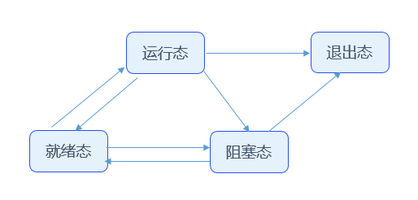

# 任务管理


## 基本概念

从系统角度看，任务是竞争系统资源的最小运行单元。任务可以使用或等待CPU、使用内存空间等系统资源，各任务的运行相互独立。

OpenHarmony LiteOS-M的任务模块可以给用户提供多个任务，实现任务间的切换，帮助用户管理业务程序流程。任务模块具有如下特性：

- 支持多任务。

- 一个任务表示一个线程。

- 抢占式调度机制，高优先级的任务可打断低优先级任务，低优先级任务必须在高优先级任务阻塞或结束后才能得到调度。

- 相同优先级任务支持时间片轮转调度方式。

- 共有32个优先级[0-31]，最高优先级为0，最低优先级为31。


### 任务相关概念

**任务状态**

任务有多种运行状态。系统初始化完成后，创建的任务就可以在系统中竞争一定的资源，由内核进行调度。

任务状态通常分为以下四种：

- 就绪（Ready）：该任务在就绪队列中，只等待CPU。

- 运行（Running）：该任务正在执行。

- 阻塞（Blocked）：该任务不在就绪队列中。包含任务被挂起（suspend状态）、任务被延时（delay状态）、任务正在等待信号量、读写队列或者等待事件等。

- 退出态（Dead）：该任务运行结束，等待系统回收资源。

**任务状态迁移**

  **图1** 任务状态示意图

  

系统会同时存在多个任务，因此就绪态和阻塞态的任务分别会加入就绪队列和阻塞队列。队列只是相同状态任务的合集，加入队列的先后与任务状态迁移的顺序无关。运行态任务仅存在一个，不存在运行态队列。

**任务状态迁移说明**

- 就绪态→运行态
  任务创建后进入就绪态，发生任务切换时，就绪队列中最高优先级的任务被执行，从而进入运行态，同时该任务从就绪队列中移出。

- 运行态→阻塞态
  正在运行的任务发生阻塞（挂起、延时、读信号量等）时，将该任务插入到对应的阻塞队列中，任务状态由运行态变成阻塞态，然后发生任务切换，运行就绪队列中最高优先级任务。

- 阻塞态→就绪态（阻塞态→运行态的前置条件）
  阻塞的任务被恢复后（任务恢复、延时时间超时、读信号量超时或读到信号量等），此时被恢复的任务会被加入就绪队列，从而由阻塞态变成就绪态；此时如果被恢复任务的优先级高于正在运行任务的优先级，则会发生任务切换，该任务由就绪态变成运行态。

- 就绪态→阻塞态
  任务也有可能在就绪态时被阻塞（挂起），此时任务状态由就绪态变为阻塞态，该任务从就绪队列中移出，不会参与任务调度，直到该任务被恢复。

- 运行态→就绪态
  有更高优先级任务创建或者恢复后，会发生任务调度，此刻就绪队列中最高优先级任务变为运行态，那么原先运行的任务由运行态变为就绪态，依然在就绪队列中。

- 运行态→退出态
  运行中的任务运行结束，任务状态由运行态变为退出态。退出态包含任务运行结束的正常退出状态以及Invalid状态。例如，任务运行结束但是没有自删除，对外呈现的就是Invalid状态，即退出态。

- 阻塞态→退出态
  阻塞的任务调用删除接口，任务状态由阻塞态变为退出态。

**任务ID**

在任务创建时通过参数返回给用户。系统中任务ID号是唯一的，是任务的重要标识。用户可以通过任务ID对指定任务进行任务挂起、任务恢复、查询任务名等操作。

**任务优先级**

优先级表示任务执行的优先顺序。任务的优先级决定了在发生任务切换时即将要执行的任务，就绪队列中最高优先级的任务将得到执行。

**任务入口函数**

新任务得到调度后将执行的函数。该函数由用户实现，在任务创建时，通过任务创建结构体设置。

**任务栈**

每个任务都拥有一个独立的栈空间，我们称为任务栈。栈空间里保存的信息包含局部变量、寄存器、函数参数、函数返回地址等。

**任务上下文**

任务在运行过程中使用的一些资源，如寄存器等，称为任务上下文。当这个任务挂起时，其他任务继续执行，可能会修改寄存器等资源中的值。如果任务切换时没有保存任务上下文，可能会导致任务恢复后出现未知错误。因此在任务切换时会将切出任务的任务上下文信息，保存在自身的任务栈中，以便任务恢复后，从栈空间中恢复挂起时的上下文信息，从而继续执行挂起时被打断的代码。

**任务控制块（TCB）**

每个任务都含有一个任务控制块(TCB)。TCB包含了任务上下文栈指针（stack pointer）、任务状态、任务优先级、任务ID、任务名、任务栈大小等信息。TCB可以反映出每个任务运行情况。

**任务切换**

任务切换包含获取就绪队列中最高优先级任务、切出任务上下文保存、切入任务上下文恢复等动作。


### 任务运行机制

用户创建任务时，系统会初始化任务栈，预置上下文。此外，系统还会将“任务入口函数”地址放在相应位置。这样在任务第一次启动进入运行态时，将会执行“任务入口函数”。


## 接口说明

OpenHarmony LiteOS-M内核的任务管理模块提供下面几种功能，接口详细信息可以查看API参考。

  **表1** 任务管理模块接口

| 功能分类 | 接口描述 |
| -------- | -------- |
| 创建和删除任务 | LOS_TaskCreateOnly：创建任务，并使该任务进入suspend状态。<br/>LOS_TaskCreate：创建任务，并使该任务进入ready状态，如果就绪队列中没有更高优先级的任务，则运行该任务。<br/>LOS_TaskDelete：删除指定的任务。 |
| 控制任务状态 | LOS_TaskResume：恢复挂起的任务，使该任务进入ready状态。<br/>LOS_TaskSuspend：挂起指定的任务，然后切换任务。<br/>LOS_TaskJoin：挂起当前任务，等待指定任务运行结束并回收其任务控制块资源<br/>LOS_TaskDelay：任务延时等待，释放CPU，等待时间到期后该任务会重新进入ready状态。传入参数为Tick数目。<br/>LOS_Msleep：任务延时等待，释放CPU，等待时间到期后该任务会重新进入ready状态。传入参数为毫秒数。<br/>LOS_TaskYield：当前任务时间片设置为0，释放CPU，触发调度运行就绪任务队列中优先级最高的任务。 |
| 控制任务调度 | LOS_TaskLock：锁任务调度，但任务仍可被中断打断。<br/>LOS_TaskUnlock：解锁任务调度。<br/>LOS_Schedule：触发任务调度。 |
| 控制任务优先级 | LOS_CurTaskPriSet：设置当前任务的优先级。<br/>LOS_TaskPriSet：设置指定任务的优先级。<br/>LOS_TaskPriGet：获取指定任务的优先级。 |
| 获取任务信息 | LOS_CurTaskIDGet：获取当前任务的ID。<br/>LOS_NextTaskIDGet：获取任务就绪队列中优先级最高的任务的ID。<br/>LOS_NewTaskIDGet：等同LOS_NextTaskIDGet。<br/>LOS_CurTaskNameGet：获取当前任务的名称。<br/>LOS_TaskNameGet：获取指定任务的名称。<br/>LOS_TaskStatusGet：获取指定任务的状态。<br/>LOS_TaskInfoGet：获取指定任务的信息，包括任务状态、优先级、任务栈大小、栈顶指针SP、任务入口函数、已使用的任务栈大小等。<br/>LOS_TaskIsRunning：获取任务模块是否已经开始调度运行。 |
| 任务信息维测 | LOS_TaskSwitchInfoGet：获取任务切换信息，需要开启编译控制宏：LOSCFG_BASE_CORE_EXC_TSK_SWITCH。 |

## 开发流程

本节介绍任务模块的典型场景开发流程：

1. 锁任务调度LOS_TaskLock，防止高优先级任务调度。

2. 创建任务LOS_TaskCreate。

3. 解锁任务LOS_TaskUnlock，让任务按照优先级进行调度。

4. 延时任务LOS_TaskDelay，任务延时等待。

5. 挂起指定的任务LOS_TaskSuspend，任务挂起等待恢复操作。

6. 恢复挂起的任务LOS_TaskResume。

>  **说明：**
> - 执行Idle任务时，会对待回收链表中的任务控制块和任务栈进行回收。
> 
> - 任务名是指针，并没有分配空间，在设置任务名时，禁止将局部变量的地址赋值给任务名指针。
> 
> - 任务栈的大小按8字节大小对齐。确定任务栈大小的原则是，够用就行，多了浪费，少了任务栈溢出。
> 
> - 挂起当前任务时，如果已经锁任务调度，则无法挂起。
> 
> - Idle任务及软件定时器任务不能被挂起或者删除。
> 
> - 在中断处理函数中或者在锁任务的情况下，执行LOS_TaskDelay会失败。
> 
> - 锁任务调度，并不关中断，因此任务仍可被中断打断。
> 
> - 锁任务调度必须和解锁任务调度配合使用。
> 
> - 设置任务优先级时可能会发生任务调度。
> 
> - 可配置的系统最大任务数是指：整个系统的任务总个数，而非用户能使用的任务个数。例如：系统软件定时器多占用一个任务资源，那么用户能使用的任务资源就会减少一个。
> 
> - LOS_CurTaskPriSet和LOS_TaskPriSet接口不能在中断中使用，也不能用于修改软件定时器任务的优先级。
> 
> - LOS_TaskPriGet接口传入的task ID对应的任务未创建或者超过最大任务数，统一返回-1。
> 
> - 在删除任务时要保证任务申请的资源（如互斥锁、信号量等）已被释放。


## 编程实例

本实例介绍基本的任务操作方法，包含2个不同优先级任务的创建、任务延时、任务锁与解锁调度、挂起和恢复等操作，阐述任务优先级调度的机制以及各接口的应用。示例代码如下：

本演示代码在 ./kernel/liteos_m/testsuites/src/osTest.c 中编译验证，在TestTaskEntry中调用验证入口函数ExampleTask。


```
#include "los_task.h"

UINT32 g_taskHiId;
UINT32 g_taskLoId;
#define TSK_PRIOR_HI 3  /* 高优先级任务的优先级 */
#define TSK_PRIOR_LO 4  /* 低优先级任务的优先级 */

UINT32 ExampleTaskHi(VOID)
{
    UINT32 ret;

    printf("Enter TaskHi Handler.\n");

    /* 延时100个Ticks，延时后该任务会挂起，执行剩余任务中最高优先级的任务(即TaskLo任务) */
    ret = LOS_TaskDelay(100);
    if (ret != LOS_OK) {
        printf("Delay TaskHi Failed.\n");
        return LOS_NOK;
    }

    /* 100个Ticks时间到了后，该任务恢复，继续执行 */
    printf("TaskHi LOS_TaskDelay Done.\n");

    /* 挂起自身任务 */
    ret = LOS_TaskSuspend(g_taskHiId);
    if (ret != LOS_OK) {
        printf("Suspend TaskHi Failed.\n");
        return LOS_NOK;
    }
    printf("TaskHi LOS_TaskResume Success.\n");
    return ret;
}

/* 低优先级任务入口函数 */
UINT32 ExampleTaskLo(VOID)
{
    UINT32 ret;

    printf("Enter TaskLo Handler.\n");

    /* 延时100个Ticks，延时后该任务会挂起，执行剩余任务中最高优先级的任务 */
    ret = LOS_TaskDelay(100);
    if (ret != LOS_OK) {
        printf("Delay TaskLo Failed.\n");
        return LOS_NOK;
    }

    printf("TaskHi LOS_TaskSuspend Success.\n");

    /* 恢复被挂起的任务g_taskHiId */
    ret = LOS_TaskResume(g_taskHiId);
    if (ret != LOS_OK) {
        printf("Resume TaskHi Failed.\n");
        return LOS_NOK;
    }
    return ret;
}

/* 任务测试入口函数，创建两个不同优先级的任务 */
UINT32 ExampleTask(VOID)
{
    UINT32 ret;
    TSK_INIT_PARAM_S taskParam1 = { 0 };
    TSK_INIT_PARAM_S taskParam2 = { 0 };

    /* 锁任务调度，防止新创建的任务比本任务高而发生调度 */
    LOS_TaskLock();

    printf("LOS_TaskLock() Success!\n");

    taskParam1.pfnTaskEntry = (TSK_ENTRY_FUNC)ExampleTaskHi;
    taskParam1.usTaskPrio = TSK_PRIOR_HI;
    taskParam1.pcName = "TaskHi";
    taskParam1.uwStackSize = LOSCFG_BASE_CORE_TSK_DEFAULT_STACK_SIZE;
    taskParam1.uwResved = LOS_TASK_ATTR_JOINABLE; /* detach 属性 */

    /* 创建高优先级任务，由于锁任务调度，任务创建成功后不会马上执行 */
    ret = LOS_TaskCreate(&g_taskHiId, &taskParam1);
    if (ret != LOS_OK) {
        LOS_TaskUnlock();

        printf("Example_TaskHi create Failed!\n");
        return LOS_NOK;
    }

    printf("Example_TaskHi create Success!\n");

    taskParam2.pfnTaskEntry = (TSK_ENTRY_FUNC)ExampleTaskLo;
    taskParam2.usTaskPrio = TSK_PRIOR_LO;
    taskParam2.pcName = "TaskLo";
    taskParam2.uwStackSize = LOSCFG_BASE_CORE_TSK_DEFAULT_STACK_SIZE;

    /* 创建低优先级任务，由于锁任务调度，任务创建成功后不会马上执行 */
    ret = LOS_TaskCreate(&g_taskLoId, &taskParam2);
    if (ret != LOS_OK) {
        LOS_TaskUnlock();
        printf("Example_TaskLo create Failed!\n");
        return LOS_NOK;
    }

    printf("Example_TaskLo create Success!\n");

    /* 解锁任务调度，此时会发生任务调度，执行就绪队列中最高优先级任务 */
    LOS_TaskUnlock();
    ret = LOS_TaskJoin(g_taskHiId, NULL);
    if (ret != LOS_OK) {
        printf("Join Example_TaskHi Failed!, 0x%x\n", ret);
    } else {
        printf("Join Example_TaskHi Success!\n");
    }
    return LOS_OK;
}
```


 **结果验证** 

编译运行得到的结果为：


```     
LOS_TaskLock() Success!
Example_TaskHi create Success!
Example_TaskLo create Success!
Enter TaskHi Handler.
Enter TaskLo Handler.
TaskHi LOS_TaskDelay Done.
TaskHi LOS_TaskSuspend Success.
TaskHi LOS_TaskResume Success.
Join Example_TaskHi Success!
```
