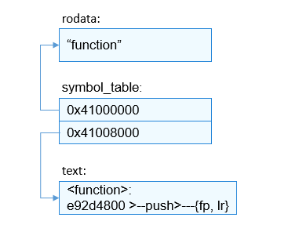

# 动态加载


## 基本概念

在硬件资源有限的小设备中，需要通过算法的动态部署能力来解决无法同时部署多种算法的问题。以开发者易用为主要考虑因素，同时考虑到多平台的通用性，LiteOS-M选择业界标准的ELF加载方案，方便拓展算法生态。LiteOS-M提供类似于dlopen、dlsym等接口，APP通过动态加载模块提供的接口可以加载、卸载相应算法库。如图1所示，APP需要通过三方算法库所需接口获取对应信息输出，三方算法库又依赖内核提供的基本接口，如malloc等。APP加载所需接口，并对相关的未定义符号完成重定位后，APP即可调用该接口完成功能调用。目前动态加载组件只支持arm架构。此外，待加载的共享库需要验签或者限制来源，确保系统的安全性。

  **图1** LiteOS-M内核动态加载架构图

  


## 运行机制


### 符号表导出

共享库调用内核接口需要内核主动暴露动态库所需的接口，如图2所示，该机制将符号信息编译到指定段中，调用SYM_EXPORT宏即可完成对指定符号的信息导出。符号信息通过结构体SymInfo描述，成员包括符号名和符号地址信息，宏SYM_EXPORT通过__attribute__编译属性将符号信息导入.sym.\*段中。

  
```
typedef struct {
  CHAR    *name;
  UINTPTR addr;
} SymInfo;

#define SYM_EXPORT(func)                                            \
const SymInfo sym_##func __attribute__((section(".sym."#func))) = { \
    .name = #func,                                                  \
    .addr = (UINTPTR)func                                           \
};
```

  **图2** 导出的符号表信息

  


### ELF文件加载

加载过程中，根据ELF文件的句柄以及程序头表的段偏移可以得到需要加载到内存的LOAD段，一般有两个段，只读段及读写段，如下所示，可以用readelf -l查看ELF文件的LOAD段信息。如图3所示，根据相应的对齐属性申请物理内存，通过每个段的加载基址及偏移将代码段或数据段写入内存中。

  
```
$ readelf -l lib.so

Elf file type is DYN (Shared object file)
Entry point 0x5b4
There are 4 program headers, starting at offset 52

Program Headers:
  Type           Offset   VirtAddr   PhysAddr   FileSiz MemSiz  Flg Align
  EXIDX          0x000760 0x00000760 0x00000760 0x00008 0x00008 R   0x4
  LOAD           0x000000 0x00000000 0x00000000 0x0076c 0x0076c R E 0x10000LOAD           0x00076c 0x0001076c 0x0001076c 0x0010c 0x00128 RW  0x10000
  DYNAMIC        0x000774 0x00010774 0x00010774 0x000c8 0x000c8 RW  0x4

 Section to Segment mapping:
  Segment Sections...
   00     .ARM.exidx
   01     .hash .dynsym .dynstr .rel.dyn .rel.plt .init .plt .text .fini .ARM.exidx .eh_frame
   02     .init_array .fini_array .dynamic .got .data .bss
   03     .dynamic
```

  **图3** ELF文件的加载过程

  


### ELF文件链接

如图4所示，通过ELF文件的.dynamic段获取重定位表，遍历表中每一个需要重定位的条目，再根据需要重定位的符号名在共享库和内核提供的导出符号表中查找相应符号并更新相应的重定位信息。

  **图4** ELF文件的链接过程

  


## ELF支持规格


### ELF支持类型

编译共享库时，添加-fPIC可以编译出位置无关代码（-fPIC为编译选项），此时共享库文件类型为ET_DYN，其可以加载至任意有效的地址区间。

例：arm-none-eabi-gcc -fPIC –shared –o lib.so lib.c


### ELF共享库编译链接选项

1. “-nostdlib”编译链接选项：不依赖编译器中lib库。

2. “-nostartfiles”编译链接选项：不依赖编译器中启动相关的文件。

3. “-fPIC”编译选项：可编译位置无关的共享库。

4. “-z max-page-size=4”链接选项：二进制文件中可加载段的对齐字节数为4，可节约内存，可用于动态库。

5. “-mcpu=”需要指定对应的CPU架构。


## 约束


- 不支持应用程序加载，只支持共享库加载。
- 待加载的共享库不能依赖编译器中的libc库及其他共享库，只能依赖内核提供的对外接口（由导出的符号表提供）。
- 依赖交叉编译器及文件系统。