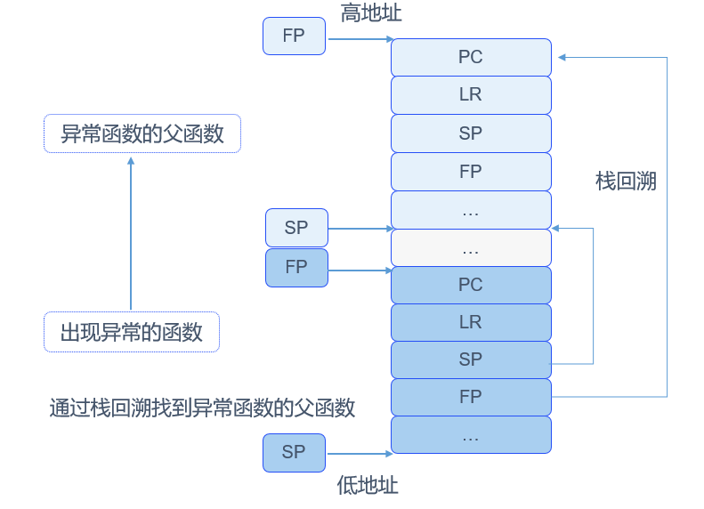

# 异常调测


## 基本概念

OpenHarmony LiteOS-M提供异常接管调测手段，帮助开发者定位分析问题。异常接管是操作系统对运行期间发生的异常情况进行处理的一系列动作，例如打印异常发生时异常类型、发生异常时的系统状态、当前函数的调用栈信息、CPU现场信息、任务调用堆栈等信息。


## 运行机制

栈帧用于保存函数调用过程中的函数参数、变量、返回值等信息。调用函数时，会创建子函数的栈帧，同时将函数入参、局部变量、寄存器入栈。栈帧从高地址向低地址生长。以ARM32 CPU架构为例，每个栈帧中都会保存PC、LR、SP和FP寄存器的历史值。LR链接寄存器（Link Register）指向函数的返回地址，FP帧指针寄存器（Frame Point）指向当前函数的父函数的栈帧起始地址。利用FP寄存器可以得到父函数的栈帧，从栈帧中获取父函数的FP，就可以得到祖父函数的栈帧，以此类推，可以追溯程序调用栈，得到函数间的调用关系。

当系统发生异常时，系统打印异常函数的栈帧中保存的寄存器内容，以及父函数、祖父函数的栈帧中的LR链接寄存器、FP帧指针寄存器内容，用户就可以据此追溯函数间的调用关系，定位异常原因。

堆栈分析原理如下图所示，实际堆栈信息根据不同CPU架构有所差异，此处仅做示意。

  **图1** 堆栈分析原理示意图

  

图中不同颜色的寄存器表示不同的函数。可以看到函数调用过程中，寄存器的保存。通过FP寄存器，栈回溯到异常函数的父函数，继续按照规律对栈进行解析，推出函数调用关系，方便用户定位问题。


## 接口说明

OpenHarmony LiteOS-M内核的回溯栈模块提供以下接口，接口详细信息可以查看API参考。

  **表1** 回溯栈模块接口

| 接口名 | 功能 | 
| -------- | -------- |
| LOS_BackTrace | 打印调用处的函数调用栈关系。| 
| LOS_RecordLR  | 在无法打印的场景，用该接口获取调用处的函数调用栈关系。|


## 使用指导


### 开发流程

开启异常调测的典型流程如下：

1. 配置异常接管相关宏。

   需要在target_config.h头文件中修改配置：
   
   | 配置项 | 含义 | 设置值 | 
   | -------- | -------- | -------- |
   | LOSCFG_BACKTRACE_DEPTH | 函数调用栈深度，默认15层 | 15 | 
   | LOSCFG_BACKTRACE_TYPE | 回溯栈类型:<br/>0：表示关闭该功能；<br/>1：表示支持Cortex-m系列硬件的函数调用栈解析；<br/>2：表示用于Risc-v系列硬件的函数调用栈解析； | 根据工具链类型设置1或2 | 

2. 使用示例中有问题的代码，编译、运行工程，在串口终端中查看异常信息输出。示例代码模拟异常代码，实际产品开发时使用异常调测机制定位异常问题。
   
   本示例演示异常输出，包含1个任务，该任务入口函数模拟若干函数调用，最终调用一个模拟异常的函数。代码实现如下：
     
   本演示代码在`./kernel/liteos_m/testsuites/src/osTest.c`中编译验证，在TestTaskEntry中调用验证入口函数ExampleExcEntry。
   
   ```
   #include <stdio.h>
   #include "los_config.h"
   #include "los_interrupt.h"
   #include "los_task.h"
   
   UINT32 g_taskExcId;
   #define TSK_PRIOR 4
   
   /* 模拟异常函数 */
   UINT32 GetResultException0(UINT16 dividend){
       UINT32 result = *(UINT32 *)(0xffffffff);
       printf("Enter GetResultException0. %u\r\n", result);
       return result;
   }
   
   UINT32 GetResultException1(UINT16 dividend){
       printf("Enter GetResultException1.\r\n");
       return GetResultException0(dividend);
   }
   
   UINT32 GetResultException2(UINT16 dividend){
       printf("Enter GetResultException2.\r\n");
       return GetResultException1(dividend);
   }
   
   UINT32 ExampleExc(VOID)
   {
       UINT32 ret;
   
       printf("Enter Example_Exc Handler.\r\n");
   
       /* 模拟函数调用 */
       ret = GetResultException2(TSK_PRIOR);
       printf("Divided result =%u.\r\n", ret);
   
       printf("Exit Example_Exc Handler.\r\n");
       return ret;
   }
   
   
   /* 任务测试入口函数，创建一个会发生异常的任务 */
   UINT32 ExampleExcEntry(VOID)
   {
       UINT32 ret;
       TSK_INIT_PARAM_S initParam = { 0 };
   
       /* 锁任务调度，防止新创建的任务比本任务高而发生调度 */
       LOS_TaskLock();
   
       printf("LOS_TaskLock() Success!\r\n");
   
       initParam.pfnTaskEntry = (TSK_ENTRY_FUNC)ExampleExc;
       initParam.usTaskPrio = TSK_PRIOR;
       initParam.pcName = "Example_Exc";
       initParam.uwStackSize = LOSCFG_BASE_CORE_TSK_DEFAULT_STACK_SIZE;
       /* 创建高优先级任务，由于锁任务调度，任务创建成功后不会马上执行 */
       ret = LOS_TaskCreate(&g_taskExcId, &initParam);
       if (ret != LOS_OK) {
           LOS_TaskUnlock();
   
           printf("Example_Exc create Failed!\r\n");
           return LOS_NOK;
       }
   
       printf("Example_Exc create Success!\r\n");
   
         /* 解锁任务调度，此时会发生任务调度，执行就绪队列中最高优先级任务 */
         LOS_TaskUnlock();
     
         return LOS_OK;
     }
   ```
   
   述代码串口终端输出异常信息如下：
   
   ```
   LOS_TaskLock() Success!
   Example_Exc create Success!
   Enter Example_Exc Handler.
   Enter GetResultException2.
   Enter GetResultException1.
   *************Exception Information**************
   Type      = 4
   ThrdPid   = 5
   Phase     = exc in task
   FaultAddr = 0xfffffffc
   Current task info:
   Task name = Example_Exc
   Task ID   = 5
   Task SP   = 0x210549bc
   Task ST   = 0x21053a00
   Task SS   = 0x1000
   Exception reg dump:
   PC        = 0x2101c61a
   LR        = 0x2101c64d
   SP        = 0x210549a8
   R0        = 0x4
   R1        = 0xa
   R2        = 0x0
   R3        = 0xffffffff
   R4        = 0x2103fb20
   R5        = 0x5050505
   R6        = 0x6060606
   R7        = 0x210549a8
   R8        = 0x8080808
   R9        = 0x9090909
   R10       = 0x10101010
   R11       = 0x11111111
   R12       = 0x0
   PriMask   = 0x0
   xPSR      = 0x41000000
   ----- backtrace start -----
   backtrace 0 -- lr = 0x2101c64c
   backtrace 1 -- lr = 0x2101c674
   backtrace 2 -- lr = 0x2101c696
   backtrace 3 -- lr = 0x2101b1ec
   ----- backtrace end -----
   
    TID  Priority   Status StackSize WaterLine StackPoint TopOfStack EventMask  SemID  CPUUSE CPUUSE10s CPUUSE1s   TaskEntry name
    ---  -------- -------- --------- --------- ---------- ---------- --------- ------ ------- --------- --------  ---------- ----
      0        0      Pend    0x1000      0xdc 0x2104730c 0x210463e8         0 0xffff     0.0       0.0      0.0  0x2101a199 Swt_Task
      1       31     Ready     0x500      0x44 0x210478e4 0x21047428         0 0xffff     0.0       0.0      0.0  0x2101a9c9 IdleCore000
      2        5  PendTime    0x6000      0xd4 0x2104e8f4 0x210489c8         0 0xffff     5.7       5.7      0.0  0x21016149 tcpip_thread
      3        3      Pend    0x1000     0x488 0x2104f90c 0x2104e9e8       0x1 0xffff     8.6       8.6      0.0  0x21016db5 ShellTaskEntry
      4       25     Ready    0x4000     0x460 0x21053964 0x2104f9f0         0 0xffff     9.0       8.9      0.0  0x2101c765 IT_TST_INI
      5        4   Running    0x1000     0x458 0x210549bc 0x21053a00         0 0xffff    76.5      76.6      0.0  0x2101c685 Example_Exc
   
   OS exception NVIC dump:
   interrupt enable register, base address: 0xe000e100, size: 0x20
   0x2001 0x0 0x0 0x0 0x0 0x0 0x0 0x0
   interrupt pending register, base address: 0xe000e200, size: 0x20
   0x0 0x0 0x0 0x0 0x0 0x0 0x0 0x0
   interrupt active register, base address: 0xe000e300, size: 0x20
   0x0 0x0 0x0 0x0 0x0 0x0 0x0 0x0
   interrupt priority register, base address: 0xe000e400, size: 0xf0
   0x0 0x0 0x0 0x0 0x0 0x0 0x0 0x0 0x0 0x0 0x0 0x0 0x0 0x0 0x0 0x0 0x0
   0x0 0x0 0x0 0x0 0x0 0x0 0x0 0x0 0x0 0x0 0x0 0x0 0x0 0x0 0x0 0x0
   0x0 0x0 0x0 0x0 0x0 0x0 0x0 0x0 0x0 0x0 0x0 0x0 0x0 0x0 0x0 0x0
   0x0 0x0 0x0 0x0 0x0 0x0 0x0 0x0 0x0 0x0 0x0
   interrupt exception register, base address: 0xe000ed18, size: 0xc
   0x0 0x0 0xf0f00000
   interrupt shcsr register, base address: 0xe000ed24, size: 0x4
   0x70002
   interrupt control register, base address: 0xe000ed04, size: 0x4
   0x1000e805
   
   memory pools check:
   system heap memcheck over, all passed!
   memory pool check end!
   
   根据实际运行环境，上文中的数据会有差异，非固定结果
   ```


### 定位流程

异常接管一般的定位步骤如下：

1. 确认编译时关掉优化选项，否则下述的描述内容可能被优化掉。

2. 打开编译后生成的镜像反汇编（asm）文件。如果默认没有生成，可以使用objdump工具生成，命令为：
   
   ```
   arm-none-eabi-objdump -S -l XXX.elf
   ```

3. 搜索PC指针（指向当前正在执行的指令）在asm中的位置，找到发生异常的函数。

   PC地址指向发生异常时程序正在执行的指令。在当前执行的二进制文件对应的asm文件中，查找PC值0x2101c61a，找到当前CPU正在执行的指令行，反汇编如下所示：
   
   ```
   2101c60c <GetResultException0>:
   2101c60c:	b580      	push	{r7, lr}
   2101c60e:	b084      	sub	sp, #16
   2101c610:	af00      	add	r7, sp, #0
   2101c612:	4603      	mov	r3, r0
   2101c614:	80fb      	strh	r3, [r7, #6]
   2101c616:	f04f 33ff 	mov.w	r3, #4294967295	; 0xffffffff
   2101c61a:	681b      	ldr	r3, [r3, #0]
   2101c61c:	60fb      	str	r3, [r7, #12]
   2101c61e:	68f9      	ldr	r1, [r7, #12]
   2101c620:	4803      	ldr	r0, [pc, #12]	; (2101c630 <GetResultException0+0x24>)
   2101c622:	f001 f92b 	bl	2101d87c <printf>
   2101c626:	68fb      	ldr	r3, [r7, #12]
   2101c628:	4618      	mov	r0, r3
   2101c62a:	3710      	adds	r7, #16
   2101c62c:	46bd      	mov	sp, r7
   2101c62e:	bd80      	pop	{r7, pc}
   2101c630:	21025f90 	.word	0x21025f90
   ```
   
4. 可以看到:
   1. 异常时CPU正在执行的指令是ldr r3, [r3, #0]，其中r3取值为0xffffffff，导致发生非法地址异常。
   2. 异常发生在函数GetResultException0中。

5. 根据LR值查找异常函数的父函数。
   
   包含LR值0x2101c64d的反汇编如下所示：

   ```
   2101c634 <GetResultException1>:
   2101c634:	b580      	push	{r7, lr}
   2101c636:	b082      	sub	sp, #8
   2101c638:	af00      	add	r7, sp, #0
   2101c63a:	4603      	mov	r3, r0
   2101c63c:	80fb      	strh	r3, [r7, #6]
   2101c63e:	4806      	ldr	r0, [pc, #24]	; (2101c658 <GetResultException1+0x24>)
   2101c640:	f001 f91c 	bl	2101d87c <printf>
   2101c644:	88fb      	ldrh	r3, [r7, #6]
   2101c646:	4618      	mov	r0, r3
   2101c648:	f7ff ffe0 	bl	2101c60c <GetResultException0>
   2101c64c:	4603      	mov	r3, r0
   2101c64e:	4618      	mov	r0, r3
   2101c650:	3708      	adds	r7, #8
   2101c652:	46bd      	mov	sp, r7
   2101c654:	bd80      	pop	{r7, pc}
   2101c656:	bf00      	nop
   2101c658:	21025fb0 	.word	0x21025fb0
   ```
   
6. LR值2101c648上一行是bl 2101c60c \<GetResultException0\>，此处调用了异常函数，调用异常函数的父函数为GetResultException1。

7. 重复步骤3，解析异常信息中backtrace start至backtrace end之间的LR值，得到调用产生异常的函数调用栈关系，找到异常原因。
