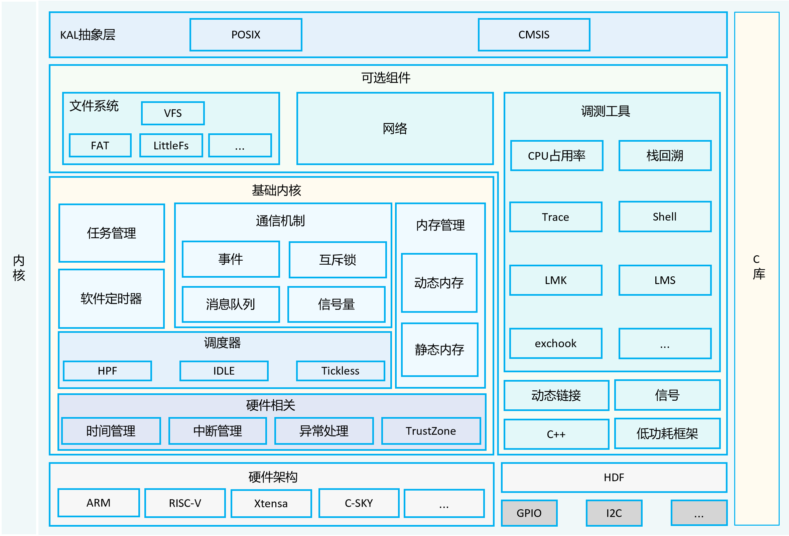
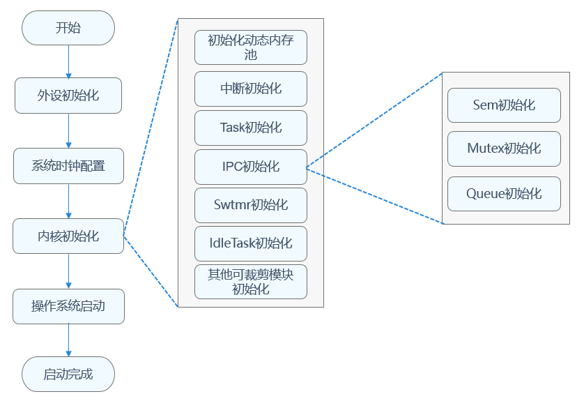

# 内核概述


## 内核简介

OpenHarmony LiteOS-M内核是面向IoT领域构建的轻量级物联网操作系统内核，具有小体积、低功耗、高性能的特点。其代码结构简单，主要包括内核最小功能集、内核抽象层、可选组件以及工程目录等。支持驱动框架HDF（Hardware Driver Foundation），统一驱动标准，为设备厂商提供了更统一的接入方式，使驱动更加容易移植，力求做到一次开发，多系统部署。

OpenHarmony LiteOS-M内核架构包含硬件相关层以及硬件无关层，如下图所示，其中硬件相关层按不同编译工具链、芯片架构分类，提供统一的HAL（Hardware Abstraction Layer）接口，提升了硬件易适配性，满足AIoT类型丰富的硬件和编译工具链的拓展；其他模块属于硬件无关层，其中基础内核模块提供基础能力，扩展模块提供网络、文件系统等组件能力，还提供错误处理、调测等能力，KAL（Kernel Abstraction Layer）模块提供统一的标准接口。

  **图1** 内核架构图

  


## CPU体系架构支持

CPU体系架构分为通用架构定义和特定架构定义两层，通用架构定义层为所有体系架构都需要支持和实现的接口，特定架构定义层为特定体系架构所特有的部分。在新增一个体系架构的时候，必须需要实现通用架构定义层，如果该体系架构还有特有的功能，可以在特定架构定义层来实现。

  **表1** CPU体系架构规则

| 规则 | 通用体系架构层 | 特定体系架构层 |
| -------- | -------- | -------- |
| 头文件位置 | arch/include | arch/&lt;arch&gt;/&lt;arch&gt;/&lt;toolchain&gt;/ |
| 头文件命名 | los_&lt;function&gt;.h | los_arch_&lt;function&gt;.h |
| 函数命名 | Halxxxx | Halxxxx |

LiteOS-M已经支持ARM Cortex-M3、ARM Cortex-M4、ARM Cortex-M7、ARM Cortex-M33、RISC-V等主流架构。


## 运行机制

在开发板配置文件target_config.h配置系统时钟、每秒Tick数，可以对任务、内存、IPC、异常处理模块进行裁剪配置。系统启动时，根据配置进行指定模块的初始化。内核启动流程包含外设初始化、系统时钟配置、内核初始化、操作系统启动等，详见下图。

  **图2** 内核启动流程

  

## 目录<a name="section161941989596"></a>

目录结构如下。

```text
/kernel/liteos_m
├── arch                 # 内核指令架构层目录
│   ├── arm              # arm 架构代码
│   │   ├── arm9         # arm9 架构代码
│   │   ├── cortex-m3    # cortex-m3架构代码
│   │   ├── cortex-m33   # cortex-m33架构代码
│   │   ├── cortex-m4    # cortex-m4架构代码
│   │   ├── cortex-m55   # cortex-m55架构代码
│   │   ├── cortex-m7    # cortex-m7架构代码
│   │   └── include      # arm架构公共头文件目录
│   ├── csky             # csky架构代码
│   │   └── v2           # csky v2架构代码
│   ├── include          # 架构层对外接口存放目录
│   ├── risc-v           # risc-v 架构
│   │   ├── nuclei       # 芯来科技risc-v架构代码
│   │   └── riscv32      # risc-v官方通用架构代码
│   └── xtensa           # xtensa 架构代码
│       └── lx6          # xtensa lx6架构代码
├── components           # 可选组件
│   ├── backtrace        # 栈回溯功能
│   ├── cppsupport       # C++支持
│   ├── cpup             # CPUP功能
│   ├── dynlink          # 动态加载与链接
│   ├── exchook          # 异常钩子
│   ├── fs               # 文件系统
│   ├── lmk              # Low memory killer 机制
│   ├── lms              # Lite memory sanitizer 机制
│   ├── net              # Network功能
│   ├── power            # 低功耗管理
│   ├── shell            # shell功能
│   └── trace            # trace 工具
├── drivers              # 驱动框架Kconfig
├── kal                  # 内核抽象层
│   ├── cmsis            # cmsis标准接口支持
│   └── posix            # posix标准接口支持
├── kernel               # 内核最小功能集支持
│   ├── include          # 对外接口存放目录
│   └── src              # 内核最小功能集源码
├── testsuites           # 内核测试用例
├── tools                # 内核工具
├── utils                # 通用公共目录
```

## 约束<a name="section119744591305"></a>

开发语言：C/C++；

适用架构：详见目录结构arch层。

动态加载模块：待加载的共享库需要验签或者限制来源，确保安全性。

## 使用说明<a name="section3732185231214"></a>

OpenHarmony
LiteOS-M内核的编译构建系统是一个基于gn和ninja的组件化构建系统，支持按组件配置、裁剪和拼装，按需构建出定制化的产品。本文主要介绍如何基于gn和ninja编译LiteOS-M工程，GCC+gn、IAR、Keil MDK等编译方式可以参考社区爱好者贡献的站点。

### 搭建系统基础环境

在搭建各个开发板环境前，需要完成OpenHarmony系统基础环境搭建。系统基础环境主要是指OpenHarmony的编译环境和开发环境，详细介绍请参考官方站点[快速入门环境搭建部分](../quick-start/quickstart-overview.md)。开发者需要根据环境搭建文档完成环境搭建。

### 获取OpenHarmony源码

详细的源码获取方式，请见[源码获取](../get-code/sourcecode-acquire.md)。获取OpenHarmony完整仓代码后，假设克隆目录为`~/OpenHarmony`。

### 已支持的示例工程

Qemu模拟器: `arm_mps2_an386、esp32、riscv32_virt、SmartL_E802`, 编译运行详见: [Qemu指导](https://gitee.com/openharmony/device_qemu)。

恒玄科技: `bes2600`, 编译运行详见: [恒玄开发指导](https://gitee.com/openharmony/device_soc_bestechnic)。

### 社区移植工程链接

LiteOS-M内核移植的具体开发板的工程由社区开发者提供，可以访问社区开发者代码仓获取。如果您移植支持了更多开发板，可以提供链接给我们进行社区分享。

-   cortex-m3：

    - STM32F103   https://gitee.com/rtos_lover/stm32f103_simulator_keil

        该仓包含OpenHarmony LiteOS-M内核基于STM32F103芯片架构构建的Keil工程，支持Keil MDK方式进行编译。

-   cortex-m4：

    - 野火挑战者STM32F429IGTb   https://gitee.com/harylee/stm32f429ig_firechallenger

        该仓包含OpenHarmony LiteOS-M内核移植支持`野火挑战者STM32F429IGTb`开发板的工程代码，支持Ninja、GCC、IAR等方式进行编译。

## 贡献<a name="section1371123476307"></a>

[如何贡献](../../contribute/参与贡献.md)

[Commit message规范](https://gitee.com/openharmony/kernel_liteos_m/wikis/Commit%20message%E8%A7%84%E8%8C%83)

[Liteos-M 内核编码规范](https://gitee.com/openharmony/kernel_liteos_m/wikis/OpenHarmony%E8%BD%BB%E5%86%85%E6%A0%B8%E7%BC%96%E7%A0%81%E8%A7%84%E8%8C%83)

如何基于Liteos-M内核贡献一款芯片:

[轻量系统芯片移植指导](../porting/porting-minichip-overview.md)

[轻量系统芯片移植案例](../porting/porting-bes2600w-on-minisystem-display-demo.md)

## 相关仓<a name="section1371113476307"></a>

[内核子系统](../../readme/内核子系统.md)

[kernel\_liteos\_m](https://gitee.com/openharmony/kernel_liteos_m/blob/master/README_zh.md)

