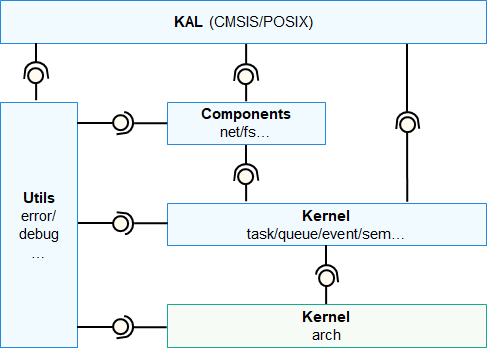
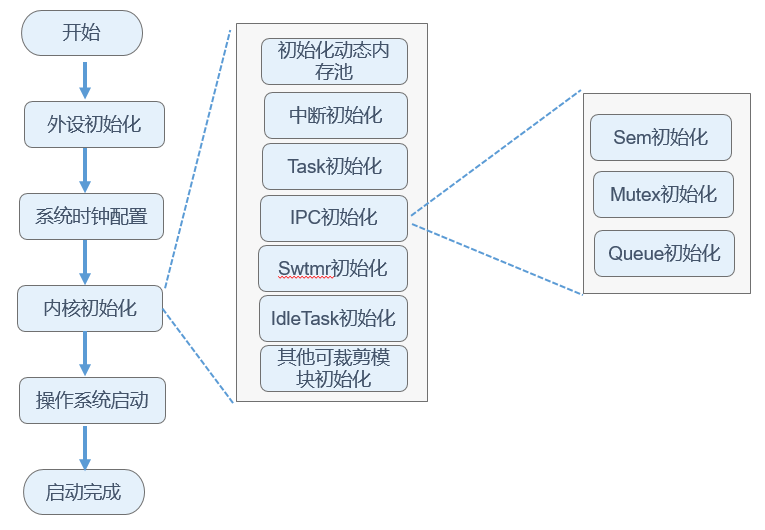

# 内核概述

-   [内核简介](#section1429342661510)
    -   [cpu体系架构支持](#section48891456112819)
    -   [运行机制](#section4599142312817)

## 内核简介

OpenHarmony LiteOS-M内核是面向IoT领域构建的轻量级物联网操作系统内核，具有小体积、低功耗、高性能的特点。其代码结构简单，主要包括内核最小功能集、内核抽象层、可选组件以及工程目录等。OpenHarmony LiteOS-M内核架构包含硬件相关层以及硬件无关层，如下图所示，其中Kernel Arch模块属于硬件相关层，该模块按不同编译工具链、芯片架构分类，提供统一的HAL（Hardware Abstraction Layer）接口，提升了硬件易适配性，满足AIoT类型丰富的硬件和编译工具链的拓展；Components等其他模块属于硬件无关层，其中Kernel Task等内核模块提供基础能力，Components模块提供网络、文件系统等组件能力，Utils模块提供错误处理、调测等能力，KAL（Kernel Abstraction Layer）模块提供统一的标准接口。

**图 1**  内核架构图  

### cpu体系架构支持

CPU体系架构分为通用架构定义和特定架构定义两层，通用架构定义层为所有体系架构都需要支持和实现的接口，特定架构定义层为特定体系架构所特有的部分。在新增一个体系架构的时候，必须需要实现通用架构定义层，如果该体系架构还有特有的功能，可以在特定架构定义层来实现。

**表 1**  CPU体系架构规则

<table><thead align="left"><tr id="row977192213323"><th class="cellrowborder" valign="top" width="21.592159215921594%" id="mcps1.2.4.1.1">
规则

</th>
<th class="cellrowborder" valign="top" width="34.713471347134714%" id="mcps1.2.4.1.2">
通用体系架构层

</th>
<th class="cellrowborder" valign="top" width="43.694369436943695%" id="mcps1.2.4.1.3">
特定体系架构层

</th>
</tr>
</thead>
<tbody><tr id="row1577522103217"><td class="cellrowborder" valign="top" width="21.592159215921594%" headers="mcps1.2.4.1.1 ">
头文件位置

</td>
<td class="cellrowborder" valign="top" width="34.713471347134714%" headers="mcps1.2.4.1.2 ">
kernel/arch/include

</td>
<td class="cellrowborder" valign="top" width="43.694369436943695%" headers="mcps1.2.4.1.3 ">
kernel/arch/&lt;arch&gt;/&lt;arch&gt;/&lt;toolchain&gt;/

</td>
</tr>
<tr id="row16781422193218"><td class="cellrowborder" valign="top" width="21.592159215921594%" headers="mcps1.2.4.1.1 ">
头文件命名

</td>
<td class="cellrowborder" valign="top" width="34.713471347134714%" headers="mcps1.2.4.1.2 ">
los_&lt;function&gt;.h

</td>
<td class="cellrowborder" valign="top" width="43.694369436943695%" headers="mcps1.2.4.1.3 ">
los_arch_&lt;function&gt;.h

</td>
</tr>
<tr id="row207882213215"><td class="cellrowborder" valign="top" width="21.592159215921594%" headers="mcps1.2.4.1.1 ">
函数命名

</td>
<td class="cellrowborder" valign="top" width="34.713471347134714%" headers="mcps1.2.4.1.2 ">
Halxxxx

</td>
<td class="cellrowborder" valign="top" width="43.694369436943695%" headers="mcps1.2.4.1.3 ">
Halxxxx

</td>
</tr>
</tbody>
</table>

LiteOS-M已经支持ARM Cortex-M3、ARM Cortex-M4、ARM Cortex-M7、ARM Cortex-M33、RISC-V等主流架构，如果需要扩展CPU体系架构，请参考[芯片架构适配点](../porting/porting-chip-kernel-overview.md#section137431650339)。

### 运行机制

在开发板配置文件target\_config.h配置系统时钟、每秒Tick数，可以对任务、内存、IPC、异常处理模块进行裁剪配置。系统启动时，根据配置进行指定模块的初始化。内核启动流程包含外设初始化、系统时钟配置、内核初始化、操作系统启动等，详见内核启动流程图。

**图 2**  内核启动流程  

