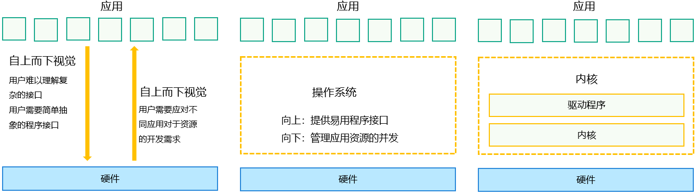
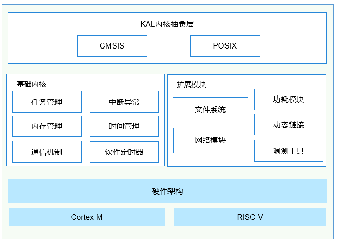
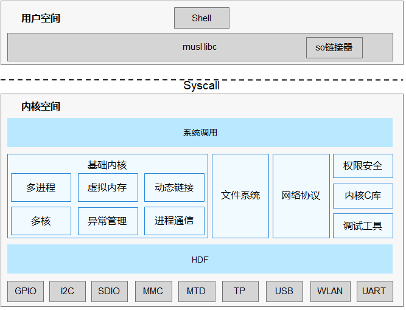

# 内核概述


### 内核简介

用户最常见到并与之交互的操作系统界面，其实只是操作系统最外面的一层。操作系统最重要的任务，包括管理硬件设备，分配系统资源等，我们称之为操作系统内在最重要的核心功能。而实现这些核心功能的操作系统模块，业界一般称之为操作系统“内核”。


### 实现原理

操作系统是位于应用和硬件之间的系统软件，向上提供易用的程序接口和运行环境，向下管理硬件资源。内核位于操作系统的下层，为操作系统上层的程序框架提供硬件资源的并发管理。

  **图1** 操作系统架构 
 
  


### 多内核架构和基本组成

业界的内核有很多，但无论是什么内核，基本上有几个最重要的组成单元是每个内核均要具备的，分别是：

- 负责持久化数据，并让应用程序能够方便的访问持久化数据的“文件系统”。

- 负责管理进程地址空间的“内存管理”。

- 负责管理多个进程的“进程管理”或者“任务管理“。

- 负责本机操作系统和另外一个设备上操作系统通信的“网络”。

OpenHarmony采用了多内核结构，支持Linux和LiteOS，开发者可按不同产品规格进行选择使用。Linux和LiteOS均具备上述组成单元，只是实现方式有所不同。多个内核通过KAL（Kernel Abstraction Layer）模块，向上提供统一的标准接口。

内核子系统位于OpenHarmony下层。需要特别注意的是，由于OpenHarmony面向多种设备类型，这些设备有着不同的CPU能力，存储大小等。为了更好的适配这些不同的设备类型，内核子系统支持针对不同资源等级的设备选用适合的OS内核，内核抽象层（KAL，Kernel Abstract Layer）通过屏蔽内核间差异，对上层提供基础的内核能力。

  **图2** OpenHarmony架构图 

 
  


### 不同内核适配的系统及设备类型

OpenHarmony按照支持的设备可分为如下几种系统类型：

- 轻量系统（mini system）
  面向MCU类处理器例如Arm Cortex-M、RISC-V 32位的设备，硬件资源极其有限，支持的设备最小内存为128KiB，可以提供多种轻量级网络协议，轻量级的图形框架，以及丰富的IOT总线读写部件等。可支撑的产品如智能家居领域的连接类模组、传感器设备、穿戴类设备等。

- 小型系统（small system）
  面向应用处理器例如Arm Cortex-A的设备，支持的设备最小内存为1MiB，可以提供更高的安全能力、标准的图形框架、视频编解码的多媒体能力。可支撑的产品如智能家居领域的IP Camera、电子猫眼、路由器以及智慧出行域的行车记录仪等。

- 标准系统（standard system）
  面向应用处理器例如Arm Cortex-A的设备，支持的设备最小内存为128MiB，可以提供增强的交互能力、3D GPU以及硬件合成能力、更多控件以及动效更丰富的图形能力、完整的应用框架。可支撑的产品如高端的冰箱显示屏。

OpenHarmony针对不同量级的系统，使用了不同形态的内核。轻量系统、小型系统可以选用LiteOS；小型系统和标准系统可以选用Linux。其对应关系如下表：

  **表1** 系统关系对应表

| 系统级别 | 轻量系统 | 小型系统 | 标准系统 | 
| -------- | -------- | -------- | -------- |
| LiteOS-M | √ | × | × | 
| LiteOS-A | × | √ | × | 
| Linux | × | √ | √ | 


## LiteOS-M


### 内核架构

OpenHarmony LiteOS-M内核是面向IoT领域构建的轻量级物联网操作系统内核，具有小体积、低功耗、高性能的特点，其代码结构简单，主要包括内核最小功能集、内核抽象层、可选组件以及工程目录等，分为硬件相关层以及硬件无关层，硬件相关层提供统一的HAL（Hardware Abstraction Layer）接口，提升硬件易适配性，不同编译工具链和芯片架构的组合分类，满足AIoT类型丰富的硬件和编译工具链的拓展。

  **图3** LiteOS-M架构图  

  


### 使用指导

LiteOS-M使用指导请参见LiteOS-M[内核概述](kernel-mini-overview.md)的“使用说明”章节。


## LiteOS-A


### 内核架构

OpenHarmony 轻量级内核是基于IoT领域轻量级物联网操作系统Huawei LiteOS内核演进发展的新一代内核，包含LiteOS-M和LiteOS-A两类内核。LiteOS-M内核主要应用于轻量系统，面向的MCU（Microprocessor Unit）一般是百K级内存，可支持MPU（Memory Protection Unit）隔离，业界类似的内核有FreeRTOS或ThreadX等；LiteOS-A内核主要应用于小型系统，面向设备一般是M级内存，可支持MMU（Memory Management Unit）隔离，业界类似的内核有Zircon或Darwin等。

为适应IoT产业的高速发展，OpenHarmony 轻量级内核不断优化和扩展，能够带给开发者友好的开发体验和统一开放的生态系统能力。轻量级内核LiteOS-A重要的新特性如下：

- 新增了丰富的内核机制：
  - 新增虚拟内存、系统调用、多核、轻量级IPC（Inter-Process Communication，进程间通信）、DAC（Discretionary Access Control，自主访问控制）等机制，丰富了内核能力；
  - 为了更好的兼容软件和开发者体验，新增支持多进程，使得应用之间内存隔离、相互不影响，提升系统的健壮性。

- 引入统一驱动框架HDF（Hardware Driver Foundation）

  引入统一驱动框架HDF，统一驱动标准，为设备厂商提供了更统一的接入方式，使驱动更加容易移植，力求做到一次开发，多系统部署。

- 支持1200+标准POSIX接口

  更加全面的支持POSIX标准接口，使得应用软件易于开发和移植，给应用开发者提供了更友好的开发体验。

- 内核和硬件高解耦

  轻量级内核与硬件高度解耦，新增单板，内核代码不用修改。

  **图4** OpenHarmony LiteOS-A内核架构图 

  


### 使用指导

LiteOS-A使用指导请参见LiteOS-A[内核概述](kernel-small-overview.md)的“使用说明”章节。


## Linux


### linux内核概述

OpenHarmony的Linux内核基于开源Linux内核LTS **4.19.y / 5.10.y** 分支演进，在此基线基础上，回合CVE补丁及OpenHarmony特性，作为OpenHarmony Common Kernel基线。针对不同的芯片，各厂商合入对应的板级驱动补丁，完成对OpenHarmony的基线适配。

- Linux社区LTS 4.19.y分支信息请查看[kernel官网](https://git.kernel.org/pub/scm/linux/kernel/git/stable/linux.git/log/?h=linux-4.19.y)。

- Linux社区LTS 5.10.y分支信息请查看[kernel官网](https://git.kernel.org/pub/scm/linux/kernel/git/stable/linux.git/log/?h=linux-5.10.y)。

内核的Patch组成模块，在编译构建流程中，针对具体芯片平台，合入对应的架构驱动代码，进行编译对应的内核镜像。所有补丁来源均遵守GPL-2.0协议。


### 内核增强特性

OpenHarmony针对linux内核在ESwap(Enhanced Swap)、关联线程组调度和CPU轻量级隔离做了增强。

**Enhanced SWAP特性**

ESwap提供了自定义新增存储分区作为内存交换分区的能力，并创建了一个常驻进程zswapd将[ZRAM](https://www.kernel.org/doc/html/latest/admin-guide/blockdev/zram.html)压缩后的匿名页加密换出到ESwap存储分区，从而能完全的空出一块可用内存，以此来达到维持Memavailable水线的目标。同时，配合这个回收机制，在整个内存框架上进行改进，优化匿名页和文件页的回收效率，并且使两者的回收比例更加合理以避免过度回收导致的refault问题造成卡顿现象。

**关联线程组调度**

关联线程组(related thread group)提供了对一组关键线程调度优化的能力，支持对关键线程组单独进行负载统计和预测，并且设置优选CPU cluster功能，从而达到为组内线程选择最优CPU运行并且根据分组负载选择合适的CPU调频点运行。

**CPU轻量级隔离**

CPU轻量级隔离特性提供了根据系统负载和用户配置来选择合适的CPU进行动态隔离的能力。内核会将被隔离CPU上的任务和中断迁移到其他合适的CPU上执行，被隔离的CPU会进入ilde状态，以此来达到功耗优化的目标。同时提供用户态的配置和查询接口来实现更好的系统调优。


### 使用指导

1. 合入HDF补丁
     在kernel/linux/build仓中，按照kernel.mk中HDF的补丁合入方法，合入不同内核版本对应的HDF内核补丁：
     
   ```
   $(OHOS_BUILD_HOME)/drivers/hdf_core/adapter/khdf/linux/patch_hdf.sh $(OHOS_BUILD_HOME) $(KERNEL_SRC_TMP_PATH) $(KERNEL_PATCH_PATH) $(DEVICE_NAME)
   ```

2. 合入芯片平台驱动补丁
   以Hi3516DV300为例：

     在kernel/linux/build仓中，按照kernel.mk中的芯片组件所对应的patch路径规则及命名规则，将对应的芯片组件patch放到对应路径下：
     
   ```
   DEVICE_PATCH_DIR := $(OHOS_BUILD_HOME)/kernel/linux/patches/${KERNEL_VERSION}/$(DEVICE_NAME)_patch
   DEVICE_PATCH_FILE := $(DEVICE_PATCH_DIR)/$(DEVICE_NAME).patch
   ```

3. 修改自己所需要编译的config
     在kernel/linux/build仓中，按照kernel.mk中的芯片组件所对应的patch路径规则及命名规则，将对应的芯片组件config放到对应路径下：
     
   ```
   KERNEL_CONFIG_PATH := $(OHOS_BUILD_HOME)/kernel/linux/config/${KERNEL_VERSION}DEFCONFIG_FILE := $(DEVICE_NAME)_$(BUILD_TYPE)_defconfig
   ```

   >  **须知：**
   > 由于OpenHarmony工程的编译构建流程中会拷贝kernel/linux/linux-\*.\*的代码环境后进行打补丁动作，在使用OpenHarmony的版本级编译命令前，需要kernel/linux/linux-\*.\*原代码环境。
   > 
   > 根据不同系统工程，编译完成后会在out目录下的kernel目录中生成对应实际编译的内核，基于此目录的内核，进行对应的config修改，将最后生成的.config文件cp到config仓对应的路径文件里，即可生效。

