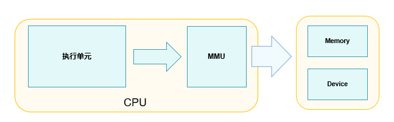

# 虚实映射

-   [基本概念](#section9108144913615)
-   [运行机制](#section12392621871)
-   [开发指导](#section10264102013713)
    -   [接口说明](#section195320251578)
    -   [开发流程](#section152774210712)

## 基本概念

虚实映射是指系统通过内存管理单元（MMU，Memory Management Unit）将进程空间的虚拟地址与实际的物理地址做映射，并指定相应的访问权限、缓存属性等。程序执行时，CPU访问的是虚拟内存，通过MMU页表条目找到对应的物理内存，并做相应的代码执行或数据读写操作。MMU的映射由页表（Page Table）来描述，其中保存虚拟地址和物理地址的映射关系以及访问权限等。每个进程在创建的时候都会创建一个页表，页表由一个个页表条目（Page Table Entry， PTE）构成，每个页表条目描述虚拟地址区间与物理地址区间的映射关系。MMU中有一块页表缓存，称为快表（TLB, Translation Lookaside Buffers），做地址转换时，MMU首先在TLB中查找，如果找到对应的页表条目可直接进行转换，提高了查询效率。CPU访问内存或外设的示意图如下：

**图 1**  CPU访问内存或外设的示意图  

## 运行机制

虚实映射其实就是一个建立页表的过程。MMU有多级页表，LiteOS-A内核采用二级页表描述进程空间。每个一级页表条目描述符占用4个字节，可表示1MiB的内存空间的映射关系，即1GiB用户空间（LiteOS-A内核中用户空间占用1GiB）的虚拟内存空间需要1024个。系统创建用户进程时，在内存中申请一块4KiB大小的内存块作为一级页表的存储区域，二级页表根据当前进程的需要做动态的内存申请。

-   用户程序加载启动时，会将代码段、数据段映射进虚拟内存空间（详细可参考[动态加载与链接](kernel-small-bundles-linking.md)），此时并没有物理页做实际的映射；
-   程序执行时，如下图粗箭头所示，CPU访问虚拟地址，通过MMU查找是否有对应的物理内存，若该虚拟地址无对应的物理地址则触发缺页异常，内核申请物理内存并将虚实映射关系及对应的属性配置信息写进页表，并把页表条目缓存至TLB，接着CPU可直接通过转换关系访问实际的物理内存；
-   若CPU访问已缓存至TLB的页表条目，无需再访问保存在内存中的页表，可加快查找速度。

**图 2**  CPU访问内存示意图  

## 开发指导

### 接口说明

**表 1**  虚实映射模块接口

<table><thead align="left"><tr id="row134151837125611"><th class="cellrowborder" valign="top" width="12.821282128212822%" id="mcps1.2.4.1.1">
功能分类

</th>
<th class="cellrowborder" valign="top" width="29.832983298329836%" id="mcps1.2.4.1.2">
接口<strong id="b197068338312">名称</strong>

</th>
<th class="cellrowborder" valign="top" width="57.34573457345735%" id="mcps1.2.4.1.3">
描述

</th>
</tr>
</thead>
<tbody><tr id="row12171174434013"><td class="cellrowborder" rowspan="5" valign="top" width="12.821282128212822%" headers="mcps1.2.4.1.1 ">
MMU相关操作

</td>
<td class="cellrowborder" valign="top" width="29.832983298329836%" headers="mcps1.2.4.1.2 ">
LOS_ArchMmuQuery

</td>
<td class="cellrowborder" valign="top" width="57.34573457345735%" headers="mcps1.2.4.1.3 ">
获取进程空间虚拟地址对应的物理地址以及映射属性。

</td>
</tr>
<tr id="row17223043124018"><td class="cellrowborder" valign="top" headers="mcps1.2.4.1.1 ">
LOS_ArchMmuMap

</td>
<td class="cellrowborder" valign="top" headers="mcps1.2.4.1.2 ">
映射进程空间虚拟地址区间与物理地址区间。

</td>
</tr>
<tr id="row536885134010"><td class="cellrowborder" valign="top" headers="mcps1.2.4.1.1 ">
LOS_ArchMmuUnmap

</td>
<td class="cellrowborder" valign="top" headers="mcps1.2.4.1.2 ">
解除进程空间虚拟地址区间与物理地址区间的映射关系。

</td>
</tr>
<tr id="row11567448194112"><td class="cellrowborder" valign="top" headers="mcps1.2.4.1.1 ">
LOS_ArchMmuChangeProt

</td>
<td class="cellrowborder" valign="top" headers="mcps1.2.4.1.2 ">
修改进程空间虚拟地址区间的映射属性。

</td>
</tr>
<tr id="row1141513373562"><td class="cellrowborder" valign="top" headers="mcps1.2.4.1.1 ">
LOS_ArchMmuMove

</td>
<td class="cellrowborder" valign="top" headers="mcps1.2.4.1.2 ">
将进程空间一个虚拟地址区间的映射关系转移至另一块未使用的虚拟地址区间重新做映射。

</td>
</tr>
</tbody>
</table>

### 开发流程

虚实映射相关接口的使用：

1.  通过LOS\_ArchMmuMap映射一块物理内存。
2.  对映射的地址区间做相关操作：
    -   通过LOS\_ArchMmuQuery可以查询相应虚拟地址区间映射的物理地址区间及映射属性；

    -   通过LOS\_ArchMmuChangeProt修改映射属性；
    -   通过LOS\_ArchMmuMove做虚拟地址区间的重映射。

3.  通过LOS\_ArchMmuUnmap解除映射关系。

> **说明：** 
>上述接口的使用都是基于MMU初始化完成以及相关进程页表的建立，MMU在系统启动阶段已完成初始化，进程创建的时候会建立页表，开发者无需介入操作。

