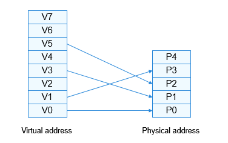

# 虚拟内存管理

-   [基本概念](#section650193717411)
-   [运行机制](#section072885512412)
-   [开发指导](#section20956116050)
    -   [接口说明](#section166137221657)
    -   [开发流程](#section8752103914513)

## 基本概念

虚拟内存管理是计算机系统管理内存的一种技术。每个进程都有连续的虚拟地址空间，虚拟地址空间的大小由CPU的位数决定，32位的硬件平台可以提供的最大的寻址空间为0-4G。整个4G空间分成两部分，LiteOS-A内核占据3G的高地址空间，1G的低地址空间留给进程使用。各个进程空间的虚拟地址空间是独立的，代码、数据互不影响。

系统将虚拟内存分割为称为虚拟页的内存块，大小一般为4k或64k，LiteOS-A内核默认的页的大小是4k，根据需要可以对MMU（Memory Management Units）进行配置。虚拟内存管理操作的最小单位就是一个页，LiteOS-A内核中一个虚拟地址区间region包含地址连续的多个虚拟页，也可只有一个页。同样，物理内存也会按照页大小进行分割，分割后的每个内存块称为页帧。虚拟地址空间划分：内核态占高地址3G\(0x40000000 \~ 0xFFFFFFFF\)，用户态占低地址1G\(0x01000000 \~ 0x3F000000\)，具体见下表，详细可以查看或配置los\_vm\_zone.h。

**表 1**  内核态地址规划：

<table><thead align="left"><tr id="row164675173616"><th class="cellrowborder" valign="top" width="11.761176117611761%" id="mcps1.2.6.1.1">
Zone名称

</th>
<th class="cellrowborder" valign="top" width="22.792279227922794%" id="mcps1.2.6.1.2">
起始地址

</th>
<th class="cellrowborder" valign="top" width="18.381838183818385%" id="mcps1.2.6.1.3">
结束地址

</th>
<th class="cellrowborder" valign="top" width="25.372537253725376%" id="mcps1.2.6.1.4">
用途

</th>
<th class="cellrowborder" valign="top" width="21.692169216921695%" id="mcps1.2.6.1.5">
属性

</th>
</tr>
</thead>
<tbody><tr id="row94619516367"><td class="cellrowborder" valign="top" width="11.761176117611761%" headers="mcps1.2.6.1.1 ">
DMA zone

</td>
<td class="cellrowborder" valign="top" width="22.792279227922794%" headers="mcps1.2.6.1.2 ">
0x40000000

</td>
<td class="cellrowborder" valign="top" width="18.381838183818385%" headers="mcps1.2.6.1.3 ">
0x43FFFFFF

</td>
<td class="cellrowborder" valign="top" width="25.372537253725376%" headers="mcps1.2.6.1.4 ">
USB、网络等dma内存访问

</td>
<td class="cellrowborder" valign="top" width="21.692169216921695%" headers="mcps1.2.6.1.5 ">
Uncache

</td>
</tr>
<tr id="row246551361"><td class="cellrowborder" valign="top" width="11.761176117611761%" headers="mcps1.2.6.1.1 ">
Normal zone

</td>
<td class="cellrowborder" valign="top" width="22.792279227922794%" headers="mcps1.2.6.1.2 ">
0x80000000

</td>
<td class="cellrowborder" valign="top" width="18.381838183818385%" headers="mcps1.2.6.1.3 ">
0x83FFFFFF

</td>
<td class="cellrowborder" valign="top" width="25.372537253725376%" headers="mcps1.2.6.1.4 ">
内核代码、数据段和堆内存和栈

</td>
<td class="cellrowborder" valign="top" width="21.692169216921695%" headers="mcps1.2.6.1.5 ">
Cache

</td>
</tr>
<tr id="row646165133613"><td class="cellrowborder" valign="top" width="11.761176117611761%" headers="mcps1.2.6.1.1 ">
high mem zone

</td>
<td class="cellrowborder" valign="top" width="22.792279227922794%" headers="mcps1.2.6.1.2 ">
0x84000000

</td>
<td class="cellrowborder" valign="top" width="18.381838183818385%" headers="mcps1.2.6.1.3 ">
0x8BFFFFFF

</td>
<td class="cellrowborder" valign="top" width="25.372537253725376%" headers="mcps1.2.6.1.4 ">
连续虚拟内存分配，物理内存不连续

</td>
<td class="cellrowborder" valign="top" width="21.692169216921695%" headers="mcps1.2.6.1.5 ">
Cache

</td>
</tr>
</tbody>
</table>

**表 2**  用户态虚地址规划：

<table><thead align="left"><tr id="row646185183618"><th class="cellrowborder" valign="top" width="11.721172117211722%" id="mcps1.2.6.1.1">
Zone名称

</th>
<th class="cellrowborder" valign="top" width="22.712271227122713%" id="mcps1.2.6.1.2">
起始地址

</th>
<th class="cellrowborder" valign="top" width="18.681868186818683%" id="mcps1.2.6.1.3">
结束地址

</th>
<th class="cellrowborder" valign="top" width="25.27252725272527%" id="mcps1.2.6.1.4">
用途

</th>
<th class="cellrowborder" valign="top" width="21.61216121612161%" id="mcps1.2.6.1.5">
属性

</th>
</tr>
</thead>
<tbody><tr id="row7462511363"><td class="cellrowborder" valign="top" width="11.721172117211722%" headers="mcps1.2.6.1.1 ">
代码段

</td>
<td class="cellrowborder" valign="top" width="22.712271227122713%" headers="mcps1.2.6.1.2 ">
0x0200000

</td>
<td class="cellrowborder" valign="top" width="18.681868186818683%" headers="mcps1.2.6.1.3 ">
0x09FFFFFF

</td>
<td class="cellrowborder" valign="top" width="25.27252725272527%" headers="mcps1.2.6.1.4 ">
用户态代码段地址空间

</td>
<td class="cellrowborder" valign="top" width="21.61216121612161%" headers="mcps1.2.6.1.5 ">
Cache

</td>
</tr>
<tr id="row34755153614"><td class="cellrowborder" valign="top" width="11.721172117211722%" headers="mcps1.2.6.1.1 ">
堆

</td>
<td class="cellrowborder" valign="top" width="22.712271227122713%" headers="mcps1.2.6.1.2 ">
0x0FC00000(起始地址随机)

</td>
<td class="cellrowborder" valign="top" width="18.681868186818683%" headers="mcps1.2.6.1.3 ">
0x17BFFFFF

</td>
<td class="cellrowborder" valign="top" width="25.27252725272527%" headers="mcps1.2.6.1.4 ">
用户态堆地址空间

</td>
<td class="cellrowborder" valign="top" width="21.61216121612161%" headers="mcps1.2.6.1.5 ">
Cache

</td>
</tr>
<tr id="row9476518368"><td class="cellrowborder" valign="top" width="11.721172117211722%" headers="mcps1.2.6.1.1 ">
栈

</td>
<td class="cellrowborder" valign="top" width="22.712271227122713%" headers="mcps1.2.6.1.2 ">
0x37000000

</td>
<td class="cellrowborder" valign="top" width="18.681868186818683%" headers="mcps1.2.6.1.3 ">
0x3EFFFFFF(起始地址随机)

</td>
<td class="cellrowborder" valign="top" width="25.27252725272527%" headers="mcps1.2.6.1.4 ">
用户态栈空间地址

</td>
<td class="cellrowborder" valign="top" width="21.61216121612161%" headers="mcps1.2.6.1.5 ">
Cache

</td>
</tr>
<tr id="row1047353364"><td class="cellrowborder" valign="top" width="11.721172117211722%" headers="mcps1.2.6.1.1 ">
共享库

</td>
<td class="cellrowborder" valign="top" width="22.712271227122713%" headers="mcps1.2.6.1.2 ">
0x1F800000(起始地址随机)

</td>
<td class="cellrowborder" valign="top" width="18.681868186818683%" headers="mcps1.2.6.1.3 ">
0x277FFFFF

</td>
<td class="cellrowborder" valign="top" width="25.27252725272527%" headers="mcps1.2.6.1.4 ">
用户态共享库加载地址空间，包括mmap

</td>
<td class="cellrowborder" valign="top" width="21.61216121612161%" headers="mcps1.2.6.1.5 ">
Cache

</td>
</tr>
</tbody>
</table>

## 运行机制

虚拟内存管理中，虚拟地址空间是连续的，但是其映射的物理内存并不一定是连续的，如下图所示。可执行程序加载运行，CPU访问虚拟地址空间的代码或数据时存在两种情况：

-   CPU访问的虚拟地址所在的页，如V0，已经与具体的物理页P0做映射，CPU通过找到进程对应的页表条目（详见虚实映射一节），根据页表条目中的物理地址信息访问物理内存中的内容并返回。
-   CPU访问的虚拟地址所在的页，如V2，没有与具体的物理页做映射，系统会触发缺页异常，系统申请一个物理页，并把相应的信息拷贝到物理页中，并且把物理页的起始地址更新到页表条目中。此时CPU重新执行访问虚拟内存的指令便能够访问到具体的代码或数据。

**图 1**  内存映射示意图  

## 开发指导

### 接口说明

**表 3**  虚拟内存管理模块接口

<table><thead align="left"><tr id="row134151837125611"><th class="cellrowborder" valign="top" width="12.811281128112812%" id="mcps1.2.4.1.1">
功能分类

</th>
<th class="cellrowborder" valign="top" width="29.84298429842984%" id="mcps1.2.4.1.2">
接口<strong id="b197068338312">名称</strong>

</th>
<th class="cellrowborder" valign="top" width="57.34573457345735%" id="mcps1.2.4.1.3">
描述

</th>
</tr>
</thead>
<tbody><tr id="row0415737175610"><td class="cellrowborder" rowspan="5" valign="top" width="12.811281128112812%" headers="mcps1.2.4.1.1 ">
获取进程空间系列接口

</td>
<td class="cellrowborder" valign="top" width="29.84298429842984%" headers="mcps1.2.4.1.2 ">
LOS_CurrSpaceGet

</td>
<td class="cellrowborder" valign="top" width="57.34573457345735%" headers="mcps1.2.4.1.3 ">
获取当前进程空间结构体指针

</td>
</tr>
<tr id="row1841519376561"><td class="cellrowborder" valign="top" headers="mcps1.2.4.1.1 ">
LOS_SpaceGet

</td>
<td class="cellrowborder" valign="top" headers="mcps1.2.4.1.2 ">
获取虚拟地址对应的进程空间结构体指针

</td>
</tr>
<tr id="row536885134010"><td class="cellrowborder" valign="top" headers="mcps1.2.4.1.1 ">
LOS_GetKVmSpace

</td>
<td class="cellrowborder" valign="top" headers="mcps1.2.4.1.2 ">
获取内核进程空间结构体指针

</td>
</tr>
<tr id="row11567448194112"><td class="cellrowborder" valign="top" headers="mcps1.2.4.1.1 ">
LOS_GetVmallocSpace

</td>
<td class="cellrowborder" valign="top" headers="mcps1.2.4.1.2 ">
获取vmalloc空间结构体指针

</td>
</tr>
<tr id="row1141513373562"><td class="cellrowborder" valign="top" headers="mcps1.2.4.1.1 ">
LOS_GetVmSpaceList

</td>
<td class="cellrowborder" valign="top" headers="mcps1.2.4.1.2 ">
获取进程空间链表指针

</td>
</tr>
<tr id="row137812054195014"><td class="cellrowborder" rowspan="15" valign="top" width="12.811281128112812%" headers="mcps1.2.4.1.1 ">
虚拟地址区间region相关的操作

</td>
<td class="cellrowborder" valign="top" width="29.84298429842984%" headers="mcps1.2.4.1.2 ">
LOS_RegionFind

</td>
<td class="cellrowborder" valign="top" width="57.34573457345735%" headers="mcps1.2.4.1.3 ">
根据起始地址在进程空间内查找是否存在虚拟地址区间

</td>
</tr>
<tr id="row254713575505"><td class="cellrowborder" valign="top" headers="mcps1.2.4.1.1 ">
LOS_RegionRangeFind

</td>
<td class="cellrowborder" valign="top" headers="mcps1.2.4.1.2 ">
根据地址区间在进程空间内查找是否存在虚拟地址区间

</td>
</tr>
<tr id="row1692045119"><td class="cellrowborder" valign="top" headers="mcps1.2.4.1.1 ">
LOS_IsRegionFileValid

</td>
<td class="cellrowborder" valign="top" headers="mcps1.2.4.1.2 ">
判断虚拟地址区间region是否与文件关联映射

</td>
</tr>
<tr id="row186701424548"><td class="cellrowborder" valign="top" headers="mcps1.2.4.1.1 ">
LOS_RegionAlloc

</td>
<td class="cellrowborder" valign="top" headers="mcps1.2.4.1.2 ">
申请空闲的虚拟地址区间

</td>
</tr>
<tr id="row1955586175412"><td class="cellrowborder" valign="top" headers="mcps1.2.4.1.1 ">
LOS_RegionFree

</td>
<td class="cellrowborder" valign="top" headers="mcps1.2.4.1.2 ">
释放进程空间内特定的region

</td>
</tr>
<tr id="row259111510282"><td class="cellrowborder" valign="top" headers="mcps1.2.4.1.1 ">
LOS_RegionEndAddr

</td>
<td class="cellrowborder" valign="top" headers="mcps1.2.4.1.2 ">
获取指定地址区间region的结束地址

</td>
</tr>
<tr id="row12894115716285"><td class="cellrowborder" valign="top" headers="mcps1.2.4.1.1 ">
LOS_RegionSize

</td>
<td class="cellrowborder" valign="top" headers="mcps1.2.4.1.2 ">
获取region的大小

</td>
</tr>
<tr id="row14931456182812"><td class="cellrowborder" valign="top" headers="mcps1.2.4.1.1 ">
LOS_IsRegionTypeFile

</td>
<td class="cellrowborder" valign="top" headers="mcps1.2.4.1.2 ">
判断是否为文件内存映射

</td>
</tr>
<tr id="row12153854132814"><td class="cellrowborder" valign="top" headers="mcps1.2.4.1.1 ">
LOS_IsRegionPermUserReadOnly

</td>
<td class="cellrowborder" valign="top" headers="mcps1.2.4.1.2 ">
判断地址区间是否是用户空间只读属性

</td>
</tr>
<tr id="row29249497282"><td class="cellrowborder" valign="top" headers="mcps1.2.4.1.1 ">
LOS_IsRegionFlagPrivateOnly

</td>
<td class="cellrowborder" valign="top" headers="mcps1.2.4.1.2 ">
判断地址区间是否是具有私有属性

</td>
</tr>
<tr id="row1233194042814"><td class="cellrowborder" valign="top" headers="mcps1.2.4.1.1 ">
LOS_SetRegionTypeFile

</td>
<td class="cellrowborder" valign="top" headers="mcps1.2.4.1.2 ">
设置文件内存映射属性

</td>
</tr>
<tr id="row178971473283"><td class="cellrowborder" valign="top" headers="mcps1.2.4.1.1 ">
LOS_IsRegionTypeDev

</td>
<td class="cellrowborder" valign="top" headers="mcps1.2.4.1.2 ">
判断是否为设备内存映射

</td>
</tr>
<tr id="row11137546152811"><td class="cellrowborder" valign="top" headers="mcps1.2.4.1.1 ">
LOS_SetRegionTypeDev

</td>
<td class="cellrowborder" valign="top" headers="mcps1.2.4.1.2 ">
设置设备内存映射属性

</td>
</tr>
<tr id="row1023564216285"><td class="cellrowborder" valign="top" headers="mcps1.2.4.1.1 ">
LOS_IsRegionTypeAnon

</td>
<td class="cellrowborder" valign="top" headers="mcps1.2.4.1.2 ">
判断是否为匿名映射

</td>
</tr>
<tr id="row1646364402813"><td class="cellrowborder" valign="top" headers="mcps1.2.4.1.1 ">
LOS_SetRegionTypeAnon

</td>
<td class="cellrowborder" valign="top" headers="mcps1.2.4.1.2 ">
设置匿名映射属性

</td>
</tr>
<tr id="row038233717288"><td class="cellrowborder" rowspan="5" valign="top" width="12.811281128112812%" headers="mcps1.2.4.1.1 ">
地址校验

</td>
<td class="cellrowborder" valign="top" width="29.84298429842984%" headers="mcps1.2.4.1.2 ">
LOS_IsUserAddress

</td>
<td class="cellrowborder" valign="top" width="57.34573457345735%" headers="mcps1.2.4.1.3 ">
判断地址是否在用户态空间

</td>
</tr>
<tr id="row61506354284"><td class="cellrowborder" valign="top" headers="mcps1.2.4.1.1 ">
LOS_IsUserAddressRange

</td>
<td class="cellrowborder" valign="top" headers="mcps1.2.4.1.2 ">
判断地址区间是否在用户态空间

</td>
</tr>
<tr id="row18301515194210"><td class="cellrowborder" valign="top" headers="mcps1.2.4.1.1 ">
LOS_IsKernelAddress

</td>
<td class="cellrowborder" valign="top" headers="mcps1.2.4.1.2 ">
判断地址是否在内核空间

</td>
</tr>
<tr id="row191211718204213"><td class="cellrowborder" valign="top" headers="mcps1.2.4.1.1 ">
LOS_IsKernelAddressRange

</td>
<td class="cellrowborder" valign="top" headers="mcps1.2.4.1.2 ">
判断地址区间是否在内核空间

</td>
</tr>
<tr id="row774964092115"><td class="cellrowborder" valign="top" headers="mcps1.2.4.1.1 ">
LOS_IsRangeInSpace

</td>
<td class="cellrowborder" valign="top" headers="mcps1.2.4.1.2 ">
判断地址区间是否在进程空间内

</td>
</tr>
<tr id="row179196525521"><td class="cellrowborder" rowspan="3" valign="top" width="12.811281128112812%" headers="mcps1.2.4.1.1 ">
vmalloc操作

</td>
<td class="cellrowborder" valign="top" width="29.84298429842984%" headers="mcps1.2.4.1.2 ">
LOS_VMalloc

</td>
<td class="cellrowborder" valign="top" width="57.34573457345735%" headers="mcps1.2.4.1.3 ">
vmalloc申请内存

</td>
</tr>
<tr id="row1934135935211"><td class="cellrowborder" valign="top" headers="mcps1.2.4.1.1 ">
LOS_VFree

</td>
<td class="cellrowborder" valign="top" headers="mcps1.2.4.1.2 ">
vmalloc释放内存

</td>
</tr>
<tr id="row944214919304"><td class="cellrowborder" valign="top" headers="mcps1.2.4.1.1 ">
LOS_IsVmallocAddress

</td>
<td class="cellrowborder" valign="top" headers="mcps1.2.4.1.2 ">
判断地址是否是通过vmalloc申请的

</td>
</tr>
<tr id="row72131845145315"><td class="cellrowborder" rowspan="4" valign="top" width="12.811281128112812%" headers="mcps1.2.4.1.1 ">
内存申请系列接口

</td>
<td class="cellrowborder" valign="top" width="29.84298429842984%" headers="mcps1.2.4.1.2 ">
LOS_KernelMalloc

</td>
<td class="cellrowborder" valign="top" width="57.34573457345735%" headers="mcps1.2.4.1.3 ">
申请小于16k的内存则通过堆内存池获取，否则申请多个连续物理页

</td>
</tr>
<tr id="row48491549145311"><td class="cellrowborder" valign="top" headers="mcps1.2.4.1.1 ">
LOS_KernelMallocAlign

</td>
<td class="cellrowborder" valign="top" headers="mcps1.2.4.1.2 ">
申请具有对齐属性的内存，申请规则：申请小于16k的内存则通过堆内存池获取，否则申请多个连续物理页

</td>
</tr>
<tr id="row151093538536"><td class="cellrowborder" valign="top" headers="mcps1.2.4.1.1 ">
LOS_KernelFree

</td>
<td class="cellrowborder" valign="top" headers="mcps1.2.4.1.2 ">
释放内核堆内存

</td>
</tr>
<tr id="row5126856205319"><td class="cellrowborder" valign="top" headers="mcps1.2.4.1.1 ">
LOS_KernelRealloc

</td>
<td class="cellrowborder" valign="top" headers="mcps1.2.4.1.2 ">
重新分配内核内存空间

</td>
</tr>
<tr id="row12397132718549"><td class="cellrowborder" rowspan="5" valign="top" width="12.811281128112812%" headers="mcps1.2.4.1.1 ">
其他

</td>
<td class="cellrowborder" valign="top" width="29.84298429842984%" headers="mcps1.2.4.1.2 ">
LOS_PaddrQuery

</td>
<td class="cellrowborder" valign="top" width="57.34573457345735%" headers="mcps1.2.4.1.3 ">
根据虚拟地址获取对应的物理地址

</td>
</tr>
<tr id="row5558122119542"><td class="cellrowborder" valign="top" headers="mcps1.2.4.1.1 ">
LOS_VmSpaceFree

</td>
<td class="cellrowborder" valign="top" headers="mcps1.2.4.1.2 ">
释放进程空间，包括虚拟内存区间、页表等信息

</td>
</tr>
<tr id="row15860142919544"><td class="cellrowborder" valign="top" headers="mcps1.2.4.1.1 ">
LOS_VmSpaceReserve

</td>
<td class="cellrowborder" valign="top" headers="mcps1.2.4.1.2 ">
在进程空间中预留一块内存空间

</td>
</tr>
<tr id="row394217543569"><td class="cellrowborder" valign="top" headers="mcps1.2.4.1.1 ">
LOS_VaddrToPaddrMmap

</td>
<td class="cellrowborder" valign="top" headers="mcps1.2.4.1.2 ">
将指定长度的物理地址区间与虚拟地址区间做映射，需提前申请物理地址区间

</td>
</tr>
<tr id="row18527155718"><td class="cellrowborder" valign="top" headers="mcps1.2.4.1.1 ">
LOS_UserSpaceVmAlloc

</td>
<td class="cellrowborder" valign="top" headers="mcps1.2.4.1.2 ">
根据地址、大小、权限等信息在用户进程空间内申请地址区间region

</td>
</tr>
</tbody>
</table>

### 开发流程

虚拟内存相关接口的使用：

1.  根据进程空间获取的系列接口可以得到进程空间结构体，进而可以读取结构体相应信息。
2.  对虚拟地址区间做相关操作：
    -   通过LOS\_RegionAlloc申请虚拟地址区间；

    -   通过LOS\_RegionFind、LOS\_RegionRangeFind可以查询是否存在相应的地址区间；
    -   通过LOS\_RegionFree释放虚拟地址区间。

3.  vmalloc接口及内存申请系列接口可以在内核中根据需要申请内存。

> **说明：** 
>内存申请系列接口申请的内存要求物理内存是连续的，当系统内存无法满足大块连续内存的申请条件时会申请失败，一般适用于小块内存的申请；vmalloc相关接口申请的内存可以获得不连续的物理内存，但其是以页（当前系统一个页为4096字节）为单位的，当需要申请以页为整数倍的内存时可以通过vmalloc申请，例如文件系统中文件读取需要较大的缓存，便可以通过vmalloc相关接口申请内存。

