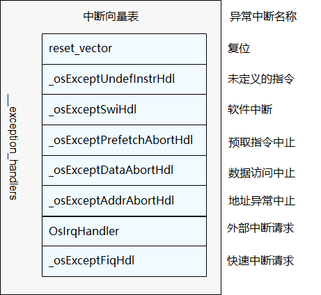

# 中断及异常处理<a name="ZH-CN_TOPIC_0000001123638623"></a>

-   [基本概念](#section439816296117)
-   [运行机制](#section2792838318)
-   [开发指导](#section15415165510110)
    -   [接口说明](#section57441612024)
    -   [开发流程](#section64332181221)
    -   [编程实例](#section204698276478)
    -   [结果验证](#section1466144215476)


## 基本概念<a name="section439816296117"></a>

中断是指出现需要时，CPU暂停执行当前程序，转而执行新程序的过程。即在程序运行过程中，出现了一个必须由CPU立即处理的事务。此时，CPU暂时中止当前程序的执行转而处理这个事务，这个过程就叫做中断。通过中断机制，可以使CPU避免把大量时间耗费在等待、查询外设状态的操作上，大大提高系统实时性以及执行效率。

异常处理是操作系统对运行期间发生的异常情况（芯片硬件异常）进行处理的一系列动作，例如虚拟内存缺页异常、打印异常发生时函数的调用栈信息、CPU现场信息、任务的堆栈情况等。

## 运行机制<a name="section2792838318"></a>

外设可以在没有CPU介入的情况下完成一定的工作，但某些情况下也需要CPU为其执行一定的工作。通过中断机制，在外设不需要CPU介入时，CPU可以执行其它任务，而当外设需要CPU时，产生一个中断信号，该信号连接至中断控制器。中断控制器是一方面接收其它外设中断引脚的输入，另一方面它会发出中断信号给CPU。可以通过对中断控制器编程来打开和关闭中断源、设置中断源的优先级和触发方式。常用的中断控制器有VIC（Vector Interrupt Controller）和GIC（General Interrupt Controller）。在ARM Cortex-A7中使用的中断控制器是GIC。CPU收到中断控制器发送的中断信号后，中断当前任务来响应中断请求。

异常处理就是可以打断CPU正常运行流程的一些事情，如未定义指令异常、试图修改只读的数据异常、不对齐的地址访问异常等。当异常发生时，CPU暂停当前的程序，先处理异常事件，然后再继续执行被异常打断的程序。

以ARMv7-a架构为例，中断和异常处理的入口为中断向量表，中断向量表包含各个中断和异常处理的入口函数。

**图 1**  中断向量表<a name="fig105771014134715"></a>  




## 开发指导<a name="section15415165510110"></a>

### 接口说明<a name="section57441612024"></a>

异常处理为内部机制，不对外提供接口，中断模块提供对外接口如下：

<a name="table11657113333110"></a>
<table><thead align="left"><tr id="row1170612337312"><th class="cellrowborder" valign="top" width="19.900000000000002%" id="mcps1.1.4.1.1"><p id="p4706133373112"><a name="p4706133373112"></a><a name="p4706133373112"></a>功能分类</p>
</th>
<th class="cellrowborder" valign="top" width="18.43%" id="mcps1.1.4.1.2"><p id="p1070653343117"><a name="p1070653343117"></a><a name="p1070653343117"></a><strong id="b197068338312"><a name="b197068338312"></a><a name="b197068338312"></a>接口名称</strong></p>
</th>
<th class="cellrowborder" valign="top" width="61.67%" id="mcps1.1.4.1.3"><p id="p370613330311"><a name="p370613330311"></a><a name="p370613330311"></a><strong id="b57068335318"><a name="b57068335318"></a><a name="b57068335318"></a>描述</strong></p>
</th>
</tr>
</thead>
<tbody><tr id="row8706123317311"><td class="cellrowborder" rowspan="2" valign="top" width="19.900000000000002%" headers="mcps1.1.4.1.1 "><p id="p4706193319318"><a name="p4706193319318"></a><a name="p4706193319318"></a>创建和删除中断</p>
</td>
<td class="cellrowborder" valign="top" width="18.43%" headers="mcps1.1.4.1.2 "><p id="p170683310317"><a name="p170683310317"></a><a name="p170683310317"></a>LOS_HwiCreate</p>
</td>
<td class="cellrowborder" valign="top" width="61.67%" headers="mcps1.1.4.1.3 "><p id="p15706833163110"><a name="p15706833163110"></a><a name="p15706833163110"></a>中断创建，注册中断号、中断触发模式、中断优先级、中断处理程序。中断被触发时，会调用该中断处理程序</p>
</td>
</tr>
<tr id="row18706153318316"><td class="cellrowborder" valign="top" headers="mcps1.1.4.1.1 "><p id="p1870615332312"><a name="p1870615332312"></a><a name="p1870615332312"></a>LOS_HwiDelete</p>
</td>
<td class="cellrowborder" valign="top" headers="mcps1.1.4.1.2 "><p id="p770616333313"><a name="p770616333313"></a><a name="p770616333313"></a>删除中断</p>
</td>
</tr>
<tr id="row1370633316316"><td class="cellrowborder" rowspan="3" valign="top" width="19.900000000000002%" headers="mcps1.1.4.1.1 "><p id="p970611333318"><a name="p970611333318"></a><a name="p970611333318"></a>打开和关闭所有中断</p>
</td>
<td class="cellrowborder" valign="top" width="18.43%" headers="mcps1.1.4.1.2 "><p id="p147061033103117"><a name="p147061033103117"></a><a name="p147061033103117"></a>LOS_IntUnLock</p>
</td>
<td class="cellrowborder" valign="top" width="61.67%" headers="mcps1.1.4.1.3 "><p id="p167061333193114"><a name="p167061333193114"></a><a name="p167061333193114"></a>打开<span>当前处理器所有中断响应</span></p>
</td>
</tr>
<tr id="row1270603314312"><td class="cellrowborder" valign="top" headers="mcps1.1.4.1.1 "><p id="p1970623343114"><a name="p1970623343114"></a><a name="p1970623343114"></a>LOS_IntLock</p>
</td>
<td class="cellrowborder" valign="top" headers="mcps1.1.4.1.2 "><p id="p1370623373115"><a name="p1370623373115"></a><a name="p1370623373115"></a>关闭<span>当前处理器所有中断响应</span></p>
</td>
</tr>
<tr id="row8706233173113"><td class="cellrowborder" valign="top" headers="mcps1.1.4.1.1 "><p id="p1770620337313"><a name="p1770620337313"></a><a name="p1770620337313"></a>LOS_IntRestore</p>
</td>
<td class="cellrowborder" valign="top" headers="mcps1.1.4.1.2 "><p id="p1470643323112"><a name="p1470643323112"></a><a name="p1470643323112"></a>恢复到使用LOS_IntLock关闭所有中断之前的状态</p>
</td>
</tr>
<tr id="row870793320317"><td class="cellrowborder" valign="top" width="19.900000000000002%" headers="mcps1.1.4.1.1 "><p id="p1970763318316"><a name="p1970763318316"></a><a name="p1970763318316"></a>获取系统支持的最大中断数</p>
</td>
<td class="cellrowborder" valign="top" width="18.43%" headers="mcps1.1.4.1.2 "><p id="p1707333123115"><a name="p1707333123115"></a><a name="p1707333123115"></a>LOS_GetSystemHwiMaximum</p>
</td>
<td class="cellrowborder" valign="top" width="61.67%" headers="mcps1.1.4.1.3 "><p id="p4707173323111"><a name="p4707173323111"></a><a name="p4707173323111"></a>获取系统支持的最大中断数</p>
</td>
</tr>
</tbody>
</table>

### 开发流程<a name="section64332181221"></a>

1.  调用中断创建接口LOS\_HwiCreate创建中断。
2.  调用LOS\_HwiDelete接口删除指定中断，此接口根据实际情况使用，判断是否需要删除中断。

### 编程实例<a name="section204698276478"></a>

本实例实现如下功能：

1.  创建中断。
2.  删除中断。

代码实现如下，演示如何创建中断和删除中断，当指定的中断号HWI\_NUM\_TEST产生中断时，会调用中断处理函数：

```
#include "los_hwi.h"
/*中断处理函数*/
STATIC VOID HwiUsrIrq(VOID)
{
    printf("in the func HwiUsrIrq \n"); 
}

static UINT32 Example_Interrupt(VOID)
{
    UINT32 ret;
    HWI_HANDLE_T hwiNum = 7;
    HWI_PRIOR_T hwiPrio = 3;
    HWI_MODE_T mode = 0;
    HWI_ARG_T arg = 0;

    /*创建中断*/
    ret = LOS_HwiCreate(hwiNum, hwiPrio, mode, (HWI_PROC_FUNC)HwiUsrIrq, (HwiIrqParam *)arg);
    if(ret == LOS_OK){
        printf("Hwi create success!\n");
    } else {
        printf("Hwi create failed!\n");
        return LOS_NOK;
    }

    /* 延时50个Ticks， 当有硬件中断发生时，会调用函数HwiUsrIrq*/
    LOS_TaskDelay(50);

    /*删除中断*/
    ret = LOS_HwiDelete(hwiNum, (HwiIrqParam *)arg);    
    if(ret == LOS_OK){
        printf("Hwi delete success!\n");
    } else {
        printf("Hwi delete failed!\n");
        return LOS_NOK;
    }
    return LOS_OK;
}
```

### 结果验证<a name="section1466144215476"></a>

编译运行得到的结果为：

```
Hwi create success!
Hwi delete success!
```

