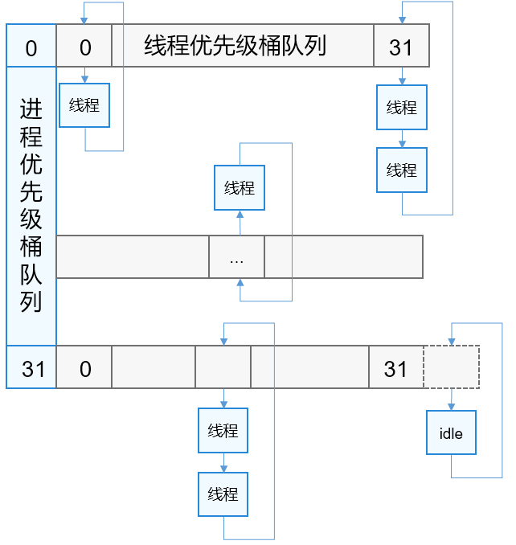
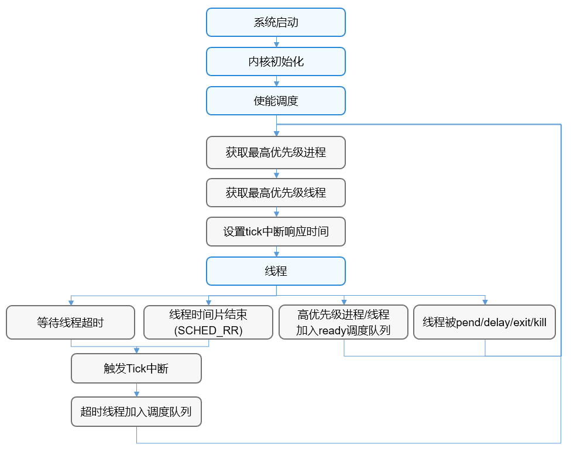

# 调度器

-   [基本概念](#section123882355719)
-   [运行机制](#section143015396572)
-   [开发指导](#section10604192145816)
    -   [接口说明](#section207985910582)
    -   [开发流程](#section1015110331584)

## 基本概念

OpenHarmony LiteOS-A内核 了高优先级优先+同优先级时间片轮转的抢占式调度机制，系统从启动开始基于real time的时间轴向前运行，使得该调度算法具有很好的实时性。

OpenHarmony 的调度算法将tickless机制天然嵌入到调度算法中，一方面使得系统具有更低的功耗，另一方面也使得tick中断按需响应，减少无用的tick中断响应，进一步提高系统的实时性。

OpenHarmony 的进程调度策略支持SCHED\_RR，线程调度策略支持SCHED\_RR和SCHED\_FIFO。

OpenHarmony 调度的最小单元为线程。

## 运行机制

OpenHarmony 采用进程优先级队列+线程优先级队列的方式，进程优先级范围为0-31，共有32个进程优先级桶队列，每个桶队列对应一个线程优先级桶队列；线程优先级范围也为0-31，一个线程优先级桶队列也有32个优先级队列。

**图 1**  调度优先级桶队列示意图  

OpenHarmony 在系统启动内核初始化之后开始调度，运行过程中创建的进程或线程会被加入到调度队列，系统根据进程和线程的优先级及线程的时间片消耗情况选择最优的线程进行调度运行，线程一旦调度到就会从调度队列上删除，线程在运行过程中发生阻塞，会被加入到对应的阻塞队列中并触发一次调度，调度其它线程运行。如果调度队列上没有可以调度的线程，则系统就会选择KIdle进程的线程进行调度运行。

**图 2**  调度流程示意图  

## 开发指导

### 接口说明

<table><thead align="left"><tr id="row513082983812"><th class="cellrowborder" valign="top" width="33.33333333333333%" id="mcps1.1.4.1.1">
功能分类

</th>
<th class="cellrowborder" valign="top" width="33.33333333333333%" id="mcps1.1.4.1.2">
接口<strong id="b197068338312">名称</strong>

</th>
<th class="cellrowborder" valign="top" width="33.33333333333333%" id="mcps1.1.4.1.3">
描述

</th>
</tr>
</thead>
<tbody><tr id="row713032973813"><td class="cellrowborder" valign="top" width="33.33333333333333%" headers="mcps1.1.4.1.1 ">
触发系统调度

</td>
<td class="cellrowborder" valign="top" width="33.33333333333333%" headers="mcps1.1.4.1.2 ">
LOS_Schedule

</td>
<td class="cellrowborder" valign="top" width="33.33333333333333%" headers="mcps1.1.4.1.3 ">
触发系统调度

</td>
</tr>
</tbody>
</table>

### 开发流程

> **说明：** 
>系统启动初始化阶段，不允许触发调度。

