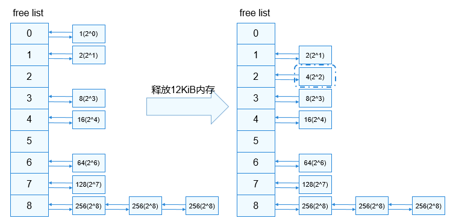

# 物理内存管理


## 基本概念

物理内存是计算机上最重要的资源之一，指的是实际的内存设备提供的、可以通过CPU总线直接进行寻址的内存空间，其主要作用是为操作系统及程序提供临时存储空间。LiteOS-A内核管理物理内存是通过分页实现的，除了内核堆占用的一部分内存外，其余可用内存均以4KiB为单位划分成页帧，内存分配和内存回收便是以页帧为单位进行操作。内核采用伙伴算法管理空闲页面，可以降低一定的内存碎片率，提高内存分配和释放的效率，但是一个很小的块往往也会阻塞一个大块的合并，导致不能分配较大的内存块。


## 运行机制

如下图所示，LiteOS-A内核的物理内存使用分布视图，主要由内核镜像、内核堆及物理页组成。内核堆部分见堆内存管理一节。

  **图1** 物理内存使用分布图

  

伙伴算法把所有空闲页帧分成9个内存块组，每组中内存块包含2的幂次方个页帧，例如：第0组的内存块包含2的0次方个页帧，即1个页帧；第8组的内存块包含2的8次方个页帧，即256个页帧。相同大小的内存块挂在同一个链表上进行管理。

- 申请内存
  系统申请12KiB内存，即3个页帧时，9个内存块组中索引为3的链表挂着一块大小为8个页帧的内存块满足要求，分配出12KiB内存后还剩余20KiB内存，即5个页帧，将5个页帧分成2的幂次方之和，即4跟1，尝试查找伙伴进行合并。4个页帧的内存块没有伙伴则直接插到索引为2的链表上，继续查找1个页帧的内存块是否有伙伴，索引为0的链表上此时有1个，如果两个内存块地址连续则进行合并，并将内存块挂到索引为1的链表上，否则不做处理。

    **图2** 内存申请示意图

    

- 释放内存
  系统释放12KiB内存，即3个页帧，将3个页帧分成2的幂次方之和，即2跟1，尝试查找伙伴进行合并，索引为1的链表上有1个内存块，若地址连续则合并，并将合并后的内存块挂到索引为2的链表上，索引为0的链表上此时也有1个，如果地址连续则进行合并，并将合并后的内存块挂到索引为1的链表上，此时继续判断是否有伙伴，重复上述操作。

    **图3** 内存释放示意图

    


## 开发指导


### 接口说明

  **表1** 物理内存管理模块接口

| 功能分类 | 接口描述 | 
| -------- | -------- |
| 申请物理内存 | -&nbsp;LOS_PhysPageAlloc：申请一个物理页<br/>-&nbsp;LOS_PhysPagesAlloc：申请物理页并挂在对应的链表上<br/>-&nbsp;LOS_PhysPagesAllocContiguous：申请多页地址连续的物理内存 | 
| 释放物理内存 | -&nbsp;LOS_PhysPageFree：释放一个物理页<br/>-&nbsp;LOS_PhysPagesFree：释放挂在链表上的物理页<br/>-&nbsp;LOS_PhysPagesFreeContiguous：释放多页地址连续的物理内存 | 
| 查询地址 | -&nbsp;LOS_VmPageGet：根据物理地址获取其对应的物理页结构体指针<br/>-&nbsp;LOS_PaddrToKVaddr：根据物理地址获取其对应的内核虚拟地址 | 


### 开发流程

内存申请时根据需要调用相关接口，小内存申请建议使用堆内存申请相关接口，4KiB及以上内存申请可以使用上述物理内存相关接口。

>  **说明：**
> - 物理内存申请相关接口需要在OsSysMemInit接口完成初始化之后再使用；
> 
> - 内存申请的基本单位是页帧，即4KiB；
> 
> - 物理内存申请时，有地址连续要求的使用LOS_PhysPagesAllocContiguous接口，无地址连续的要求尽量使用LOS_PhysPagesAlloc接口，将连续的大块内存留给有需要的模块使用。


### 编程实例

编程示例主要是调用申请、释放接口对内存进行操作，包括申请一个页以及多个页的示例。

  
```
#include "los_vm_phys.h"

#define PHYS_PAGE_SIZE 0x4000

// 申请一个页
VOID OsPhysPagesAllocTest3(VOID)
{
    PADDR_T newPaddr;
    VOID *kvaddr = NULL;
    LosVmPage *newPage = NULL;

    newPage = LOS_PhysPageAlloc();
    if (newPage == NULL) {
        printf("LOS_PhysPageAlloc fail\n");
        return;
    }
    printf("LOS_PhysPageAlloc success\n");

    newPaddr = VM_PAGE_TO_PHYS(newPage);
    kvaddr = OsVmPageToVaddr(newPage);

    // Handle the physical memory

    // Free the physical memory
    LOS_PhysPageFree(newPage);
}

// 申请多个页，不要求连续
VOID OsPhysPagesAllocTest2(VOID)
{
    UINT32 sizeCount;
    UINT32 count;
    UINT32 size = PHYS_PAGE_SIZE;
    LosVmPage *vmPageArray[PHYS_PAGE_SIZE >> PAGE_SHIFT] = { NULL };
    UINT32 i = 0;
    LosVmPage *vmPage = NULL;
    PADDR_T pa;

    size = LOS_Align(size, PAGE_SIZE);
    if (size == 0) {
        return;
    }
    sizeCount = size >> PAGE_SHIFT;

    LOS_DL_LIST_HEAD(pageList);

    count = LOS_PhysPagesAlloc(sizeCount, &pageList);
    if (count < sizeCount) {
        printf("failed to allocate enough pages (ask %zu, got %zu)\n", sizeCount, count);
        goto ERROR;
    }
    printf("LOS_PhysPagesAlloc success\n");
    while ((vmPage = LOS_ListRemoveHeadType(&pageList, LosVmPage, node))) {
        pa = vmPage->physAddr;
        vmPageArray[i++] = vmPage;
        // Handle the physical memory
    }

    // Free the physical memory
    for (i = 0; i < sizeCount; ++i) {
        LOS_PhysPageFree(vmPageArray[i]);
    }

    return;

ERROR:
    (VOID)LOS_PhysPagesFree(&pageList);
}

// 申请多个连续页
VOID OsPhysPagesAllocTest1(VOID)
{
    VOID *ptr = NULL;
    LosVmPage *page = NULL;
    UINT32 size = PHYS_PAGE_SIZE;

    ptr = LOS_PhysPagesAllocContiguous(ROUNDUP(size, PAGE_SIZE) >> PAGE_SHIFT);
    if (ptr == NULL) {
        printf("LOS_PhysPagesAllocContiguous fail\n");
        return;
    }

    printf("LOS_PhysPagesAllocContiguous success\n");

    // Handle the physical memory

    // Free the physical memory
    page = OsVmVaddrToPage((VOID *)ptr);
    LOS_PhysPagesFreeContiguous((VOID *)ptr, size >> PAGE_SHIFT);
}

UINT32 ExamplePhyMemCaseEntry(VOID)
{
    OsPhysPagesAllocTest1();
    OsPhysPagesAllocTest2();
    OsPhysPagesAllocTest3();
    return LOS_OK;
}
```


### 结果验证

编译运行得到的结果为：

  
```
LOS_PhysPagesAllocContiguous success
LOS_PhysPagesAlloc success
LOS_PhysPageAlloc success
```
