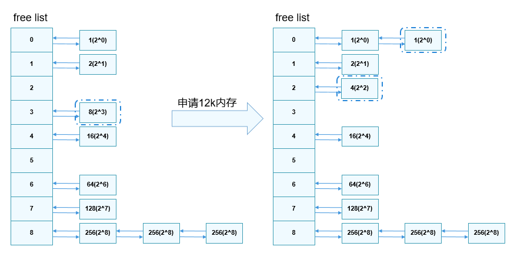
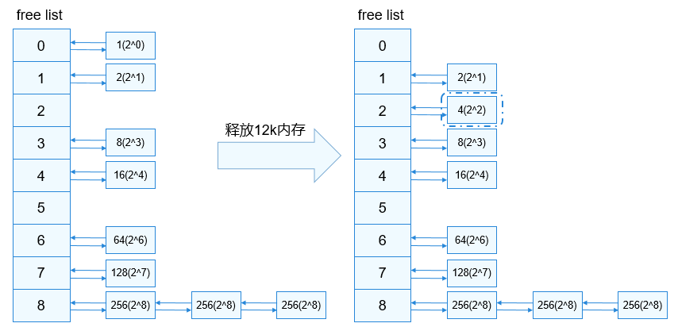

# 物理内存管理<a name="ZH-CN_TOPIC_0000001078575732"></a>

-   [基本概念](#section210891719217)
-   [运行机制](#section111355315213)
-   [开发指导](#section393116496217)
    -   [接口说明](#section13210155619214)
    -   [开发流程](#section178441091231)
    -   [编程实例](#section1258174015319)
    -   [结果验证](#section515091342819)


## 基本概念<a name="section210891719217"></a>

物理内存是计算机上最重要的资源之一，指的是实际的内存设备提供的、可以通过CPU总线直接进行寻址的内存空间，其主要作用是为操作系统及程序提供临时存储空间。LiteOS-A内核管理物理内存是通过分页实现的，除了内核堆占用的一部分内存外，其余可用内存均以4KiB为单位划分成页帧，内存分配和内存回收便是以页帧为单位进行操作。内核采用伙伴算法管理空闲页面，可以降低一定的内存碎片率，提高内存分配和释放的效率，但是一个很小的块往往也会阻塞一个大块的合并，导致不能分配较大的内存块。

## 运行机制<a name="section111355315213"></a>

如下图所示，LiteOS-A内核的物理内存使用分布视图，主要由内核镜像、内核堆及物理页组成。内核堆部分见堆内存管理一节。

**图 1**  物理内存使用分布图<a name="fig3648124205514"></a>  


伙伴算法把所有空闲页帧分成9个内存块组，每组中内存块包含2的幂次方个页帧，例如：第0组的内存块包含2的0次方个页帧，即1个页帧；第8组的内存块包含2的8次方个页帧，即256个页帧。相同大小的内存块挂在同一个链表上进行管理。

-   申请内存

    系统申请12KiB内存，即3个页帧时，9个内存块组中索引为3的链表挂着一块大小为8个页帧的内存块满足要求，分配出12KiB内存后还剩余20KiB内存，即5个页帧，将5个页帧分成2的幂次方之和，即4跟1，尝试查找伙伴进行合并。4个页帧的内存块没有伙伴则直接插到索引为2的链表上，继续查找1个页帧的内存块是否有伙伴，索引为0的链表上此时有1个，如果两个内存块地址连续则进行合并，并将内存块挂到索引为1的链表上，否则不做处理。

    **图 2**  内存申请示意图<a name="fig1319620135615"></a>  
    


-   释放内存

    系统释放12KiB内存，即3个页帧，将3个页帧分成2的幂次方之和，即2跟1，尝试查找伙伴进行合并，索引为1的链表上有1个内存块，若地址连续则合并，并将合并后的内存块挂到索引为2的链表上，索引为0的链表上此时也有1个，如果地址连续则进行合并，并将合并后的内存块挂到索引为1的链表上，此时继续判断是否有伙伴，重复上述操作。

    **图 3**  内存释放示意图<a name="fig44001027165614"></a>  
    


## 开发指导<a name="section393116496217"></a>

### 接口说明<a name="section13210155619214"></a>

**表 1**  物理内存管理模块接口

<a name="table1415203765610"></a>
<table><thead align="left"><tr id="row134151837125611"><th class="cellrowborder" valign="top" width="12.821282128212822%" id="mcps1.2.4.1.1"><p id="p16415637105612"><a name="p16415637105612"></a><a name="p16415637105612"></a>功能分类</p>
</th>
<th class="cellrowborder" valign="top" width="29.832983298329836%" id="mcps1.2.4.1.2"><p id="p11415163718562"><a name="p11415163718562"></a><a name="p11415163718562"></a>接口<strong id="b197068338312"><a name="b197068338312"></a><a name="b197068338312"></a>名称</strong></p>
</th>
<th class="cellrowborder" valign="top" width="57.34573457345735%" id="mcps1.2.4.1.3"><p id="p1641533755612"><a name="p1641533755612"></a><a name="p1641533755612"></a>描述</p>
</th>
</tr>
</thead>
<tbody><tr id="row11567448194112"><td class="cellrowborder" rowspan="3" valign="top" width="12.821282128212822%" headers="mcps1.2.4.1.1 "><p id="p1377313451287"><a name="p1377313451287"></a><a name="p1377313451287"></a>申请物理内存</p>
</td>
<td class="cellrowborder" valign="top" width="29.832983298329836%" headers="mcps1.2.4.1.2 "><p id="p69501257634"><a name="p69501257634"></a><a name="p69501257634"></a>LOS_PhysPageAlloc</p>
</td>
<td class="cellrowborder" valign="top" width="57.34573457345735%" headers="mcps1.2.4.1.3 "><p id="p17950155714310"><a name="p17950155714310"></a><a name="p17950155714310"></a>申请一个物理页</p>
</td>
</tr>
<tr id="row1877155711548"><td class="cellrowborder" valign="top" headers="mcps1.2.4.1.1 "><p id="p687795718546"><a name="p687795718546"></a><a name="p687795718546"></a>LOS_PhysPagesAlloc</p>
</td>
<td class="cellrowborder" valign="top" headers="mcps1.2.4.1.2 "><p id="p11877957115413"><a name="p11877957115413"></a><a name="p11877957115413"></a>申请物理页并挂在对应的链表上</p>
</td>
</tr>
<tr id="row1141513373562"><td class="cellrowborder" valign="top" headers="mcps1.2.4.1.1 "><p id="p1525917111411"><a name="p1525917111411"></a><a name="p1525917111411"></a>LOS_PhysPagesAllocContiguous</p>
</td>
<td class="cellrowborder" valign="top" headers="mcps1.2.4.1.2 "><p id="p72594111245"><a name="p72594111245"></a><a name="p72594111245"></a>申请多页地址连续的物理内存</p>
</td>
</tr>
<tr id="row11129518231"><td class="cellrowborder" rowspan="3" valign="top" width="12.821282128212822%" headers="mcps1.2.4.1.1 "><p id="p329691015710"><a name="p329691015710"></a><a name="p329691015710"></a>释放物理内存</p>
</td>
<td class="cellrowborder" valign="top" width="29.832983298329836%" headers="mcps1.2.4.1.2 "><p id="p836211258313"><a name="p836211258313"></a><a name="p836211258313"></a>LOS_PhysPageFree</p>
</td>
<td class="cellrowborder" valign="top" width="57.34573457345735%" headers="mcps1.2.4.1.3 "><p id="p183626251933"><a name="p183626251933"></a><a name="p183626251933"></a>释放一个物理页</p>
</td>
</tr>
<tr id="row171671014107"><td class="cellrowborder" valign="top" headers="mcps1.2.4.1.1 "><p id="p368411237415"><a name="p368411237415"></a><a name="p368411237415"></a>LOS_PhysPagesFree</p>
</td>
<td class="cellrowborder" valign="top" headers="mcps1.2.4.1.2 "><p id="p12684112320411"><a name="p12684112320411"></a><a name="p12684112320411"></a>释放挂在链表上的物理页</p>
</td>
</tr>
<tr id="row13796135518114"><td class="cellrowborder" valign="top" headers="mcps1.2.4.1.1 "><p id="p379616558114"><a name="p379616558114"></a><a name="p379616558114"></a>LOS_PhysPagesFreeContiguous</p>
</td>
<td class="cellrowborder" valign="top" headers="mcps1.2.4.1.2 "><p id="p1879675510114"><a name="p1879675510114"></a><a name="p1879675510114"></a>释放多页地址连续的物理内存</p>
</td>
</tr>
<tr id="row757517464414"><td class="cellrowborder" rowspan="2" valign="top" width="12.821282128212822%" headers="mcps1.2.4.1.1 "><p id="p128501418185714"><a name="p128501418185714"></a><a name="p128501418185714"></a>查询地址</p>
</td>
<td class="cellrowborder" valign="top" width="29.832983298329836%" headers="mcps1.2.4.1.2 "><p id="p147379529411"><a name="p147379529411"></a><a name="p147379529411"></a>LOS_VmPageGet</p>
</td>
<td class="cellrowborder" valign="top" width="57.34573457345735%" headers="mcps1.2.4.1.3 "><p id="p1573711521144"><a name="p1573711521144"></a><a name="p1573711521144"></a>根据物理地址获取其对应的物理页结构体指针</p>
</td>
</tr>
<tr id="row20508104412412"><td class="cellrowborder" valign="top" headers="mcps1.2.4.1.1 "><p id="p1124573417"><a name="p1124573417"></a><a name="p1124573417"></a>LOS_PaddrToKVaddr</p>
</td>
<td class="cellrowborder" valign="top" headers="mcps1.2.4.1.2 "><p id="p71217579414"><a name="p71217579414"></a><a name="p71217579414"></a>根据物理地址获取其对应的内核虚拟地址</p>
</td>
</tr>
</tbody>
</table>

### 开发流程<a name="section178441091231"></a>

内存申请时根据需要调用相关接口，小内存申请建议使用堆内存申请相关接口，4KiB及以上内存申请可以使用上述物理内存相关接口。

> **说明：** 
>-   物理内存申请相关接口需要在OsSysMemInit接口完成初始化之后再使用；
>-   内存申请的基本单位是页帧，即4KiB；
>-   物理内存申请时，有地址连续要求的使用LOS\_PhysPagesAllocContiguous接口，无地址连续的要求尽量使用LOS\_PhysPagesAlloc接口，将连续的大块内存留给有需要的模块使用。

### 编程实例<a name="section1258174015319"></a>

编程示例主要是调用申请、释放接口对内存进行操作，包括申请一个页以及多个页的示例。

```
#include "los_vm_phys.h"

#define PHYS_PAGE_SIZE 0x4000

// 申请一个页
VOID OsPhysPagesAllocTest3(VOID)
{
    PADDR_T newPaddr;
    VOID *kvaddr = NULL;
    LosVmPage *newPage = NULL;

    newPage = LOS_PhysPageAlloc();
    if (newPage == NULL) {
        printf("LOS_PhysPageAlloc fail\n");
        return;
    }
    printf("LOS_PhysPageAlloc success\n");

    newPaddr = VM_PAGE_TO_PHYS(newPage);
    kvaddr = OsVmPageToVaddr(newPage);

    // Handle the physical memory

    // Free the physical memory
    LOS_PhysPageFree(newPage);
}

// 申请多个页，不要求连续
VOID OsPhysPagesAllocTest2(VOID)
{
    UINT32 sizeCount;
    UINT32 count;
    UINT32 size = PHYS_PAGE_SIZE;
    LosVmPage *vmPageArray[PHYS_PAGE_SIZE >> PAGE_SHIFT] = { NULL };
    UINT32 i = 0;
    LosVmPage *vmPage = NULL;
    PADDR_T pa;

    size = LOS_Align(size, PAGE_SIZE);
    if (size == 0) {
        return;
    }
    sizeCount = size >> PAGE_SHIFT;

    LOS_DL_LIST_HEAD(pageList);

    count = LOS_PhysPagesAlloc(sizeCount, &pageList);
    if (count < sizeCount) {
        printf("failed to allocate enough pages (ask %zu, got %zu)\n", sizeCount, count);
        goto ERROR;
    }
    printf("LOS_PhysPagesAlloc success\n");
    while ((vmPage = LOS_ListRemoveHeadType(&pageList, LosVmPage, node))) {
        pa = vmPage->physAddr;
        vmPageArray[i++] = vmPage;
        // Handle the physical memory
    }

    // Free the physical memory
    for (i = 0; i < sizeCount; ++i) {
        LOS_PhysPageFree(vmPageArray[i]);
    }

    return;

ERROR:
    (VOID)LOS_PhysPagesFree(&pageList);
}

// 申请多个连续页
VOID OsPhysPagesAllocTest1(VOID)
{
    VOID *ptr = NULL;
    LosVmPage *page = NULL;
    UINT32 size = PHYS_PAGE_SIZE;

    ptr = LOS_PhysPagesAllocContiguous(ROUNDUP(size, PAGE_SIZE) >> PAGE_SHIFT);
    if (ptr == NULL) {
        printf("LOS_PhysPagesAllocContiguous fail\n");
        return;
    }

    printf("LOS_PhysPagesAllocContiguous success\n");

    // Handle the physical memory

    // Free the physical memory
    page = OsVmVaddrToPage((VOID *)ptr);
    LOS_PhysPagesFreeContiguous((VOID *)ptr, size >> PAGE_SHIFT);
}

UINT32 ExamplePhyMemCaseEntry(VOID)
{
    OsPhysPagesAllocTest1();
    OsPhysPagesAllocTest2();
    OsPhysPagesAllocTest3();
    return LOS_OK;
}
```

### 结果验证<a name="section515091342819"></a>

编译运行得到的结果为：

```
LOS_PhysPagesAllocContiguous success
LOS_PhysPagesAlloc success
LOS_PhysPageAlloc success
```

