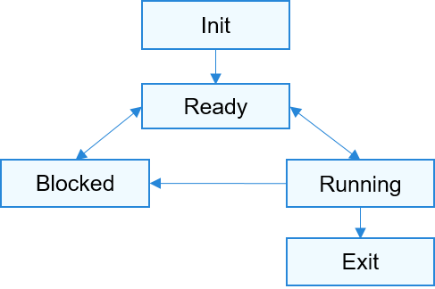

# 任务


## 基本概念

从系统的角度看，任务Task是竞争系统资源的最小运行单元。任务可以使用或等待CPU、使用内存空间等系统资源，并独立于其它任务运行。

OpenHarmony 内核中使用一个任务表示一个线程。

OpenHarmony 内核中同优先级进程内的任务统一调度、运行。

OpenHarmony 内核中的任务采用抢占式调度机制，同时支持时间片轮转调度和FIFO调度方式。

OpenHarmony 内核的任务一共有32个优先级（0-31），最高优先级为0，最低优先级为31。

当前进程内, 高优先级的任务可抢占低优先级任务，低优先级任务必须在高优先级任务阻塞或结束后才能得到调度。

**任务状态说明**：

- 初始化（Init）：任务正在被创建。

- 就绪（Ready）：任务在就绪列表中，等待CPU调度。

- 运行（Running）：任务正在运行。

- 阻塞（Blocked）：任务被阻塞挂起。Blocked状态包括：pending（因为锁、事件、信号量等阻塞）、suspended（主动pend）、delay（延时阻塞）、pendtime（因为锁、事件、信号量时间等超时等待）。

- 退出（Exit）：任务运行结束，等待父任务回收其控制块资源。

  **图1** 任务状态迁移示意图

  

**任务状态迁移说明：**

- Init→Ready：
  任务创建拿到控制块后为初始化阶段（Init状态），当任务初始化完成将任务插入调度队列，此时任务进入就绪状态。

- Ready→Running：
  任务创建后进入就绪态，发生任务切换时，就绪列表中最高优先级的任务被执行，从而进入运行态，此刻该任务从就绪列表中删除。

- Running→Blocked：
  正在运行的任务发生阻塞（挂起、延时、读信号量等）时，任务状态由运行态变成阻塞态，然后发生任务切换，运行就绪列表中剩余最高优先级任务。

- Blocked→Ready ：
  阻塞的任务被恢复后（任务恢复、延时时间超时、读信号量超时或读到信号量等），此时被恢复的任务会被加入就绪列表，从而由阻塞态变成就绪态。

- Ready→Blocked：
  任务也有可能在就绪态时被阻塞（挂起），此时任务状态会由就绪态转变为阻塞态，该任务从就绪列表中删除，不会参与任务调度，直到该任务被恢复。

- Running→Ready：
  有更高优先级任务创建或者恢复后，会发生任务调度，此刻就绪列表中最高优先级任务变为运行态，那么原先运行的任务由运行态变为就绪态，并加入就绪列表中。

- Running→Exit：
  运行中的任务运行结束，任务状态由运行态变为退出态。若为设置了分离属性（ 由头文件 los_task.h 中的宏定义 LOS_TASK_STATUS_DETACHED 设置）的任务，运行结束后将直接销毁。


## 运行机制

OpenHarmony 任务管理模块提供任务创建、任务延时、任务挂起和任务恢复、锁任务调度和解锁任务调度、根据ID查询任务控制块信息功能。

用户创建任务时，系统会将任务栈进行初始化，预置上下文。此外，系统还会将“任务入口函数”地址放在相应位置。这样在任务第一次启动进入运行态时，将会执行任务入口函数。


## 开发指导


### 接口说明

##### 表1 任务的创建和删除

| 接口名             | 接口描述                                                     |
| ------------------ | ------------------------------------------------------------ |
| LOS_TaskCreate     | 创建任务，若所创建任务的优先级比当前的运行的任务优先级高且任务调度没有锁定，<br/>则该任务将被调度进入运行态 |
| LOS_TaskCreateOnly | 创建任务并阻塞，任务恢复前不会将其加入就绪队列中             |
| LOS_TaskDelete     | 删除指定的任务，回收其任务控制块和任务栈所消耗的资源         |

##### 表2 任务的状态控制

| 接口名          | 接口描述                                                     |
| --------------- | ------------------------------------------------------------ |
| LOS_TaskResume  | 恢复挂起的任务                                               |
| LOS_TaskSuspend | 挂起指定的任务，该任务将从就绪任务队列中移除                 |
| LOS_TaskJoin    | 阻塞当前任务，等待指定任务运行结束并回收其资源               |
| LOS_TaskDetach  | 修改任务的 joinable 属性为 detach 属性，detach 属性的任务运行结束会自动回收任务控制块资源 |
| LOS_TaskDelay   | 延迟当前任务的执行，在延后指定的时间（tick数）后可以被调度             |
| LOS_TaskYield   | 将当前任务从具有相同优先级的任务队列，移动到就绪任务队列的末尾 |

##### 表3 任务调度

| 接口名               | 接口描述                                                     |
| -------------------- | ------------------------------------------------------------ |
| LOS_TaskLock         | 锁定任务调度，阻止任务切换                                   |
| LOS_TaskUnlock       | 解锁任务调度。通过该接口可以使任务锁数量减1，若任务多次加锁，那么<br/>任务调度在锁数量减为0时才会完全解锁 |
| LOS_GetTaskScheduler | 获取指定任务的调度策略                                       |
| LOS_SetTaskScheduler | 设置指定任务的调度参数，包括优先级和调度策略                 |
| LOS_Schedule         | 触发主动的任务调度                                           |

##### 表4 任务相关信息获取

| 接口名                   | 接口描述                 |
| ------------------------ | ------------------------ |
| LOS_CurTaskIDGet         | 获取当前任务的ID         |
| LOS_TaskInfoGet          | 获取指定任务的信息       |
| LOS_GetSystemTaskMaximum | 获取系统支持的最大任务数 |

##### 表5 任务优先级

| 接口名            | 接口描述                       |
| ----------------- | ------------------------------ |
| LOS_CurTaskPriSet | 设置当前正在运行的任务的优先级 |
| LOS_TaskPriSet    | 设置指定任务的优先级           |
| LOS_TaskPriGet    | 获取指定任务的优先级           |

##### 表6 任务绑核操作

| 接口名             | 接口描述                                    |
| ------------------ | ------------------------------------------- |
| LOS_TaskCpuAffiSet | 绑定指定任务到指定CPU上运行，仅在多核下使用 |
| LOS_TaskCpuAffiGet | 获取指定任务的绑核信息，仅在多核下使用      |


### 开发流程

任务的典型开发流程：

1. 通过LOS_TaskCreate创建一个任务。
   - 指定任务的执行入口函数
   - 指定任务名
   - 指定任务的栈大小
   - 指定任务的优先级
   - 指定任务的属性，LOS_TASK_ATTR_JOINABLE和LOS_TASK_STATUS_DETACHED属性
   - 多核运行时，可以选择设置任务的绑核属性

2. 任务参与调度运行，执行用户指定的业务代码。

3. 任务执行结束，如果设置了 LOS_TASK_STATUS_DETACHED 属性，则自动回收任务资源，如果任务设置了 LOS_TASK_ATTR_JOINABLE 属性，则需要调用LOS_TaskJoin 回收任务资源，默认为 LOS_TASK_STATUS_DETACHED 属性。

>  **说明：**
> - 内核态具有最高权限，可以操作任意进程内的任务。
>
> - 用户态进程通过系统调用进入内核态后创建的任务属于KProcess, 不属于当前用户态进程。


### 编程实例

代码实现如下（该示例代码的测试函数可以加在 kernel /liteos_a/testsuites /kernel /src /osTest.c  中的 TestTaskEntry 中进行测试。）：


```c
UINT32 g_taskLoID;
UINT32 g_taskHiID;
#define TSK_PRIOR_HI 4
#define TSK_PRIOR_LO 5
UINT32 ExampleTaskHi(VOID)
{
    UINT32 ret;
    PRINTK("Enter TaskHi Handler.\n");
    /* 延时2个Tick，延时后该任务会挂起，执行剩余任务中最高优先级的任务(g_taskLoID任务) */
    ret = LOS_TaskDelay(2);
    if (ret != LOS_OK) {
        PRINTK("Delay Task Failed.\n");
        return LOS_NOK;
    }
    /* 2个Tick时间到了后，该任务恢复，继续执行 */
    PRINTK("TaskHi LOS_TaskDelay Done.\n");
    /* 挂起自身任务 */
    ret = LOS_TaskSuspend(g_taskHiID);
    if (ret != LOS_OK) {
        PRINTK("Suspend TaskHi Failed.\n");
        return LOS_NOK;
    }
    PRINTK("TaskHi LOS_TaskResume Success.\n");
    return LOS_OK;
}

/* 低优先级任务入口函数 */
UINT32 ExampleTaskLo(VOID)
{
    UINT32 ret;
    PRINTK("Enter TaskLo Handler.\n");
    /* 延时2个Tick，延时后该任务会挂起，执行剩余任务中就高优先级的任务(背景任务) */
    ret = LOS_TaskDelay(2);
    if (ret != LOS_OK) {
        PRINTK("Delay TaskLo Failed.\n");
        return LOS_NOK;
    }
    PRINTK("TaskHi LOS_TaskSuspend Success.\n");
    /* 恢复被挂起的任务g_taskHiID */
    ret = LOS_TaskResume(g_taskHiID);
    if (ret != LOS_OK) {
        PRINTK("Resume TaskHi Failed.\n");
        return LOS_NOK;
    }
    PRINTK("TaskHi LOS_TaskDelete Success.\n");
    return LOS_OK;
}
/* 任务测试入口函数，在里面创建优先级不一样的两个任务 */
UINT32 ExampleTaskCaseEntry(VOID)
{
    UINT32 ret;
    TSK_INIT_PARAM_S initParam = {0};

    /* 锁任务调度 */
    LOS_TaskLock();
    PRINTK("LOS_TaskLock() Success!\n");
    /* 高优先级任务的初始化参数，其资源回收需要其他任务调用 LOS_TaskJoin */
    initParam.pfnTaskEntry = (TSK_ENTRY_FUNC)ExampleTaskHi;
    initParam.usTaskPrio = TSK_PRIOR_HI;
    initParam.pcName = "HIGH_NAME";
    initParam.uwStackSize = LOS_TASK_MIN_STACK_SIZE;
    initParam.uwResved   = LOS_TASK_ATTR_JOINABLE;

    /* 创建高优先级任务，由于锁任务调度，任务创建成功后不会马上执行 */
    ret = LOS_TaskCreate(&g_taskHiID, &initParam);
    if (ret != LOS_OK) {
        LOS_TaskUnlock();
        PRINTK("ExampleTaskHi create Failed! ret=%d\n", ret);
        return LOS_NOK;
    }
    PRINTK("ExampleTaskHi create Success!\n");

    /* 低优先级任务的初始化参数，任务结束后会自行结束销毁 */
    initParam.pfnTaskEntry = (TSK_ENTRY_FUNC)ExampleTaskLo;
    initParam.usTaskPrio = TSK_PRIOR_LO;
    initParam.pcName = "LOW_NAME";
    initParam.uwStackSize = LOS_TASK_MIN_STACK_SIZE;
    initParam.uwResved   = LOS_TASK_STATUS_DETACHED;

    /* 创建低优先级任务，由于锁任务调度，任务创建成功后不会马上执行 */
    ret = LOS_TaskCreate(&g_taskLoID, &initParam);
    if (ret!= LOS_OK) {
        LOS_TaskUnlock();
        PRINTK("ExampleTaskLo create Failed!\n");
        return LOS_NOK;
    }
    PRINTK("ExampleTaskLo create Success!\n");

    /* 解锁任务调度，此时会发生任务调度，执行就绪列表中最高优先级任务 */
    LOS_TaskUnlock();
    ret = LOS_TaskJoin(g_taskHiID, NULL);
    if (ret != LOS_OK) {
        PRINTK("Join ExampleTaskHi Failed!\n");
    } else {
        PRINTK("Join ExampleTaskHi Success!\n");
    }
    while(1){};
    return LOS_OK;
}
```

编译运行得到的结果为：


```
LOS_TaskLock() Success!
ExampleTaskHi create Success!
ExampleTaskLo create Success!
Enter TaskHi Handler.
Enter TaskLo Handler.
TaskHi LOS_TaskDelay Done.
TaskHi LOS_TaskSuspend Success.
TaskHi LOS_TaskResume Success.
TaskHi LOS_TaskDelete Success.
Join ExampleTaskHi Success!
```
