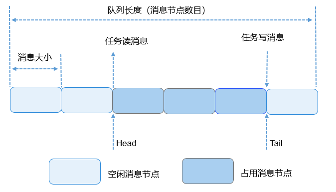

# 消息队列<a name="ZH-CN_TOPIC_0000001078912736"></a>

-   [基本概念](#section81171363232)
-   [运行机制](#section1074515132316)
    -   [队列控制块](#section194431851201315)
    -   [队列运作原理](#section89875741418)

-   [开发指导](#section827981242419)
    -   [接口说明](#section19327151642413)
    -   [开发流程](#section1390154210243)

-   [编程实例](#section27132341285)
    -   [实例描述](#section197311443141017)
    -   [编程示例](#section972214490107)
    -   [结果验证](#section19287165416106)


## 基本概念<a name="section81171363232"></a>

队列又称消息队列，是一种常用于任务间通信的数据结构。队列接收来自任务或中断的不固定长度消息，并根据不同的接口确定传递的消息是否存放在队列空间中。

任务能够从队列里面读取消息，当队列中的消息为空时，挂起读取任务；当队列中有新消息时，挂起的读取任务被唤醒并处理新消息。任务也能够往队列里写入消息，当队列已经写满消息时，挂起写入任务；当队列中有空闲消息节点时，挂起的写入任务被唤醒并写入消息。

可以通过调整读队列和写队列的超时时间来调整读写接口的阻塞模式，如果将读队列和写队列的超时时间设置为0，就不会挂起任务，接口会直接返回，这就是非阻塞模式。反之，如果将都队列和写队列的超时时间设置为大于0的时间，就会以阻塞模式运行。

消息队列提供了异步处理机制，允许将一个消息放入队列，但不立即处理。同时队列还有缓冲消息的作用，可以使用队列实现任务异步通信，队列具有如下特性：

-   消息以先进先出的方式排队，支持异步读写。
-   读队列和写队列都支持超时机制。
-   每读取一条消息，就会将该消息节点设置为空闲。
-   发送消息类型由通信双方约定，可以允许不同长度（不超过队列的消息节点大小）的消息。
-   一个任务能够从任意一个消息队列接收和发送消息。
-   多个任务能够从同一个消息队列接收和发送消息。
-   创建队列时所需的队列空间，接口内系统自行动态申请内存。

## 运行机制<a name="section1074515132316"></a>

### 队列控制块<a name="section194431851201315"></a>

```
/**
  * 队列控制块数据结构
  */
typedef struct {
    UINT8 *queueHandle; /**< Pointer to a queue handle */
    UINT16 queueState;  /**< Queue state */
    UINT16 queueLen;    /**< Queue length */
    UINT16 queueSize;   /**< Node size */
    UINT32 queueID;     /**< queueID */
    UINT16 queueHead;   /**< Node head */
    UINT16 queueTail;   /**< Node tail */
    UINT16 readWriteableCnt[OS_QUEUE_N_RW];   /**< Count of readable or writable resources, 0:readable, 1:writable */
    LOS_DL_LIST readWriteList[OS_QUEUE_N_RW]; /**< the linked list to be read or written, 0:readlist, 1:writelist */
    LOS_DL_LIST memList;                      /**< Pointer to the memory linked list */
} LosQueueCB;
```

每个队列控制块中都含有队列状态，表示该队列的使用情况：

-   OS\_QUEUE\_UNUSED：队列未被使用。
-   OS\_QUEUE\_INUSED：队列被使用中。

### 队列运作原理<a name="section89875741418"></a>

-   创建队列时，创建队列成功会返回队列ID。
-   在队列控制块中维护着一个消息头节点位置Head和一个消息尾节点位置Tail，用于表示当前队列中消息的存储情况。Head表示队列中被占用的消息节点的起始位置。Tail表示被占用的消息节点的结束位置，也是空闲消息节点的起始位置。队列刚创建时，Head和Tail均指向队列起始位置。
-   写队列时，根据readWriteableCnt\[1\]判断队列是否可以写入，不能对已满（readWriteableCnt\[1\]为0）队列进行写操作。写队列支持两种写入方式：向队列尾节点写入，也可以向队列头节点写入。尾节点写入时，根据Tail找到起始空闲消息节点作为数据写入对象，如果Tail已经指向队列尾部则采用回卷方式。头节点写入时，将Head的前一个节点作为数据写入对象，如果Head指向队列起始位置则采用回卷方式。
-   读队列时，根据readWriteableCnt\[0\]判断队列是否有消息需要读取，对全部空闲（readWriteableCnt\[0\]为0）队列进行读操作会引起任务挂起。如果队列可以读取消息，则根据Head找到最先写入队列的消息节点进行读取。如果Head已经指向队列尾部则采用回卷方式。
-   删除队列时，根据队列ID找到对应队列，把队列状态置为未使用，把队列控制块置为初始状态，并释放队列所占内存。

图 1 队列读写数据操作示意图



上图对读写队列做了示意，图中只画了尾节点写入方式，没有画头节点写入，但是两者是类似的。

## 开发指导<a name="section827981242419"></a>

### 接口说明<a name="section19327151642413"></a>

<a name="table10903105695114"></a>
<table><thead align="left"><tr id="row1293645645110"><th class="cellrowborder" valign="top" width="23.56%" id="mcps1.1.4.1.1"><p id="p59361562512"><a name="p59361562512"></a><a name="p59361562512"></a>功能分类</p>
</th>
<th class="cellrowborder" valign="top" width="24.29%" id="mcps1.1.4.1.2"><p id="p1393665645118"><a name="p1393665645118"></a><a name="p1393665645118"></a>接口<strong id="b197068338312"><a name="b197068338312"></a><a name="b197068338312"></a>名称</strong></p>
</th>
<th class="cellrowborder" valign="top" width="52.15%" id="mcps1.1.4.1.3"><p id="p119363564516"><a name="p119363564516"></a><a name="p119363564516"></a>描述</p>
</th>
</tr>
</thead>
<tbody><tr id="row1693665613516"><td class="cellrowborder" rowspan="2" valign="top" width="23.56%" headers="mcps1.1.4.1.1 "><p id="p193675615514"><a name="p193675615514"></a><a name="p193675615514"></a>创建/删除消息队列</p>
</td>
<td class="cellrowborder" valign="top" width="24.29%" headers="mcps1.1.4.1.2 "><p id="p11936115612514"><a name="p11936115612514"></a><a name="p11936115612514"></a>LOS_QueueCreate</p>
</td>
<td class="cellrowborder" valign="top" width="52.15%" headers="mcps1.1.4.1.3 "><p id="p1593620562517"><a name="p1593620562517"></a><a name="p1593620562517"></a>创建一个消息队列，由系统动态申请队列空间</p>
</td>
</tr>
<tr id="row79361156175113"><td class="cellrowborder" valign="top" headers="mcps1.1.4.1.1 "><p id="p893615567517"><a name="p893615567517"></a><a name="p893615567517"></a>LOS_QueueDelete</p>
</td>
<td class="cellrowborder" valign="top" headers="mcps1.1.4.1.2 "><p id="p4936155695111"><a name="p4936155695111"></a><a name="p4936155695111"></a>根据队列ID删除一个指定队列</p>
</td>
</tr>
<tr id="row093614566519"><td class="cellrowborder" rowspan="3" valign="top" width="23.56%" headers="mcps1.1.4.1.1 "><p id="p1593685614513"><a name="p1593685614513"></a><a name="p1593685614513"></a>读/写队列（不带拷贝）</p>
</td>
<td class="cellrowborder" valign="top" width="24.29%" headers="mcps1.1.4.1.2 "><p id="p6936556155118"><a name="p6936556155118"></a><a name="p6936556155118"></a>LOS_QueueRead</p>
</td>
<td class="cellrowborder" valign="top" width="52.15%" headers="mcps1.1.4.1.3 "><p id="p11936556155118"><a name="p11936556155118"></a><a name="p11936556155118"></a>读取指定队列头节点中的数据（队列节点中的数据实际上是一个地址）</p>
</td>
</tr>
<tr id="row199369565518"><td class="cellrowborder" valign="top" headers="mcps1.1.4.1.1 "><p id="p393655620513"><a name="p393655620513"></a><a name="p393655620513"></a>LOS_QueueWrite</p>
</td>
<td class="cellrowborder" valign="top" headers="mcps1.1.4.1.2 "><p id="p12936256175120"><a name="p12936256175120"></a><a name="p12936256175120"></a>向指定队列尾节点中写入入参bufferAddr的值（即buffer的地址）</p>
</td>
</tr>
<tr id="row1293615635114"><td class="cellrowborder" valign="top" headers="mcps1.1.4.1.1 "><p id="p893625665119"><a name="p893625665119"></a><a name="p893625665119"></a>LOS_QueueWriteHead</p>
</td>
<td class="cellrowborder" valign="top" headers="mcps1.1.4.1.2 "><p id="p193620566515"><a name="p193620566515"></a><a name="p193620566515"></a>向指定队列头节点中写入入参bufferAddr的值（即buffer的地址）</p>
</td>
</tr>
<tr id="row593675635117"><td class="cellrowborder" rowspan="3" valign="top" width="23.56%" headers="mcps1.1.4.1.1 "><p id="p293675615111"><a name="p293675615111"></a><a name="p293675615111"></a>读/写队列（带拷贝）</p>
</td>
<td class="cellrowborder" valign="top" width="24.29%" headers="mcps1.1.4.1.2 "><p id="p14936356155113"><a name="p14936356155113"></a><a name="p14936356155113"></a>LOS_QueueReadCopy</p>
</td>
<td class="cellrowborder" valign="top" width="52.15%" headers="mcps1.1.4.1.3 "><p id="p11936155616510"><a name="p11936155616510"></a><a name="p11936155616510"></a>读取指定队列头节点中的数据</p>
</td>
</tr>
<tr id="row093619569510"><td class="cellrowborder" valign="top" headers="mcps1.1.4.1.1 "><p id="p179361256175117"><a name="p179361256175117"></a><a name="p179361256175117"></a>LOS_QueueWriteCopy</p>
</td>
<td class="cellrowborder" valign="top" headers="mcps1.1.4.1.2 "><p id="p6936155616515"><a name="p6936155616515"></a><a name="p6936155616515"></a>向指定队列尾节点中写入入参bufferAddr中保存的数据</p>
</td>
</tr>
<tr id="row16936856185111"><td class="cellrowborder" valign="top" headers="mcps1.1.4.1.1 "><p id="p49361156195113"><a name="p49361156195113"></a><a name="p49361156195113"></a>LOS_QueueWriteHeadCopy</p>
</td>
<td class="cellrowborder" valign="top" headers="mcps1.1.4.1.2 "><p id="p1193625675116"><a name="p1193625675116"></a><a name="p1193625675116"></a>向指定队列头节点中<em id="i1183903561620"><a name="i1183903561620"></a><a name="i1183903561620"></a>写入入参</em>bufferAddr中保存的数据</p>
</td>
</tr>
<tr id="row1936756155114"><td class="cellrowborder" valign="top" width="23.56%" headers="mcps1.1.4.1.1 "><p id="p149371956105114"><a name="p149371956105114"></a><a name="p149371956105114"></a>获取队列信息</p>
</td>
<td class="cellrowborder" valign="top" width="24.29%" headers="mcps1.1.4.1.2 "><p id="p7937145613516"><a name="p7937145613516"></a><a name="p7937145613516"></a>LOS_QueueInfoGet</p>
</td>
<td class="cellrowborder" valign="top" width="52.15%" headers="mcps1.1.4.1.3 "><p id="p19371356175110"><a name="p19371356175110"></a><a name="p19371356175110"></a>获取指定队列的信息，包括队列ID、队列长度、消息节点大小、头节点、尾节点、可读节点数量、可写节点数量、等待读操作的任务、等待写操作的任务</p>
</td>
</tr>
</tbody>
</table>

### 开发流程<a name="section1390154210243"></a>

1.  用LOS\_QueueCreate创建队列。创建成功后，可以得到队列ID。
2.  通过LOS\_QueueWrite或者LOS\_QueueWriteCopy写队列。
3.  通过LOS\_QueueRead或者LOS\_QueueReadCopy读队列。
4.  通过LOS\_QueueInfoGet获取队列信息。
5.  通过LOS\_QueueDelete删除队列。

> **说明：** 
>-   系统支持的最大队列数是指：整个系统的队列资源总个数，而非用户能使用的个数。例如：系统软件定时器多占用一个队列资源，那么用户能使用的队列资源就会减少一个。
>-   创建队列时传入的队列名和flags暂时未使用，作为以后的预留参数。
>-   队列接口函数中的入参timeOut是相对时间。
>-   LOS\_QueueReadCopy和LOS\_QueueWriteCopy及LOS\_QueueWriteHeadCopy是一组接口，LOS\_QueueRead和LOS\_QueueWrite及LOS\_QueueWriteHead是一组接口，每组接口需要配套使用。
>-   鉴于LOS\_QueueWrite和LOS\_QueueWriteHead和LOS\_QueueRead这组接口实际操作的是数据地址，用户必须保证调用LOS\_QueueRead获取到的指针所指向的内存区域在读队列期间没有被异常修改或释放，否则可能导致不可预知的后果。
>-   鉴于LOS\_QueueWrite和LOS\_QueueWriteHead和LOS\_QueueRead这组接口实际操作的是数据地址，也就意味着实际写和读的消息长度仅仅是一个指针数据，因此用户使用这组接口之前，需确保创建队列时的消息节点大小，为一个指针的长度，避免不必要的浪费和读取失败。

## 编程实例<a name="section27132341285"></a>

### 实例描述<a name="section197311443141017"></a>

创建一个队列，两个任务。任务1调用写队列接口发送消息，任务2通过读队列接口接收消息。

1.  通过LOS\_TaskCreate创建任务1和任务2。
2.  通过LOS\_QueueCreate创建一个消息队列。
3.  在任务1 SendEntry中发送消息。
4.  在任务2 RecvEntry中接收消息。
5.  通过LOS\_QueueDelete删除队列。

### 编程示例<a name="section972214490107"></a>

示例代码如下：

```
#include "los_task.h"
#include "los_queue.h"
static UINT32 g_queue;
#define BUFFER_LEN 50

VOID SendEntry(VOID)
{
    UINT32 ret = 0;
    CHAR abuf[] = "test message";
    UINT32 len = sizeof(abuf);

    ret = LOS_QueueWriteCopy(g_queue, abuf, len, 0);
    if(ret != LOS_OK) {
        printf("send message failure, error: %x\n", ret);
    }
}

VOID RecvEntry(VOID)
{
    UINT32 ret = 0;
    CHAR readBuf[BUFFER_LEN] = {0};
    UINT32 readLen = BUFFER_LEN;

    //休眠1s
    usleep(1000000);
    ret = LOS_QueueReadCopy(g_queue, readBuf, &readLen, 0);
    if(ret != LOS_OK) {
        printf("recv message failure, error: %x\n", ret);
    }

    printf("recv message: %s\n", readBuf);

    ret = LOS_QueueDelete(g_queue);
    if(ret != LOS_OK) {
        printf("delete the queue failure, error: %x\n", ret);
    }

    printf("delete the queue success!\n");
}

UINT32 ExampleQueue(VOID)
{
    printf("start queue example\n");
    UINT32 ret = 0;
    UINT32 task1, task2;
    TSK_INIT_PARAM_S initParam = {0};

    initParam.pfnTaskEntry = (TSK_ENTRY_FUNC)SendEntry;
    initParam.usTaskPrio = 9;
    initParam.uwStackSize = LOSCFG_BASE_CORE_TSK_DEFAULT_STACK_SIZE;
    initParam.pcName = "SendQueue";

    LOS_TaskLock();
    ret = LOS_TaskCreate(&task1, &initParam);
    if(ret != LOS_OK) {
        printf("create task1 failed, error: %x\n", ret);
        return ret;
    }

    initParam.pcName = "RecvQueue";
    initParam.pfnTaskEntry = (TSK_ENTRY_FUNC)RecvEntry;
    ret = LOS_TaskCreate(&task2, &initParam);
    if(ret != LOS_OK) {
        printf("create task2 failed, error: %x\n", ret);
        return ret;
    }

    ret = LOS_QueueCreate("queue", 5, &g_queue, 0, 50);
    if(ret != LOS_OK) {
        printf("create queue failure, error: %x\n", ret);
    }

    printf("create the queue success!\n");
    LOS_TaskUnlock();
    return ret;
}
```

### 结果验证<a name="section19287165416106"></a>

编译运行得到的结果为：

```
start test example
create the queue success!
recv message: test message
delete the queue success!
```

