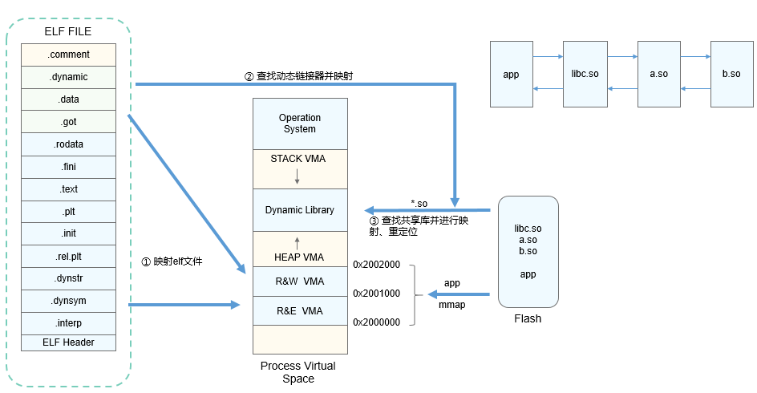
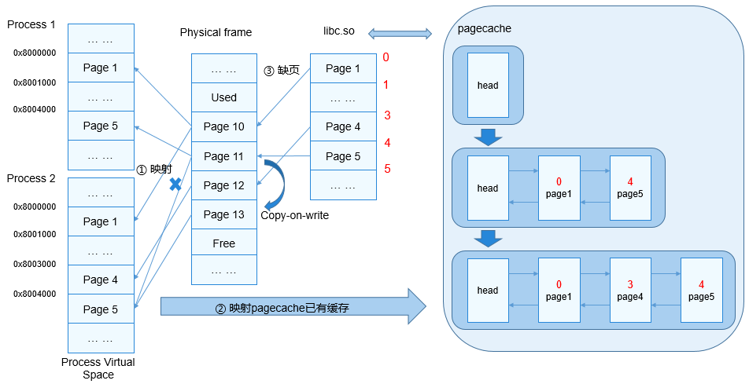

# 动态加载与链接

## 基本概念

OpenHarmony系统的动态加载与链接机制主要是由内核加载器以及动态链接器构成，内核加载器用于加载应用程序以及动态链接器，动态链接器用于加载应用程序所依赖的共享库，并对应用程序和共享库进行符号重定位。与静态链接相比，动态链接是将应用程序与动态库推迟到运行时再进行链接的一种机制。

**动态链接的优势：**

1. 多个应用程序可以共享一份代码，最小加载单元为页，相对静态链接可以节约磁盘和内存空间。

2. 共享库升级时，理论上将旧版本的共享库覆盖即可（共享库中的接口向下兼容），无需重新链接。

3. 加载地址可以进行随机化处理，防止攻击，保证安全性。

## 运行机制

  **图1** **动态加载流程**
  
  

1. 内核将应用程序ELF文件的PT_LOAD段信息映射至进程空间。对于ET_EXEC类型的文件，根据PT_LOAD段中p_vaddr进行固定地址映射；对于ET_DYN类型（位置无关的可执行程序，通过编译选项“-fPIE”得到）的文件，内核通过mmap接口选择base基址进行映射（load_addr = base + p_vaddr）。

2. 若应用程序是静态链接的（静态链接不支持编译选项“-fPIE”），设置堆栈信息后跳转至应用程序ELF文件中e_entry指定的地址并运行；若程序是动态链接的，应用程序ELF文件中会有PT_INTERP段，保存动态链接器的路径信息（ET_DYN类型）。musl的动态链接器是libc-musl.so的一部分，libc-musl.so的入口即动态链接器的入口。内核通过mmap接口选择base基址进行映射，设置堆栈信息后跳转至base + e_entry（该e_entry为动态链接器的入口）地址并运行动态链接器。

3. 动态链接器自举并查找应用程序依赖的所有共享库并对导入符号进行重定位，最后跳转至应用程序的e_entry（或base + e_entry），开始运行应用程序。

  **图2** **程序执行流程**
  
  

1. 加载器与链接器调用mmap映射PT_LOAD段。

2. 内核调用map_pages接口查找并映射pagecache已有的缓存。

3. 程序执行时，虚拟内存区间若无具体的物理内存做映射，系统将触发缺页中断，将elf文件内容读入物理内存，并将该内存块加入pagecache。

4. 将已读入文件内容的物理内存与虚拟地址区间做映射。

5. 程序继续执行。

## 开发指导

### 接口说明

  **表1** 内核加载器模块接口

| 功能分类   | 接口**名称**     | 描述                             |
| ---------- | ---------------- | -------------------------------- |
| 模块初始化 | LOS_DoExecveFile | 根据输入的参数执行指定的用户程序 |

### 开发流程

LOS_DoExecveFile接口一般由用户通过exec家族函数利用系统调用机制创建新的进程，内核不能直接调用该接口启动新进程。