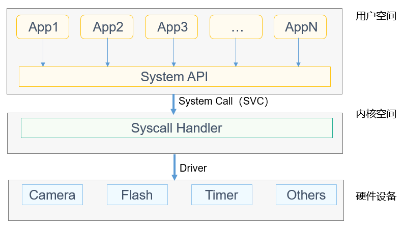

# 系统调用


## 基本概念

OpenHarmony LiteOS-A实现了用户态与内核态的区分隔离，用户态程序不能直接访问内核资源，而系统调用则为用户态程序提供了一种访问内核资源、与内核进行交互的通道。


## 运行机制

  如图1所示，用户程序通过调用System API（系统API，通常是系统提供的POSIX接口）进行内核资源访问与交互请求，POSIX接口内部会触发SVC/SWI异常，完成系统从用户态到内核态的切换，然后对接到内核的Syscall Handler（系统调用统一处理接口）进行参数解析，最终分发至具体的内核处理函数。
  
  **图1** 系统调用示意图

  
Syscall Handler的具体实现在kernel/liteos_a/syscall/los_syscall.c中OsArmA32SyscallHandle函数，在进入系统软中断异常时会调用此函数，并且按照kernel/liteos_a/syscall/syscall_lookup.h中的清单进行系统调用的入参解析，执行各系统调用最终对应的内核处理函数。

>  **说明：**
> - 系统调用提供基础的用户态程序与内核的交互功能，不建议开发者直接使用系统调用接口，推荐使用内核提供的对外POSIX接口，若需要新增系统调用接口，详见开发指导。
> 
> - 内核向用户态提供的系统调用接口清单详见kernel/liteos_a/syscall/syscall_lookup.h，内核相应的系统调用对接函数清单详见kernel/liteos_a/syscall/los_syscall.h。


## 开发指导


### 开发流程

新增系统调用的典型开发流程如下：

1. 在LibC库中确定并添加新增的系统调用号。

2. 在LibC库中新增用户态的函数接口声明及实现。

3. 在内核系统调用头文件中确定并添加新增的系统调用号及对应内核处理函数的声明。

4. 在内核中新增该系统调用对应的内核处理函数。


### 编程实例

**示例代码**：

1. 在LibC库syscall.h.in中新增系统调用号
     如下所示，其中__NR_new_syscall_sample为新增系统调用号：
     
   ```
   ...
   /* 当前现有的系统调用清单 */
   /* OHOS customized syscalls, not compatible with ARM EABI */
   #define __NR_OHOS_BEGIN         500
   #define __NR_pthread_set_detach (__NR_OHOS_BEGIN + 0)
   #define __NR_pthread_join       (__NR_OHOS_BEGIN + 1)
   #define __NR_pthread_deatch     (__NR_OHOS_BEGIN + 2)
   #define __NR_create_user_thread  (__NR_OHOS_BEGIN + 3)
   #define __NR_processcreate       (__NR_OHOS_BEGIN + 4)
   #define __NR_processtart        (__NR_OHOS_BEGIN + 5)
   #define __NR_printf             (__NR_OHOS_BEGIN + 6)
   #define __NR_dumpmemory         (__NR_OHOS_BEGIN + 13)
   #define __NR_mkfifo             (__NR_OHOS_BEGIN + 14)
   #define __NR_mqclose            (__NR_OHOS_BEGIN + 15)
   #define __NR_realpath           (__NR_OHOS_BEGIN + 16)
   #define __NR_format             (__NR_OHOS_BEGIN + 17)
   #define __NR_shellexec          (__NR_OHOS_BEGIN + 18)
   #define __NR_ohoscapget         (__NR_OHOS_BEGIN + 19)
   #define __NR_ohoscapset         (__NR_OHOS_BEGIN + 20)
   
   #define __NR_new_syscall_sample (__NR_OHOS_BEGIN + 21) /* 新增的系统调用号 __NR_new_syscall_sample:521 */
   
   #define __NR_syscallend         (__NR_OHOS_BEGIN + 22)
   ...
   ```

2. 在LibC库中新增用户态接口的声明与实现
     
   ```
   #include "stdio_impl.h"
   #include "syscall.h"
   ...
   /* 新增系统调用用户态的接口实现 */
   void newSyscallSample(int num)
   {
        printf("user mode: num = %d\n", num);
        __syscall(SYS_new_syscall_sample, num);
        return;
   }
   ```

3. 在内核系统调用头文件中新增系统调用号
   如下所示，在third_party/musl/porting/liteos_a/kernel/include/bits/syscall.h文件中，__NR_new_syscall_sample为新增系统调用号。

     
   ```
   ...
   /* 当前现有的系统调用清单 */
   /* OHOS customized syscalls, not compatible with ARM EABI */
   #define __NR_OHOS_BEGIN         500
   #define __NR_pthread_set_detach (__NR_OHOS_BEGIN + 0)
   #define __NR_pthread_join       (__NR_OHOS_BEGIN + 1)
   #define __NR_pthread_deatch     (__NR_OHOS_BEGIN + 2)
   #define __NR_create_user_thread  (__NR_OHOS_BEGIN + 3)
   #define __NR_processcreate       (__NR_OHOS_BEGIN + 4)
   #define __NR_processtart        (__NR_OHOS_BEGIN + 5)
   #define __NR_printf             (__NR_OHOS_BEGIN + 6)
   #define __NR_dumpmemory         (__NR_OHOS_BEGIN + 13)
   #define __NR_mkfifo             (__NR_OHOS_BEGIN + 14)
   #define __NR_mqclose            (__NR_OHOS_BEGIN + 15)
   #define __NR_realpath           (__NR_OHOS_BEGIN + 16)
   #define __NR_format             (__NR_OHOS_BEGIN + 17)
   #define __NR_shellexec          (__NR_OHOS_BEGIN + 18)
   #define __NR_ohoscapget         (__NR_OHOS_BEGIN + 19)
   #define __NR_ohoscapset         (__NR_OHOS_BEGIN + 20)
   
   #define __NR_new_syscall_sample (__NR_OHOS_BEGIN + 21) /* 新增的系统调用号 __NR_new_syscall_sample:521 */
   
   #define __NR_syscallend         (__NR_OHOS_BEGIN + 22)
   ...
   ```

   在kernel/liteos_a/syscall/syscall_lookup.h中，增加一行SYSCALL_HAND_DEF(__NR_new_syscall_sample, SysNewSyscallSample, void, ARG_NUM_1)：

     
   ```
   ...
   /* 当前现有的系统调用清单 */
   SYSCALL_HAND_DEF(__NR_chown, SysChown, int, ARG_NUM_3)
   SYSCALL_HAND_DEF(__NR_chown32, SysChown, int, ARG_NUM_3)
   #ifdef LOSCFG_SECURITY_CAPABILITY
   SYSCALL_HAND_DEF(__NR_ohoscapget, SysCapGet, UINT32, ARG_NUM_2)
   SYSCALL_HAND_DEF(__NR_ohoscapset, SysCapSet, UINT32, ARG_NUM_1)
   #endif
   /* 新增系统调用 */
   SYSCALL_HAND_DEF(__NR_new_syscall_sample, SysNewSyscallSample, void, ARG_NUM_1)
   ...
   ```

4. 在内核中新增内核该系统调用对应的处理函数
   如下所示，在kernel/liteos_a/syscall/los_syscall.h中，SysNewSyscallSample为新增系统调用的内核处理函数声明：

     
   ```
   ...
   /* 当前现有的系统调用内核处理函数声明清单 */
   extern int SysClockSettime64(clockid_t clockID, const struct timespec64 *tp);
   extern int SysClockGettime64(clockid_t clockID, struct timespec64 *tp);
   extern int SysClockGetres64(clockid_t clockID, struct timespec64 *tp);
   extern int SysClockNanoSleep64(clockid_t clk, int flags, const struct timespec64 *req, struct timespec64 *rem);
   extern int SysTimerGettime64(timer_t timerID, struct itimerspec64 *value);
   extern int SysTimerSettime64(timer_t timerID, int flags, const struct itimerspec64 *value, struct itimerspec64 *oldValue);
   /* 新增的系统调用内核处理函数声明 */
   extern void SysNewSyscallSample(int num);
   ...
   ```

     新增的系统调用的内核处理函数实现如下：
     
   ```
   include "los_printf.h"
   ...
   /* 新增系统调用内核处理函数的实现 */
   void SysNewSyscallSample(int num)
   {
       PRINTK("kernel mode: num = %d\n", num);
       return;
   }
   ```


**结果验证：**


用户态程序调用newSyscallSample(10)接口，得到输出结果如下：


  
```
/* 用户态接口与内核态接口均有输出，证明系统调用已使能 */
user mode: num = 10
kernel mode: num = 10
```
