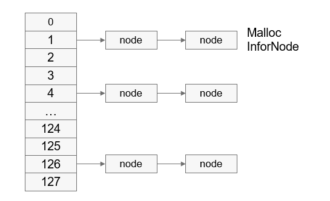

# 运行机制

-   [内存泄漏检查](#section142061581018)
-   [堆内存统计](#section136902041337)
-   [内存完整性检查](#section196491231761)

## 内存泄漏检查

对于每个进程，内存调测模块维护了128个链表（当前系统的线程最大数量为128个），每个链表的索引为线程ID。

申请内存时：保存关键信息到内存节点控制块，根据当前线程ID将内存节点控制块挂到对应链表；

释放内存时：根据需要释放的内存地址匹配内存节点控制块并将该控制块删除。

**图 1**  堆内存节点信息链表  

申请内存时，返回地址会被保存到LR寄存器中。进程运行过程中，系统会在内存节点控制块中添加疑似泄漏点对应的lr等信息。如下图所示：

**图 2**  堆内存节点信息  

其中，TID表示线程ID；PID表示进程ID；ptr表示申请的内存地址；size表示申请的内存大小；lr\[n\]表示函数调用栈地址，变量n可以根据具体场景的需要进行配置。

释放内存时，将free等接口的入参指针与node的ptr字段进行匹配，如果相同则删除该内存节点控制块信息。

用户通过串口或文件等方式，将各个进程内存调测信息导出，利用addr2line工具将导出的信息转换成导致内存泄漏的代码行，便可以解决内存泄露问题。

**图 3**  泄漏点代码行定位流程  

## 堆内存统计

用户态线程堆内存使用统计具有一定的实际意义，统计线程申请的堆内存占比，为用户程序的内存使用优化提供数据支持。用户态堆内存统计模块主要涉及的接口为malloc和free。如[图1](#fig4294145810543)，每个进程维护128个链表，链表索引即线程ID，申请内存时系统将ptr和size信息记录在内存节点控制块中并将节点控制块挂在以线程ID为头信息的链表上，堆内存释放时根据ptr从对应的链表上移除相应的堆内存块信息；同时计算出当前线程所持有的堆内存总的使用量，并更新当前进程的堆内存使用量和堆内存使用峰值。

## 内存完整性检查

-   使用malloc申请内存（小于等于0x1c000bytes时通过堆分配算法分配）

    用户程序申请堆内存时，在堆内存节点处添加校验值等信息，如果校验值异常，则很有可能是前一块堆内存使用越界导致的（目前无法识别校验值被野指针破坏的场景）。在内存申请、释放时校验内存节点校验值的正确性，若内存节点被破坏，校验失败时则输出tid、pid及当前被踩节点前一块堆内存申请时保存的调用栈信息，通过addr2line工具可获得具体的代码行信息，辅助用户解决问题。

    **图 4**  node节点头信息添加校验值  
    

    free堆内存时，不会立即把该内存块释放掉，而是在内存中写入魔术数字0xFE，并放到free队列中\(保证在一定时间内不会再被malloc函数分配\)，当有野指针或use-after-free的情况对该内存进行读取的操作时，能够发现数据异常，但是对于写操作则无法判断出来。

    **图 5**  free流程图  
    

-   使用malloc申请内存（大于0x1c000bytes时通过mmap申请）

    当malloc通过mmap申请大块内存时，在返回给用户使用的内存区间头和尾分别多申请一个页，一个页PAGE\_SIZE当前为0x1000，这两个页分别通过mprotect接口设置权限为PROT\_NONE（无可读可写权限），可以有效防止内存越界读写问题：越界读写数据时由于无读写权限而导致用户程序异常，根据异常调用栈信息可找到相应的代码逻辑。

    **图 6**  malloc通过mmap机制申请内存的内存布局  
    

