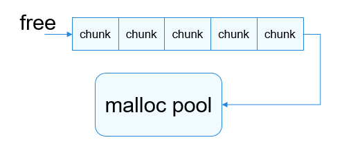

# 用户态内存调测
## 基本概念

Debug版本的musl-libc库为用户提供内存泄漏检测、堆内存统计、踩内存分析以及backtrace功能等维测手段，可以提高用户态内存相关问题的定位效率。

采用了对malloc/free接口进行插桩，保存关键节点信息，然后程序在申请和释放内存时进行内存节点完整性校验，最后在程序结束时通过统计节点信息得到内存统计信息并根据统计信息判断内存是否泄漏的设计思想。

## 运行机制

### 内存泄漏检查

对于每个进程，内存调测模块维护了128个链表（当前系统的线程最大数量为128个），每个链表的索引为线程ID。

申请内存时：保存关键信息到内存节点控制块，根据当前线程ID将内存节点控制块挂到对应链表；

释放内存时：根据需要释放的内存地址匹配内存节点控制块并将该控制块删除。

  **图1** 堆内存节点信息链表

  

申请内存时，返回地址会被保存到LR寄存器中。进程运行过程中，系统会在内存节点控制块中添加疑似泄漏点对应的lr等信息。如下图所示：

  **图2** 堆内存节点信息

  

其中，TID表示线程ID；PID表示进程ID；ptr表示申请的内存地址；size表示申请的内存大小；lr[n]表示函数调用栈地址，变量n的大小可以根据具体场景的需要进行配置。

释放内存时，将free等接口的入参指针与node的ptr字段进行匹配，如果相同则删除该内存节点控制块信息。

用户通过串口或文件等方式，将各个进程内存调测信息导出，利用addr2line工具将导出的信息转换成导致内存泄漏的代码行，便可以解决内存泄露问题。

  **图3** 泄漏点代码行定位流程

  


### 堆内存统计

用户态线程堆内存使用统计具有一定的实际意义，统计线程申请的堆内存占比，为用户程序的内存使用优化提供数据支持。用户态堆内存统计模块主要涉及的接口为malloc和free。如上图所示，每个进程维护128个链表，链表索引即线程ID，申请内存时系统将ptr和size信息记录在内存节点控制块中并将节点控制块挂在以线程ID为头信息的链表上，堆内存释放时根据ptr从对应的链表上移除相应的堆内存块信息；同时计算出当前线程所持有的堆内存总的使用量，并更新当前进程的堆内存使用量和堆内存使用峰值。


### 内存完整性检查

- 使用malloc申请内存（小于等于0x1c000 bytes时通过堆分配算法分配）
  用户程序申请堆内存时，在堆内存节点处添加校验值等信息，如果校验值异常，则很有可能是前一块堆内存使用越界导致的（目前无法识别校验值被野指针破坏的场景）。在内存申请、释放时校验内存节点校验值的正确性，若内存节点被破坏，校验失败时则输出tid、pid及当前被踩节点前一块堆内存申请时保存的调用栈信息，通过addr2line工具可获得具体的代码行信息，辅助用户解决问题。

    **图4** node节点头信息添加校验值

    

  free堆内存时，不会立即把该内存块释放掉，而是在内存中写入魔术数字0xFE，并放到free队列中(保证在一定时间内不会再被malloc函数分配)，当有野指针或use-after-free的情况对该内存进行读取的操作时，能够发现数据异常，但是对于写操作则无法判断出来。

    **图5** free流程图

    

- 使用malloc申请内存（大于0x1c000 bytes时通过mmap申请）
  当malloc通过mmap申请大块内存时，在返回给用户使用的内存区间头和尾分别多申请一个页，一个页PAGE_SIZE当前为0x1000，这两个页分别通过mprotect接口设置权限为PROT_NONE（无可读可写权限），可以有效防止内存越界读写问题：越界读写数据时由于无读写权限而导致用户程序异常，根据异常调用栈信息可找到相应的代码逻辑。

    **图6** malloc通过mmap机制申请内存的内存布局

    

### 使用指导
#### 接口说明


  **表1** 内存调测功能

| 接口名 | 描述 |
| -------- | -------- |
| mem_check_init | 初始化内存检测模块。 |
| watch_mem | 获取线程级堆内存使用信息。 |
| check_leak | 检查是否有堆内存泄漏。 |
| check_heap_integrity | 检查堆内存的完整性。 |
| backtrace | 获取调用栈地址信息。 |
| backtrace_symbols | 根据地址信息获取符号信息。 |
| print_trace | 输出函数调用栈信息。 |


  **表2** 调用栈回溯功能

| 接口名 | 描述 |
| -------- | -------- |
| backtrace | 获取调用栈地址信息。 |
| backtrace_symbols | 根据地址信息获取符号信息。 |
| print_trace | 输出函数调用栈信息。 |

### 使用说明


编译OpenHarmony工程时默认编译的是debug版本，即libc库已经集成内存调测相关的接口实现，用户可以根据具体需要决定是否使能内存调测功能。


堆内存调测功能提供两种方式供用户使用：接口调用及命令行参数。


- 接口调用：优点是可以较精确的检查某一段代码逻辑的堆内存相关信息，缺点是需要修改用户代码。

- 命令行参数：优点是无需修改用户代码，缺点是无法精确的校验某一段逻辑的堆内存信息。


>  **说明：**
> 内存调测功能使能后，进程退出时会默认进行一次堆内存泄漏和堆内存完整性检查。内存调测功能未使能时，堆内存统计、堆内存泄漏检查、堆内存完整性校验功能不会开启，调用相关调测接口无响应。


#### 接口调用方式


##### 示例代码

代码功能：显式调用调测模块的相关接口对用户代码进行内存校验。


```c
#include <pthread.h>
#include <stdlib.h>
#include <stdio.h>
#include <debug.h> // 包含提供内存调测接口声明的头文件。

#define MALLOC_LEAK_SIZE  0x300

void func(void)
{
    char *ptr = malloc(MALLOC_LEAK_SIZE);
    memset(ptr, '3', MALLOC_LEAK_SIZE);
}

int main()
{
    mem_check_init(NULL); // 通过串口输出内存调测信息，必须在用户程序第一次申请堆内存之前调用（一般在main函数入口调用），否则调测信息不准确。
    // mem_check_init("/storage/mem_debug.txt"); // 内存调测信息输出到/storage/mem_debug.txt文件中，如果该文件创建失败，则信息通过串口输出。
    char *ptr = malloc(MALLOC_LEAK_SIZE);
    memset(ptr, '1', MALLOC_LEAK_SIZE);

    watch_mem(); // 在当前代码逻辑处查看线程级内存统计信息。
    func();
    check_heap_integrity(); // 检查堆内存节点完整性。
    check_leak(); // 在当前代码逻辑处检查堆内存是否泄漏（一般在程序退出之前校验比较准确，若在malloc和free调用逻辑之间做校验，则结果不准确）。
    return 0;
}
```


##### 编译


```
$ clang -o mem_check mem_check.c -funwind-tables -rdynamic -g -mfloat-abi=softfp -mcpu=cortex-a7 -mfpu=neon-vfpv4 -target arm-liteos --sysroot=/home/<user-name>/directory/out/hispark_taurus/ipcamera_hispark_taurus/sysroot $(clang -mfloat-abi=softfp -mcpu=cortex-a7 -mfpu=neon-vfpv4 -target arm-liteos -print-file-name=libunwind.a)
```


>  **说明：**
> - 本编译示例基于将编译器的路径写入环境变量中，即.bashrc文件中。
>
> - 编译用户程序及所需的lib库时，需要添加编译选项-funwind-tables，-rdynamic，-g，用于栈回溯。
>
> - -mfloat-abi=softfp，-mcpu=cortex-a7，-mfpu=neon-vfpv4编译选项用于指定具体的芯片架构、浮点数计算优化、fpu，与具体的libc库使用的编译选项保持一致，否则链接时可能出现找不到libc库文件。
>
> - -target arm-liteos用于指定编译器相关库文件路径。
>
> - --sysroot=/home/&lt;user-name&gt;/directory/out/hispark_taurus/ipcamera_hispark_taurus/sysroot用于指定编译器库文件搜索根目录，假设OpenHarmony工程代码存放路径为/home/&lt;user-name&gt;/directory。其中out/hispark_taurus/ipcamera_hispark_taurus路径为在编译时，hb set命令指定的具体产品，本示例选择的是ipcamera_hispark_taurus产品。
>
> - $(clang -mfloat-abi=softfp -mcpu=cortex-a7 -mfpu=neon-vfpv4 -target arm-liteos -print-file-name=libunwind.a)用于指定相应的unwind库的路径。


##### 调测信息


```
OHOS # ./mem_check
OHOS #
==PID:4== Heap memory statistics(bytes): // 堆内存统计信息。
    [Check point]: // check点调用栈。
        #00: <main+0x38>[0x86c] -> mem_check
        #01: <(null)+0x24baf9dc>[0x219dc] -> /lib/libc.so

    [TID: 18, Used: 0x320] // 18号线程堆内存占用，当前进程仅一个线程。

==PID:4== Total heap: 0x320 byte(s), Peak: 0x320 byte(s)

Check heap integrity ok! // 堆内存完整性检查。

==PID:4== Detected memory leak(s): // 内存泄漏信息及调用栈。
    [Check point]:
        #00: <check_leak+0x1c4>[0x2da4c] -> /lib/libc.so
        #01: <main+0x44>[0x878] -> mem_check

    [TID:18 Leak:0x320 byte(s)] Allocated from:
        #00: <main+0x1c>[0x850] -> mem_check
        #01: <(null)+0x24baf9dc>[0x219dc] -> /lib/libc.so

    [TID:18 Leak:0x320 byte(s)] Allocated from:
        #00: <func+0x14>[0x810] -> mem_check
        #01: <main+0x3c>[0x870] -> mem_check
        #02: <(null)+0x24baf9dc>[0x219dc] -> /lib/libc.so

==PID:4== SUMMARY: 0x640 byte(s) leaked in 2 allocation(s).

==PID:4== Detected memory leak(s):
    [Check point]:
        #00: <check_leak+0x1c4>[0x2da4c] -> /lib/libc.so
        #01: <exit+0x28>[0x111ec] -> /lib/libc.so

    [TID:18 Leak:0x320 byte(s)] Allocated from:
        #00: <main+0x1c>[0x850] -> mem_check
        #01: <(null)+0x24baf9dc>[0x219dc] -> /lib/libc.so

    [TID:18 Leak:0x320 byte(s)] Allocated from:
        #00: <func+0x14>[0x810] -> mem_check
        #01: <main+0x3c>[0x870] -> mem_check
        #02: <(null)+0x24baf9dc>[0x219dc] -> /lib/libc.so

==PID:4== SUMMARY: 0x640 byte(s) leaked in 2 allocation(s).

Check heap integrity ok!
```


##### 调用栈解析

提供parse_mem_info.sh脚本可以对调用栈进行解析，解析脚本存放的路径：kernel/liteos_a/tools/scripts/parse_memory/parse_mem_info.sh。利用脚本可以将相应的调测信息转换成具体的源码行号，如下命令所示，mem_debug.txt保存的是内存调测信息，elf1、elf2等文件是需要解析的elf文件。


```
$ ./parse_mem_info.sh mem_debug.txt elf1 elf2 elf3 ...
```

例如：


```
$ ./parse_mem_info.sh mem_debug.txt mem_check
Compiler is [gcc/llvm]: llvm
Now using addr2line ...

==PID:4== Heap memory statistics(bytes):
    [Check point]:
        #00: <main+0x38>[0x86c] at /usr1/xxx/TEST_ELF/mem_check.c:22
        #01: <(null)+0x24baf9dc>[0x219dc] -> /lib/libc.so

    [TID: 18, Used: 0x320]

==PID:4== Total heap: 0x320 byte(s), Peak: 0x320 byte(s)

Check heap integrity ok!

==PID:4== Detected memory leak(s):
    [Check point]:
        #00: <check_leak+0x1c4>[0x2da4c] -> /lib/libc.so
        #01: <main+0x44>[0x878] at /usr1/xxx/TEST_ELF/mem_check.c:28

    [TID:18 Leak:0x320 byte(s)] Allocated from:
        #00: <main+0x1c>[0x850] at /usr1/xxx/TEST_ELF/mem_check.c:17
        #01: <(null)+0x24baf9dc>[0x219dc] -> /lib/libc.so

    [TID:18 Leak:0x320 byte(s)] Allocated from:
        #00: <func+0x14>[0x810] at /usr1/xxx/TEST_ELF/mem_check.c:9
        #01: <main+0x3c>[0x870] at /usr1/xxx/TEST_ELF/mem_check.c:24
        #02: <(null)+0x24baf9dc>[0x219dc] -> /lib/libc.so

==PID:4== SUMMARY: 0x640 byte(s) leaked in 2 allocation(s).
```

#### 命令行参数方式


对用户态进程进行内存相关的检查时，除了接口调用方式还可以通过命令行方式进行内存统计、内存泄漏或内存完整性检查。

```
--mwatch：初始化内存调测功能，注册信号。内存调测信息将从串口输出；
--mrecord <f_path>：初始化内存调测功能，注册信号。内存调测信息将保存至f_path文件，若f_path创建失败，则内存调测信息将从串口输出
```


在待调测的进程未退出时可使用信号机制获取对应信息:

```
kill -35 <pid> # 查看线程级堆内存占用
kill -36 <pid> # 检查是否存在堆内存泄漏
kill -37 <pid> # 检查堆内存头节点是否完整
```


##### 示例代码

代码功能：构造内存问题利用命令行方式进行内存调测。


```c
#include <pthread.h>
#include <stdlib.h>
#include <stdio.h>

#define MALLOC_LEAK_SIZE  0x300

void func(void)
{
    char *ptr = malloc(MALLOC_LEAK_SIZE);
    memset(ptr, '3', MALLOC_LEAK_SIZE);
}

int main()
{
    char *ptr = malloc(MALLOC_LEAK_SIZE);
    memset(ptr, '1', MALLOC_LEAK_SIZE);
    func();
    while (1);
}
```


##### 编译

参考接口调用章节里的编译。


##### 使用mwatch参数命令


```
OHOS # ./mem_check --mwatch // 利用task命令可以查到mem_check进程的pid为4。
OHOS #
OHOS # kill -35 4 // 查看堆内存统计信息。
OHOS #
==PID:4== Heap memory statistics(bytes):
    [Check point]:
        #00: <arm_signal_process+0x5c>[0x58dfc] -> /lib/libc.so

    [TID: 18, Used: 0x640]

==PID:4== Total heap: 0x640 byte(s), Peak: 0x640 byte(s)

OHOS # kill -36 4 // 检查是否存在堆内存泄漏。
OHOS #
==PID:4== Detected memory leak(s):
    [Check point]:
        #00: <check_leak+0x1c4>[0x2da4c] -> /lib/libc.so
        #01: <arm_signal_process+0x5c>[0x58dfc] -> /lib/libc.so

    [TID:18 Leak:0x320 byte(s)] Allocated from:
        #00: <main+0x14>[0x724] -> mem_check
        #01: <(null)+0x2555a9dc>[0x219dc] -> /lib/libc.so

    [TID:18 Leak:0x320 byte(s)] Allocated from:
        #00: <func+0x14>[0x6ec] -> mem_check
        #01: <main+0x30>[0x740] -> mem_check
        #02: <(null)+0x2555a9dc>[0x219dc] -> /lib/libc.so

==PID:4== SUMMARY: 0x640 byte(s) leaked in 2 allocation(s).

OHOS # kill -37 4 // 检查堆内存头节点的完整性。
OHOS #
Check heap integrity ok!
```


##### 调用栈解析

将调测信息保存至test.txt文件中，利用脚本进行解析，获取内存泄漏的具体行号。


```
$ ./parse_mem_info.sh test.txt mem_check
Compiler is [gcc/llvm]: llvm
Now using addr2line ...

==PID:4== Detected memory leak(s):
    [Check point]:
        #00: <check_leak+0x1c4>[0x2da4c] -> /lib/libc.so
        #01: <arm_signal_process+0x5c>[0x58dfc] -> /lib/libc.so

    [TID:18 Leak:0x320 byte(s)] Allocated from:
        #00: <main+0x14>[0x724] at /usr1/xxx/TEST_ELF/mem_check.c:14
        #01: <(null)+0x2555a9dc>[0x219dc] -> /lib/libc.so

    [TID:18 Leak:0x320 byte(s)] Allocated from:
        #00: <func+0x14>[0x6ec] at /usr1/xxx/TEST_ELF/mem_check.c:8
        #01: <main+0x30>[0x740] at /usr1/xxx/TEST_ELF/mem_check.c:19
        #02: <(null)+0x2555a9dc>[0x219dc] -> /lib/libc.so

==PID:4== SUMMARY: 0x640 byte(s) leaked in 2 allocation(s).
```


##### 使用mrecord参数命令

1. 执行用户程序并指定记录内存调测信息的文件路径

   ```
   OHOS # ./mem_check --mrecord /storage/check.txt
   ```

2. 利用kill -35 &lt;pid&gt;统计内存信息，该信息将会输出到文件中，使用cat命令查看

   ```
   OHOS # kill -35 4
   OHOS # Memory statistics information saved in /storage/pid(4)_check.txt

   OHOS # cat /storage/pid(4)_check.txt

   ==PID:4== Heap memory statistics(bytes):
       [Check point]:
           #00: <arm_signal_process+0x5c>[0x5973c] -> /lib/libc.so

       [TID: 18, Used: 0x640]

   ==PID:4== Total heap: 0x640 byte(s), Peak: 0x640 byte(s)
   ```

3. 利用kill -36 &lt;pid&gt;校验内存完整性，该信息将会输出到文件中，使用cat命令查看

   ```
   OHOS # kill -36 4
   OHOS # Leak check information saved in /storage/pid(4)_check.txt

   OHOS # cat /storage/pid(4)_check.txt

   ==PID:4== Heap memory statistics(bytes):
       [Check point]:
           #00: <arm_signal_process+0x5c>[0x5973c] -> /lib/libc.so

       [TID: 18, Used: 0x640]

   ==PID:4== Total heap: 0x640 byte(s), Peak: 0x640 byte(s)

   ==PID:4== Detected memory leak(s):
       [Check point]:
           #00: <check_leak+0x1c4>[0x2e38c] -> /lib/libc.so
           #01: <arm_signal_process+0x5c>[0x5973c] -> /lib/libc.so

       [TID:18 Leak:0x320 byte(s)] Allocated from:
           #00: <main+0x14>[0x724] -> mem_check
           #01: <(null)+0x1fdd231c>[0x2231c] -> /lib/libc.so

       [TID:18 Leak:0x320 byte(s)] Allocated from:
           #00: <func+0x14>[0x6ec] -> mem_check
           #01: <main+0x30>[0x740] -> mem_check
           #02: <(null)+0x1fdd231c>[0x2231c] -> /lib/libc.so

   ==PID:4== SUMMARY: 0x640 byte(s) leaked in 2 allocation(s).
   ```

4. 利用kill -9 &lt;pid&gt;杀掉当前进程，进程退出后会默认校验内存完整性，该信息将会输出到文件中，使用cat命令查看

   ```
   OHOS # kill -9 4
   OHOS # Leak check information saved in /storage/pid(4)_check.txt

   Check heap integrity ok!

   OHOS # cat /storage/pid(4)_check.txt
   OHOS #
   ==PID:4== Heap memory statistics(bytes):
       [Check point]:
           #00: <arm_signal_process+0x5c>[0x5973c] -> /lib/libc.so

       [TID: 18, Used: 0x640]

   ==PID:4== Total heap: 0x640 byte(s), Peak: 0x640 byte(s)

   ==PID:4== Detected memory leak(s):
       [Check point]:
           #00: <check_leak+0x1c4>[0x2e38c] -> /lib/libc.so
           #01: <arm_signal_process+0x5c>[0x5973c] -> /lib/libc.so

       [TID:18 Leak:0x320 byte(s)] Allocated from:
           #00: <main+0x14>[0x724] -> mem_check
           #01: <(null)+0x1fdd231c>[0x2231c] -> /lib/libc.so

       [TID:18 Leak:0x320 byte(s)] Allocated from:
           #00: <func+0x14>[0x6ec] -> mem_check
           #01: <main+0x30>[0x740] -> mem_check
           #02: <(null)+0x1fdd231c>[0x2231c] -> /lib/libc.so

   ==PID:4== SUMMARY: 0x640 byte(s) leaked in 2 allocation(s).

   ==PID:4== Detected memory leak(s):
       [Check point]:
           #00: <check_leak+0x1c4>[0x2e38c] -> /lib/libc.so
           #01: <exit+0x28>[0x11b2c] -> /lib/libc.so

       [TID:18 Leak:0x320 byte(s)] Allocated from:
           #00: <main+0x14>[0x724] -> mem_check
           #01: <(null)+0x1fdd231c>[0x2231c] -> /lib/libc.so

       [TID:18 Leak:0x320 byte(s)] Allocated from:
           #00: <func+0x14>[0x6ec] -> mem_check
           #01: <main+0x30>[0x740] -> mem_check
           #02: <(null)+0x1fdd231c>[0x2231c] -> /lib/libc.so

   ==PID:4== SUMMARY: 0x640 byte(s) leaked in 2 allocation(s).
   ```

>  **说明：**
> 上述连续记录的信息会逐步追加到初始化时所指定的文件中，故最后cat文件时，文件中还包含历史记录的信息内容。
## 常见问题


### UAF(Use after free)

- 申请小块内存（不大于0x1c000 bytes）
  free之后：

  读操作：读取free之后的内存大概率是魔术数字(0xFEFEFEFE)。

  >  **说明：**
  > free之后的堆内存不会立即释放进堆内存池，会先放至固定长度的队列中，并置魔术数字0xFE，队列满后会将先放至队列中的内存块释放进堆内存池。

  写操作：无法校验。


- 申请大块内存（大于0x1c000 bytes）
  堆内存由malloc通过调用mmap接口申请，free之后若仍访问该内存，则用户程序异常（该内存区间已被unmap）。


### Double free

Double free时，用户程序将会异常退出。


### 堆内存节点被踩

- 申请小块内存（不大于0x1c000 bytes）

  堆内存节点被踩时，用户程序将会异常退出，并输出破坏被踩节点的可能的堆内存申请调用栈，对于野指针踩内存情况无法校验出来。例如用户程序mem_check中存在堆内存越界踩的情况，利用命令行方式可以获得踩内存的可能的具体位置。


  ```
  OHOS # ./mem_check --mwatch
  OHOS #
  ==PID:6== Memory integrity information:
      [TID:28 allocated addr: 0x272e1ea0, size: 0x120] The possible attacker was allocated from:
          #00: <malloc+0x808>[0x640e8] -> /lib/libc.so
          #01: <threadFunc1+0x7c>[0x21d0] -> mem_check
  ```

  可以通过调用栈解析脚本对调用栈信息进行解析。

- 申请大块内存（大于0x1c000 bytes）

  堆内存由malloc通过mmap接口申请，申请得到的堆内存块前后各置一个size为PAGE_SIZE大小的区间，设置无读写权限，读写操作会触发用户程序异常。

