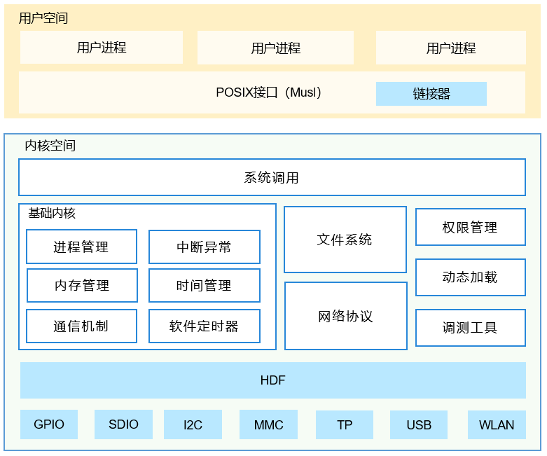

# 内核概述


## 简介

OpenHarmony 轻量级内核是基于IoT领域轻量级物联网操作系统Huawei LiteOS内核演进发展的新一代内核，包含LiteOS-M和LiteOS-A两类内核。LiteOS-M内核主要应用于轻量系统，面向的MCU（Microprocessor Unit）一般是百K级内存，可支持MPU（Memory Protection Unit）隔离，业界类似的内核有FreeRTOS或ThreadX等；LiteOS-A内核主要应用于小型系统，面向设备一般是M级内存，可支持MMU（Memory Management Unit）隔离，业界类似的内核有Zircon或Darwin等。

>  **说明：**
> OpenHarmony针对不同量级的系统，分别使用了不同形态的内核，小型系统支持LiteOS和Linux，本开发指南适用于LiteOS-A内核，linux内核的相关操作请参考[Linux内核概述](../kernel/kernel-standard-overview.md)。

为适应IoT产业的高速发展，OpenHarmony 轻量级内核不断优化和扩展，能够带给应用开发者友好的开发体验和统一开放的生态系统能力。轻量级内核LiteOS-A重要的新特性如下：

- 新增了丰富的内核机制
  新增虚拟内存、系统调用、多核、轻量级IPC（Inter-Process Communication，进程间通信）、DAC（Discretionary Access Control，自主访问控制）等机制，丰富了内核能力；为了更好的兼容软件和开发者体验，新增支持多进程，使得应用之间内存隔离、相互不影响，提升系统的健壮性。

- 引入统一驱动框架HDF（Hardware Driver Foundation）
  引入统一驱动框架HDF，统一驱动标准，为设备厂商提供了更统一的接入方式，使驱动更加容易移植，力求做到一次开发，多系统部署。

- 支持1200+标准POSIX接口
  更加全面的支持POSIX标准接口，使得应用软件易于开发和移植，给应用开发者提供了更友好的开发体验。

- 内核和硬件高解耦
  轻量级内核与硬件高度解耦，新增单板，内核代码不用修改。


## 内核架构

轻量级内核主要由基础内核、扩展组件、HDF框架、POSIX接口组成。轻量级内核的文件系统、网络协议等扩展功能（没有像微内核那样运行在用户态）运行在内核地址空间，主要考虑组件之间直接函数调用比进程间通信或远程过程调用要快得多。

  **图1** OpenHarmony LiteOS-A内核架构图
  

- 基础内核主要包括内核的基础机制，如调度、内存管理、中断异常等

- 扩展组件主要包括文件系统、网络协议和安全等扩展功能

- HDF框架是外设驱动统一标准框架

- POSIX接口是为兼容POSIX标准的应用方便移植到OpenHarmony

**基础内核**

基础内核组件实现精简，主要包括内核的基础机制，如调度、内存管理、中断异常、内核通信等；

- 进程管理：支持进程和线程，基于Task实现进程，进程独立4GiB地址空间

- 多核调度：支持任务和中断亲核性设置，支持绑核运行

- 实时调度：支持高优先级抢占，同优先级时间片轮转

- 虚拟内存：内核空间静态映射到0-1GiB地址，用户空间映射到1-4GiB地址

- 内核通信：事件、信号量、互斥锁、队列

- 时间管理：软件定时器、系统时钟

**文件系统**

轻量级内核支持FAT，JFFS2，NFS，ramfs，procfs等众多文件系统，并对外提供完整的POSIX标准的操作接口；内部使用VFS层作为统一的适配层框架，方便移植新的文件系统，各个文件系统也能自动利用VFS层提供的丰富的功能。

主要特性有：

- 完整的POSIX接口支持

- 文件级缓存(pagecache）

- 磁盘级缓存（bcache）

- 目录缓存(pathcache)

- DAC能力

- 支持嵌套挂载及文件系统堆叠等

- 支持特性的裁剪和资源占用的灵活配置。

**网络协议**

轻量级内核网络协议基于开源lwIP（lightweight IP）构建，对lwIP的RAM占用进行优化，同时提高lwIP的传输性能。

- 协议： IP、IPv6、 ICMP、 ND、MLD、 UDP、 TCP、IGMP、ARP、PPPoS、PPPoE

- API：socket API

- 扩展特性：多网络接口IP转发、TCP拥塞控制、RTT估计和快速恢复/快速重传

- 应用程序：HTTP(S)服务、SNTP客户端、SMTP(S)客户端、ping工具、NetBIOS名称服务、mDNS响应程序、MQTT客户端、TFTP服务、DHCP客户端、DNS客户端、AutoIP/APIPA（零配置）、SNMP代理

**HDF框架**

轻量级内核集成HDF框架，HDF框架旨在为开发者提供更精准、更高效的开发环境，力求做到一次开发，多系统部署。

- 支持多内核平台

- 支持用户态驱动

- 可配置组件化驱动模型

- 基于消息的驱动接口模型

- 基于对象的驱动、设备管理

- HDI（Hardware Device Interface）统一硬件接口

- 支持电源管理、PnP

**扩展组件**

对内核功能进行扩展，可选但很重要的机制。

- 动态链接：支持标准ELF链接执行、加载地址随机化

- 进程通信：支持轻量级LiteIPC，同时也支持标准的Mqueue、Pipe、Fifo、Signal等机制

- 系统调用：支持170+系统调用，同时有支持VDSO机制

- 权限管理：支持进程粒度的特权划分和管控，UGO三种权限配置
## 目录<a name="section161941989596"></a>

```text
/kernel/liteos_a
├── apps                   # 用户态的init和shell应用程序
├── arch                   # 体系架构的目录，如arm等
│   └── arm                # arm架构代码
├── bsd                    # freebsd相关的驱动和适配层模块代码引入，例如USB等
├── compat                 # 内核接口兼容性目录
│   └── posix              # posix相关接口
├── drivers                # 内核驱动
│   └── char               # 字符设备
│       ├── mem            # 访问物理IO设备驱动
│       ├── quickstart     # 系统快速启动接口目录
│       ├── random         # 随机数设备驱动
│       └── video          # framebuffer驱动框架
├── figures                # 内核架构图
├── fs                     # 文件系统模块，主要来源于NuttX开源项目
│   ├── fat                # fat文件系统
│   ├── jffs2              # jffs2文件系统
│   ├── include            # 对外暴露头文件存放目录
│   ├── nfs                # nfs文件系统
│   ├── proc               # proc文件系统
│   ├── ramfs              # ramfs文件系统
│   └── vfs                # vfs层
├── kernel                 # 进程、内存、IPC等模块
│   ├── base               # 基础内核，包括调度、内存等模块
│   ├── common             # 内核通用组件
│   ├── extended           # 扩展内核，包括动态加载、vdso、liteipc等模块
│   ├── include            # 对外暴露头文件存放目录
│   └── user               # 加载init进程
├── lib                    # 内核的lib库
├── net                    # 网络模块，主要来源于lwip开源项目
├── platform               # 支持不同的芯片平台代码，如Hi3516DV300等
│   ├── hw                 # 时钟与中断相关逻辑代码
│   ├── include            # 对外暴露头文件存放目录
│   └── uart               # 串口相关逻辑代码
├── security               # 安全特性相关的代码，包括进程权限管理和虚拟id映射管理
├── shell                  # 接收用户输入的命令，内核去执行
├── syscall                # 系统调用
├── testsuilts             # 测试套件
└── tools                  # 构建工具及相关配置和代码
```

## 约束<a name="section119744591305"></a>

-   开发语言：C/C++；
-   适用于Hi3516DV300单板；
-   Hi3516DV300默认使用FAT文件系统。

## 使用说明<a name="section741617511812"></a>

OpenHarmony LiteOS-A内核支持[Hi3516DV300](https://gitee.com/openharmony/docs/blob/master/zh-cn/device-dev/quick-start/quickstart-appendix-hi3516.md)单板。开发者可基于此单板开发运行自己的应用程序。

### 准备<a name="section1579912573329"></a>

开发者需要在Linux上[搭建编译环境](https://gitee.com/openharmony/docs/blob/master/zh-cn/device-dev/quick-start/quickstart-pkg-prepare.md)。


### 获取源码<a name="section11443189655"></a>

在Linux服务器上下载并解压一套源代码，源码获取方式参考[源码获取](https://gitee.com/openharmony/docs/blob/master/zh-cn/device-dev/get-code/sourcecode-acquire.md)。

### 编译构建<a name="section2081013992812"></a>

如果这是您的首次应用程序开发，可参考：

-   [helloworld for Hi3516DV300](https://gitee.com/openharmony/docs/blob/master/zh-cn/device-dev/quick-start/quickstart-pkg-3516-running.md)。

## 相关仓<a name="section1371113476307"></a>

[内核子系统](https://gitee.com/openharmony/docs/blob/master/zh-cn/readme/%E5%86%85%E6%A0%B8%E5%AD%90%E7%B3%BB%E7%BB%9F.md)

[drivers\_liteos](https://gitee.com/openharmony/drivers_liteos/blob/master/README_zh.md)

[kernel\_liteos\_a](https://gitee.com/openharmony/kernel_liteos_a/blob/master/README_zh.md)

