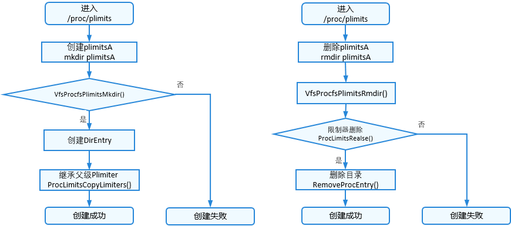
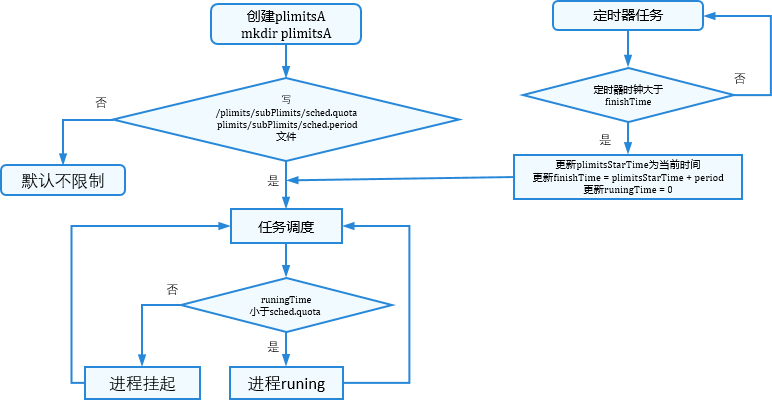
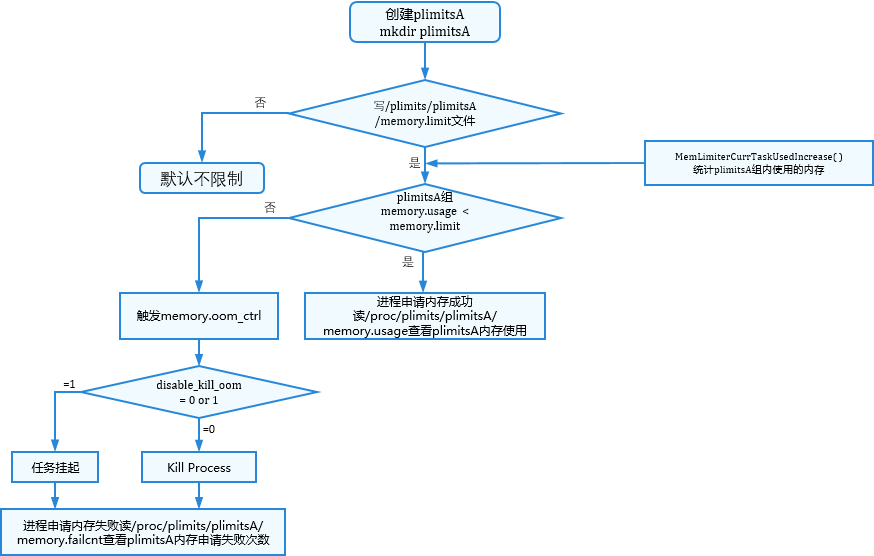
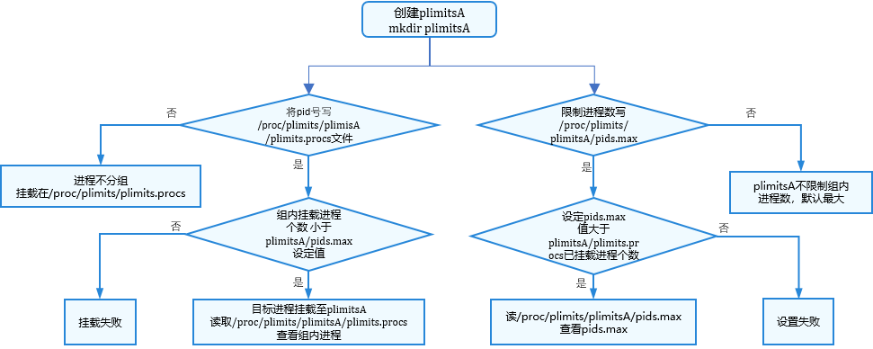

# 容器配额（plimits）

## 简介

面对进程越来越多，应用环境越来越复杂的状况，需要对容器做限制，若不做限制，会发生资源浪费、争夺等。容器配额plimits（Process Limits）是内核提供的一种可以限制单个进程或者多个进程所使用资源的机制，可以对cpu，内存等资源实现精细化控制。plimits的接口通过plimitsfs的伪文件系统提供。通过操作文件对进程及进程资源进行分组管理，通过配置plimits组内限制器Plimiter限制进程组的memory、sched等资源的使用。

## 基本概念

- plimits：内核的一个特性，用于限制、记录和隔离一组进程的资源使用。
- plimitsfs：plimits文件系统，向用户提供操作接口，实现plimits的创建，删除。向用户展示plimits的层级等。
- plimiter：资源限制器的总称，一个子系统代表一类资源限制器，包含memory限制器、pids限制器、sched限制器。
- sched限制器：限制plimits组内的所有进程，在时间周期内占用的cpu时间。
- memory限制器：限制plimits组内所有进程的内存使用总和。
- pids限制器：限制plimits组内能挂载的最大进程数。

## 运行机制

plimitsfs文件系统，在系统初始化阶段，初始化plimits目录挂载至proc目录下：

```
├─proc
│  ├─plimits
│  │  ├─plimits.plimiter_add
│  │  ├─plimits.plimiter_delete
│  │  ├─plimits.procs
│  │  ├─plimits.limiters
│  │  ├─pids.max
│  │  ├─sched.period
│  │  ├─sched.quota
│  │  ├─sched.stat
│  │  ├─memory.failcnt
│  │  ├─memory.limit
│  │  ├─memory.peak
│  │  ├─memory.usage
│  │  ├─memory.oom_ctrl
│  │  └─memory.stat
```

1. plimits分组：

    **图1** plimits创建/删除

    

2. sched限制器：

    **图2** sched限制器配置

    

3. memory限制器：

    **图3** memory限制器配置

    

4. pids限制器：

    **图4** Pids限制器配置

  


## 开发指导


### 接口说明

LiteOS-A的plimits根目录在/proc/plimits下，其下的所有文件只有只读权限，不允许写操作。限制器文件设定值默认为最大值，通过读文件，可查看组内进程资源状态。
通过mkdir创建plimitsA目录完成对进程资源分组，进而操作资源的分配限制。创建的plimitsA目录继承其父plimits目录。  

1. plimitsA文件目录见下表：

   | <div style="width:70px">权限</div> | 大小 | 用户 | 用户组 |         文件名         | 文件描述 | 
   | --------- | ---- | ---- | ------ | ---------------------- | --------- |
   |-r--r--r-- | 0    | u:0  | g:0    | sched.stat             | 每个线程上周期内使用的时间片信息，方便测试验证使用 | 
   |-rw-r--r-- | 0    | u:0  | g:0    | sched.quota            | 组内所有进程在周期内使用时间片总和，单位：ns | 
   |-rw-r--r-- | 0    | u:0  | g:0    | sched.period           | 时间片统计周期，单位：ns | 
   |-r--r--r-- | 0    | u:0  | g:0    | memory.stat            | 统计内存使用的信息，单位：字节 | 
   |-r--r--r-- | 0    | u:0  | g:0    | memory.usage           | 已使用内存份额，单位：字节 | 
   |-r--r--r-- | 0    | u:0  | g:0    | memory.peak            | 内存历史使用峰值，单位：字节 | 
   |-rw-r--r-- | 0    | u:0  | g:0    | memory.limit           | 内存使用限额，单位：字节 | 
   |-r--r--r-- | 0    | u:0  | g:0    | memory.failcnt         | 记录超过限额内存分配失败的次数，单位：次 | 
   |-rw-r--r-- | 0    | u:0  | g:0    | pids.max               | 组内允许挂载进程的最大数，单位：个 | 
   |-rw-r--r-- | 0    | u:0  | g:0    | plimits.procs          | 组内挂载的所有进程 | 
   |-rw-r--r-- | 0    | u:0  | g:0    | plimits.limiter_delete | 根据写入的限制器名称，删除限制器 | 
   |-rw-r--r-- | 0    | u:0  | g:0    | plimits.limiter_add    | 根据写入的限制器名称，添加限制器 | 
   |-r--r--r-- | 0    | u:0  | g:0    | plimits.limiters       | 查看组内限制器 | 

   在/proc/plimits/下创建的plimitsA目录下文件均可读部分可写，通过write对plimitsA子目录中写入内容，完成对进程资源分配与限制。
   - 对文件sched.quota写入时间，单位ns，可限制组内所有进程使用cpu的时间
   - 对文件sched.period写入时间，单位ns，可设置组内统计的时间周期
   - 对文件memory.limit写入内存，单位字节，可限制组内允许使用的内存制
   - 对文件pids.max写入十进制数字，可限制组内允许挂载的进程个数
   - 对文件plimits.procs写入Pid，可将进程挂到不同的plimits组
   - 通过read读不同的文件，可查看组内资源配置使用状况

2. 删除plimitsA组：

   首先对/proc/plimits/plimitsA/plimits.limiter_delete文件依次写入字段“sched”、“memory”、“pids”删除限制器，才能使用rmdir删除plimitsA。

   |    权限   |   大小  |  用户  | 用户组 |         文件名          | 
   | --------- | ------- | ------ | ------ | ----------------------- |
   |-rw-r--r-- | 0       | u:0    | g:0    | plimits.procs           | 
   |-rw-r--r-- | 0       | u:0    | g:0    | plimits.limiter_delete  | 
   |-rw-r--r-- | 0       | u:0    | g:0    | plimits.limiter_add     | 
   |-r--r--r-- | 0       | u:0    | g:0    | plimits.limiters        | 

### 开发流程

plimits文件系统的主要开发流程包括创建新的plimitsA，将pid号写入/plimitsA/plimits.procs，对进程资源分组；按照字节大小写文件/plimitsA/memory.limit文件，限制plimitsA组内能使用的最大内存；对文件/plimitsA/pids.max写入十进制数字限制plimitsA组内所能挂载的进程数等；通过配置plimitsA组内限制器文件，对相应的资源进行分配和限制。亦可删除plimitsA，不限制资源的使用。

### 编程实例

编程示例主要是创建分组plimitsA，通过读写子目录内容，完成进程与进程资源的分组，对Plimits组内进程资源限制。

```
#include <stdio.h>
#include <unistd.h>
#include <stdlib.h>
#include <string.h>
#include <sys/types.h>
#include <sys/stat.h>
#include <fcntl.h>

#define LOS_OK 0
#define LOS_NOK -1

int main ()
{
    int ret;
    ssize_t len;
    int fd = -1;
    //get main pid
    int mainpid = getpid();
    char plimitsA[128] = "/proc/plimits/plimitsA";
    char plimitsAPids[128] = "/proc/plimits/plimitsA/pids.max";
    char plimitsAMemoryLimit[128] = "/proc/plimits/plimitsA/memory.limit";
    char plimitsAMemoryUsage[128] = "/proc/plimits/plimitsA/memory.usage";
    char plimitsAProcs[128] = "/proc/plimits/plimitsA/plimits.procs";
    char plimitsAAdd[128] = "/proc/plimits/plimitsA/plimits.limiter_add";
    char plimitsADelete[128] = "/proc/plimits/plimitsA/plimits.limiter_delete";
    char plimitsMem[128] = "/proc/plimits/memory.usage";
    char plimitsPid[128] = "/proc/plimits/plimits.procs";
    char *mem = NULL;
    char writeBuf[128];
    char readBuf[128];

    /* 查看根plimits组内进程 */
    memset(readBuf, 0, sizeof(readBuf));
    fd = open(plimitsPid, O_RDONLY);
    len = read(fd, readBuf, sizeof(readBuf));
    if (len != strlen(readBuf)) {
        printf("read file failed.\n");
        return LOS_NOK;
    }
    close(fd);
    printf("/proc/plimits组内进程：%s\n", readBuf);

    /* 查看根plimits组内内存使用 */
    memset(readBuf, 0, sizeof(readBuf));
    fd = open(plimitsMem, O_RDONLY);
    len = read(fd, readBuf, sizeof(readBuf));
    if (len != strlen(readBuf)) {
        printf("read file failed.\n");
        return LOS_NOK;
    }
    close(fd);
    printf("/proc/plimits组内已使用内存：%s\n", readBuf);


    /* 创建plimitsA “/proc/plimits/plimitsA” */
    ret = mkdir(plimitsA, 0777);
    if (ret != LOS_OK) {
        printf("mkdir failed.\n");
        return LOS_NOK;
    }

    /* 设置plimitsA组允许挂载进程个数 */
    memset(writeBuf, 0, sizeof(writeBuf));
    sprintf(writeBuf, "%d", 3);
    fd = open(plimitsAPids, O_WRONLY);
    len = write(fd, writeBuf, strlen(writeBuf));
    if (len != strlen(writeBuf)) {
        printf("write file failed.\n");
        return LOS_NOK;
    }
    close(fd);

    /* 挂载进程至plimitsA组 */
    memset(writeBuf, 0, sizeof(writeBuf));
    sprintf(writeBuf, "%d", mainpid);
    fd = open(plimitsAProcs, O_WRONLY);
    len = write(fd, writeBuf, strlen(writeBuf));
    if (len != strlen(writeBuf)) {
        printf("write file failed.\n");
        return LOS_NOK;
    }
    close(fd);

    /* 设置plimitsA组内分配内存限额 */
    memset(writeBuf, 0, sizeof(writeBuf));
    //limit memory
    sprintf(writeBuf, "%d", (1024*1024*3));
    fd = open(plimitsAMemoryLimit, O_WRONLY);
    len = write(fd, writeBuf, strlen(writeBuf));
    if (len != strlen(writeBuf)) {
        printf("write file failed.\n");
        return LOS_NOK;
    }
    close(fd);

    /* 查看plimitsA组内允许使用的最大内存 */
    memset(readBuf, 0, sizeof(readBuf));
    fd = open(plimitsAMemoryLimit, O_RDONLY);
    len = read(fd, readBuf, sizeof(readBuf));
    if (len != strlen(readBuf)) {
        printf("read file failed.\n");
        return LOS_NOK;
    }
    close(fd);
    printf("/proc/plimits/plimitsA组允许使用的最大内存：%s\n", readBuf);

    /* 查看plimitsA组内挂载的进程 */
    memset(readBuf, 0, sizeof(readBuf));
    fd = open(plimitsAProcs, O_RDONLY);
    len = read(fd, readBuf, sizeof(readBuf));
    if (len != strlen(readBuf)) {
        printf("read file failed.\n");
        return LOS_NOK;
    }
    close(fd);
    printf("/proc/plimits/plimitsA组内挂载的进程：%s\n", readBuf);

    /* 查看plimitsA组内存的使用情况 */
    mem = (char*)malloc(1024*1024);
    memset(mem, 0, 1024);
    memset(readBuf, 0, sizeof(readBuf));
    fd = open(plimitsAMemoryUsage, O_RDONLY);
    len = read(fd, readBuf, sizeof(readBuf));
    if (len != strlen(readBuf)) {
        printf("read file failed.\n");
        return LOS_NOK;
    }
    close(fd);
    printf("/proc/plimits/plimitsA组已使用内存：%s\n", readBuf);

    /* 删除plimitsA组内memory限制器 */
    memset(writeBuf, 0, sizeof(writeBuf));
    sprintf(writeBuf, "%s", "memory");
    fd = open(plimitsADelete, O_WRONLY);
    len = write(fd, writeBuf, strlen(writeBuf));
    if (len != strlen(writeBuf)) {
        printf("write file failed.\n");
        return LOS_NOK;
    }
    close(fd);

    /* 增加plimitsA组内memory限制器 */
    memset(writeBuf, 0, sizeof(writeBuf));
    sprintf(writeBuf, "%s", "memory");
    fd = open(plimitsAAdd, O_WRONLY);
    len = write(fd, writeBuf, strlen(writeBuf));
    if (len != strlen(writeBuf)) {
        printf("write file failed.\n");
        return LOS_NOK;
    }
    close(fd);

    /* 删除plimitsA组,首先删除memory、pids、sched限制器 */
    memset(writeBuf, 0, sizeof(writeBuf));
    sprintf(writeBuf, "%s", "memory");
    fd = open(plimitsADelete, O_WRONLY);
    len = write(fd, writeBuf, strlen(writeBuf));
    if (len != strlen(writeBuf)) {
        printf("write file failed.\n");
        return LOS_NOK;
    }
    memset(writeBuf, 0, sizeof(writeBuf));
    sprintf(writeBuf, "%s", "pids");
    fd = open(plimitsADelete, O_WRONLY);
    len = write(fd, writeBuf, strlen(writeBuf));

    memset(writeBuf, 0, sizeof(writeBuf));
    sprintf(writeBuf, "%s", "sched");
    fd = open(plimitsADelete, O_WRONLY);
    len = write(fd, writeBuf, strlen(writeBuf));
    close(fd);
    ret = rmdir(plimitsA);
    if (ret != LOS_OK) {
        printf("rmdir failed.\n");
        return LOS_NOK;
    }

    return 0;
}
```


### 结果验证

编译运行得到的结果为：

  
```
/proc/plimits组内进程：
1
2
3
4
5
6
7
8
9
10
11
12
13
14
15

/proc/plimits组内已使用内存：28016640

/proc/plimits/plimitsA组允许使用的最大内存：3145728

/proc/plimits/plimitsA组内挂载的进程：
15

/proc/plimits/plimitsA组已使用内存：4096
```
