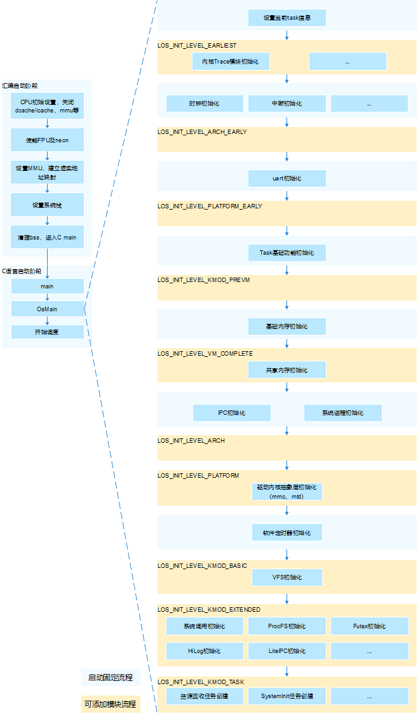

# 内核态启动


## 内核启动流程

内核启动流程包含汇编启动阶段和C语言启动阶段2部分，如图1所示。汇编启动阶段完成CPU初始设置，关闭dcache/icache，使能FPU及neon，设置MMU建立虚实地址映射，设置系统栈，清理bss段，调用C语言main函数等。C语言启动阶段包含OsMain函数及开始调度等，其中如图1所示，OsMain函数用于内核基础初始化和架构、板级初始化等，其整体由内核启动框架主导初始化流程，图中右边区域为启动框架中可接受外部模块注册启动的阶段，各个阶段的说明如下表1所示。


  **图1** 内核启动流程图
  


  **表1** 启动框架层级

| 层级 | 说明 |
| -------- | -------- |
| LOS_INIT_LEVEL_EARLIEST | 最早期初始化<br/>说明：不依赖架构，单板以及后续模块会对其有依赖的纯软件模块初始化<br/>例如：Trace模块 |
| LOS_INIT_LEVEL_ARCH_EARLY | 架构早期初始化<br/>说明：架构相关，后续模块会对其有依赖的模块初始化，如启动过程中非必需的功能，建议放到LOS_INIT_LEVEL_ARCH层 |
| LOS_INIT_LEVEL_PLATFORM_EARLY | 平台早期初始化<br/>说明：单板平台、驱动相关，后续模块会对其有依赖的模块初始化，如启动过程中必需的功能，建议放到LOS_INIT_LEVEL_PLATFORM层<br/>例如：uart模块 |
| LOS_INIT_LEVEL_KMOD_PREVM | 内存初始化前的内核模块初始化<br/>说明：在内存初始化之前需要使能的模块初始化 |
| LOS_INIT_LEVEL_VM_COMPLETE | 基础内存就绪后的初始化<br/>说明：此时内存初始化完毕，需要进行使能且不依赖进程间通讯机制与系统进程的模块初始化<br/>例如：共享内存功能 |
| LOS_INIT_LEVEL_ARCH | 架构后期初始化<br/>说明：架构拓展功能相关，后续模块会对其有依赖的模块初始化 |
| LOS_INIT_LEVEL_PLATFORM | 平台后期初始化<br/>说明：单板平台、驱动相关，后续模块会对其有依赖的模块初始化<br/>例如：驱动内核抽象层初始化（mmc、mtd） |
| LOS_INIT_LEVEL_KMOD_BASIC | 内核基础模块初始化<br/>说明：内核可拆卸的基础模块初始化<br/>例如：VFS初始化 |
| LOS_INIT_LEVEL_KMOD_EXTENDED | 内核扩展模块初始化<br/>说明：内核可拆卸的扩展模块初始化<br/>例如：系统调用初始化、ProcFS初始化、Futex初始化、HiLog初始化、HiEvent初始化、LiteIPC初始化 |
| LOS_INIT_LEVEL_KMOD_TASK | 内核任务创建<br/>说明：进行内核任务的创建（内核任务，软件定时器任务）<br/>例如：资源回收系统常驻任务的创建、SystemInit任务创建、CPU占用率统计任务创建 |
| LOS_INIT_LEVEL_FINISH | 内核初始化完成 |


## 编程样例


 **实例描述**

新增一个内核模块，需要在内核初始化时进行该模块的初始化，则通过内核启动框架将该模块的初始化函数注册进内核启动流程中。

为方便学习，本演示代码直接在 . kernel /liteos_a/testsuites /kernel /src /osTest.c中编译验证即可。

**示例代码**

```c
/* 内核启动框架头文件 */
#include "los_init.h"

/* 新增模块的初始化函数 */
unsigned int OsSampleModInit(void)
{
    PRINTK("OsSampleModInit SUCCESS!\n");
}

/* 在启动框架的目标层级中注册新增模块 */
LOS_MODULE_INIT(OsSampleModInit, LOS_INIT_LEVEL_KMOD_EXTENDED);
```

**结果验证**

```

main core booting up...

/* 根据实际运行环境，过程打印会有差异 */
......

/* 打印测试代码新增模块初始化函数 */
OsSampleModInit SUCCESS!
```


根据上述系统启动阶段的打印可知，内核在启动时进行了该注册模块的初始化函数调用，完成该模块的初始化操作。


>  **说明：**
> 启动框架中同一层级内的注册模块不能有依赖关系，建议新增模块按照上述启动阶段进行模块初始化的拆分，按需注册启动。
>
> 可通过查看系统编译生成文件OHOS_Image.map中.rodata.init.kernel.\*段内的符号表来了解当前已注册进内核启动框架中的各个模块初始化入口，以及检查新注册的模块初始化入口是否生效。
