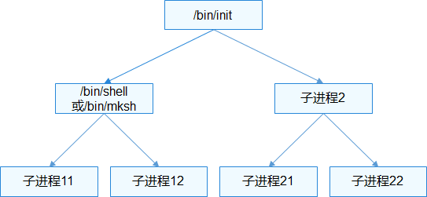

# 用户态启动


## 用户态根进程启动

根进程是系统第一个用户态进程，进程ID为1，它是所有用户态进程的祖先。

  **图1** 进程树示意图

  


### 根进程的启动过程

使用链接脚本将如下init启动代码放置到系统镜像指定位置。


```c
#define LITE_USER_SEC_ENTRY   __attribute__((section(".user.entry")))
LITE_USER_SEC_ENTRY VOID OsUserInit(VOID *args)
{
#ifdef LOSCFG_KERNEL_DYNLOAD
    sys_call3(__NR_execve, (UINTPTR)g_initPath, 0, 0);
#endif
    while (true) {
    }
}
```

> 上述启动代码已在 kernel/liteos_a/kernel/user/src/los_user_init.c 中，g_initPath 根据启动设置的不同，其值为 /dev/shm/init 或 /bin/init。

系统启动阶段，OsUserInitProcess启动init进程。具体过程如下：

1. 由内核OsLoadUserInit加载上述代码。

2. 创建新的进程空间，启动/bin/init进程。


### 根进程的职责

- 启动关键系统程序或服务，如交互进程shell。
  >  **说明：**
  > 在OpenHarmony 中**init**进程通过读取/etc/init.cfg，根据配置执行指定命令，或启动指定进程（详见：[init启动引导](../subsystems/subsys-boot-init-cfg.md)）。

- 监控回收孤儿进程，清理子进程中的僵尸进程。


## 用户态程序运行

用户态程序启动有如下常见方式：

- shell命令启动进程。

  ```
  OHOS $ exec helloworld
  OHOS $ ./helloworld
  OHOS $ /bin/helloworld
  ```

- 通过POSIX接口启动新进程。
  Fork方法创建一个新的进程，exec类接口执行一个全新的进程。
