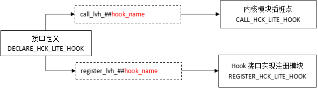

# HCK内核解耦框架指导


## 背景

随着更多的平台适配OpenHarmony，各厂商针对内核的需求功能也不尽相同，都有特性化的方案。

直接合入内核仓或适用patch方法，会导致后期构建开发效率低、日常维护复杂、特性移植性差等问题，阻碍内核的良性发展。

为使三方内核特性在不侵入或少侵入内核仓的情况下合入社区，社区开发设计HCK（OpenHarmony Common Kernel）内核解耦框架，该方案为开发者提供了整套插桩、注册、调用接口，减少对内核的侵入修改，统一解耦框架，插桩接口可在多平台间通用。

本文主要对基于源生hook方式的HCK框架进行使用指导说明，并对使用规范进行说明。

## 使用范围

涉及Linux内核patch、特性、模块侵入源生内核的整改。

## 接口说明

DECLARE_HCK_LITE_HOOK：接口定义使用的接口宏，用于插桩接口定义声明用，同时会生成注册和调用接口。

REGISTER_HCK_LITE_HOOK：插桩接口实例注册宏，HCK方案仅支持单接口注册单实例，且不可注销已注册接口。

REGISTER_HCK_LITE_DATA_HOOK：带参数的接口注册宏，同样仅单实例注册，且接口不可注销。

CALL_HCK_LITE_HOOK：插桩接口调用接口宏，在原侵入内核代码处进行替换，使用方法下详。

**图 1** HCK定义、注册、调用接口及流程图



## 使用指导

### 配置说明

使用HCK方案请先在kernel_linux_config仓下对应平台config配置文件中打开以下配置：

```c
CONFIG_HCK=y
CONFIG_HCK_VENDOR_HOOKS=y
```

### 接口定义

在kernel-x.x/include/linux/hck/lite_hck_xxx.h中用以下宏定义hook接口：

```c
#include <linux/hck/lite_vendor_hooks.h> // 包含hck必要头文件

// 可自定义数据类型，供注册传参用
struct hck_data {
   int   stat;
   char* name;
};

// 插桩接口声明，声明宏中包含EXPORT接口，无需单独调用
DECLARE_HCK_LITE_HOOK(boot_config_info0_lhck, TP_PROTO(类型 参数, ...), TP_ARGS(参数, ...));
```

### 接口声明

在统一新增的vendor hck模块下添加声明接口头文件，文件路径：drivers/hck/vendor_hooks.c

```c
#define CREATE_LITE_VENDOR_HOOK
#include <linux/hck/lite_hck_sample.h> // 在宏定义后添加接口声明头文件
```

### 接口注册

在自研hook模块中定义插桩函数以及注册hook函数

```c
// 包含接口声明头文件
#include <linux/hck/lite_hck_sample.h>

// 接口实现：
boot_config_info0([void* data], ...)
{
    // 调用注册入参
    ((struct hck_data*)data)->stat ... ;
}

// 接口注册：一般在模块init函数中进行注册，确保注册要在调用之前完成
xxx_init()
{
    REGISTER_HCK_LITE_HOOK(boot_config_info0_lhck, boot_config_info0);
    // 带参数的接口注册，代入的参数可在接口实例中获取使用
    REGISTER_HCK_LITE_DATA_HOOK(boot_config_info1_lhck, boot_config_info1, data);
}
```

### 接口调用

在其他内核模块中，插入hook函数，完成接口调用。

如：在linux-x.y/drivers/xxx/xxx.c中添加之前定义的接口

```c
#include <linux/hck/lite_hck_sample.h>
...
int foo(...)
{
    CALL_HCK_LITE_HOOK(boot_config_info0_lhck, 参数...);
}
```

### 示例模块参考

示例代码位置：kernel/linux/linux-5.10(or linux-6.6)/samples/hck

启用示例代码，请打开以下config配置（请勿在正式版本中开启）：

```c
CONFIG_SAMPLES=y
CONFIG_SAMPLE_HCK=y
CONFIG_SAMPLE_HCK_CALL=y
CONFIG_SAMPLE_HCK_REGISTER=y
```

## 使用规范

### 命名规范

1. 遵守内核接口命名格式即可，尽量做到自解释。

2. 当前使用的是lite hck接口，请在接口命名后加”_lhck”后缀。如：
```c
DECLARE_HCK_LITE_HOOK(boot_config_info0_lhck, TP_PROTO(int* s ), TP_ARGS(s));
```

3. 使用英文单词和语法，不要用拼音。

4. 使用领域内公用的缩写，不自创缩写。

5. 尽量不要用否定句式。

如：获取启动配置接口：		get_boot_config_lhck

### 文件目录规范

1. 接口定义头文件放置位置：kernel-x.x/include/linux/hck/

2. 头文件命名规范：lite_hck_模块简述.h，如lite_hck_mmc.h