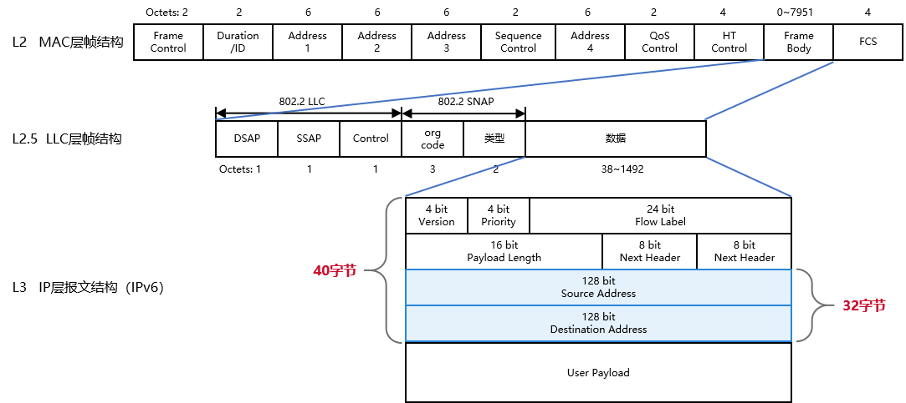
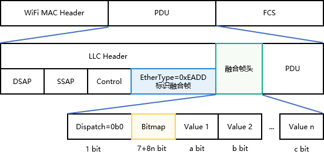
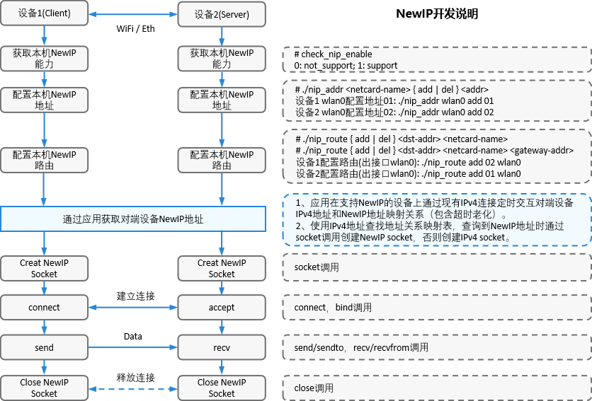
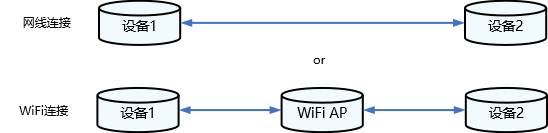
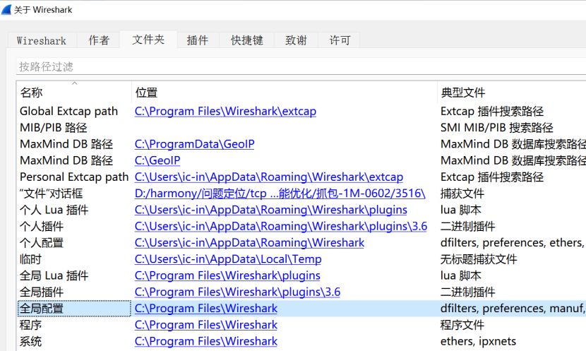
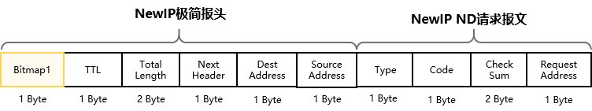
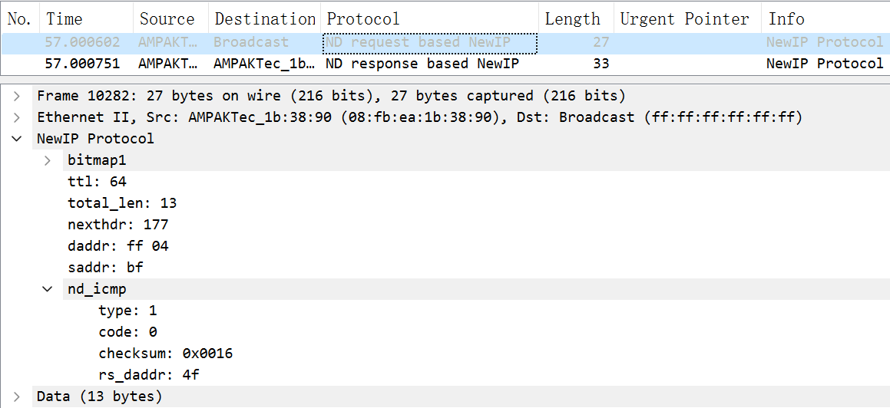
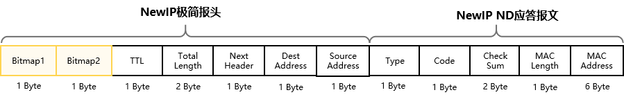
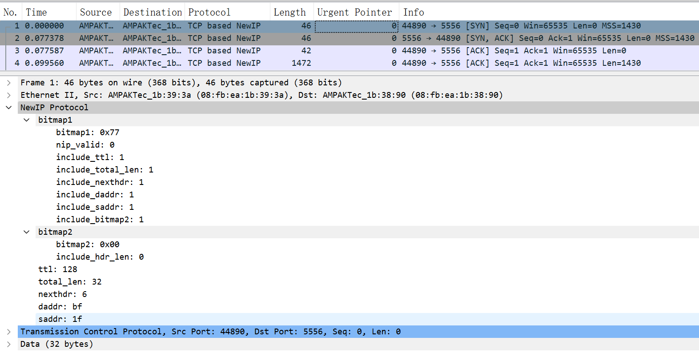
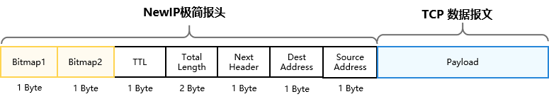

# New IP内核协议栈介绍


## 基本概念

New IP在现有IP能力的基础上，以灵活轻量级报头和可变长多语义地址为基础，通过二三层协议融合，对协议去冗和压缩，减少冗余字节，实现高能效比，高净吞吐，提升通信效率。打造终端之间高效的横向通信，支撑超级终端的体验，实现异构网络的端到端互联。

目前WiFi协议报文，三层报头和地址开销使得报文开销大，传输效率较低。



```
IPv4地址长度固定4字节，IPv6地址长度固定16字节。
IPv4网络层报头长度20~60字节，IPv6网络层报头长度40字节。
```

New IP支持**可变长多语义地址（最短1字节）**，**可变长定制化报头封装（最短5字节）**，通过精简报文头开销，提升数据传输效率。

New IP报头开销，相比IPv4节省25.9%，相比IPv6节省44.9%。

New IP载荷传输效率，相比IPv4提高最少1%，相比IPv6提高最少2.33%。

| 对比场景        | 报头开销     | 载荷传输效率（WiFi MTU=1500B，BT MTU=255B） |
| --------------- | ------------ | ------------------------------------------- |
| IPv4 for WiFi   | 30+8+20=58 B | (1500-58)/1500=96.13%                       |
| IPv6 for WiFi   | 30+8+40=78 B | (1500-78)/1500=94.8%                        |
| New IP for WiFi | 30+8+5=43 B  | (1500-43)/1500=97.13%                       |

## 可变长报头格式

New IP WiFi灵活极简报文头如下图所示，通过LLC Header中的EtherType = 0xEADD标识New IP报文。Bitmap是一组由0和1组成的二进制序列，每个二进制位的数值用于表示New IP报头中是否携带某个字段，即New IP报文头可以由用户根据业务场景自行定制报头中携带哪些字段。



1)	Dispatch：指示封装子类，数值0b0表示其为极简封装子类，长度为1比特；(0b表示后面数值为二进制)。

2)	Bitmap：变长，Bitmap默认为紧跟在Dispatch有效位后面的7比特，Bitmap字段长度可持续扩展。Bitmap最后一位置0表示Bitmap结束，最后一位置1表示Bitmap向后扩展1 Byte，直至最后一位置0。
3)	Value: 标识字段的值，长度为1 Byte的整数倍，类型及长度由报头字段语义表确定。

**Bitmap字段定义如下：**

| 极简Bitmap标识               | Bitops | 携带字段的长度   | 置位策略       | 备注                                    |
| ---------------------------- | ------ | ---------------- | -------------- | --------------------------------------- |
| Bitmap 1st Byte:             | -      | -                | -              | 下面8bit是从高位到低位排列。            |
| 标记位Dispatch               | 0      | -                | 置0            | 0：极简封装报头，1：非极简封装报头。    |
| 报文头是否携带TTL            | 1      | 1 Byte           | 置1            | 剩余跳数。                              |
| 报文头是否携带Total Length   | 2      | 2 Byte           | UDP置0，TCP置1 | New IP报文总长度（包含报头长度）。      |
| 报文头是否携带Next Header    | 3      | 1 Byte           | 置1            | 协议类型。                              |
| Reserve                      | 4      | 保留             | 置0            | 保留字段。                              |
| 报文头是否携带Dest Address   | 5      | 变长（1~8 Byte） | 置1            | 目的地址。                              |
| 报文头是否携带Source Address | 6      | 变长（1~8 Byte） | 由协议自行确定 | 源地址。                                |
| 标记位，标志是否有2nd Byte   | 7      | -                | -              | 0：bitmap结束，1：后跟另外8bit bitmap。 |
| Bitmap 2nd Byte:             | -      | -                | -              | 下面8bit是从高位到低位排列。            |
| 报文头是否携带Header Length  | 0      | 1 Byte           | -              | New IP报头长度。                        |
| Reserve                      | 1      | 保留             | 置0            | -                                       |
| Reserve                      | 2      | 保留             | 置0            | -                                       |
| Reserve                      | 3      | 保留             | 置0            | -                                       |
| Reserve                      | 4      | 保留             | 置0            | -                                       |
| Reserve                      | 5      | 保留             | 置0            | -                                       |
| Reserve                      | 6      | 保留             | 置0            | -                                       |
| 标记位，标志是否有3rd Byte   | 7      | -                | -              | 0：bitmap结束，1：后跟另外8bit bitmap。 |

New IP报头（极简封装）解析遇到新bitmap字段时的处理方法：

仅解析当前版本协议中已定义的bitmap字段，从第一个未知语义的bitmap字段开始，跳过后面的所有bitmap字段，直接通过header length定位到报文开始位置并解析报文。如果报头中携带了未知语义的bitmap字段，且未携带header length字段，则丢弃该数据包。

## 可变长地址格式

New IP支持可变长地址（IPv4/IPv6地址长度固定），支持自解析地址长度，报文头中可以不携带地址长度字段，New IP地址编码格式如下所示：

| First Byte | Semantics                                                    | 地址段有效范围                                               |
| ---------- | ------------------------------------------------------------ | ------------------------------------------------------------ |
| 0x00       | Address is 0                                                 | 【1字节】0 ~ 220 (0x00 ~ 0xDC)                               |
| 0x01       | Address is 1                                                 | -                                                            |
| 0x02       | Address is 2                                                 | -                                                            |
| ...        | ...                                                          | -                                                            |
| 0xDC       | Address is 220                                               | -                                                            |
| 0xDD       | An 16-bit address, which is 0 + 256 * (0xDD - 0xDD) + the last byte value | 【2字节】221 ~ 255 (0x**DD**DD ~ 0x**DD**FF)                 |
| 0xDE       | An 16-bit address, which is 0 + 256 * (0xDE - 0xDD) + the last byte value | 【2字节】256 ~ 511 (0x**DE**00 ~ 0x**DE**FF)                 |
| 0xDF       | An 16-bit address, which is 0 + 256 * (0xDF - 0xDD) + the last byte value | 【2字节】512 ~ 767 (0x**DF**00 ~ 0x**DF**FF)                 |
| ...        | ...                                                          | -                                                            |
| 0xF0       | An 16-bit address, which is 0 + 256 * (0xF0 - 0xDD) + the last byte value | 【2字节】4864 ~ 5119 (0x**F0**00 ~ 0x**F0**FF)               |
| 0xF1       | An 16-bit address is followed                                | 【3字节】5120 ~ 65535 (0x**F1** 1400 ~ 0x**F1** FFFF)        |
| 0xF2       | An 32-bit address is followed                                | 【5字节】65536 ~ 4,294,967,295 (0x**F2** 0001 0000 ~ 0x**F2** FFFF FFFF) |
| 0xF3       | An 48-bit address is followed                                | 【7字节】4,294,967,296 ~ 281,474,976,710,655 (0x**F3** 0001 0000 0000 ~ 0x**F3** FFFF FFFF FFFF) |
| 0xFE       | An 56-bit address is followed                                | 【8字节】0 ~ 72,057,594,037,927,935 (0x**FE**00 0000 0000 0000 ~ 0x**FE**FF FFFF FFFF FFFF) |


## New IP配置指导

### New IP使能

目前只有rk3568开发板Linux 5.10内核上支持New IP内核协议栈，在rk3568开发板内核模块配置文件中搜索NEWIP，将其修改成“CONFIG_XXX=y”即可，New IP相关CONFIG如下。

```
# kernel/linux/config/linux-5.10/arch/arm64/configs/rk3568_standard_defconfig
CONFIG_NEWIP=y          // 使能New IP内核协议栈
CONFIG_NEWIP_HOOKS=y    // 使能New IP内核侵入式修改插桩函数注册，使能New IP的同时必须使用New IP HOOKS功能
HCK_VENDOR_HOOKS=y      // 使能内核插桩基础框架(New IP依赖此配置项，rk3568开发板已默认开启)
```

代码编译完成后，通过下面命令可以确认New IP协议栈代码是否使能成功。

```
find out/ -name *nip*.o
...
out/kernel/OBJ/linux-5.10/net/newip/nip_addrconf_core.o
out/kernel/OBJ/linux-5.10/net/newip/nip_hdr_decap.o
out/kernel/OBJ/linux-5.10/net/newip/nip_addr.o
out/kernel/OBJ/linux-5.10/net/newip/nip_checksum.o
out/kernel/OBJ/linux-5.10/net/newip/tcp_nip_output.o
...
```

备注：OpenHarmony linux内核要求所有原生内核代码侵入式修改，都要修改成插桩方式。例如下面IPv4，IPv6协议栈公共流程中增加New IP处理时，不能直接调用New IP函数，需要在公共流程中增加插桩点，New IP使能后在模块初始化时将xx功能函数注册到对应的函数指针上，下面公共流程就可以通过函数指针的形式调用到New IP的函数。

```c
/* 将New IP ehash函数注册到内核 */
/* call the newip hook function in sk_ehashfn function (net\ipv4\inet_hashtables.c):
 */
void nip_ninet_ehashfn(const struct sock *sk, u32 *ret)
{
	*ret = ninet_ehashfn(sock_net(sk), &sk->SK_NIP_RCV_SADDR,
			     sk->sk_num, &sk->SK_NIP_DADDR, sk->sk_dport);
}

void nip_ninet_ehashfn_lhck_register(void)
{
	REGISTER_HCK_LITE_HOOK(nip_ninet_ehashfn_lhck, nip_ninet_ehashfn);
}

/* 下面是IPv4，IPv6协议栈总入口函数，在总入口函数内新增New IP协议栈相关处理 */
static u32 sk_ehashfn(const struct sock *sk)
{
    /* IPv6 */
#if IS_ENABLED(CONFIG_IPV6)
	if (sk->sk_family == AF_INET6 &&
	    !ipv6_addr_v4mapped(&sk->sk_v6_daddr))
		return inet6_ehashfn(sock_net(sk),
				     &sk->sk_v6_rcv_saddr, sk->sk_num,
				     &sk->sk_v6_daddr, sk->sk_dport);
#endif

	if (sk->sk_family == AF_NINET) {
		u32 ret = 0;

        /* New IP注册的ehash函数 */
		CALL_HCK_LITE_HOOK(nip_ninet_ehashfn_lhck, sk, &ret);
		return ret;
	}
    /* IPv4 */
	return inet_ehashfn(sock_net(sk),
			    sk->sk_rcv_saddr, sk->sk_num,
			    sk->sk_daddr, sk->sk_dport);
}
```

### New IP禁用

在rk3568开发板内核模块配置文件中搜索NEWIP，将其“CONFIG_NEWIP=y”和“CONFIG_NEWIP_HOOKS=y”删除或使用#注释掉即可。

```
# kernel/linux/config/linux-5.10/arch/arm64/configs/rk3568_standard_defconfig
# CONFIG_NEWIP is not set
# CONFIG_NEWIP_HOOKS is not set
```

## New IP相关接口

用户态应用程序调用Socket API创建New IP socket，采用New IP极简封装进行收发包，New IP协议socket接口列表如下：

| 函数     | 输入                                                         | 输出                                           | 返回值           | 接口具体描述                                                 |
| -------- | ------------------------------------------------------------ | ---------------------------------------------- | ---------------- | ------------------------------------------------------------ |
| socket   | int **domain**, int type, int **protocol**                   | NA                                             | Socket句柄sockfd | 创建New IP 协议类型socket，并返回socket实例所对应的句柄。**domain参数填写 AF_NINET，表示创建New IP协议类型socket。protocol参数填写IPPROTO_TCP或IPPROTO_UDP**。 |
| bind     | int sockfd, const **struct sockaddr_nin** *myaddr, socklen_t addrlen | NA                                             | int，返回错误码  | 将创建的socket绑定到指定的IP地址和端口上。**myaddr->sin_family填写AF_NINET**。 |
| listen   | int socket, int backlog                                      | NA                                             | int，返回错误码  | 服务端监听New IP地址和端口。                                 |
| connect  | int sockfd, const **struct sockaddr_nin** *addr, aocklen_t addrlen | NA                                             | int，返回错误码  | 客户端创建至服务端的连接。                                   |
| accept   | int sockfd, **struct sockaddr_nin** *address, socklen_t *address_len | NA                                             | 返回socket的fd   | 服务端返回已建链成功的socket。                               |
| send     | int sockfd, const void *msg, int len, unsigned int flags, const **struct sockaddr_nin** *dst_addr, int addrlen | NA                                             | int，返回错误码  | 用于socket已连接的New IP类型数据发送。                       |
| recv     | int sockfd, size_t len, int flags, **struct sockaddr_nin** *src_addr, | void  **buf, int* *fromlen                     | int，返回错误码  | 用于socket已连接的New IP类型数据接收。                       |
| close    | int sockfd                                                   | NA                                             | int，返回错误码  | 关闭socket，释放资源。                                       |
| ioctl    | int sockfd, unsigned long cmd, ...                           | NA                                             | int，返回错误码  | 对New IP协议栈相关信息进行查询或更改。                       |
| sendto   | int sockfd, const void *msg, int len, unsigned int flags, const **struct sockaddr** *dst_addr, int addrlen | NA                                             | int，返回错误码  | 用于socket无连接的New IP类型数据发送。                       |
| recvfrom | int sockfd, size_t len, int flags,                           | void *buf, struct sockaddr *from, int *fromlen | int，返回错误码  | 用于socket无连接的New IP类型数据接收。                       |

New IP短地址结构如下：

```c
enum nip_8bit_addr_index {
	NIP_8BIT_ADDR_INDEX_0 = 0,
	NIP_8BIT_ADDR_INDEX_1 = 1,
	NIP_8BIT_ADDR_INDEX_2 = 2,
	NIP_8BIT_ADDR_INDEX_3 = 3,
	NIP_8BIT_ADDR_INDEX_4 = 4,
	NIP_8BIT_ADDR_INDEX_5 = 5,
	NIP_8BIT_ADDR_INDEX_6 = 6,
	NIP_8BIT_ADDR_INDEX_7 = 7,
	NIP_8BIT_ADDR_INDEX_MAX,
};

enum nip_16bit_addr_index {
	NIP_16BIT_ADDR_INDEX_0 = 0,
	NIP_16BIT_ADDR_INDEX_1 = 1,
	NIP_16BIT_ADDR_INDEX_2 = 2,
	NIP_16BIT_ADDR_INDEX_3 = 3,
	NIP_16BIT_ADDR_INDEX_MAX,
};

enum nip_32bit_addr_index {
	NIP_32BIT_ADDR_INDEX_0 = 0,
	NIP_32BIT_ADDR_INDEX_1 = 1,
	NIP_32BIT_ADDR_INDEX_MAX,
};

#define nip_addr_field8 v.u.field8
#define nip_addr_field16 v.u.field16
#define nip_addr_field32 v.u.field32

#pragma pack(1)
struct nip_addr_field {
	union {
		unsigned char   field8[NIP_8BIT_ADDR_INDEX_MAX];
		unsigned short field16[NIP_16BIT_ADDR_INDEX_MAX]; /* big-endian */
		unsigned int   field32[NIP_32BIT_ADDR_INDEX_MAX]; /* big-endian */
	} u;
};

struct nip_addr {
	unsigned char bitlen;	/* The address length is in bit (not byte) */
	struct nip_addr_field v;
};
#pragma pack()

/* The following structure must be larger than V4. System calls use V4.
 * If the definition is smaller than V4, the read process will have memory overruns
 * v4: include\linux\socket.h --> sockaddr (16Byte)
 */
#define POD_SOCKADDR_SIZE 3
struct sockaddr_nin {
	unsigned short sin_family; /* [2Byte] AF_NINET */
	unsigned short sin_port;   /* [2Byte] Transport layer port, big-endian */
	struct nip_addr sin_addr;  /* [9Byte] NIP address */

	unsigned char sin_zero[POD_SOCKADDR_SIZE]; /* [3Byte] Byte alignment */
};
```

## New IP开发说明

目前只在OpenHarmony Linux-5.10内核支持New IP内核协议栈，只能在用户态人工配置New IP地址和路由到内核，两台设备通过路由器WiFi连接。如果想配置New IP地址和路由后自动切换到New IP内核协议栈通信，应用可以参考下面蓝框中描述。



上图中New IP地址，路由配置程序可以参考[代码仓examples代码](https://gitee.com/openharmony/kernel_linux_common_modules/tree/master/newip/examples)，根据CPU硬件差异更改Makefile中CC定义编译成二级制文件后推送到开发板，参考上图命令给设备配置New IP地址和路由。

| 文件名             | 功能                                                     |
| ------------------ | -------------------------------------------------------- |
| nip_addr.c         | New IP可变长地址配置demo代码（可配置任意有效New IP地址） |
| nip_route.c        | New IP路由配置demo代码（可配置任意有效New IP地址）       |
| check_nip_enable.c | 获取本机New IP能力                                       |

设备1上查看New IP地址和路由：

```sh
# cat /proc/net/nip_addr
01          wlan0
# cat /proc/net/nip_route
02      ff09       1 wlan0        # 到设备2的路由
01      01      2149580801 wlan0  # 本机自发自收路由
```

设备2上查看New IP地址和路由：

```sh
# cat /proc/net/nip_addr
02          wlan0
# cat /proc/net/nip_route
01      ff09       1 wlan0        # 到设备1的路由
02      02      2149580801 wlan0  # 本机自发自收路由
```

## New IP收发包代码示例

New IP可变长地址配置，路由配置，UDP/TCP收发包demo代码链接如下，New IP协议栈用户态接口使用方法可以参考[代码仓examples代码](https://gitee.com/openharmony/kernel_linux_common_modules/tree/master/newip/examples)。demo代码内配置固定地址和路由，执行编译后二进制程序时不需要人工指定地址和路由。

| 文件名                | 功能                           |
| --------------------- | ------------------------------ |
| nip_addr_cfg_demo.c   | New IP可变长地址配置demo代码   |
| nip_route_cfg_demo.c  | New IP路由配置demo代码         |
| nip_udp_server_demo.c | New IP UDP收发包服务端demo代码 |
| nip_udp_client_demo.c | New IP UDP收发包客户端demo代码 |
| nip_tcp_server_demo.c | New IP TCP收发包服务端demo代码 |
| nip_tcp_client_demo.c | New IP TCP收发包客户端demo代码 |
| nip_lib.c             | 接口索引获取等API接口demo代码  |

**基础操作步骤：**



1. 将demo代码拷贝到Linux编译机上，make clean，make all编译demo代码。

2. 将编译生成二级制文件上传到设备1，设备2。

3. 执行“ifconfig wlan0 up”开启网卡设备。

4. 在设备1的shell下执行“./nip_addr_cfg_demo server”给服务端配置0xDE00（2字节）变长地址，在设备2的shell下执。行“./nip_addr_cfg_demo client”给客户端配置0x50（1字节）变长地址，通过“cat /proc/net/nip_addr”查看内核地址配置结果。

5. 在设备1的shell下执行“./nip_route_cfg_demo server”给服务端配置路由，在设备2的shell下执行“./nip_route_cfg_demo client”给客户端配置路由，通过“cat /proc/net/nip_route”查看内核路由配置结果。

以上步骤操作完成后，可以进行UDP/TCP收发包，收发包demo默认使用上面步骤中配置的地址和路由。


**UDP收发包操作步骤：**

先在服务端执行“./nip_udp_server_demo”，然后再在客户端执行“./nip_udp_client_demo”，客户端会发送10个New IP报文，服务端收到报文后再发送给客户端。

```
服务端shell窗口打印内容：
Received -- 1661826989 498038 NIP_UDP #      0 -- from 0x50:57605
Sending  -- 1661826989 498038 NIP_UDP #      0 -- to 0x50:57605
Received -- 1661826990  14641 NIP_UDP #      1 -- from 0x50:57605
Sending  -- 1661826990  14641 NIP_UDP #      1 -- to 0x50:57605
Received -- 1661826990 518388 NIP_UDP #      2 -- from 0x50:57605
Sending  -- 1661826990 518388 NIP_UDP #      2 -- to 0x50:57605
...
Received -- 1661827011 590576 NIP_UDP #      9 -- from 0x50:37758
Sending  -- 1661827011 590576 NIP_UDP #      9 -- to 0x50:37758

客户端sh窗口打印内容：
Received --1661827007  55221 NIP_UDP #      0 sock 3 success:     1/     1/no=     0
Received --1661827007 557926 NIP_UDP #      1 sock 3 success:     2/     2/no=     1
Received --1661827008  62653 NIP_UDP #      2 sock 3 success:     3/     3/no=     2
...
Received --1661827011 590576 NIP_UDP #      9 sock 3 success:    10/    10/no=     9
```


**TCP收发包操作步骤：**

先在服务端执行“./nip_tcp_server_demo”，然后再在客户端执行“./nip_tcp_client_demo”，客户端会发送10个New IP报文，服务端收到报文后再发送给客户端。

```
服务端shell窗口打印内容：
Received -- 1661760202 560605 NIP_TCP #      0 --:1024
Sending  -- 1661760202 560605 NIP_TCP #      0 --:1024
Received -- 1661760203  69254 NIP_TCP #      1 --:1024
Sending  -- 1661760203  69254 NIP_TCP #      1 --:1024
Received -- 1661760203 571604 NIP_TCP #      2 --:1024
Sending  -- 1661760203 571604 NIP_TCP #      2 --:1024
...
Received -- 1661760207  86544 NIP_TCP #      9 --:1024
Sending  -- 1661760207  86544 NIP_TCP #      9 --:1024

客户端shell窗口打印内容：
Received --1661760202 560605 NIP_TCP #      0 sock 3 success:     1/     1/no=     0
Received --1661760203  69254 NIP_TCP #      1 sock 3 success:     2/     2/no=     1
...
Received --1661760207  86544 NIP_TCP #      9 sock 3 success:    10/    10/no=     9
```

## selinux规则说明

用户态进程操作New IP socket需要添加selinux policy，否则操作会被拦截。

```sh
# base\security\selinux\sepolicy\ohos_policy\xxx\xxx.te
# socket 基础操作
# avc:  denied  { create } for  pid=540 comm="thread_xxx" scontext=u:r:thread_xxx:s0 tcontext=u:r:thread_xxx:s0 tclass=socket permissive=0
allow thread_xxx thread_xxx:socket { create bind connect listen accept read write shutdown setopt getopt };

# ioctl 操作
# 操作码在 linux-xxx\include\uapi\linux\sockios.h 中定义
# 0x8933 : name -> if_index mapping
# 0x8916 : set PA address
# 0x890B : add routing table entry
allowxperm thread_xxx thread_xxx:socket ioctl { 0x8933 0x8916 0x890B };
```

## WireShark报文解析模板

Wireshark默认报文解析规则无法解析New IP报文，在WireShark配置中添加New IP报文解析模板可以实现New IP报文解析，[New IP报文解析模板](https://gitee.com/openharmony/kernel_linux_common_modules/blob/master/newip/tools/wireshark_cfg_for_newip.lua)详见代码仓。

报文解析模板配置文件的方法：

依次单击 Help -> About Wireshark -> Folders，打开Global Configuration目录，编辑init.lua文件。在末尾添加dofile(DATA_DIR..”newip.lua”)，其中DATA_DIR即为newip.lua报文解析模板所在路径。



New IP报文解析模板添加样例：

```
New IP报文解析模板存放路径：
D:\tools\WireShark\wireshark_cfg_for_newip.lua

WireShark配置文件路径：
C:\Program Files\Wireshark\init.lua

在init.lua文件最后增加下面配置（window 11）
dofile("D:\\tools\\WireShark\\wireshark_cfg_for_newip.lua")
```

### 报文解析样例

#### ND请求

New IP邻居发现(Neighbor Discovery)请求报文格式如下，New IP极简报文头包含1字节的bitmap（0x76），bitmap标识后面携带TTL，报文总长度，上层协议类型，目的地址，源地址。New IP ND请求报文包含报文类型，操作码，校验和和请求地址。

备注：New IP支持变长地址（1字节~8字节），下图中1字节地址仅表示当前报文头中携带的地址是1字节。





#### ND应答

New IP邻居发现(Neighbor Discovery)应答报文格式如下，New IP极简报文头包含2字节的bitmap（0x77，0x00），bitmap1标识后面携带TTL，报文总长度，上层协议类型，目的地址，源地址。bitmap2是字节对齐不携带任何数据（rk3568开发板链路层数据发送要求数据长度是偶数字节）。New IP ND应答报文包含报文类型，操作码，校验和和邻居MAC地址长度，邻居MAC地址。

备注：New IP支持变长地址（1字节~8字节），下图中1字节地址仅表示当前报文头中携带的地址是1字节。




#### TCP握手

TCP三次握手SYN报文格式如下，New IP极简报文头包含2字节的bitmap（0x77，0x00），bitmap1标识后面携带TTL，报文总长度，上层协议类型，目的地址，源地址。bitmap2是字节对齐不携带任何数据（rk3568开发板链路层数据发送要求数据长度是偶数字节）。

备注：New IP支持变长地址（1字节~8字节），下图中1字节地址仅表示当前报文头中携带的地址是1字节。




#### TCP数据包

TCP数据格式如下，New IP极简报文头包含2字节的bitmap（0x77，0x00），bitmap1标识后面携带TTL，报文总长度，上层协议类型，目的地址，源地址。bitmap2是字节对齐不携带任何数据（rk3568开发板链路层数据发送要求数据长度是偶数字节）。

备注：New IP支持变长地址（1字节~8字节），下图中1字节地址仅表示当前报文头中携带的地址是1字节。




