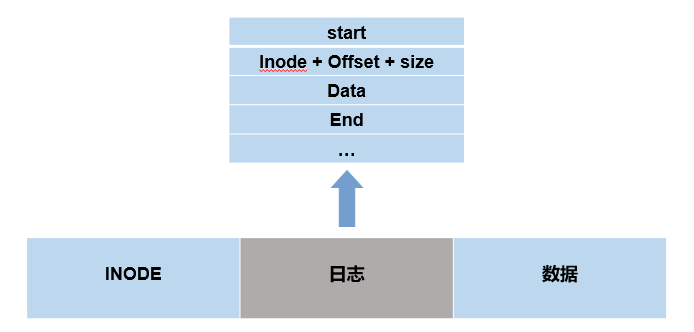
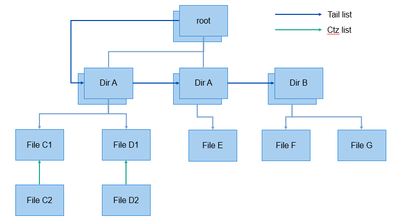
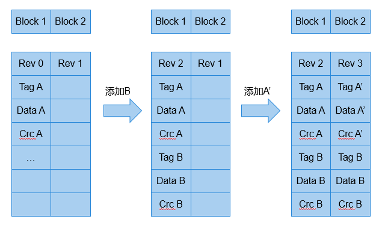

# 基本概念

-   [运行机制](#section10284121317365)
    -   [日志方式](#section13804114513361)
    -   [Cow机制](#section172771130193610)
    -   [lfs掉电保护](#section42941021173614)

LittleFS主要用在微控制器和flash上，是一种嵌入式文件系统，具有如下3个特点：

1.  掉电恢复

    在写入时即使复位或者掉电也可以恢复到上一个正确的状态。

2.  擦写均衡

    有效延长flash的使用寿命。

3.  有限的RAM/ROM

    节省ROM和RAM空间。

## 运行机制

最经典的掉电保护方法有两种，一种是使用日志，一种是通过COW方式。lfs结合了两种方法，并优化了两种方案的缺点，提供了一套掉电保护策略

### 日志方式

具体步骤为：

1.  写入数据之前，先在日志区存储开始标志，记录要写入的数据位置和大小；
2.  待写入的数据写入日志区；
3.  待写入的数据写入数据区；
4.  写入完成之后，在日志区记录结束标志。

模拟掉电场景：

1.  步骤1完成，步骤2没有完成；重启之后，保持原来的数据，日志无效；
2.  步骤1，2完成了，步骤3没有完成，尝试把步骤2的数据写入到数据区；
3.  步骤1，2，3完成了，步骤4没有完成，同样尝试把步骤2的数据写入到数据区；

### Cow机制

具体步骤为：

1.  想更新节点F的数据，先申请一个新的节点，把F的旧数据拷贝过去，然后更新新的数据；
2.  把父节点的指针指向新的节点，去掉旧节点的指针。

模拟掉电场景：

步骤1完成了，步骤2没有完成，则使用旧的数据，新的节点变成孤儿节点。

### lfs掉电保护

fs结合了日志方式和COW机制两种方式进行掉电保护，并且优化了两种方案。

前面谈过文件系统三要素，超级块，inode，以及数据。对应lfs来说，他把超级块以及inode通过日志的方式存储，两种采用统一的存储结构，后文称两者为元数据；普通数据则采用cow的方式存储，采用czt逆序链表的方式。

**元数据的存储**

元数据（对应root，dir）采用双block的方式存储，互为备份，每个block都有一个revision序号，值越大，表示block的数据越新，每个block默认可以存储最多0xff个文件的数据，如果超过这个值，则需要compact（压缩）。

Compact是干什么呢？ 即当数据的大小大于某个值的时候，把数据整合，剔除同一个id的旧的数据，然后写入到备份block里面。

**普通数据的存储**

Lfs的数据采用链表的方式逆向管理。

1.  采用逆向的指针，这样常规的追加数据，不需要额外的开销来重新建立所有的索引；
2.  每个偶数block有多个指针，指向更远的数据，这样可以在检索的时候加快速度。

