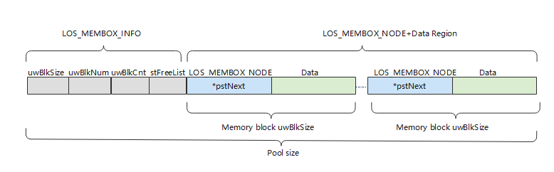

# 静态内存<a name="ZH-CN_TOPIC_0000001078876516"></a>

-   [运行机制](#section165473517522)
-   [开发指导](#section57511620165218)
    -   [使用场景](#section215474911529)
    -   [接口说明](#section79231214539)
    -   [开发流程](#section1388511316548)
    -   [编程实例](#section17801515105519)
    -   [结果验证](#section11818154112319)


## 运行机制<a name="section165473517522"></a>

静态内存实质上是一个静态数组，静态内存池内的块大小在初始化时设定，初始化后块大小不可变更。

静态内存池由一个控制块LOS\_MEMBOX\_INFO和若干相同大小的内存块LOS\_MEMBOX\_NODE构成。控制块位于内存池头部，用于内存块管理，包含内存块大小uwBlkSize，内存块数量uwBlkNum，已分配使用的内存块数量uwBlkCnt和空闲内存块链表stFreeList。内存块的申请和释放以块大小为粒度，每个内存块包含指向下一个内存块的指针pstNext。

**图 1**  静态内存示意图<a name="fig1081017327364"></a>  


## 开发指导<a name="section57511620165218"></a>

### 使用场景<a name="section215474911529"></a>

当用户需要使用固定长度的内存时，可以通过静态内存分配的方式获取内存，一旦使用完毕，通过静态内存释放函数归还所占用内存，使之可以重复使用。

### 接口说明<a name="section79231214539"></a>

OpenHarmony LiteOS-M的静态内存管理主要为用户提供以下功能，接口详细信息可以查看API参考。

**表 1**  静态内存模块接口

<a name="table1415203765610"></a>
<table><thead align="left"><tr id="row134151837125611"><th class="cellrowborder" valign="top" width="16.19161916191619%" id="mcps1.2.4.1.1"><p id="p16415637105612"><a name="p16415637105612"></a><a name="p16415637105612"></a>功能分类</p>
</th>
<th class="cellrowborder" valign="top" width="22.472247224722473%" id="mcps1.2.4.1.2"><p id="p11415163718562"><a name="p11415163718562"></a><a name="p11415163718562"></a>接口名</p>
</th>
<th class="cellrowborder" valign="top" width="61.33613361336133%" id="mcps1.2.4.1.3"><p id="p1641533755612"><a name="p1641533755612"></a><a name="p1641533755612"></a>描述</p>
</th>
</tr>
</thead>
<tbody><tr id="row0415737175610"><td class="cellrowborder" valign="top" width="16.19161916191619%" headers="mcps1.2.4.1.1 "><p id="p2990613114416"><a name="p2990613114416"></a><a name="p2990613114416"></a>初始化静态内存池</p>
</td>
<td class="cellrowborder" valign="top" width="22.472247224722473%" headers="mcps1.2.4.1.2 "><p id="p169901113194416"><a name="p169901113194416"></a><a name="p169901113194416"></a>LOS_MemboxInit</p>
</td>
<td class="cellrowborder" valign="top" width="61.33613361336133%" headers="mcps1.2.4.1.3 "><p id="p5990113174414"><a name="p5990113174414"></a><a name="p5990113174414"></a>初始化一个静态内存池，根据入参设定其起始地址、总大小及每个内存块大小。</p>
</td>
</tr>
<tr id="row1841519376561"><td class="cellrowborder" valign="top" width="16.19161916191619%" headers="mcps1.2.4.1.1 "><p id="p9367164904413"><a name="p9367164904413"></a><a name="p9367164904413"></a>清除静态内存块内容</p>
</td>
<td class="cellrowborder" valign="top" width="22.472247224722473%" headers="mcps1.2.4.1.2 "><p id="p103671549144411"><a name="p103671549144411"></a><a name="p103671549144411"></a>LOS_MemboxClr</p>
</td>
<td class="cellrowborder" valign="top" width="61.33613361336133%" headers="mcps1.2.4.1.3 "><p id="p18367184916448"><a name="p18367184916448"></a><a name="p18367184916448"></a>清零从静态内存池中申请的静态内存块的内容。</p>
</td>
</tr>
<tr id="row1187514443616"><td class="cellrowborder" rowspan="2" valign="top" width="16.19161916191619%" headers="mcps1.2.4.1.1 "><p id="p64541711458"><a name="p64541711458"></a><a name="p64541711458"></a>申请、释放静态内存</p>
</td>
<td class="cellrowborder" valign="top" width="22.472247224722473%" headers="mcps1.2.4.1.2 "><p id="p84547710452"><a name="p84547710452"></a><a name="p84547710452"></a>LOS_MemboxAlloc</p>
</td>
<td class="cellrowborder" valign="top" width="61.33613361336133%" headers="mcps1.2.4.1.3 "><p id="p5454177164520"><a name="p5454177164520"></a><a name="p5454177164520"></a>从指定的静态内存池中申请一块静态内存块。</p>
</td>
</tr>
<tr id="row1745415527441"><td class="cellrowborder" valign="top" headers="mcps1.2.4.1.1 "><p id="p645457204512"><a name="p645457204512"></a><a name="p645457204512"></a>LOS_MemboxFree</p>
</td>
<td class="cellrowborder" valign="top" headers="mcps1.2.4.1.2 "><p id="p545415704514"><a name="p545415704514"></a><a name="p545415704514"></a>释放从静态内存池中申请的一块静态内存块。</p>
</td>
</tr>
<tr id="row19101718144518"><td class="cellrowborder" rowspan="2" valign="top" width="16.19161916191619%" headers="mcps1.2.4.1.1 "><p id="p15927427144615"><a name="p15927427144615"></a><a name="p15927427144615"></a>获取、打印静态内存池信息</p>
</td>
<td class="cellrowborder" valign="top" width="22.472247224722473%" headers="mcps1.2.4.1.2 "><p id="p792715277464"><a name="p792715277464"></a><a name="p792715277464"></a>LOS_MemboxStatisticsGet</p>
</td>
<td class="cellrowborder" valign="top" width="61.33613361336133%" headers="mcps1.2.4.1.3 "><p id="p139271327114620"><a name="p139271327114620"></a><a name="p139271327114620"></a>获取指定静态内存池的信息，包括内存池中总内存块数量、已经分配出去的内存块数量、每个内存块的大小。</p>
</td>
</tr>
<tr id="row1346314166464"><td class="cellrowborder" valign="top" headers="mcps1.2.4.1.1 "><p id="p8927102754619"><a name="p8927102754619"></a><a name="p8927102754619"></a>LOS_ShowBox</p>
</td>
<td class="cellrowborder" valign="top" headers="mcps1.2.4.1.2 "><p id="p49274279460"><a name="p49274279460"></a><a name="p49274279460"></a>打印指定静态内存池所有节点信息（打印等级是LOS_INFO_LEVEL），包括内存池起始地址、内存块大小、总内存块数量、每个空闲内存块的起始地址、所有内存块的起始地址。</p>
</td>
</tr>
</tbody>
</table>

> **说明：** 
>初始化后的内存池的内存块数量，不等于总大小除于内存块大小，因为内存池的控制块和每个内存块的控制头，都存在内存开销，设置总大小时，需要将这些因素考虑进去。

### 开发流程<a name="section1388511316548"></a>

本节介绍使用静态内存的典型场景开发流程。

1.  规划一片内存区域作为静态内存池。
2.  调用LOS\_MemboxInit初始化静态内存池。

    初始化会将入参指定的内存区域分割为N块（N值取决于静态内存总大小和块大小），将所有内存块挂到空闲链表，在内存起始处放置控制头。

3.  调用LOS\_MemboxAlloc接口分配静态内存。

    系统将会从空闲链表中获取第一个空闲块，并返回该内存块的起始地址。

4.  调用LOS\_MemboxClr接口。

    将入参地址对应的内存块清零。

5.  调用LOS\_MemboxFree接口。

    将该内存块加入空闲链表。


### 编程实例<a name="section17801515105519"></a>

本实例执行以下步骤：

1.  初始化一个静态内存池。
2.  从静态内存池中申请一块静态内存。
3.  在内存块存放一个数据。
4.  打印出内存块中的数据。
5.  清除内存块中的数据。
6.  释放该内存块。

    示例代码如下：


```
#include "los_membox.h"

VOID Example_StaticMem(VOID)
{
    UINT32 *mem = NULL;
    UINT32 blkSize = 10;
    UINT32 boxSize = 100;
    UINT32 boxMem[1000];
    UINT32 ret;

    /*内存池初始化*/
    ret = LOS_MemboxInit(&boxMem[0], boxSize, blkSize);
    if(ret != LOS_OK) {
        printf("Membox init failed!\n");
        return;
    } else {
        printf("Membox init success!\n");
    }

    /*申请内存块*/
    mem = (UINT32 *)LOS_MemboxAlloc(boxMem);
    if (NULL == mem) {
        printf("Mem alloc failed!\n");
        return;
    }
    printf("Mem alloc success!\n");

    /*赋值*/
    *mem = 828;
    printf("*mem = %d\n", *mem);

    /*清除内存内容*/
    LOS_MemboxClr(boxMem, mem);
    printf("Mem clear success \n *mem = %d\n", *mem);

    /*释放内存*/
    ret = LOS_MemboxFree(boxMem, mem);
    if (LOS_OK == ret) {
        printf("Mem free success!\n");
    } else {
        printf("Mem free failed!\n");
    }

    return;
}
```

### 结果验证<a name="section11818154112319"></a>

输出结果如下：

```
Membox init success!
Mem alloc success!
*mem = 828
Mem clear success   
*mem = 0
Mem free success!
```

