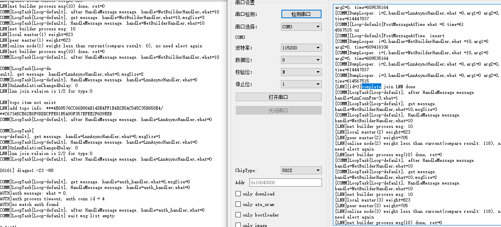

# Combo解决方案之ASR芯片移植案例

本方案基于OpenHarmony LiteOS-M内核，使用ASR582X芯片的[DEV.WIFI.A开发板](https://gitee.com/openharmony/device_board_lango)进行开发移植。作为典型的IOT Combo（Wi-Fi+BLE）解决方案，本文章介绍ASR582X的适配过程。

## 编译移植

### 目录规划

本方案的目录结构使用[Board和Soc解耦的思路](https://gitee.com/openharmony-sig/sig-content/blob/master/devboard/docs/board-soc-arch-design.md)：

```
device
├── board                                --- 单板厂商目录
│   └── lango                            --- 单板厂商名字：朗国
│       └── dev_wifi_a                   --- 单板名：DEV.WIFI.A
└── soc                                  --- SoC厂商目录
    └── asrmicro                         --- SoC厂商名字：翱捷科技
        └── asr582x                      --- SoC Series名：ASR582X系列芯片
```

产品样例目录规划为：

```
vendor
└── asrmicro                             --- 开发产品样例厂商目录，翱捷科技的产品样例
    ├── wifi_demo                        --- 产品名字：Wi-Fi样例代码
    └── xts_demo                         --- 产品名字: XTS测试样例
```

### 产品定义

以`vendor/asrmicro/wifi_demo`为例，这里描述了产品使用的内核、单板、子系统等信息。其中，内核、单板型号、单板厂商需要提前规划好，也是预编译指令（`hb set`）所关注的。这里填入的信息与规划的目录相对应。例如：

```
{
    "product_name": "wifi_demo",          --- 产品名
    "type": "mini",                       --- 系统类型: mini
    "version": "3.0",                     --- 系统版本: 3.0
    "device_company": "lango",            --- 单板厂商：lango
    "board": "dev_wifi_a",                --- 单板名：dev_wifi_a
    "kernel_type": "liteos_m",            --- 内核类型：liteos_m
    "kernel_version": "3.0.0",            --- 内核版本：3.0.0
    "subsystems": []                      --- 子系统
}
```
这里的device_company和board用于关联出//device/board/<device_company>/\<board\>目录。

### 单板配置

在关联到的\<board\>目录下，以`device/board/lango/dev_wifi_a`为例，需要在liteos_m目录下放置config.gni文件，这个配置文件用于描述该单板的信息，包括CPU、toolchain、kernel、compile flags等。例如：

```
# 内核类型。
kernel_type = "liteos_m"

# 内核版本。
kernel_version = "3.0.0"

# 单板CPU类型。
board_cpu = "cortex-m4"

# 工具链，这里使用arm-none-eabi。
board_toolchain = "arm-none-eabi"

# 工具链路径，可以使用系统路径，填""，也可以自定义，如下：
board_toolchain_path = rebase_path("//device/soc/asrmicro/gcc/gcc-arm-none-eabi/Linux64/bin")

# 单板相关的编译参数。
board_cflags = []

# 单板相关的链接参数。
board_ld_flags = []

# 单板相关的头文件。
board_include_dirs = []
```

### 预编译

在正确配置好产品的目录、产品定义、单板配置后，在工程根目录下输入预编译指令`hb set`，在显示的列表中就可以找到相关的产品。


选择好产品后，输入回车就会在根目录下自动生成`ohos_config.json`文件，这里会将要编译的产品信息列出。


## 内核移植

### Kconfig适配

在//kernel/liteos_m的编译中，需要在相应的单板以及SoC目录下使用`Kconfig`文件进行索引。

单板目录的`Kconfig`，以`//device/board/lango`为例：
```
├── dev_wifi_a                                   --- dev_wifi_a单板配置目录
│   ├── Kconfig.liteos_m.board                   --- 单板的配置选项
│   ├── Kconfig.liteos_m.defconfig.board         --- 单板的默认配置项
│   └── liteos_m
│       └── config.gni                           --- 单板的配置文件
├── Kconfig.liteos_m.boards                      --- 单板厂商下Boards配置信息
└── Kconfig.liteos_m.defconfig.boards            --- 单板厂商下Boards默认配置信息
```

在 `dev_wifi_a/Kconfig.liteos_m.board`中，配置只有SOC_ASR5822S被选后，BOARD_DEV_WIFI_A才可被选：

```
config BOARD_DEV_WIFI_A
    bool "select board DEV_WIFI_A"
    depends on SOC_ASR5822S
```

SoC目录的`Kconfig`，以`//device/soc/asrmicro`为例：

```
├── asr582x                                      --- ASR582X系列
│   ├── Kconfig.liteos_m.defconfig.asr5822s      --- ASR5822S芯片默认配置
│   ├── Kconfig.liteos_m.defconfig.series        --- ASR582X系列默认配置
│   ├── Kconfig.liteos_m.series                  --- ASR582X系列配置
│   └── Kconfig.liteos_m.soc                     --- ASR582X芯片配置
├── Kconfig.liteos_m.defconfig                   --- SoC默认配置
├── Kconfig.liteos_m.series                      --- Series配置
└── Kconfig.liteos_m.soc                         --- SoC配置
```

在 asr582x/Kconfig.liteos_m.series中：

```
config SOC_SERIES_ASR582X
    bool "ASR582X Series"
    select ARM
    select SOC_COMPANY_ASRMICRO              --- 选择 SOC_COMPANY_ASRMICRO
    select CPU_CORTEX_M4
    help
        Enable support for ASR582X series
```

只有选择了 SOC_SERIES_ASR582X，在 asr582x/Kconfig.liteos_m.soc中才可以选择SOC_ASR5822S：

```
choice
    prompt "ASR582X series SoC"
    depends on SOC_SERIES_ASR582X

config SOC_ASR5822S                         --- 选择 SOC_ASR5822S
    bool "SoC ASR5822S"

endchoice
```

综上所述，要编译单板BOARD_DEV_WIFI_A，则要分别选中：SOC_COMPANY_ASRMICRO、SOC_SERIES_ASR582X、SOC_ASR5822S，可以在`kernel/liteos_m`中执行`make menuconfig`进行选择配置。


配置后的文件会默认保存在`//vendor/asrmicro/wifi_demo/kernel_configs/debug.config`,也可以直接填写debug.config：

```
LOSCFG_BOARD_DEV_WIFI_A=y
LOSCFG_SOC_COMPANY_ASRMICRO=y
LOSCFG_SOC_SERIES_ASR582X=y
LOSCFG_SOC_ASR5822S=y
```

### 模块化编译

`Board`和`SoC`的编译采用模块化的编译方法，从`kernel/liteos_m/BUILD.gn`开始逐级向下递增。本方案的适配过程如下：

1. 在`//device/board/lango`中新建文件BUILD.gn，新增内容如下：

   ```
   if (ohos_kernel_type == "liteos_m") {
     import("//kernel/liteos_m/liteos.gni")
     module_name = get_path_info(rebase_path("."), "name")
     module_group(module_name) {
       modules = [
         "dev_wifi_a",                     # 单板模块。
         "hcs",                            # hcs文件的对应模块。
       ]
     }
   }
   ```

   在上述BUILD.gn中，dev_wifi_a以及hcs即是按目录层级组织的模块名。

2. 在`//device/soc/asrmicro`中，使用同样的方法，新建文件BUILD.gn，按目录层级组织，新增内容如下：

   ```
   if (ohos_kernel_type == "liteos_m") {
     import("//kernel/liteos_m/liteos.gni")
     module_name = get_path_info(rebase_path("."), "name")
     module_group(module_name) {
       modules = [
         "asr582x",
       ]
     }
   }
   ```

3. 在`//device/soc/asrmicro`各个层级模块下，同样新增文件BUILD.gn，将该层级模块加入编译，以`//device/soc/asrmicro/asr582x/liteos_m/sdk/startup/BUILD.gn`为例：

   ```
   import("//kernel/liteos_m/liteos.gni")

   config("public") {
     include_dirs = [ "." ]                 # 公共头文件。
   }

   kernel_module("asr_startup") {           # 编译的模块。
     sources = [                            # 编译的源文件.
         "startup.c",
         "board.c",
         "startup_cm4.S",
     ]

     include_dirs = [                       # 模块内使用到的头文件。
       "...",
     ]
   }
   ```

4. 为了组织链接以及一些编译选项，在`//device/soc/asrmicro/asr582x/liteos_m/sdk/config/BUILD.gn`下的config("public")填入了相应的参数：

   ```
   config("public") {
     include_dirs = []                       # 公共头文件。
     ldflags = []                            # 链接参数，包括ld文件。
     libs = []                               # 链接库。
     defines = []                            # 定义。
   ```

    **说明：** 
	建议公共的参数选项以及头文件不在各个组件中重复填写。

5. 为了组织一些产品侧的应用，本方案在vendor相应的config.json加入了相应的list来组织，以`//vendor/asrmicro/wifi_demo/config.json`为例，在config.json增加对应的list：
   ```
   "tests_list": [                       --- demo list
     {
       "enable": "true",                 --- list开关
       "test_modules": [
         "example",                      --- OS基础demo
         "wifi_test"                     --- Wi-Fi demo
       ]
     }
   ]
   ```

   这里将demo作为了模块来管理，开启/关闭某个demo，在tests_list中增减项即可。tests_list在gn中可以直接被读取，需要在`//device/board/lango/dev_wifi_a/liteos_m/config.gni`加入以下内容：

   ```
   product_conf = read_file("${product_path}/config.json", "json")
   product_name = product_conf.product_name
   tests_list = product_conf.tests_list
   ```

   读取list后即可在相应的链接选项上加入相关的组件库，需要在`//device/soc/asrmicro/asr582x/liteos_m/sdk/config/BUILD.gn`加入以下内容：

   ```
   foreach(test_item, tests_list) {
       test_enable = test_item.enable
       if(test_enable == "true")
       {
         foreach(test_module, test_item.test_modules) {
         ldflags += [ "-l${test_module}" ]
         }
       }
   }
   ```

### C库适配

为了整个系统不区分用户态内核态，上层组件与内核共用一套基于musl的C库，本方案使用musl C，三方库见`//third_party/musl/porting/liteos_m/kernel/BUILD.gn`。

kernel另外对malloc相应的code进行了改造适配，适配文件见`//kernel/liteos_m/kal/libc/musl/porting/src/malloc.c`。

在本方案中，printf相关的接口使用开源代码实现，适配文件见 `//device/soc/asrmicro/asr582x/liteos_m/sdk/drivers/platform/system/printf-stdarg.c`。

为了满足printf相关接口的链接调用，需要在`//device/board/lango/dev_wifi_a/liteos_m/config.gni`的新增这些函数的wrap链接：

```
board_ld_flags += [
  "-Wl,--wrap=printf",
  "-Wl,--wrap=sprintf",
  "-Wl,--wrap=snprintf",
  "-Wl,--wrap=vprintf",
  "-Wl,--wrap=vsprintf",
  "-Wl,--wrap=vsnprintf",
]
```
### shell适配

为了方便调试，本方案集成了内核的shell组件，可以在make menuconfig中的Debug中选中 Enable Shell，或者在`//vendor/asrmicro/wifi_demo/kernel_configs/debug.config`文件中填入LOSCFG_SHELL=y
shell组件需要进行初始化，可参考`device/soc/asrmicro/asr582x/liteos_m/sdk/startup/board.c`：

```
ret = LosShellInit();
if (ret != LOS_OK) {
    printf("LosShellInit failed! ERROR: 0x%x\n", ret);
}
ret = OsShellInit();
if (ret != LOS_OK) {
    printf("OsShellInit failed! ERROR: 0x%x\n", ret);
}
```

在初始化之后，每个shell命令需要进行注册，例如：`vendor/asrmicro/wifi_demo/tests/wifi/wifi_app.c`：

```
osCmdReg(CMD_TYPE_STD, "wifi_open", 0, (CMD_CBK_FUNC)ap_conn_func);    // 连接AP的指令，这里可以带参。
osCmdReg(CMD_TYPE_EX, "wifi_close", 0, (CMD_CBK_FUNC)ap_close_func);   // 断开指令。
```

### 内核启动适配

单板进入到main函数后，首先会进行单板初始化，然后需要注册中断，之后再进行内核的初始化和调度。
注册中断，可参考`//device/soc/asrmicro/asr582x/liteos_m/sdk/startup/board.c`:

```
ArchHwiCreate(UART1_IRQn,configLIBRARY_NORMAL_INTERRUPT_PRIORITY,0,UART1_IRQHandler,0);   // UART中断。
ArchHwiCreate(GPIO_IRQn,configLIBRARY_NORMAL_INTERRUPT_PRIORITY,0,GPIO_IRQHandler,0);     // GPIO中断。
```

内核初始化示例如下：
```
osStatus_t ret = osKernelInitialize();                                                    // 内核初始化。

if(ret == osOK)
{
    threadId = osThreadNew((osThreadFunc_t)sys_init,NULL,&g_main_task);                   // 创建init线程。

    if(threadId!=NULL)
    {
        osKernelStart();                                                                  // 线程调度。
    }
}
```

在`sys_init`中，需要对OpenHarmony的系统组件进行初始化：

```
...
DeviceManagerStart();           // HDF初始化。

OHOS_SystemInit();              // OpenHarmony系统组件初始化。
....
```

### HDF驱动框架适配

HDF驱动框架提供了一套应用访问硬件的统一接口，可以简化应用开发，添加HDF组件需要在`//vendor/asrmicro/wifi_demo/kernel_configs/debug.config`添加：

```
LOSCFG_DRIVERS_HDF=y
LOSCFG_DRIVERS_HDF_PLATFORM=y
```

同时需在board中新增对应开发板硬件配置描述文件，位于`//device/board/lango/hcs`。本案例以GPIO以及UART为例，移植过程如下：

#### GPIO适配

1. 芯片驱动适配文件位于`//drivers/hdf_core/adapter/platform`目录，在gpio目录增加gpio_asr.c文件，在BUILD.gn中增加新增的驱动文件编译条件：

   ```
   if (defined(LOSCFG_SOC_COMPANY_ASRMICRO)) {
     sources += [ "gpio_asr.c" ]
   }
   ```

2. gpio_asr.c中驱动描述文件如下：

   ```
   struct HdfDriverEntry g_GpioDriverEntry = {
       .moduleVersion = 1,
       .moduleName = "ASR_GPIO_MODULE_HDF",
       .Init = GpioDriverInit,
       .Release = GpioDriverRelease,
   };
   HDF_INIT(g_GpioDriverEntry);
   ```

3. 在`//device/board/lango/hcs`添加gpio硬件描述信息文件gpio.hcs, 映射后的gpio0控制板卡上的可编程LED，gpio1对应用户按键，hcs内容如下：

   ```
   root {
       platform {
           gpio_config {
               match_attr = "gpio_config";
               pin = [0, 1];
               // led3: GPIO9.
               // user key: GPIO7.
               realPin = [9, 7];
               config = [5, 1];
               pinNum = 2;
           }
       }
   }
   ```

4. gpio.hcs的配置信息会在GpioDriverInit进行加载，并执行对应GPIO引脚的初始化。应用层控制LED灯和读取按键信息只需要以下简单的代码：

   ```
   int32_t GpioKeyIrqFunc(uint16_t gpio, void *data)
   {
       printf("user key %d pressed\n", gpio);
   }
   GpioSetIrq(1, OSAL_IRQF_TRIGGER_FALLING, GpioKeyIrqFunc, NULL);

   GpioWrite(0, 0);
   lega_rtos_delay_milliseconds(1000);
   GpioWrite(0, 1);
   ```

#### UART适配

1. 芯片驱动适配文件位于`//drivers/adapter/platform`目录，在uart目录增加uart_asr.c和uart_asr.h文件，在BUILD.gn中增加新增的驱动文件编译条件：

   ```
   if (defined(LOSCFG_SOC_COMPANY_ASRMICRO)) {
     sources += [ "uart_asr.c" ]
   }
   ```

2. uart_asr.c中驱动描述文件如下：

   ```
   struct HdfDriverEntry g_hdfUartDevice = {
       .moduleVersion = 1,
       .moduleName = "HDF_PLATFORM_UART",
       .Bind = HdfUartDeviceBind,
       .Init = HdfUartDeviceInit,
       .Release = HdfUartDeviceRelease,
   };

   HDF_INIT(g_hdfUartDevice);
   ```

3. 在`//device/board/lango/hcs`添加gpio硬件描述信息文件uart.hcs, hcs内容如下：

   ```
   controller_uart0 :: uart_controller {
       match_attr = "asr582x_uart_0";
       port = 0;                        /* UART_ID_0 */

       pin_tx_pin = 0;                  /* IO_PIN_10 */
       pin_tx_mux = 25;                 /* IO_MUX_2  */

       pin_rx_pin = 1;                  /* IO_PIN_11 */
       pin_rx_mux = 25;                 /* IO_MUX_2 */
       tx_rx = 3;                       /* TX_RX MODE */
   }
   ```

4. gpio.hcs的配置信息会在HdfUartDeviceInit进行加载，并执行对应串口引脚的初始化。应用层测试串口代码如下：

   ```
   DevHandle uart_handle = UartOpen(0);
   UartSetBaud(uart_handle, 115200);
   ...
   attr.dataBits = UART_ATTR_DATABIT_8;
   attr.parity = UART_ATTR_PARITY_NONE;
   attr.stopBits = UART_ATTR_STOPBIT_1;
   ret = UartSetAttribute(uart_handle, &attr);
   ret = UartWrite(uart_handle, send_data, strlen(send_data));
   ret = UartRead(uart_handle, recv_data, sizeof(recv_data) - 1);
   ...
   ```

## OpenHarmony组件移植

子系统的编译选项入口在相应产品config.json下，以下以`//vendor/asrmicro/wifi_demo/config.json`为例。

### lwIP组件

lwIP组件的源码在`//third_party/lwip`，OpenHarmony在kernel中做了定制化，`//kernel/liteos_m/components/net/lwip-2.1`，包括一些接口的重定义，结构体的重定义等。

lwIP组件适配：

lwIP是一个小型开源的TCP/IP协议栈，LiteOS-M已对开源lwIP做了适配和功能增强，lwIP代码分为两部分：


- third_party/lwip目录下是lwIP开源代码，里面只做了少量的侵入式修改，为了适配增强功能。

- kernel/liteos_m/components/net/lwip-2.1目录下是lwIP适配和功能增强代码，里面提供了lwIP的默认配置文件。


如果需要使用lwIP组件，请按如下步骤适配：


1. 在产品目录下新建一个目录用来存放产品的适配文件，如lwip_adapter。

2. 在lwip_adapter目录下新建一个目录include，用来存放适配的头文件。

3. 在include目录下新建目录lwip，并在lwip目录下新建头文件lwipopts.h，代码如下所示，如果默认配置不能满足产品使用，可自行根据产品使用情况修改配置，如关闭DHCP功能。

   ```
   #ifndef _LWIP_ADAPTER_LWIPOPTS_H_
   #define _LWIP_ADAPTER_LWIPOPTS_H_
   
   #include_next "lwip/lwipopts.h"
   
   #undef LWIP_DHCP#define LWIP_DHCP                       0 // 关闭DHCP功能。
   
   #endif /* _LWIP_ADAPTER_LWIPOPTS_H_ */
   ```

4. 将kernel/liteos_m/components/net/lwip-2.1目录下的BUILD.gn复制到lwip_adapter目录下，并按如下修改。

   ```
   import("//kernel/liteos_m/liteos.gni")
   import("$LITEOSTHIRDPARTY/lwip/lwip.gni")
   import("$LITEOSTOPDIR/components/net/lwip-2.1/lwip_porting.gni")
   module_switch = defined(LOSCFG_NET_LWIP_SACK)
   module_name = "lwip"kernel_module(module_name) {
     sources = LWIP_PORTING_FILES + LWIPNOAPPSFILES - [ "$LWIPDIR/api/sockets.c" ]
     include_dirs = [ "//utils/native/lite/include" ]
   }
   #添加新增加的适配头文件路径include。
   config("public") {
     include_dirs = [ "include" ] + LWIP_PORTING_INCLUDE_DIRS + LWIP_INCLUDE_DIRS
   }
   ```

5. 在产品的配置文件(如config.json)中设置lwIP的编译路径，即步骤4中BUILD.gn的路径。

   ```
   {
     "subsystem": "kernel",
     "components": [
       { "component": "liteos_m", "features":["ohos_kernel_liteos_m_lwip_path = \"//xxx/lwip_adapter\"" ] }
     ]
   },
   ```

6. 在产品的内核编译配置文件中，如kernel_config/debug.config，打开编译lwIP的开关。

   ```
   LOSCFG_NET_LWIP=y
   ```

本案例在config.json中设置lwIP的路径如下：

   ```
   "subsystem": "kernel",
   "components": [
     {
       "component": "liteos_m",
       "features": [
         "ohos_kernel_liteos_m_lwip_path = \"//device/soc/asrmicro/asr582x/liteos_m/components/net/lwip-2.1\""
       ]
     }
   ]
   ```

另外，需在内核编译配置文件kernel_config/debug.config中，打开编译lwIP的开关，如下：

```
LOSCFG_NET_LWIP=y
```

### security组件

security需要在config.json中打开相应的选项，本案例移植了三方库中的mbedtls（`//third_party/mbedtls`）作为加密模块，选项配置如下：

```
"subsystem": "security",
"components": [
  { "component": "huks", "features":
    [
      ...
      "ohos_security_huks_mbedtls_porting_path = \"//device/soc/asrmicro/asr582x/liteos_m/components/mbedtls\""
    ]
  }
]
```

在上述目录中，需要对mbedtls做配置，可见`config/config_liteos_m.h`。需要注意的是，如果使用mbedtls的RNG的能力（比如dsoftbus组件在`//foundation/communication/dsoftbus/adapter/common/mbedtls/softbus_adapter_crypto.c`中有使用），要指定产生随机数的熵源。本案例使用了ASR582X的硬件随机数能力，需要打开如下宏定义：

```
#define MBEDTLS_ENTROPY_HARDWARE_ALT
```

打开此宏后，需要实现entropy_hardware_alt接口，可见`library/entropy_hardware_alt.c`。

### wifi_lite组件

wifi_lite组件的选项配置如下：

```
"subsystem": "communication",
"components": [
  { "component": "wifi_lite", "features":[] }
  ]
```

与Wi-Fi有关的实现在`//device/soc/asrmicro/asr582x/liteos_m/sdk/hal/src/wifi_adapter.c`下。

本案例也提供了使用wifi_lite相关接口的Demo，可见`//vendor/asrmicro/wifi_demo/tests/wifi/wifi_app.c`，这里提供了两个连接的测试指令：

表 1 ASR Wi-Fi 连接指令

| 指令         | 参数     | 说明     |
|------------|--------|--------|
| wifi_open  | sta [SSID] [KEY] | 连接路由指令,例如:wifi_open sta ASR_AP test123456。 |
| wifi_close | 无      | 断开连接指令。   |

### xts组件

xts组件的适配，以`//vendor/asrmicro/xts_demo/config.json`为例，需要加入组件选项：

```
"subsystem": "xts",
"components": [
  { "component": "xts_acts", "features":
    [
      "enable_ohos_test_xts_acts_use_thirdparty_lwip = true"
    ]
  },
  { "component": "xts_tools", "features":[] }
]
```

另外，xts功能也使用了list来组织，可参考[模块化编译]，在config.json文件中增减相应模块：

```
"xts_list": [
  {
    "enable": "true",
    "xts_modules": [
      "ActsKvStoreTest",
      "ActsDfxFuncTest",
      "ActsHieventLiteTest",
      "ActsSamgrTest",
      "ActsParameterTest",
      "ActsWifiServiceTest",
      "ActsWifiIotTest",
      "ActsBootstrapTest"
    ]
  }
],
```

### dsoftbus组件

dsoftbus组件提供了设备间的发现连接、组网和传输能力，本方案以Wi-Fi设备间的软总线能力为例。

依赖组件：lwIP组件、security组件、wifi_lite组件。

前置条件：设备需先连接路由，所有的组网设备需在同一局域网中。

dsoftbus组件的选项配置如下：

```
"subsystem": "communication",
"components": [
  { "component": "dsoftbus", "features":[] }
  ]
```

在`//vendor/asrmicro/wifi_demo`下提供了dsoftbus的测试Demo，打开该功能需修改`//vendor/asrmicro/wifi_demo/tests/BUILD.gn`：

```
declare_args() {
  asr_dsoftbus_test = true              # 打开dsoftbus demo编译。
}
```

另外，需在`//vendor/asrmicro/wifi_demo/config.json`中添加dsoftbus_test模块：

```
"tests_list": [
    {
    "enable": "true",
    "test_modules": [
        "wifi_test",
        "dsoftbus_test"                 # 打开dsoftbus_test模块。
    ]
    }
]
```

dsoftbus组件的启动接口可参考`//vendor/asrmicro/wifi_demo/tests/dsoftbus/dsoftbus_app.c`：

```
InitSoftBusServer();
```

dsoftbus组件的运行需至少预留80KB RAM。如资源不够，可对其它地方进行剪裁。例如，可在以下文件修改lwIP组件：
`//kernel_liteos_m/blob/master/components/net/lwip-2.1/porting/include/lwip/lwipopts.h`：

```
#define TCPIP_THREAD_STACKSIZE          0x2000              // 缩小TCPIP任务栈大小
```

在communication_dsoftbus仓中，加入了-fPIC编译选项，这样会让编译器产生与位置无关代码，并使用相对地址，但是在LiteOS-M核中使用的是静态库，不推荐使用。
建议开发者手动注释-fPIC编译选项，后续会推进OpenHarmony统一规划此编译选项的开关。修改方法是在如下的四个文件中，找到"-fPIC"选项，并全部注释：

`//foundation/communication/dsoftbus/core/common/BUILD.gn`

`//foundation/communication/dsoftbus/core/frame/BUILD.gn`

`//foundation/communication/dsoftbus/sdk/BUILD.gn`

`//foundation/communication/dsoftbus/components/nstackx_mini/nstackx_ctrl/BUILD.gn`

软总线的组网需要通过设备认证，在研发阶段，可以把认证跳过，先行调试组网以及传输能力，需将文件`//foundation/communication/dsoftbus/core/authentication/src/auth_manager.c`中的HandleReceiveDeviceId函数替换为如下实现：

```
void HandleReceiveDeviceId(AuthManager *auth, uint8_t *data)
{
    uint8_t tempKey[SESSION_KEY_LENGTH] = {0};
    if (auth == NULL || data == NULL) {
        SoftBusLog(SOFTBUS_LOG_AUTH, SOFTBUS_LOG_ERROR, "invalid parameter");
        return;
    }
    if (AuthUnpackDeviceInfo(auth, data) != SOFTBUS_OK) {
        SoftBusLog(SOFTBUS_LOG_AUTH, SOFTBUS_LOG_ERROR, "AuthUnpackDeviceInfo failed");
        AuthHandleFail(auth, SOFTBUS_AUTH_UNPACK_DEVID_FAILED);
        return;
    }
    if (auth->side == SERVER_SIDE_FLAG) {
        if (EventInLooper(auth->authId) != SOFTBUS_OK) {
            SoftBusLog(SOFTBUS_LOG_AUTH, SOFTBUS_LOG_ERROR, "auth EventInLooper failed");
            AuthHandleFail(auth, SOFTBUS_MALLOC_ERR);
            return;
        }
        if (AuthSyncDeviceUuid(auth) != SOFTBUS_OK) {
            AuthHandleFail(auth, SOFTBUS_AUTH_SYNC_DEVID_FAILED);
        }
        (void)memset_s(tempKey, SESSION_KEY_LENGTH, 1, SESSION_KEY_LENGTH);
        AuthOnSessionKeyReturned(auth->authId, tempKey, SESSION_KEY_LENGTH); 
        return;
    }
    //VerifyDeviceDevLvl(auth);                                            --- 这里注释认证过程
    (void)memset_s(tempKey, SESSION_KEY_LENGTH, 1, SESSION_KEY_LENGTH);
    AuthOnSessionKeyReturned(auth->authId, tempKey, SESSION_KEY_LENGTH);
}
```

在正确配置并编译烧录后，设备使用wifi_open指令连接路由，连接成功后，设备会自动进行组网。如下为组网成功截图：




其它组件的适配过程与官方以及其它厂商的过程类似，不再赘述。

## todo

- 待支持BLE
- 待丰富Wi-Fi测试指令