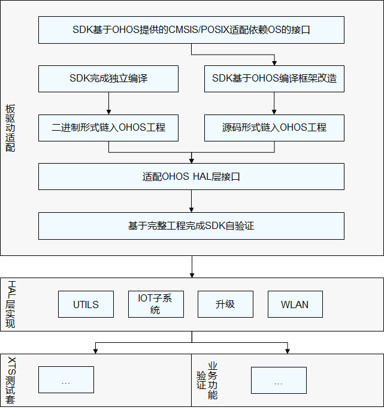

# 移植概述


## 板级移植流程

最小系统移植完成后，下一步进行板级系统移植，板级系统移植包含以下几步操作：

1. 板级驱动适配。

2. HAL层实现。

3. XTS测试套。

4. 业务功能验证。


  **图1** 单板驱动适配流程

  


## 板级目录规范


板级系统编译适配参考[编译系统介绍](../porting/porting-chip-prepare-process.md)，板级相关的驱动、SDK、目录、HAL实现存放在device目录，目录结构和具体描述如下：


  
```
.
├── device                                              --- 单板样例
│   └── xxx                                             --- <单板厂商名>
│       └── xxx                                         --- <单板名>，里面包含liteos-m内核的，并且能够运行的demo
│           ├── BUILD.gn                                --- 定义单板的编译配置文件
│           ├── board                                   --- 板子特定的实现（可选，如果本单板直接提供产品级demo，则相关应用层实现放在此目录）
│           ├── liteos_m                                --- 根据BUILD.gn文件中的kernel_type，使用liteos_m内核
│           │   └── config.gni                          --- 编译选项
│           ├── libraries                               --- 板级SDK
│           │   └── include                             --- SDK提供对外头文件
│           │   └── ...                                 --- binary or source
│           ├── main.c                                  --- main函数入口（如果产品级存在相同定义，则使用产品级配置）
│           ├── target_config.h                         --- 板级内核配置
│           ├── project                                 --- 单板级工程配置文件（如果产品级存在相同定义，则使用产品级配置）
│           └── adapter                                 --- 单板适配上层应用组件的适配层接口，根据能力可选
│               └── hals
│                   ├── communication
│                   │  └── wifi_lite
│                   │      ├── ...
│                   └── iot_hardware
│                       ├── upgrade
│                       ├── utils
│                       └── wifiiot_lite
├── vendor                                              --- 提供端到端的OpenHarmony特性产品样例
│   └── huawei                                          --- 厂商名字
│       └── wifiiot                                     --- wifiiot表示特性产品
│           ├── app
│           │   └── main.c                              --- 产品的main函数入口
│           ├── project                                 --- 工程配置文件
│           ├── BUILD.gn                                --- 工程编译入口
│           └── config.json                             --- 定义产品的编译配置文件，配置产品所使用的组件等。
└── out                                                 --- 编译过程中的输出目录
    ├── ...                                             --- 单板/产品编译产生的bin等
```
