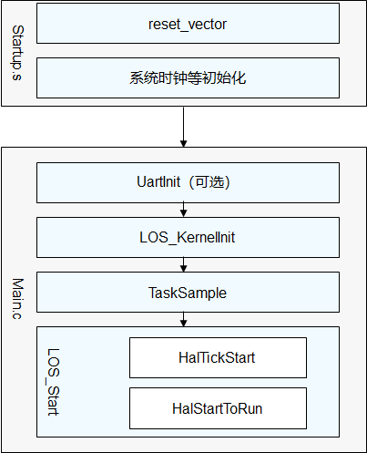

# 内核基础适配

芯片架构适配完成后，liteos-m提供系统运行所需的系统初始化流程和定制化配置选项。移植过程中，需要关注初始化流程中跟硬件配置相关的函数；了解内核配置选项，才能裁剪出适合单板的最小内核。

## 基础适配

如下图所示，基础适配主要分为以下两步：

1. 启动文件startup.S和相应链接配置文件。

2. main. c中的串口初始化和tick中断注册。

  **图1** 启动流程

  

启动文件startup.S需要确保中断向量表的入口函数（例如reset_vector）放在RAM的首地址，它由链接配置文件来指定。其中iar、keil和gcc工程的链接配置文件分别为xxx.icf、xxx.sct和xxx.ld，如果startup.S已经完成系统时钟初始化，并且能够引导到main函数，则启动文件不需要进行修改，采用厂商自带的startup.S即可，否则需要实现以上功能。

在main.c文件中，需要关注串口初始化UartInit和系统Tick的handler函数注册。

- UartInit函数表示单板串口的初始化，具体的函数名根据单板自行定义。这个函数是可选的，用户可以根据硬件单板是否支持串口来自行选择调用该函数。如果硬件单板支持串口，则该函数需要完成使能串口TX和RX通道，设置波特率。

- HalTickStart设置tick中断的handler函数OsTickHandler。

对于中断向量表不可重定向的芯片，需要关闭LOSCFG_PLATFORM_HWI宏，并且在startup.S中新增tick中断的handler函数。

## 特性配置项

liteos_m的完整配置能力及默认配置在los_config.h定义，该头文件中的配置项可以根据不同的单板进行裁剪配置。

如果针对这些配置项需要进行不同的板级配置，则可将对应的配置项直接定义到对应单板的device/xxxx/target_config.h文件中，其他未定义的配置项，采用los_config.h中的默认值。

一份典型的配置参数如下：

  **表1** 内核典型配置项说明

| 配置项 | 说明 | 
| -------- | -------- |
| LOSCFG_BASE_CORE_SWTMR | 软件定时器特性开关，1表示打开，0表示关闭 | 
| LOSCFG_BASE_CORE_SWTMR_ALIGN | 对齐软件定时器特性开，1表示打开，依赖软件定时器特性打开，0表示关闭 | 
| LOSCFG_BASE_IPC_MUX | mux功能开关，1表示打开，0表示关闭 | 
| LOSCFG_BASE_IPC_QUEUE | 队列功能开关，1表示打开，0表示关闭 | 
| LOSCFG_BASE_CORE_TSK_LIMIT | 除idle&nbsp;task之外，总的可用task个数限制，可以根据业务使用的task个数来配置，也可以设置一个较大的值，待业务稳定了，查看运行task的个数来进行配置 | 
| LOSCFG_BASE_IPC_SEM | 信号量功能开关，1表示打开，0表示关闭 | 
| LOSCFG_PLATFORM_EXC | 异常特性开关，1表示打开，0表示关闭 | 
| LOSCFG_KERNEL_PRINTF | 打印特性开关，1表示打开，0表示关闭 | 
