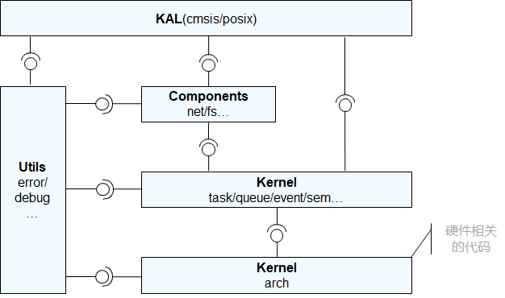

# 移植概述


## 移植场景

芯片架构适配是可选过程，如果在liteos_m/arch目录下已经支持对应芯片架构，则可以跳过芯片架构适配，进行单板适配过程，否则需要进行芯片架构移植工作。


## 目录规范

模组芯片使用的内核为liteos-m，liteos-m中主要分为KAL、Components、Kernel和Utils四个模块。

- KAL模块作为内核对外的接口依赖Components模块和Kernel模块。

- Components模块可插拔，它依赖Kernel模块。

- 在Kernel模块中，其中硬件相关的代码放在kernel的arch目录中，其余为硬件无关的代码。内核功能集（task、sem等）的实现依赖硬件相关的arch代码，例如任务上下文切换、原子操作等。

- Utils模块作为基础代码块，被其他模块依赖。

  **图1** liteos-m内核模块图

  

内核的目录结构和说明如下：

  
```
.
├── components              --- 移植可选组件，依赖内核，单独对外提供头文件
├── kal                     --- 内核抽象层，提供内核对外接口，当前支持cmsis接口和部分posix接口
├── kernel                  --- 内核最小功能集代码
│   ├── arch                --- 内核指令架构层代码
│   │   ├── arm             --- arm32架构的代码
│   │   │   ├── cortex-m3   --- cortex-m3架构的代码
│   │   │   │   ├── iar     --- iar编译工具链实现
│   │   │   │   ├── keil    --- keil编译工具链实现
│   │   │   │   └── xxx     --- xxx编译工具链实现
│   │   │   └── cortex-m4   --- cortex-m4架构的代码
│   │   │        ├── iar    --- iar编译工具链实现 
│   │   │        ├── keil   --- keil编译工具链实现
│   │   │        └── xxx    --- xxx编译工具链实现
│   │   ├── include         --- 所有的arch需要实现的函数定义，内核依赖
│   │   └── risc-v          --- risk-v架构
│   │        └── gcc        --- gcc编译工具链实现
│   ├── include             --- 内核最小功能集代码
│   └── src                 --- 内核最小功能集代码                       
└──utils                    --- 基础代码，作为依赖的最底层，被系统依赖
```


## 芯片架构适配点

如内核的[目录结构](#目录规范)所示，arch/include定义通用的芯片架构所需要实现的函数，另外芯片架构相关的代码会有部分的汇编代码，而汇编代码会因编译工具链的不同而不同，因此在具体的芯片架构下，还包含不同工具链（iar、keil、gcc等）的实现。

arch/include 目录定义通用的文件以及函数列表，该目录下的所有函数在新增arch组件时都需要适配，详见每一个头文件：

  
```
los_arch.h                        --- 定义芯片架构初始化所需要的函数
los_atomic.h                      --- 定义芯片架构所需要实现的原子操作函数
los_context.h                     --- 定义芯片架构所需要实现的任务上下文相关函数
los_interrupt.h                   --- 定义芯片架构所需要实现的中断和异常相关的函数
los_timer.h                       --- 定义芯片架构所需要实现的系统时钟相关的函数
```
